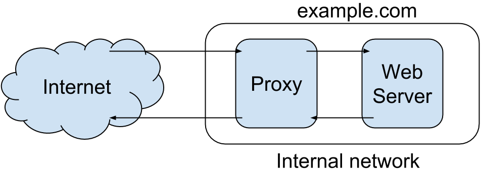
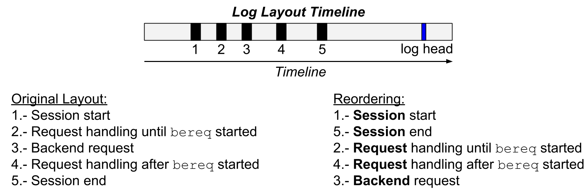
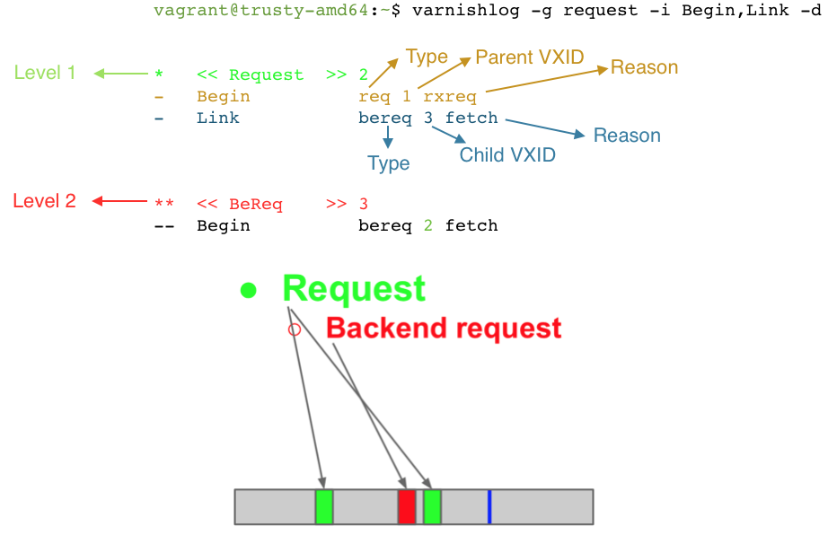
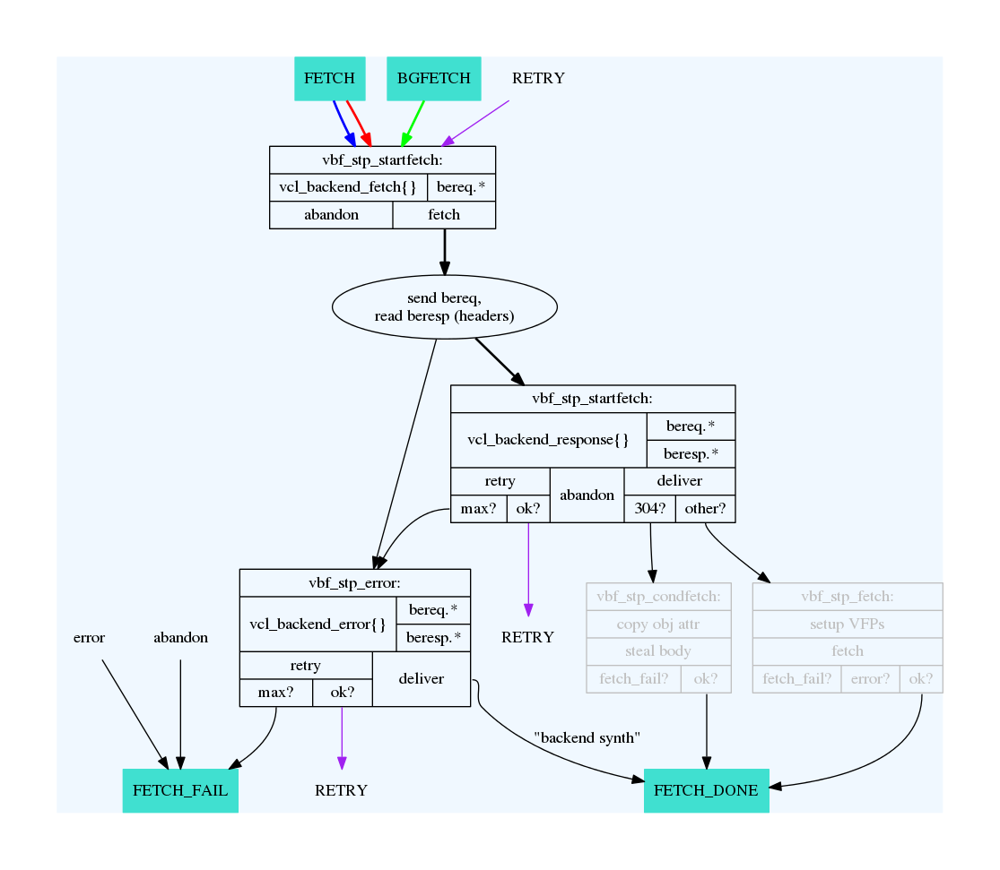

.. include:: util/frontpage.rst

.. include:: build/version.rst

.. contents::
   :class: handout

.. include:: util/printheaders.rst

.. include:: util/control.rst

.. include:: util/param.rst

.. raw:: pdf

   PageBreak oneColumn

.. TODO for the author: To make a simplified version of the Varnish workflow.

Abstract
========

The Varnish Book is the training material for Varnish Plus courses.
The book teaches technical staff to use Varnish Cache 4 and selected modules of Varnish Plus effectively.

The book explains how to get started with the Varnish, and its Varnish Configuration Language (VCL).
Covered are such procedures to effectively use VCL functions, cache invalidation, and more.
Also included are Varnish programs such as ``varnishtop``, and extra material.

Preface
=======

- Course for Varnish Plus
- Install and configure a Varnish server
- Write effective VCL code
- Learn specific features depending the course and your needs

.. TODO for instructor: tailor this slide!

.. container:: handout

   .. Common goal:

   **After finishing this course, you will be able to install and configure the Varnish server, and write effective VCL code.**
   The Varnish Book is designed to teach attendees of Varnish Plus courses.
   Varnish Plus is the commercial suite including the enhanced commercial edition of Varnish Cache.
   This enhanced edition is called Varnish Cache Plus.

   Most of the material presented in this book also applies to the open source Varnish Cache.
   Therefore, you can also refer to the Varnish Cache documentation at https://www.varnish-cache.org/docs/4.0/.

   For simplicity, the book refers to *Varnish Cache* or *Varnish Cache Plus* as **Varnish** when there is no difference between them.
   There is more information about differences between Varnish Cache and Varnish Cache Plus in the Introduction section.

   The Varnish Book is the training material that provides technical staff with a practical approach to thorough understand Varnish.
   The goal of the book is to make you confident when using Varnish.
   Varnish instructors focus on your area, needs or interest.
   Varnish courses are usually flexible enough to make room for it.

   In addition, you will learn the specific material for the course you take.
   The System Administration (Admin) course provides attendees with the necessary knowledge to troubleshoot and tune common parameters of a Varnish server.
   The Web Developer (Webdev) course teaches how to adapt web applications so that they work with Varnish, which guarantees a fast experience for visitors of any website.
   Besides that, other courses may also be taught with this book.

   .. TODO for author: "as visitors' requests scales": can we state a magnitude number? or at what level of scalability are we talking about?
   .. The VMOD course shows how to ???.

Necessary Background
--------------------

.. TODO for instructor: tailor this slide!

The Admin course requires that you:

- have expertise in a shell on a Linux/UNIX machine, including editing text files and starting daemons,
- understand HTTP and related Internet protocols,
- and understand regular expressions.

The Webdev course requires that you:

- have expertise in a shell on a Linux/UNIX machine, including editing text files and starting daemons,
- understand HTTP and related Internet protocols,

.. container:: handout

   You need have no background in theory or application behind Varnish to complete this course.
   However, it is assumed that you have experience and expertise in basic UNIX commands.
   More specific prerequisite skills depend the course you take.

   The book starts with the installation of Varnish and navigation of some of the common configuration files.
   This part is perhaps the most UNIX-centric part of the course.
   If you are taking a Varnish course, do not hesitate to ask your instructor for help.

.. Organization of the Book and Course
   -----------------------------------

   TODO for instructor: tailor this slide

   Each chapter has the following structure:

     1) background,
     2) checklist,
     3) example(s),
     4) exercise(s), and 
     5) feedback.

   At the end of each chapter there is a **Fast Track** section, and it contains three parts:
     1) a review,
     2) exercise(s), and 
     3) feedback.

   .. container:: handout

      .. TODO presentation of outline

      The introduction presents background information of the relevant technologies behind Varnish.
      It presents the history and main design principles needed to understand Varnish.

      .. TODO for the author:
      .. complete this paragraph

      .. Each chapter teaches one **objective** and its **sub-objectives**, or component skills.
      .. The format of each sub-objective is of a five-part **lesson** including:

      The Fast Track can be used for various purposes:

      - As a preliminary test. If you know the information in the Fast Track and can do its exercises, you may skip the chapter.
      - As a test. If you can perform the exercises in the Fast Track, you have learned the important skills taught in the chapter.
      - As a express lesson. If you do not have the time to complete the entire chapter, you can use the Fast Track instead.
      - As a preview of the chapter. The Fast Track provides a concise overview of what you learn in the chapter.
      - As a review. Once you have completed the Varnish Book, you can use the Fast Tracks as a quick review.

      In Appendix A of the book, you will find the **Varnish Book Reference**.
      The Varnish Book Reference is a complete listing, by chapter, of all the checklists.
      Appendix B and C contain special purpose Varnish programs and supporting material respectively.
      Appendix D lists the Varnish Three Letter Acronyms.
      Appendix E describes what is new since Varnish 3.0.

      .. TODO for the author: include a glossary based on:
      .. https://www.varnish-cache.org/trac/wiki/VTLA

      .. TODO for the author: remove this comment when the organization has been completely implemented.

      Note: This organization is still not completely implemented.

.. Commenting this subsection

   How to Use the Book
   -------------------

   .. TODO: "How to Use the Book" is a subsection.
   .. At the moment is a section to exlude it from compiling in the Makefile

   - Most of the material in this book applies to Varnish Cache. Parts that apply only to Varnish Cache Plus are clearly stated.
   - The instructor guides you through the book
   - Use the *manual pages* and help options.

   .. - To practice the course, use the Fast Track in the following way:

   ..   - Read the Review and Exercise parts of the Fast Track.
   ..   - If you can complete the exercise(s), you remember the most important parts.
   ..   - If not, you should repeat the chapter.

   .. container:: handout

      .. Varnish Cache Course

      The Varnish Book is designed to be used as training material under the Varnish Plus course taught by a certified instructor.
      Under the course, the instructor guides you and selects the relevant chapters to learn.
      .. If you use the book as self-instructional tutorial, it is recommended to complete the Fast Track of the chapter you want to read.

      .. Exercises

      There are almost always many ways to do an exercise.
      The solutions provided in this book or by your instructor are not necessarily better than your own.

      .. man pages and help commands

      Varnish installs several reference manuals that are accessible through the manual page command ``man``.
      You can issue the command ``man -k varnish`` to list the manual pages that mention Varnish in their short description.
      In addition, the ``vsl`` man page that explains the Varnish Shared Memory Logging (VSL).
      This man page does not come out when issuing ``man -k varnish``, because it does not contain the word `varnish` in its short description.

      The command ``man varnishd``, for example, retrieves the manual page of the Varnish HTTP accelerator daemon.
      Also, some commands have a help option to print the usage of the command.
      For example, ``varnishlog -h`` prints the usage and options of the command with a short description of them.

      .. Installation required

      To complete this book, you need the following installation:

      - Varnish Cache Plus, or Varnish Cache Plus 4.0 or later
      - Apache/2.4 or later
      - HTTPie 0.8.0 or later

      .. formats

      The book is written with different formatting conventions.
      Varnish Configuration Language (VCL) text is in verbatim mode.

      .. TODO for the author: insert an example of VCL code here.

      Important notes and tips are stated inside boxes throughout the book.

      .. Ask for help

      This book is meant to be understandable to everyone who takes a Varnish Plus course and has the required skills.
      If you find something unclear, do not be shy and blame yourself, ask your instructor for help.
      You can also contact the Varnish open source community at https://varnish-cache.org.
      To book training, please look at https://varnish-software.com/academy.

Introduction
============

- What is Varnish?
- Benefits of Varnish
- Open source / Free software
- Varnish Software: The company
- What is Varnish Plus?
- Varnish: more than a cache server
- History of Varnish
- Varnish Governance Board (VGB)

.. TODO Comparison of related software solutions such as: Apache mod_security, Squid, Nginx, and Apache Traffic Server (ATS) (reverse and forward proxy, generally comparable to Nginx and Squid).

What is Varnish?
----------------

.. container:: handout

   .. What is Varnish?:

   Varnish is a reverse HTTP proxy, sometimes referred to as a HTTP accelerator or a web accelerator.
   A reverse proxy is a proxy server that appears to clients as an ordinary server.
   Varnish stores files or fragments of files in memory, allowing them to be served quickly. 
   It is essentially a key/value store, that usually uses the URL as a key. 
   It is designed for modern hardware, modern operating systems and modern work loads.

   .. Benefits:

   At the same time, Varnish is flexible.
   The Varnish Configuration Language (VCL) is lightning fast and allows system administrators to express their wanted policy rather than being constrained by what the Varnish developers want to cater for or could think of.
   Varnish has shown itself to work well both on large (and expensive) servers and tiny appliances.

   .. Varnish use

   Varnish is more than a reverse HTTP proxy.
   Depending on the installation, Varnish can be used as:

   .. TODO for the author: can we be more specific with what functionality is achieved with Varnish Cache, and which one with Varnish Cache Plus?

   - web application firewall,
   - DDoS attacks defender,
   - load balancer,
   - integration point,
   - quick fix for unstable backends, and
   - HTTP router.

   At the moment of writting this book, Varnish Plus is supporting the following Linux distributions:

   - RedHat Enterprise Linux 5
   - RedHat Enterprise Linux 6
   - Ubuntu Linux 12.04 LTS (precise)
   - Ubuntu Linux 14.04 LTS (trusty)
   - Debian Linux 7 (wheezy)

   Varnish Cache Plus is supported on 64-bit systems.

Varnish Cache and Varnish Cache Plus
------------------------------------

.. csv-table:: Topics Covered in This Book and Their Availability in Varnish Cache and Varnish Plus
   :name: Topics Covered in This Book and Their Availability in Varnish Cache and Varnish Plus
   :delim: ,
   :header-rows: 1
   :file: tables/varnish_cache_plus_offer_diff.csv

.. container:: handout

   .. Open Source / Free Software:

   Varnish Cache is an open source project, and free software. 
   The development process is public and everyone can submit patches, or just take a peek at the code if there is some uncertainty on how does Varnish Cache work.
   There is a community of volunteers who help each other and newcomers. 
   The BSD-like license used by Varnish Cache does not place significant restriction on re-use of the code, which makes it possible to integrate Varnish Cache in virtually any solution.

   Varnish Cache is developed and tested on GNU/Linux and FreeBSD. 
   The code-base is kept as self-contained as possible to avoid introducing out-side bugs and unneeded complexity. 
   As a consequence of this, Varnish uses very few external libraries.

   At the moment of writting this book, Varnish Cache is supporting the following Linux distributions:

   - Debian Linux 7 (wheezy)
   - Debian Linux 8 (jessie)
   - Ubuntu Linux 12.04 (precise)
   - Ubuntu Linux 14.04 (trusty)
   - RedHat Enterprise Linux 6
   - FreeBSD 9
   - FreeBSD 10

   .. Varnish Software:

   Varnish Software is the company behind Varnish Cache.
   Varnish Software and the Varnish community maintain a package repository of Varnish Cache for several common GNU/Linux distributions.

   .. Varnish Plus:

   Varnish Software also provides a commercial suite called Varnish Plus with software products for scalability, customization, monitoring and expert support services.
   The engine of the Varnish Plus commercial suite is the enhanced commercial edition of Varnish Cache.
   This edition is proprietary and it is called *Varnish Cache Plus*.
   
   The Varnish Plus offer of software products include:

   - the Varnish Massive Storage Engine (MSE),
   - hashtwo (Varnish Software implementation of surrogate keys),
   - Varnish Administration Console (VAC),
   - Varnish Customer Statistics (VCS),
   - Varnish Tuner,
   - and more.

   .. Covered in this book:
   
   This book covers technical topics for Varnish Cache and Varnish Plus Products.
   Table `Topics Covered in This Book and Their Availability in Varnish Cache and Varnish Plus`_  shows the these topics and their availability for Varnish Cache users and Varnish Plus customers.
   For more detailed information about the Varnish Plus offer, please visit https://www.varnish-software.com/what-is-varnish-plus.

Varnish Software
----------------

Varnish timeline:

- 2005: Ideas! Verdens Gang (www.vg.no, Norway's biggest newspaper) were looking for alternative cache solutions.
- 2006: Work began. 
  Redpill Linpro was in charge of project management, infrastructure and supporting development. 
  Poul-Henning Kamp did the majority of the actual development.
- 2006: Varnish 1.0 released
- 2008: Varnish 2.0 released
- 2009: The first Varnish User Group Meeting is held in London.
  Roughly a dozen people participate from all around the world.
- 2010: Varnish Software is born as a spin-off to Redpill Linpro AS.
- 2011: Varnish 3.0 released
- 2012: The fifth Varnish User Group Meeting is held in Paris. 
  Roughly 70 people participate on the User-day and around 30 on the developer-day!

.. container:: handout

   VG, a large Norwegian newspaper, initiated the Varnish project in cooperation with Linpro. 
   The lead developer of the Varnish project, Poul-Henning Kamp, is an experienced FreeBSD kernel hacker. 
   Poul-Henning Kamp continues to bring his wisdom to Varnish in most areas where it counts.

   From 2006 throughout 2008, most of the development was sponsored by
   VG, API, Escenic and Aftenposten, with project management,
   infrastructure and extra man-power provided by Redpill Linpro. At
   the time, Redpill Linpro had roughly 140 employees mostly centered
   around consulting services.

   Today Varnish Software is able to fund the core development with income from service agreements, in addition to offering development of specific features on a case-by-case basis.
   The interest in Varnish continues to increase.
   An informal study based on the list of most popular web sites in Norway indicates that about 75% or more of the web traffic that originates in Norway is served through Varnish.

   .. TODO for the author: reference for the informal study?

   .. VGB

   Varnish development is governed by the Varnish Governance Board (VGB),
   which thus far has not needed to intervene. The VGB consists of an
   architect, a community representative and a representative from Varnish
   Software.
   
   .. TODO for the editor: confirm the VGB positions
   
   As of December 2014, the VGB positions are filled by Poul-Henning Kamp (Architect), Rogier Mulhuijzen (Community) and Lasse Karstensen (Varnish Software).
   On a day-to-day basis, there is little need to interfere with the general flow of development.

   .. TODO for the editor: is this still true?
   
   For those interested in development, the developers arrange weekly bug washes were recent tickets and development is discussed. 
   This usually takes place on Mondays around 12:00 CET on the IRC channel `#varnish-hacking` on `irc.linpro.net`.

Design principles
-----------------

Varnish is designed to:

- solve real problems,
- run on modern hardware (64-bit multi-core architectures),
- work with the kernel, not against it,
- translate Varnish Configuration Language (VCL) to C programming language,
- be extendible via Varnish Modules (VMODs), and
- reduce lock-contention via its workspace-oriented shared memory model.

.. - Innovation, not regurgitation

.. container:: handout

	.. run on modern hardware
        
	The focus of Varnish has always been performance and flexibility.
        Varnish is designed for hardware that you buy today, not the
        hardware you bought 15 years ago. Varnish is designed to run
        on 64-bit architectures and scales almost proportional to
        the number of CPU cores you have available. Though CPU-power
        is rarely a problem.

        If you choose to run Varnish on a 32-bit system, you are limited to
        3GB of virtual memory address space, which puts a limit on the
        number of threads you can run and the size of your cache. This is a
        trade-off to gain a simpler design and reduce the amount of work
        Varnish needs to do. The 3GB limit depends on the operating system (OS)
        kernel. The theoretical maximum is 4GB, but your OS reserves
        some of that for the kernel. This is called the user/kernel  memory split.

	.. work with the kernel
        
	Varnish does not keep track of whether your cache is on disk or in
        memory. Instead, Varnish requests a large chunk of memory and
        leave it to the operating system to figure out where that memory
        really is. The operating system can generally do a better job than
        a user-space program.

        Accept ``filters``, ``epoll`` and ``kqueue`` are advanced features of the
        operating system that are designed for high-performance services
        like Varnish. By using these, Varnish can move a lot of the
        complexity into the OS kernel which is also better positioned to
        know what threads are ready to execute when.

        .. VCL   
	
	In addition, Varnish uses a configuration language (VCL) that is translated to C programming language code.
	This code is compiled with a standard C compiler and then dynamically linked directly into Varnish at run-time. 
	This has several advantages.
	The most practical is the freedom you get as system administrator.
	
	You can use VCL to decide how you want to interact with Varnish, instead of having a developer trying to predict every possible caching scenario.
	The fact that VCL is translated to C code, gives Varnish a very high performance.
	You can also by-pass the process of code translation and write raw C code, this is called in-line C in VCL.
	In short: VCL allows you to specify exactly how to use and combine the features of Varnish.

	.. VMODs
        
	Varnish allows integration of Varnish Modules or simply VMODs.
	These modules let you extend the functionality of the VCL language by
        pulling in custom-written features. Some examples include
        non-standard header manipulation, access to *memcached* or complex
        normalization of headers.

	.. shared memory
        
	The shared memory log allows Varnish to log large amounts of
        information at almost no cost by having other applications parse
        the data and extract the useful bits. This reduces the
        lock-contention in the heavily threaded environment of Varnish.
        Lock-contention is also one of the reasons why Varnish uses a
        workspace-oriented memory-model instead of allocating the
        exact amount of space it needs at run-time.

	.. TODO for the author: Move to fast track
        
	To summarize: Varnish is designed to run on modern hardware
        under real work-loads and to solve real problems. Varnish does not
        cater to the "I want to make Varnish run on my 486 just
        because"-crowd. If it does work on your 486, then that's fine, but
        that's not where you will see our focus. Nor will you see us
        sacrifice performance or simplicity for the sake of niche use-cases
        that can easily be solved by other means -- like using a 64-bit OS.

How objects are stored
......................

- Objects in Varnish are stored in memory and addressed by hash keys
- You can control the hashing
- Multiple objects can have the same hash key

.. container:: handout

	.. hash

	Varnish has a key/value store in its core. 
	Objects are stored in memory and references to these objects are kept in a hash tree.

	.. Cache control

	A rather unique feature of Varnish is that it allows you to control the input of the hashing algorithm.
	The key is by default made out of the HTTP Host header and the URL, which is sufficient and recommended for typical cases.
	However, you are able to create the key from something else.
	For example, you can use cookies or the user-agent of a client request to create a hash key.

	.. multiple objects

	HTTP specifies that multiple objects can be served from the same URL, depending on the preferences of the client.
	For instance, content in *gzip* format is sent only to clients that indicate *gzip* support.
	Varnish stores various objects under one key.
	Upon a client request, Varnish selects the object that matches the client preferences.

Getting Started
===============

In this chapter, you will:

- Install Varnish and Apache
- Configure Varnish to use Apache as backend
- Cover basic configuration

.. container:: handout

   This course is independent of the operating system in use.
   However, there are some differences between Linux distributions that Varnish supports.
   Those differences are stated when necessary.

   Most of the commands you will type in this course require root privileges.
   You can get temporary root privileges by typing ``sudo <command>``, or permanent root privileges by typing ``sudo -i``.

   .. backend definition

   In Varnish terminology, a backend server is whatever server Varnish talks to fetch content.
   This can be any sort of service as long as it understands HTTP. 
   Most of the time, Varnish talks to a web server or an application frontend server.
   In this book, we use backend, web server or application frontend server interchangeably.

Install Varnish and Apache as backend
-------------------------------------

- Use packages provided by varnish-cache.org

.. csv-table:: Different Locations of the Varnish Configuration File
   :name: Different Locations of the Varnish Configuration File
   :delim: ;
   :header-rows: 2
   :file: tables/varnish_configuration_files.csv

[1] The file does not exist by default.
Copy it from ``/lib/systemd/system/`` and edit it.

[2] There is no configuration file.
Use the command ``chkconfig varnishlog/varnishncsa on/off`` instead.

[3] There is no configuration file.
Use the command ``systemctl start/stop/enable/disable/ varnishlog/varnishncsa`` instead.

.. container:: handout

   .. Note for the editor: Table varnish_apache should be above 'handout', but having two tables throws an error when compiling.

   .. csv-table:: Varnish and Apache configuration
      :name: varnish_apache
      :delim: ;
      :widths: 20, 30, 50
      :header-rows: 1
      :file: tables/varnish_apache.csv

   \* These files are for a SysV Ubuntu/Debian configuration.

   The configuration file is used to give parameters and command line arguments to the Varnish daemon.
   This file also specifies the location of the VCL file.
   Modifications to this file require to run ``service varnish restart`` for the changes to take effect.

   The location of the Varnish configuration file depends on the operating system and whether it uses the ``init`` system of `SysV`, or `systemd`.
   Table `Different Locations of the Varnish Configuration File`_ shows the locations for each system installation.

   .. Introduction to apt-get and yum

   To install packages on Ubuntu and Debian, use the command ``apt-get install <package>``, e.g., ``apt-get install varnish``. 
   For Red Hat, use ``yum install <package>``.

Install Apache
..............

   To install Apache in Ubuntu, type the command: ``apt-get install apache2``.
   Install the *HTTPie* utility with the command: ``apt-get install httpie``.
   HTTPie allows you to issue arbitrary HTTP requests in the terminal.
   Next:

   #. Verify that Apache works by typing ``http -p h localhost``.
      You should see a ``200 OK`` response from Apache.
   #. Change Apache's port from 80 to 8080 in `/etc/apache2/ports.conf` and `/etc/apache2/sites-enabled/000-default.conf`.
   #. Restart Apache: ``service apache2 restart``.

Install Varnish
...............

   .. TODO for the author: Update this instructions to install Varnish Plus once packages are available for Ubuntu.

   Varnish is distributed in Ubuntu package repositories, but the Varnish version in those repositories might be out of date.
   We generally recommend you to use the packages provided by varnish-cache.org.
   Please be advised that we only provide packages for Ubuntu's LTS releases, not all the intermediate releases.
   However, these packages might still work fine on newer releases.

   To use the varnish-cache.org repository and install Varnish on Ubuntu 14.04 trusty do the following as root::

     #. apt-get install apt-transport-https
     #. curl https://repo.varnish-cache.org/ubuntu/GPG-key.txt | apt-key add -
     #. echo "deb https://repo.varnish-cache.org/ubuntu/ trusty varnish-4.0" >> \
	/etc/apt/sources.list.d/varnish-cache.list
     #. apt-get update
     #. apt-get install varnish

   For Ubuntu 12.04 (precise) replace ``trusty`` with ``precise`` in instruction 3.
   If you want to install Varnish version 3.0, replace ``varnish-4.0`` with ``varnish-3.0`` in instruction 3.

Configure Varnish
.................

   Once you have found the Varnish configuration file, edit it to listen on port `80` and have a management interface on port `1234`.
   This is configured with the ``-a`` and ``-T`` options of the variable ``DAEMON_OPTS``::

     -a ${VARNISH_LISTEN_ADDRESS}:${VARNISH_LISTEN_PORT}
     -T ${VARNISH_ADMIN_LISTEN_ADDRESS}:${VARNISH_ADMIN_LISTEN_PORT}

   In order for changes in the configuration file to take effect, `varnishd` must be restarted.
   The safest way to restart Varnish is by using ``service varnish restart``.

   The default VCL file location is ``/etc/varnish/default.vcl``.
   You can change this location by editing the configuration file.
   The VCL file contains your VCL and backend definitions.
   Edit the VCL file to use Apache as backend::

     backend default {
       .host = "127.0.0.1";
       .port = "8080";
     }

   After changing a VCL file, you can run ``service varnish reload``, which does not restart `varnishd`. 

   .. tip::

      You can get an overview over services listening on TCP ports by issuing the command ``netstat -nlpt``.

   .. tip::

      Issue the command ``man vcl`` to see all available options to define a backend.

   .. note::

      Varnish recommends to disable SELinux.
      If you prefer otherwise, then set the boolean 'varnishd_connect_any' variable to 1.
      You can do that by executing the command ``sudo setsebool varnishd_connect_any 1``.

The management interface
------------------------

Varnish offers a management command line interface (CLI) to control a running Varnish instance.
This interface implements a list of management commands in the ``varnishadm`` utility program.
``varnishadm`` establishes a connection to the Varnish daemon ``varnishd``.
You can use ``varnishadm`` to:

- start and stop Varnish
- change configuration parameters without restarting Varnish
- reload the Varnish Configuration Language (VCL) without restarting Varnish 
- view the most up-to-date documentation for parameters

You can read about other usages by issuing the ``help`` command after you connect to the management interface (``varnishadm``).

.. container:: handout

   To connect to the management interface, issue the command ``varnishadm``.
   If there are many Varnish instances running in one machine, specify the instance with the ``-n`` option.
   Keep the following in mind when using the management interface:

   1. Changes take effect on the running Varnish daemon instance without need to restart it.
   2. Changes are not persistent across restarts of Varnish. 
      If you change a parameter and you want the change to persist after you restart Varnish,
      you need to store your changes in the configuration file of the boot script.
      The location of the configuration file is is in Table `Different Locations of the Varnish Configuration File`_.

   ``varnishadm`` uses a non-encrypted key stored in a secret file to authenticate and connect to a Varnish daemon.
   You can now provide access to the interface on a per user basis by adjusting the read permission on the secret file.
   The location of the secret file is ``/etc/varnish/secret`` by default, but you can use the ``-S`` option to specify other location.
   The content of the file is a shared secret, which is a string generated under Varnish installation.
   
   The management interface authenticates with a challenge-response mechanism.
   Therefore, the shared secret is never transmitted, but a challenge and the response to the challenge.
   This authentication mechanism offers a reasonably good access control, but it does not protect the data transmitted over the connection.
   Therefore, it is very important to avoid eavesdroppers like in the man-in-the-middle attack.
   The simplest way to avoid eavesdroppers is to configure the management interface listening address of ``varnishd`` to listen only on localhost (127.0.0.1).
   You configure this address with the ``-T`` option of the ``varnishd`` command.

   .. tip::
      Varnish provides many on-line reference manuals.
      To learn more about ``varnishadm``, issue ``man varnishadm``.
      To check the Varnish CLI manual page, issue ``man varnish-cli``.

More about Varnish Configuration
................................

.. csv-table:: Varnish Configuration Types
   :name: configuration_types
   :delim: ;
   :widths: 25, 25, 50
   :header-rows: 1
   :file: tables/configuration_type.csv

The location of the configuration file is in Table `Different Locations of the Varnish Configuration File`_.

.. csv-table:: How to reload Varnish
   :name: varnish_reload
   :delim: ;
   :widths: 40, 60
   :header-rows: 1
   :file: tables/varnish_reload.csv

Using the ``service`` commands is recommended, safe and fast.

.. container:: handout

   Command line options and tunable parameters are used to:
   1) define how Varnish should work with operating system and hardware, and
   2) set default values.
   Configuration in VCL defines how Varnish should interact with web servers and clients.

   Almost every aspect of Varnish can be reconfigured without restarting Varnish.
   Notable exceptions are:
   1) allocated memory size for caching,
   2) cache file location, 
   3) ownership (for user and group privileges) of the Varnish daemon, and
   4) the hashing algorithm.

   Some parameters changes require to restart Varnish to take effect.
   For example, the modification of the listening port.
   Other changes might not take effect immediately, but restart is not required.
   Changes to cache time-to-live (TTL), for instance, take effect only after the current cached objects expire.
   In this example, the value of the TTL parameter is only applicable to caches fetched after the TTL modification.

   ``param.show <parameter>`` outputs a description of ``parameter``.
   The description includes when and how modifications takes effect, and the default and current value of the parameter.

   There are other ways to reload VCL and make parameter-changes take effect, mostly using the ``varnishadm`` tool. 
   However, using the ``service varnish reload`` and ``service varnish restart`` commands is a good habit.

   .. note::

      If you want to know how the ``service varnish``-commands work, look at the script that runs behind the scenes. 
      The script is in ``/etc/init.d/varnish``.

   .. warning::

      The varnish script-configuration (located under `/etc/default/` or `/etc/sysconfig/`) is directly sourced as a shell script.
      Pay close attention to any backslashes (\\) and quotation marks that might move around as you edit the ``DAEMON_OPTS`` environmental variable.

Command line configuration
--------------------------

Relevant options for the course are:

-a <[hostname]:port>      listening address and port for client requests
-f <filename>             VCL file
-p <parameter=value>      set tunable parameters
-S <secretfile>           shared secret file for authorizing access to the management interface
-T <hostname:port>        listening address and port for the management interface
-s <storagetype,options>  where and how to store objects

.. container:: handout

        All the options that you can pass to the ``varnishd`` binary are
        documented in the ``varnishd(1)`` manual page (``man varnishd``).
        You may want to take a moment to skim over the options mentioned
        above.

        For Varnish to start, you must specify a backend.
	You can specify a backend by two means: 
	1) declare it in a VCL file, or
	2) use the ``-b`` to declare a backend when starting ``varnishd``.

        Though they are not strictly required, you almost always want to
        specify a ``-s`` to select a storage backend,  ``-a`` to make sure
        Varnish listens for clients on the port you expect and ``-T`` to
        enable a management interface, often referred to as a telnet
        interface.

        For both ``-T`` and ``-a``, you do not need to specify an IP, but
        can use ``:80`` to tell Varnish to listen to port 80 on all IPs
        available. Make sure you do not forget the colon, as ``-a 80``
        tells Varnish to listen to the IP with the decimal-representation
        "80", which is almost certainly not what you want. This is a result
        of the underlying function that accept this kind of syntax.

        You can specify ``-p`` for parameters multiple times. The workflow
        for tuning Varnish parameters usually means that you first try the
        parameter on a running Varnish through the management interface to
        find the value you want.
	Then store the parameter and value in a configuration file.
	This file is read every time you start Varnish.

        The ``-S`` option specifies a file which contains a secret to be
        used for authentication. This can be used to authenticate with
        ``varnishadm -S`` as long as ``varnishadm`` can read the same secret
        file -- or rather the same content: The content of the file can be
        copied to another machine to allow ``varnishadm`` to access the
        management interface remotely.

        .. note::

	   Varnish requires that you specify a backend.
	   A backend is normally specified in the VCL file.
           You specify the VCL file with the ``-f`` option.
	   However, it is possible to start Varnish without a VCL file by specifying the backend server with the ``-b <hostname:port>`` option instead.

	   Since the ``-b`` option is mutually exclusive with the ``-f`` option, we use only the ``-f`` option. 
	   You can use ``-b`` if you do not intend to specify any VCL and only have a single backend server.

	.. tip::
	   Type ``man varnishd`` to see all options of the Varnish daemon.

	.. review bookmark

Defining a backend in VCL
-------------------------

**/etc/varnish/default.vcl**

.. include:: vcl/backend.vcl
   :literal:

.. container:: handout

   The above example defines a backend named ``default``, where the name `default` is not special.
   Varnish uses the first backend you specify as default.
   You can specify many backends at the same time, but for now, we will only specify one to get started.

Exercise: Use the administration interface to learn, review and set Varnish parameters
--------------------------------------------------------------------------------------
#. Use ``varnishadm`` to see the default value for the ``default_ttl`` parameter, and what it does.

.. TODO for the author: This exercise is too short and simple. Consider to remove it or elaborate it.

Exercise: Fetch data through Varnish
------------------------------------

- Execute ``http -p hH http://localhost/`` on the command line
- Compare the results from multiple executions.

.. container:: handout

        ``-p hH`` specifies HTTPie to print only request and response headers, but not the content.
	The typical HTTP response is "200 OK" or "404 File not found".
	Feel free to try removing some of the options observe the effect.
	For more information about the HTTPie command, type ``man http``.

	Testing Varnish with a web browser can be confusing, because web browsers have their own cache.
        Therefore, it is useful to double-check web browsers requests with HTTPie.

The Varnish Log
===============

.. In this chapter you will learn about:

- Log data is in shared memory
- Varnish logs everything (no debug switches)

.. container:: handout
   
   .. Log data is in shared memory

   Varnish provides log data in real-time. 
   ``/var/log/varnish/`` is either non-existent or empty.
   There is a reason for that.

   .. logs everything

   Varnish logs all its information to a shared memory log which is overwritten repeatedly every time it is filled up.
   The downside is that there is no historic data unless you set it up yourself.
   The upside is that you get an abundance of information when you need it.

   The ``varnishlog`` and ``varnishncsa`` configuration files allow you to enable or disable log writting to disk.
   Table `Different Locations of the Varnish Configuration File`_ shows the location of the configuration file based on your platform.
   Keep in mind that ``varnishlog`` generates large amounts of data!

   Varnish provides specific tools to parse the content of logs: ``varnishlog``, ``varnishncsa``, and ``varnishstat``.
   ``varnishlog`` and ``varnishstat`` are the two most common used tools.

   .. tip::
   
      Issue ``man varnishlog/varnishncsa/varnishstat`` to retrieve their reference manuals.

Log Data Tools
--------------

Tools to display detailed log records:

- ``varnishlog`` is used to access request-specific data. It provides information about specific clients and requests.
- ``varnishncsa`` displays Varnish logs in Apache/NCSA combined log format.

Statistical tools:

- ``varnishstat`` is used to **access global counters**. It provides overall statistics, e.g the number of total requests, number of objects and more.
- ``varnishtop`` reads the Varnish log and presents a continuously updated list of the most commonly occurring log entries.
- ``varnishhist`` reads the Varnish log and presents a continuously updated histogram showing the distribution of the last *N* requests by their processing.

- If you have multiple Varnish instances on the same machine, you need to specify ``-n <name>`` both when starting Varnish and when starting the corresponding tools.

.. container:: handout

   All log tools (including ``varnishadm``) take a ``-n`` option. 
   The Varnish daemon ``varnishd`` itself also takes a ``-n`` option. 
   This option is used to specify the instance of ``varnishd``, or the location of the shared memory log. 
   On most installations ``-n`` is not used, but if you run multiple Varnish instances on a single machine, you need to use ``-n`` to distinguish one Varnish instance from another.

   In this course, we focus on the two  most important tools: ``varnishlog`` and ``varnishstat``.
   Unlike all other tools, ``varnishstat`` does not read from entries from Varnish log, but global counters.
   We include ``varnishstat`` in this section, because it is useful to use it with ``varnishlog`` to analyze your Varnish installation.
   You can find more details about ``varnishncsa``, ``varnishtop`` and ``varnishhist`` in Appendix ##.

   .. TODO for the editor: update reference to Appendix ##.

   .. tip::
      All tool programs of Varnish log have installed reference manuals.
      Remember to use the ``man`` command to retrieve their manual pages.

Log Layout
----------

.. container:: handout
   
   The figure above shows how Varnish logs transactions chronologically, and how can they be reordered.
   The ``varnishlog`` tool offers mechanisms to reorder transactions grouped by session, client- or backend-request.
   `Transactions`_ Subsection explains transactions in more detail.

Transactions
------------

- A transaction is one work item in Varnish
- Share a single Varnish Transaction ID (VXID) per types of transactions.
  Examples of transaction types are:

 - Session
 - Client request
 - Backend request

- Transaction reasons. Examples:

 - ESI request
 - restart
 - fetch

.. container:: handout

   .. Definition of transaction

   A transaction is a set of log lines that belongs together, e.g. a client request or a backend request.
   The Varnish Transaction IDs (VXIDs) are applied to lots of different kinds of work items.
   A unique VXID is assigned to each type of transaction.
   You can use the VXID when you view the log through varnishlog. 
   
   .. More about VXID

   The default is to group the log on VXID, which basically makes ``varnishlog`` act more or less the way it does in Varnish 3.0.
   When viewing a log for a simple cache miss, you can see the backend request, the client request and then the session.
   They are displayed in the order they end.
   Some people find it a bit counter intuitive that the backend request is logged before the client request, but if you think about it is perfectly natural.

   .. Transaction reasons

Transaction Groups
..................

.. the VSL-query man page describes the grouping modes and the transaction hierarchy
.. https://www.varnish-cache.org/docs/trunk/reference/vsl-query.html

- ``varnishlog -g <session | request | vxid | raw>`` groups together transactions
- Transaction groups are hierarchical
- Levels are equal to relationships (parents and children)::
 
   Lvl 1: Client request (cache miss)
     Lvl 2: Backend request
     Lvl 2: ESI subrequest (cache miss)
       Lvl 3: Backend request
       Lvl 3: Backend request (VCL restart)
       Lvl 3: ESI subrequest (cache miss)
         Lvl 4: Backend request
     Lvl 2: ESI subrequest (cache hit)

.. container:: handout

   .. Hierarchy
   .. client request
   .. ESI
   
   When grouping transactions, there is a hierarchy structure showing which transaction initiated what.    
   In client request grouping mode, the various work items are logged together with their originating client request.
   For example, a client request that triggers a backend request might trigger two more ESI subrequests, which in turn might trigger yet another ESI subrequest.
   After that, it comes the response from the backend to the client.
   All these requests together with the client response are arranged in the order they are initiated.
   This arrangement is easier to grasp than when grouping by VXID.
   We will see in the Content Composition section how to analyze the log for Edge Side Includes (ESI) transactions.

   .. Levels and relationships of transactions
   .. TODO for the author: explain that levels are equal to relationships.
   .. This explanation will probably go before when explaining subroutines.
   
   When a subrequest occurs in the log, the subrequest tells us about the relationship to its parent request through the `Link` statement. 
   This statement contains the VXID of the parent request.
   ``varnishlog`` indents its output based on the level of the request, making it easier to see the level of the current request.

Example of Transaction Grouping with ``varnishlog``
...................................................

..   :align: center
..   :width: 100%

.. TODO: To update cache_miss_request_grouping.png resolution

.. container:: handout

   The example shows a client request in a *cache miss* scenario.
   In figure ##, ``varnishlog`` returns records grouped by request.
   For simplicity, we use the ``-i`` option to include only the ``Session`` and ``Link`` tags.
   For more information about the format and content of all Varnish shared memory logging (VSL) tags, see its man page by typing ``man vsl``.
   You will learn more about the work flow of Varnish in detail in Section ##.
   
   To reproduce the example, issue ``http -p hH http://localhost/``, and then the ``varnishlog`` command as above.
   The ``-d`` option processes all recorded entries in Varnish log.
   To learn more about the available ``varnishlog`` options, enter ``varnishlog -h`` or see the man page of varnishlog.

   .. warning::

      ``varnishlog`` accepts all option that are syntactically correct.
      The semantics of your use of options, however, might be different than what you think at first.
      Therefore, you should ensure that your results  make sense.
      You can verify the meaning of your results by double checking the filters, and by separating your results with the ``-b``and ``-c`` options.

Query language
--------------

- Operates on transaction groups
- Query expression is true if it matches one or more records, false otherwise.
- Supports:

  - string matching ``RespProtocol eq "HTTP/1.1"``
  - regex ``ReqMethod ~ "GET|POST"``
  - integer and float matching ``RespStatus == 200``
  - boolean operators ``RespStatus >= 500 and RespStatus < 600``
  - parenthesis hierarchy
  - Negate using ``not``

Examples of Varnish log queries::

   varnishlog -q 'respstatus < 500'
   varnishlog -g request -q 'ReqURL eq "/"'
   varnishlog -g request -q 'Backend ~default'

.. container:: handout

    .. Query Log Language

    The ``-q`` option allows you to add a query to ``varnishlog``. 
    Think of it as a sort of select filter for ``varnishlog``. 
    It works together with the grouping so that if the query matches some part of any of the work items in the transaction group, the whole group matches and gets displayed.

    Query expressions can be combined using boolean functions.
    There are many output control options, such as ``-i``.
    Output controls are applied last, and they do not affect queries.

    .. Benefits for others

    The grouping and the query log processing all happens in the Varnish logging API.
    This means that other programs using the ``varnishlog`` API automatically get grouping and query language.

    .. tip::

       Other useful tricks:
       
       - Response time exceeds 1⁄2 second ``ReqEnd[5] >= 0.5``
       - Client requests connection closed ``ReqHeader:connection ~ close``
       - ESI miss (-g request) ``{3+}Begin ~ Bereq``

	 .. TODO for the author: double check {3+}

Exercise
--------

- Make ``varnishlog`` only print client-requests where the `ReqURL` tag contains ``/favicon.ico``.

.. TODO for the author: Elaborate more this exercise.

.. TODO for the author: Fix this proposed solution:

.. varnishlog -I ReqURL:favicon\.ico$ -d

varnishstat
-----------

.. TOFIX for the author: The values of Hitrate are not displayed in the HTML version. Fix it!

TOFIX: To resize the font of this example.

::

   Uptime mgt:   1+23:38:08                                                                Hitrate n:       10      100      438
   Uptime child: 1+23:38:08                                                                   avg(n):   0.9967   0.5686   0.3870

   NAME                                               CURRENT       CHANGE      AVERAGE       AVG_10      AVG_100     AVG_1000
   MAIN.uptime                                           171488         1.00         1.00         1.00         1.00         1.00
   MAIN.sess_conn                                          1055         7.98          .           8.35         4.49         2.11
   MAIN.client_req                                         1055         7.98          .           8.35         4.49         2.11
   MAIN.cache_hit                                          1052         7.98          .           8.35         4.49         2.10
   MAIN.cache_miss                                            3         0.00          .           0.00         0.00         0.00
   MAIN.backend_conn                                          4         0.00          .           0.00         0.00         0.01
   MAIN.backend_toolate                                       3         0.00          .           0.00         0.00         0.01
   MAIN.backend_recycle                                       4         0.00          .           0.00         0.00         0.01
   MAIN.fetch_length                                          4         0.00          .           0.00         0.00         0.01
   MAIN.pools                                                 2         0.00          .           2.00         2.00         2.00
   MAIN.threads                                             200         0.00          .         200.00       200.00       200.00
   MAIN.threads_created                                     200         0.00          .           0.00         0.00         0.00
   MAIN.n_object                                              1         0.00          .           1.00         0.85         0.81
   MAIN.n_objectcore                                          3         0.00          .           3.00         2.85         2.81
   MAIN.n_objecthead                                          4         0.00          .           4.00         3.89         3.83
   MAIN.n_backend                                             1         0.00          .           1.00         1.00         1.00
   MAIN.n_expired                                             2         0.00          .           2.00         1.76         1.33
   MAIN.s_sess                                             1055         7.98          .           8.35         4.49         2.11
   MAIN.s_req                                              1055         7.98          .           8.35         4.49         2.11
   MAIN.s_fetch                                               3         0.00          .           0.00         0.00         0.00
   MAIN.s_req_hdrbytes                                   122380       926.07          .         968.24       520.74       244.35
   MAIN.s_resp_hdrbytes                                  376249      2854.04         2.00      2982.17      1602.59       751.87
   MAIN.s_resp_bodybytes                                3435094     25993.71        20.00     27177.59     14616.67      6858.74
   MAIN.backend_req                                           4         0.00          .           0.00         0.00         0.01
   MAIN.n_vcl                                                 1         0.00          .           0.00         0.00         0.00
   MAIN.bans                                                  1         0.00          .           1.00         1.00         1.00
   MAIN.n_gunzip                                              4         0.00          .           0.00         0.00         0.01
   MGT.uptime                                            171488         1.00         1.00         1.00         1.00         1.00
   SMA.s0.c_req                                               8         0.00          .           0.00         0.01         0.01
   SMA.s0.c_bytes                                         15968         0.00          .           0.01        18.98        27.33
   SMA.s0.c_freed                                         11976         0.00          .           0.00        12.17        18.56
   SMA.s0.g_alloc                                             2         0.00          .           2.00         1.70         1.62
   SMA.s0.g_bytes                                          3992         0.00          .        3991.87      3398.82      3235.53
   SMA.s0.g_space                                     268431464         0.00          .   268431464.13 268432057.18 268432220.47
   VBE.default(127.0.0.1,,8080).bereq_hdrbytes              630         0.00          .           0.00         0.70         1.13
   VBE.default(127.0.0.1,,8080).beresp_hdrbytes            1128         0.00          .           0.00         1.34         1.93
   VBE.default(127.0.0.1,,8080).beresp_bodybytes          13024         0.00          .           0.01        15.48        22.29

   MAIN.cache_hit                                                                                                         INFO
   Cache hits:
   Count of cache hits.   A cache hit indicates that an object has been delivered to a  client without fetching it from a backend server.

.. container:: handout

   ``varnishstat`` gives a good representation of the general health of Varnish.
   Unlike all other tools, ``varnishstat`` does not read log entries, but counters that Varnish update in real-time.   
   It can be used to determine your request rate, memory usage, thread usage, number of failed backend connections, and more.
   ``varnishstat`` gives you information just about anything that is not related to a specific request.

   There are over a hundred different counters available.
   To increase the usefulness of ``varnishstat``, only counters with a value different from 0 is shown by default.

   ``varnishstat`` can be used interactively with its text user interface, or it can prints the current values of all the counters with the ``-1`` option.
   Both methods allow you to specify specific counters using ``-f field1,field2,...`` to limit the list.

   In interactive mode, ``varnishstat`` has three areas.
   The top area shows process uptime and hitrate information.
   The center area shows a list of counter values.
   The bottom area shows the description of the currently selected counter.

   .. intervals

   `Hitrate n` and `avg(n)` are related, where `n` is the number intervals.
   `avg(n)`  measures the cache hit rate within `n` intervals.
   The default interval time is one second.
   You can configure the interval time with the ``-w`` option.

   Since there is no historical data of counters changes, ``varnishstat`` has to compute the average while it is running.
   Therefore, when you start ``varnishstat``, `Hitrate` values start at 1, then they increase to 10, 100 and 1000.
   In the example above, the interval is one second.
   The hitrate average ``avg(n)`` show data for the last 10, 100, and 438 seconds.
   The average hitrate is 0.9967 (or 99.67%) for the last 10 seconds, 0.5686 for the last 100 seconds and 0.3870 for the last 438 seconds.

   .. csv-table:: Columns displayed in central area of ``varnishstat``
      :name: columns_central_area
      :delim: ;
      :widths: 20, 80
      :header-rows: 1
      :file: tables/columns_central_area.csv

   In the above example Varnish has served 1055 requests and is currently serving roughly 7.98 requests per second.
   Some counters do not have "per interval" data.
   These are counters which both increase and decrease.

   There are far too many counters to keep track of for non-developers, and
   many of the counters are only there for debugging purposes. This allows
   you to provide the developers of Varnish with real and detailed data
   whenever you run into a performance issue or bug. It allows the
   developers to test ideas and get feedback on how it works in production
   environments without creating special test versions of Varnish. In
   short: It allows Varnish to be developed according to how it is used.

   Some counters to note are:

   .. csv-table:: Notable counters in ``varnishstat``
      :name: notable_counters
      :delim: ;
      :widths: 20, 80
      :header-rows: 1
      :file: tables/notable_counters.csv

   .. tip::
      Remember that Varnish provides many on-line reference manuals.
      To see all Varnish counter field definitions, issue ``man varnish-counters``.

Exercise: Try ``varnishstat`` and ``varnishlog`` together
---------------------------------------------------------

- Run ``varnishstat`` and ``varnishlog`` while performing a few requests.

.. container:: handout

   As you are finishing up this exercise, you hopefully begin to see the
   usefulness of the various Varnish tools. ``varnishstat`` and
   ``varnishlog`` are the two most used tools, and are usually what you
   need for sites that are not in production yet.

   The various arguments for ``varnishlog`` are mostly designed to help you
   find exactly what you want, and filter out the noise. On production
   traffic, the amount of log data that Varnish produces is staggering, and
   filtering is a requirement for using ``varnishlog`` effectively.

Tuning
======

*This chapter is for the System Administration Course only*

This chapter covers:

- Architecture
- Best practices
- Parameters

.. container:: handout

   Perhaps the most important aspect of tuning Varnish is writing effective VCL code.
   For now, however, we will focus on tuning Varnish for your hardware, operating system and network.
   To be able to do that, knowledge of Varnish architecture is helpful.

   It is important to know the internal architecture of Varnish for two reasons.
   First, the architecture is chiefly responsible for the performance, and second, it influences how you integrate Varnish in your own architecture.

   There are several aspects of the design that were unique to Varnish when it was originally implemented.
   Truly good solutions, regardless of reusing ancient ideas or coming up with something radically different, is the aim of Varnish.

Varnish Architecture
--------------------

.. image:: ui/img/architecture.png
   :align: center

.. container:: handout

   .. TODO for the author: Add some of the description from https://www.varnish-cache.org/docs/trunk/phk/barriers.html

   Figure *Varnish Architecture* shows a block diagram of the Varnish architecture.
   The diagram shows the data flow between the principal parts of Varnish.

   The central block is the Varnish daemon that is contained in the ``varnishd`` binary program.
   ``varnishd`` creates a new child process mainly for security reasons.
   The parent and child processes are represented by the *Manager* and *Cacher* blocks respectively.

   The Manager's CLI is accessible directly on the terminal, through ``varnishadm`` as explained in `The Management Interface`_ Subsection, or through the Varnish Administration Console (VAC) via *agent2*.
   *agent2* exposes ``varnishd`` services to allow remote control and monitoring.
   For more detailed information about vagent2, please visit https://github.com/varnish/vagent2.

   .. C-compiler
   .. TODO

   .. Shared object
   .. TODO

   .. Shared memory
   .. TODO

   .. varnishlog, etc.
   .. TODO

The Parent Process: The Manager
-------------------------------

The *Manager* process is owned by the root user, and its main functions are:

- apply configuration changes (from VCL files and parameters)
- compile VCL
- monitor Varnish
- provide a Varnish command line interface (CLI)
- initialize the *Cacher*

The *Manager*  checks every few seconds whether the *Cacher* is still there.
If the *Manager* does not get a reply within a given interval defined in ``ping_interval``, the *Manager* kills the *Cacher* and starts it up again. 
This automatic restart also happens if the *Cacher* exits unexpectedly, for example, from a segmentation fault or assert error.

Automatic restart of child processes is a resilience property of Varnish.
This property ensures that even if Varnish contains a critical bug that crashes the child, the child starts up again usually within a few seconds.
You can toggle this property using the ``auto_restart`` parameter.

.. note::

   Even if you do not perceive a lengthy service downtime, you should check whether the Varnish child is being restarted.
   This is important, because child restarts introduce extra loading time as ``varnishd`` is constantly emptying its cache.
   Automatic restarts are logged into ``/var/log/syslog``.

   To verify that the child process is not being restarted, you can also check its lifetime with the ``MAIN.uptime`` counter in ``varnishstat``.

   Varnish Software and the Varnish community at large occasionally get requests for assistance in performance tuning Varnish that turn out to be crash-issues.
.. raw:: pdf

   PageBreak

The Child Process: The Cacher
-----------------------------

Since the *Cacher* listens on public IP addresses and known ports, it is exposed to evil clients.
Therefore, for security reasons, this child process is owned by the *nobody* user, and it has no backwards communication to its parent, the *Manager*.

The main functions of the *Cacher* are:

- listen for client requests
- manage worker threads
- store caches
- log traffic
- update counters for statistics

The *Cacher* consists of several different types of threads, including, but not limited to:

- Acceptor thread to accept new connections and delegate them.
- Worker threads - one per client request (session). It's common to use hundreds of worker threads.
- Expiry thread, to evict old content from the cache.

Varnish uses workspaces to reduce the contention between each thread when
they need to acquire or modify memory. There are multiple workspaces, but
the most important one is the session workspace, which is used to
manipulate session data. An example is changing `www.example.com` to
`example.com` before it is entered into the cache, to reduce the number of
duplicates.

It is important to remember that even if you have 5MB of session workspace
and are using 1000 threads, the actual memory usage is not 5GB. The virtual
memory usage will indeed be 5GB, but unless you actually use the memory,
this is not a problem. Your memory controller and operating system will
keep track of what you actually use.

To communicate with the rest of the system, the child process uses a shared
memory log accessible from the file system. This means that if a thread
needs to log something, all it has to do is to grab a lock, write to a memory
area and then free the lock. In addition to that, each worker thread has a
cache for log-data to reduce lock contention.

The log file is usually about 80MB, and split in two. The first part is
counters, the second part is request data. To view the actual data, a
number of tools exist that parses the shared memory log. Since the
log-data is not meant to be written to disk in its raw form, Varnish can
afford to be very verbose. You then use one of the log-parsing tools to
extract the piece of information you want - either to store it permanently
or to monitor Varnish in real-time.

.. class:: handout

VCL compilation
................

Configuring the caching policies of Varnish is done in the Varnish Configuration Language (VCL). 
Your VCL is then interpreted by the *Manager* process into C, compiled by a normal C compiler – typically ``gcc``, and linked into the running Varnish instance.
Since the VCL compilation is done outside of the child process, there is no risk of affecting the running Varnish by accidentally loading an ill-formatted VCL.

As a result of this, changing configuration while running Varnish is very cheap. 
Policies of the new VCL takes effect immediately.
However, objects created with an older configuration may persist until they have no more old references or the  new configuration acts on them.

A compiled VCL file is kept around until you restart Varnish completely, or until you issue ``vcl.discard`` from the management interface.
You can only discard compiled VCL files after all references to them are gone.
You can see the amount of VCL references by reading the parameter ``vcl.list``.

Storage backends
----------------

Varnish supports different methods to allocate space for the cache.
You can select one method with the ``-s`` option of ``varnishd``.

- malloc
- file

  + persistent (deprecated in Varnish 4, but supported in Varnish Plus 3)

- Varnish Massive Storage Engine (MSE)

.. note::

    As a rule of thumb use: malloc if it fits in memory, file if it doesn't.
    Expect around 1kB of overhead per object cached.

.. container:: handout

        .. malloc

        They approach the same basic problem from different angles.
        With the `malloc` method, Varnish will request the entire size of
        the cache with a malloc() (memory allocation) library call. The
        operating system divides the cache between memory and disk by
        swapping out what it can't fit in memory.

	.. file

        Another possibility is to use the `file` storage backend, which instead
        creates a file on a filesystem to contain the entire cache, then
        tell the operating system through the mmap() (memory map) system
        call to map the entire file into memory if possible.

	.. persistence
	.. TODO: update according to varnish-cache/docs/phinx/phk/persistent.rst
        
	The `file` storage method does not retain data when you stop or restart Varnish!
	This is what persistent storage is for.
	When ``-s file`` is used, Varnish does not keep track of what is written to disk and what is not. 
        Varnish will not, because it cannot, re-use old cache with the ``-s file`` option.

	The persistent feature is experimental, and it is only supported in Varnish Plus 3.x series.
	This feature is deprecated in Varnish Cache 4.

	.. MSE

	The Varnish Massive Storage Engine (MSE) is an improved storage backend for Varnish Plus only.
	Its main improvements are decreased disk IO load and lower storage fragmentation.
	MSE is designed and tested with storage sizes up to 10 TB.

        While `malloc` is used swap to store data to disk, `file` and MSE use memory to cache the data instead. 
        
	.. Choosing the storage backend

        When choosing storage backend, use `malloc` if your cache will be contained entirely or mostly in memory.
	If your cache will exceed the available physical memory, you have two options: `file` or MSE.
	We recommend you to use MSE because it performs much better than `file` storage backend.

        .. TODO for the author: update the overhead size

        It is important to keep in mind that the size you specify with the
        ``-s`` option is the size for the actual cache. Varnish has an
        overhead on top of this for keeping track of the cache, so the
        actual memory footprint of Varnish will exceed what the '-s'
        argument specifies if the cache is full. The current estimate
        (subject to change on individual Varnish-versions) is that about
	1kB of overhead needed for each object. For 1 million objects, that
        means 1GB extra memory usage.

        In addition to the per-object overhead, there is also a fairly
        static overhead which you can calculate by starting Varnish without
        any objects. Typically around 100MB.

The shared memory log
---------------------

- Avoid I/O operations. 
- Mount the shared memory log as `tmpfs`.
- `shm-log` is not persistent.

.. container:: handout

   Varnish' shared memory log is used to log most data. 
   It's sometimes called a `shm-log`, and operates on a circular buffer.

   .. I/O operations

   There's not much you have to do with the shared memory log, except ensure that it does not cause I/O operations.
   You can avoid I/O by mounting the shared memory log as a temporary file storage (`tmpfs`).
   This is typically configured in ``/etc/fstab``, and the `shm-log` is normally kept under ``/var/lib/varnish/`` or equivalent locations.
   You need to restart ``varnishd`` after mounting it as `tmpfs`.

   .. no persistent

   The shared memory log is not persistent.    
   You can issue ``varnishlog -d`` to see old log entries.
   The typical size of the shared memory log is 80MB. 
   All the content under ``/var/lib/varnish/`` directory is safe to delete.

   .. warning::

      Some Varnish distribution setup the `file` storage backend option ``-s file`` by default.
      Those distribution set a path that puts the storage file in the same directory as the shm-log.
      We discourage this practice.

Tunable parameters
------------------

- In the CLI::

        param.show -l

- Do not fall for the copy/paste tips
- Test the parameters in CLI, then store them in the configuration file

.. container:: handout

        Varnish has many different parameters which can be adjusted to make
        Varnish act better under specific workloads or with specific software and
        hardware setups. They can all be viewed with ``param.show`` in the
        management interface ``varnishadm``.

	You can set up parameters in two different ways.
	In ``varnishadm``, use the command ``param.set <param> <value>``.
	Alternatively, you can issue the command ``varnishd -p param=value``.

        Remember that changes made in the management interface are not persistent.
	Therefore, unless you store your changes in a startup script, they will be lost when Varnish restarts.

        The general advice with regards to parameters is to keep it simple. 
	Most of the defaults are optimal.
	If you do not have a very specific need, it is generally better to use the default values.

        A few hidden debug commands exist in the CLI, which can be revealed with ``help -d``. 
	These commands are meant exclusively for development or testing, and many of them are downright dangerous. 
	They are hidden for a reason, and the only exception is perhaps ``debug.health``, which is somewhat common to use.

Varnish Tuner
-------------

- Command ``varnishtuner``
- Suggested values for system variables and Varnish parameters are **installation specific**
- With our without user input
- Available for Varnish Plus only

.. container:: handout

   .. outside Varnish

   The biggest potential for improvement is outside Varnish. 
   First and foremost in tuning the network stack and the TCP/IP connection handling.
   
   .. history

   Varnish Tuner is a program toolkit based on the experience and documentation we have built.
   The toolkit tries to gather as much information as possible from your installation and decides which parameters need tuning.

   .. Specific per system

   The tuning advice that the toolkit gives is specific to that system.  
   The Varnish Tuner gathers information from the system it is running in.
   Based on that information, it suggests values for systems variables of your OS and parameters for your Varnish installation that can be beneficial to tune.
   Varnish Tuner includes the following information for each suggested system variable or parameter:

   - current value
   - suggested value
   - text explaining why it is advised to be changed

   .. user interaction

   ``varnishturner`` requires by default user input to produce its output.
   If you are not sure about the requested input, you can instruct ``varnishturner`` to do not suggest parameters that require user input.
   For this, you issue ``varnishturner -n``.

   .. varnish plus

   Varnish Tuner is valuable to both experts and non-experts.
   Varnish Tuner is available for Varnish Plus series only.

   .. warning::
          Copying Varnish Tuner suggestions to other systems might not be a good idea.

Varnish Tuner Persistence
.........................

The output of ``varnishturner`` updates every time you introduce a new input or execute a suggested command.
However, the result of the suggested commands are not necessarily persistent, which means that they do not survive a reboot or restart of Varnish Cache.
To make the tuning persistent, you can add do the following:

- Specify the Varnish parameters in the configuration file.
- Specify the ``sysctl`` system variables in ``/etc/sysctl.conf`` or in ``/etc/sysctl.d/varnishtuner.conf`` (if ``/etc/sysctl.d/`` is included).

To see the usage documentation of Varnish Tuner, execute: ``varnishtuner --help``.

Install Varnish Tuner
.....................

Below are the installation instructions for getting the tuner from our repositories.
Replace the ``<username>`` and ``<password>`` with the ones of your Varnish Plus subscription.
If you do not know them, please send an email to our support email to recover them. 

**Ubuntu Trusty 14.04**

Packages in our repositories are signed and distributed via https.
You need to enable https support in the package manager and install our public key first::

  apt-get install -y apt-transport-https
  curl https://<username>:<password>@repo.varnish-software.com/GPG-key.txt | 
  apt-key add -

You add the Varnish Plus repository to ``/etc/apt/sources.list.d/varnish-plus.list``::

  # Varnish Tuner
  deb https://<username>:<password>@repo.varnish-software.com/ubuntu 
  <distribution_codename> non-free

Where ``<distribution_codename>`` is the codename of  your Linux distribution, for example: trusty, debian, or wheezy.

Then::

  apt-get update
  apt-get install varnishtuner 

**Red Hat Enterprise Linux 6**

To install Varnish Plus on RHEL6, put the following lines into ``/etc/yum.repos.d/varnish-plus.repo``::

  [varnishtuner]
  name=Varnishtuner
  baseurl=https://<username>:<password>@repo.varnish-software.com/redhat/ \
  varnishtuner/el6
  enabled=1
  gpgcheck=0

Threading model
---------------

- The child process runs multiple threads in two tread pools
- Worker threads are the bread and butter of the Varnish architecture
- Utility-threads

.. container:: handout

   The child process runs multiple threads in two thread pools.
   The threads of these pools are called worker threads.
   The following table lists some relevant threads.
   
   .. csv-table:: Relevant threads in Varnish
      :name: relevant_threads
      :delim: ;
      :widths: 20, 40, 40
      :header-rows: 1
      :file: tables/relevant_threads.csv

   For tuning Varnish, you need to think about your expected traffic. 
   The most important thread setting is the number of cache-worker threads.
   You may configure ``thread_pool_min`` and ``thread_pool_max``.
   These parameters are per thread pool.

   Although Varnish threading model allows you to use multiple thread pools, we recommend you to do not modify this parameter.
   Time and experience shows that 2 thread pools are enough.
   Adding more pools will not increase performance.

   .. note::

      If you run across tuning advice that suggests running one thread pool for each CPU core, rest assured that this is old advice. 
      Experiments and data from production environments have revealed that as long as you have two thread pools (which is the default), there is nothing to gain by increasing the number of thread pools.
      Still, you may increase the number of threads per pool.

      All other thread variables are not configurable.

Threading parameters
--------------------

- Thread pools can safely be ignored
- Maximum: roughly 5000 (total)
- Start them sooner rather than later
- Maximum and minimum values are per thread pool

.. class:: handout

Details of threading parameters
-------------------------------

While most parameters can be left to the defaults, the exception is the number of threads.

Varnish will use one thread for each session and the number of threads you let Varnish use is directly proportional to how many requests Varnish can serve concurrently.

The available parameters directly related to threads are:

.. csv-table:: Thread parameters
      :name: thread_parameters
      :delim: ;
      :widths: 50, 50
      :header-rows: 1
      :file: tables/thread_parameters.csv

Among these, ``thread_pool_min`` and ``thread_pool_max`` are the most important parameters.
Values of these parameters are per thread pool.
The ``thread_pools`` parameter is mainly used to calculate the total number of threads.
For the sake of keeping things simple, the current best practice is to leave thread_pools at the default |def_thread_pools|.

Varnish operates with multiple pools of threads. 
When a connection is accepted, the connection is delegated to one of these thread pools.
Afterwards, the thread pool either delegates the connection request to an available thread, queue the request otherwise, or drop the connection if the queue is full. 
By default, Varnish uses 2 thread pools, and this has proven sufficient for even the most busy Varnish server.

.. class:: handout

Number of threads
.................

Varnish has the ability to spawn new worker threads on demand, and remove them once the load is reduced. 
This is mainly intended for traffic spikes.
It's a better approach to try to always keep a few threads idle during regular traffic than it is to run on a minimum amount of threads and constantly spawn and destroy threads as demand changes.
As long as you are on a 64-bit system, the cost of running a few hundred threads extra is very low.

The ``thread_pool_min`` parameter defines how many threads will be running for each thread pool even when there is no load. 
``thread_pool_max`` defines the maximum amount of threads that will be used per thread pool.
That means that with the minimum defaults |def_thread_pool_min| and |def_thread_pool_max| of minimum and maximums threads per pool respectively, you have:

- at least |def_thread_pool_min| * |def_thread_pools| worker threads at any given time
- no more than |def_thread_pool_max| * |def_thread_pools| worker threads ever

We rarely recommend running with more than 5000 threads.
If you seem to need more than 5000 threads, it's very likely that there is something wrong in your setup.
Therefore, you should investigate elsewhere before you increase the maximum value.

For minimum, it's common to operate with 500 to 1000 threads minimum (total).
You can observe if those values are enough by looking at ``MAIN.sess_queued`` through ``varnishstat``.
Look at the counter over time, because it is fairly static right after startup.

.. class:: handout

.. warning::

   New threads use preallocated workespace.
   If threads have not enough workspace, the child process is unable to process the task and it terminates.
   The workspace needed depends on the task that the thread handles.
   This is normally defined in your VCL.
   To avoid that the child terminates, evaluate your VCL code and consider to increase the ``workspace_client`` or ``workspace_backend`` parameter.

Timing thread growth
....................

Varnish can use several thousand threads, and has had this capability from the very beginning. 
However, not all operating system kernels were prepared to deal with this capability.
Therefore the parameter ``thread_pool_add_delay`` was added to ensure that there is a small delay between each thread that spawns.
As operating systems have matured, this has become less important and the default value of ``thread_pool_add_delay`` has been reduced dramatically,
from 20 ms to 2 ms.

There are a few, less important parameters related to thread timing. 
The ``thread_pool_timeout`` is how long a thread is kept around when there is no work for it before it is removed.
This only applies if you have more threads than the minimum, and is rarely changed.

Another less important parameter is the ``thread_pool_fail_delay``.
After the operating system fails to create a new thread, ``thread_pool_fail_delay`` defines how long to wait for a re-trial.

System parameters
-----------------

As Varnish has matured, fewer and fewer parameters require tuning.
The ``workspace_client`` and ``workspace_backend`` are parameters that could still be relevant.

- ``workspace_client`` – incoming HTTP header workspace from the client
- ``workspace_backend`` – bytes of HTTP protocol workspace for backend HTTP req/resp
- ESI typically requires exponential growth
- Remember: it is virtual, not physical memory

.. container:: handout

        Workspaces are some of the things you can change with parameters. 
        Some times you may have to increase them to avoid running out of workspace.

	The ``workspace_client`` parameter states how much memory can be allocated for each HTTP session.
	This space is used for tasks like string manipulation of incoming headers.
	The ``workspace_backend`` parameter indicates how much memory can be allocated to modify objects returned from the backend.
	After an object is modified, its exact size is allocated and the object is stored read-only.

        As most of the parameters can be left unchanged, we will not go through all of them.
	You can take a look at the list of parameter by issuing ``varnishadm param.show -l`` to get information about what they can do.

Timers
------

.. csv-table:: Timers
      :name: timers
      :delim: ;
      :widths: 20,20,40,20
      :header-rows: 1
      :file: tables/timers.csv

.. container:: handout

        The timeout-parameters are generally set to pretty good defaults, but you might have to adjust them for unusual applications.
	The default value of ``connect_timeout`` is |def_connect_timeout|.
	This value is more than enough when having the Varnish server and the backend in the same server room.
	Consider to increase the ``connect_timeout`` value if your Varnish server and backend have a higher network latency.

        Keep in mind that the session timeout affects how long sessions are kept around, which in turn affects file descriptors left open. 
	It is not wise to increase the session timeout without taking this into consideration.

        The ``cli_timeout`` is how long the management thread waits for the worker thread to reply before it assumes it is dead, kills it and starts it back up. 
	The default value seems to do the trick for most users today.

        .. warning::

	   If ``connect_timeout`` is set too high, it does not let Varnish handle errors gracefully.

	.. note::

           Another use-case for increasing ``connect_timeout`` occurs when virtual machines are involved, as they can increase the connection time significantly.

	.. tip::
	   More information in https://www.varnish-software.com/blog/understanding-timeouts-varnish-cache.

Exercise: Tune first_byte_timeout
---------------------------------

.. This line was before inside Varnishlog

- Run ``varnishstat`` and ``varnishlog`` while performing a few requests.

 - See, analyze and understand how counters in ``varnishstat`` and parameters in ``varnishlog`` change.

- Create a small CGI script under ``/usr/lib/cgi-bin/`` containing::

        #! /bin/sh
        sleep 5
        echo "Content-type: text/plain"
        echo "Cache-control: max-age=0"
        echo
        echo "Hello world"
	date

#. Make it executable.
#. Test that it works without involving of Varnish.
#. Test it through Varnish.
#. Set ``first_byte_timeout`` to 2 seconds.
#. Check how Varnish times out the request to the backend.

.. tip::

   You may need to enable the cgi module in apache.
   One way to do that, is by issuing the commands: ``a2enmod cgi``, and then ``service apache2 restart``.

Exercise: Configure threading
-----------------------------

While performing this exercise, watch the `MAIN.threads` counter in ``varnishstat`` to know how many threads are running.

- Change the ``thread_pool_min`` and ``thread_pool_max`` parameters to get 100 threads running at any given time, but never more than 400.
- Make the changes work across restarts of Varnish.

Extra: Experiment with ``thread_pool_add_delay`` and ``thread_pool_timeout`` while watching ``varnishstat`` to see how thread creation and destruction is affected.
Does ``thread_pool_timeout`` affect already running threads?

.. container:: handout

   You can also try changing the ``thread_pool_stack`` variable to a lower value. 
   This will only affect new threads, but try to find out how low you can set it, and what happens if it's too low.

   .. note::

      It's not common to modify ``thread_pool_stack``, ``thread_pool_add_delay`` or ``thread_pool_timeout``. 
      These assignments are for educational purposes, and not intended as an encouragement to change the values.

.. Commenting this section because it is not updated

   HTTP
   ====

   TODO: This chapter has not been updated yet.

   *This chapter is for the webdeveloper course only*

   This chapter covers:

   - Protocol basics
   - Requests and responses
   - HTTP request/response control flow
   - Statelessness and idempotence
   - Cache related headers

   .. container:: handout

      HTTP is at the heart of Varnish, or rather the model HTTP represents.

      This chapter will cover the basics of HTTP as a protocol, how it's used
      in the wild, and delve into caching as it applies to HTTP.

   Protocol basics
   ---------------

   - Hyper-Text Transfer Protocol, HTTP, is at the core of the web
   - Specified by the IETF, the latest version (HTTP/1.1) is available from
     http://tools.ietf.org/html/rfc2616
   - A request consists of a request method, headers and an optional request body.
   - A response consists of a response status, headers and an optional
     response body.
   - Multiple requests can be sent over a single connection, in serial.
   - Clients will open multiple connections to fetch resources in parallel.

   .. container:: handout

       HTTP is a networking protocol for distributed systems. It is the foundation of
       data communication for the Web. The development of this standard is done by the
       IETF and the W3C. The latest version of the standard is HTTP/1.1.

       A new version of HTTP called HTTP bis is under development, you can follow
       the work document at http://datatracker.ietf.org/wg/httpbis/charter/.
       Basically HTTP bis will be HTTP/1.1 with new features for example a better
       caching of web pages.

   Requests
   --------

   - Standard request methods are: `GET`, `POST`, `HEAD`, `OPTIONS`, `PUT`,
     `DELETE`, `TRACE`, or `CONNECT`.
   - This is followed by a URI, e.g:  `/img/image.png` or `/index.html`
   - Usually followed by the HTTP version
   - A new-line (CRLF), followed by an arbitrary amount of CRLF-separated
     headers (`Accept-Language`, `Cookie`, `Host`, `User-Agent`, etc).
   - A single empty line, ending in CRLF.
   - An optional message body, depending on the request method.

   .. container:: handout

      Each request has the same, strict and fairly simple pattern. A request
      method informs the web server what sort of request this is: Is the
      client trying to fetch a resource (`GET`), or update some data(`POST`)?
      Or just get the headers of a resource (`HEAD`)?

      There are strict rules that apply to the request methods. For instance,
      a `GET` request can not contain a request body, but a `POST` request
      can.

      Similarly, a web server can not attach a request body to a response to a
      `HEAD` body.

   Request example
   ---------------

   ::

       GET / HTTP/1.1
       Host: localhost
       User-Agent: Mozilla/5.0 (Macintosh; U; Intel Mac OS X 10.5; fr; rv:1.9.2.16) \
       Gecko/20110319 Firefox/3.6.16
       Accept: text/html,application/xhtml+xml,application/xml;q=0.9,*/*;q=0.8
       Accept-Language: fr,fr-fr;q=0.8,en-us;q=0.5,en;q=0.3
       Accept-Encoding: gzip,deflate
       Accept-Charset: ISO-8859-1,utf-8;q=0.7,*;q=0.7
       Keep-Alive: 115
       Connection: keep-alive
       Cache-Control: max-age=0

   .. container:: handout

      The above is a typical HTTP `GET` request for the ``/`` resource.

      Note that the ``Host``-header contains the hostname as seen by the
      browser. The above request was generated by entering http://localhost/
      in the browser. The browser automatically adds a number of headers. Some
      of these will vary depending on language settings, others will vary
      depending on whether the client has a cached copy of the page already,
      or if the client is doing a refresh or forced refresh.

      Whether the server honors these headers will depend on both the server
      in question and the specific header.

      The following is an example of a HTTP request using the `POST` method,
      which includes a request body::

	POST /accounts/ServiceLoginAuth HTTP/1.1
	Host: www.google.com
	User-Agent: Mozilla/5.0 (Macintosh; U; Intel Mac OS X 10.5; fr; rv:1.9.2.16) \
	Gecko/20110319 Firefox/3.6.16
	Accept: text/html,application/xhtml+xml,application/xml;q=0.9,*/*;q=0.8
	Accept-Language: fr,fr-fr;q=0.8,en-us;q=0.5,en;q=0.3
	Accept-Encoding: gzip,deflate
	Accept-Charset: ISO-8859-1,utf-8;q=0.7,*;q=0.7
	Keep-Alive: 115
	Connection: keep-alive
	Referer: https://www.google.com/accounts/ServiceLogin
	Cookie: GoogleAccountsLocale_session=en;[...]
	Content-Type: application/x-www-form-urlencoded
	Content-Length: 288

	ltmpl=default[...]&signIn=Sign+in&asts=

   Response
   --------

   ::

	   HTTP/1.1 200 OK
	   Cache-Control: max-age=150
	   Content-Length: 150

	   [data]

   - A HTTP response contains the HTTP versions, response code(e.g: 200)  and response
     message (e.g: OK).
   - CRLF as line separator
   - A number of headers
   - Headers are terminated with a blank line.
   - Optional response body

   .. container:: handout

      The HTTP response is similar to the request itself. The response code
      informs the browser both whether the request succeeded and what type of
      response this is. The response message is a text-representation of the
      same information, and is often ignored by the browser itself.

      Examples of status codes are `200 OK`, `404 File Not Found`, `304 Not
      Modified` and so fort. They are all defined in the HTTP standard, and
      grouped into the following categories:

      - 1xx: Informational - Request received, continuing process

      - 2xx: Success - The action was successfully received, understood, and
	accepted

      - 3xx: Redirection - Further action must be taken in order to complete
	the request

      - 4xx: Client Error - The request contains bad syntax or cannot be
	fulfilled

      - 5xx: Server Error - The server failed to fulfill an apparently valid
	request

   Response example
   ----------------

   ::

       HTTP/1.1 200 OK
       Server: Apache/2.2.14 (Ubuntu)
       X-Powered-By: PHP/5.3.2-1ubuntu4.7
       Cache-Control: public, max-age=86400
       Last-Modified: Mon, 04 Apr 2011 04:13:41 +0000
       Expires: Sun, 11 Mar 1984 12:00:00 GMT
       Vary: Cookie,Accept-Encoding
       ETag: "1301890421"
       Content-Type: text/html; charset=utf-8
       Content-Length: 23562
       Date: Mon, 04 Apr 2011 09:02:26 GMT
       X-Varnish: 1886109724 1886107902
       Age: 17324
       Via: 1.1 varnish
       Connection: keep-alive

       (data)

   HTTP request/response control flow
   ----------------------------------

   .. image:: ui/img/httprequestflow.png
      :align: center
      :width: 80%

   The client sends an HTTP request to the server which returns an HTTP response
   with the message body.

   Statelesness and idempotence
   ----------------------------

   **statelesness**
       HTTP is by definition a stateless protocol which means that in theory
       your browser has to reconnect to the server for every request. In practice
       there is a header called `Keep-Alive` you may use if you want to keep the
       connection open between the client (your browser) and the server.

   **idempotence**
       Imdempotence means that an operation can be applied multiple times without
       changing the result. `GET` and `PUT` HTTP request are expected to be
       idempotent whereas `POST` requests are not. In other words, you can not
       cache `POST` HTTP responses.

   .. container:: handout

      For more discussion about idempotence
      http://queue.acm.org/detail.cfm?id=2187821.

   Cache related headers
   ---------------------

   HTTP provides a list of headers dedicated to page caching and cache
   invalidation. The most important ones are :

   - Expires
   - Cache-Control
   - Etag
   - Last-Modified
   - If-Modified-Since
   - If-None-Match
   - Vary
   - Age

   Exercise : Test various Cache headers
   -------------------------------------

   Before we talk about all the various cache headers and cache mechanisms, we
   will use `httpheadersexample.php` to experiment and get a sense of what
   it's all about.

   Try both clicking the links twice, hitting refresh and forced refresh
   (usually done by hitting control-F5, depending on browser).

   - Try out the Expires-header and see how the browser and Varnish behave.
   - What happens when both Expires and Cache-Control is present?
   - Test the `If-Modified-Since` request too. Does the browser issue a
      request to Varnish? If the item was in cache, does Varnish query the
      web-server?
   - Try the `Vary`-test by using two different browsers at the same time.

   .. container:: handout

      When performing this exercise, try to see if you can spot the patterns.
      There are many levels of cache on the Web, and you have to think about
      more than just Varnish.

      If it hasn't already, it's likely that browser cache will confuse you at
      least a few times through this course. When that happens, pull up
      varnishlog or another browser.

   Expires
   -------

   The `Expires` **response** header field gives the date/time after which the
   response is considered stale. A stale cache item will not be returned by
   any cache (proxy cache or client cache).

   The syntax for this header is::

       Expires: GMT formatted date

   It is recommended not to define `Expires` too far in the future. Setting it
   to 1 year is usually enough.

   Using `Expires` does not prevent the cached resource to be updated. If a
   resource is updated changing its name (by using a version number for
   instance) is possible.

   `Expires` works best for any file that is part of your design like
   JavaScripts stylesheets or images.

   Cache-Control
   -------------

   The `Cache-Control` header field specifies directives that **must** be
   applied by all caching mechanisms (from proxy cache to browser cache).
   `Cache-Control` accepts the following arguments (only the most relevant are
   described):

   - `public`: The response may be cached by any cache.
   - `no-store`: The response body **must not** be stored by any cache
     mechanism;
   - `no-cache`: Authorizes a cache mechanism to store the response in its
     cache but it **must not** reuse it without validating it with the origin
     server first. In order to avoid any confusion with this argument think of
     it as a "store-but-do-no-serve-from-cache-without-revalidation"
     instruction.
   - `max-age`: Specifies the period in seconds during which the cache will be
     considered fresh;
   - `s-maxage`: Like `max-age` but it applies only to public caches;
   - `must-revalidate`: Indicates that a stale cache item can not be serviced
     without revalidation with the origin server first;

   .. container:: handout

	   Unlike `Expires`, `Cache-Control` is both a **request** and a **response**
	   header, here is the list of arguments you may use for each context:

	   +--------------------+---------+-----------+
	   | Argument           | Request | Response  |
	   +====================+=========+===========+
	   | `no-cache`         | X       | X         |
	   +--------------------+---------+-----------+
	   | `no-store`         | X       | X         |
	   +--------------------+---------+-----------+
	   | `max-age`          | X       | X         |
	   +--------------------+---------+-----------+
	   | `s-maxage`         |         | X         |
	   +--------------------+---------+-----------+
	   | `max-stale`        | X       |           |
	   +--------------------+---------+-----------+
	   | `min-fresh`        | X       |           |
	   +--------------------+---------+-----------+
	   | `no-transform`     | X       | X         |
	   +--------------------+---------+-----------+
	   | `only-if-cached`   | X       |           |
	   +--------------------+---------+-----------+
	   | `public`           |         | X         |
	   +--------------------+---------+-----------+
	   | `private`          |         | X         |
	   +--------------------+---------+-----------+
	   | `must-revalidate`  |         | X         |
	   +--------------------+---------+-----------+
	   | `proxy-revalidate` |         | X         |
	   +--------------------+---------+-----------+

	   Example of a `Cache-Control` header::

	       Cache-Control: public, must-revalidate, max-age=2592000

	   .. Note::

	       As you might have noticed `Expires` and `Cache-Control` do more or less the
	       same job, `Cache-Control` gives you more control though. There is a
	       significant difference between these two headers:

		   - `Cache-Control` uses relative times in seconds, cf (s)max-age
		   - `Expires` always returns an absolute date

	   .. Note::

	       Cache-Control **always** overrides Expires.

	   .. Note::

	       By default, Varnish does not care about the Cache-Control
	       request header.  If you want to let users update the cache
	       via a force refresh you need to do it yourself.

   Last-Modified
   -------------

   The `Last-Modified` **response** header field indicates the date and time
   at which the origin server believes the variant was last modified. This
   headers may be used in conjunction with `If-Modified-Since` and
   `If-None-Match`.

   Example of a `Last-Modified` header: ::

       Last-Modified: Wed, 01 Sep 2004 13:24:52 GMT

   If-Modified-Since
   -----------------

   The `If-Modified-Since` **request** header field is used with a method to
   make it conditional:

   - **if** the requested variant has not been modified since the time
     specified in this field, an entity will not be returned from the server;
   - **instead**, a 304 (not modified) response will be returned without any
     message-body.

   Example of an `If-Modified-Since` header: ::

       If-Modified-Since: Wed, 01 Sep 2004 13:24:52 GMT

   .. image:: ui/img/httpifmodifiedsince.png
      :align: center
      :height: 1235px

   If-None-Match
   -------------

   The `If-None-Match` **request** header field is used with a method to make
   it conditional.

   A client that has one or more entities previously obtained from the
   resource can verify that none of those entities is current by including a
   list of their associated entity tags in the If-None-Match header field.

   The purpose of this feature is to allow efficient updates of cached
   information with a minimum amount of transaction overhead. It is also used
   to prevent a method (e.g. PUT) from inadvertently modifying an existing
   resource when the client believes that the resource does not exist.

   Example of an `If-None-Match` header : ::

       If-None-Match: "1edec-3e3073913b100"

   .. image:: ui/img/httpifnonematch.png
      :align: center
      :width: 80%

   Etag
   ----

   The `ETag` **response** header field provides the current value of the
   entity tag for the requested variant.  The idea behind `Etag` is to provide
   a unique value for a resource's contents.

   Example of an `Etag` header: ::

       Etag: "1edec-3e3073913b100"

   Pragma
   ------

   The `Pragma` **request** header is a legacy header and should no longer be used.
   Some applications still send headers like ``Pragma: no-cache`` but this is
   for backwards compatibility reasons **only**.

   Any proxy cache should treat ``Pragma: no-cache`` as ``Cache-Control:
   no-cache``, and should not be seen as a reliable header especially when
   used as a response header.

   Vary
   ----

   The `Vary` **response** header indicates the response returned by the origin
   server may vary depending on headers received in the request.

   The most common usage of `Vary` is to use ``Vary: Accept-Encoding``, which
   tells caches (Varnish included) that the content might look different
   depending on the `Accept-Encoding`-header the client sends. In other words:
   The page can be delivered compressed or uncompressed depending on the
   client.

   .. container:: handout

      The `Vary`-header is one of the trickiest headers to deal with for a
      cache. A cache, like Varnish, does not necessarily understand the
      semantics of a header, or what part triggers different variants of a
      page.

      As a result, using ``Vary: User-Agent`` for instance tells a cache that
      for ANY change in the `User-Agent`-header, the content `might` look
      different. Since there are probably thousands of `User-Agent` strings
      out there, this means you will drastically reduce the efficiency of any
      cache method.

      An other example is using ``Vary: Cookie`` which is actually not a bad
      idea. Unfortunately, you can't issue ``Vary: Cookie(but only THESE
      cookies: ...)``. And since a client will send you a great deal of
      cookies, this means that just using ``Vary: Cookie`` is not necessarily
      sufficient. We will discuss this further in the Content Composition
      chapter.

      .. note::

	 From Varnish version 3, Varnish handles `Accept-Encoding` and ``Vary:
	 Accept-Encoding`` for you. This is because Varnish 3 has support for
	 gzip compression. In Varnish 2 it was necessary to normalize the
	 `Accept-Encoding`-header, but this is redundant in Varnish 3.

   Age
   ---

   - A cache server can send an additional response header, `Age`, to indicate
     the age of the response.
   - Varnish (and other caches) does this.
   - Browsers (and Varnish) will use the Age-header to determine how long to
     cache.
   - E.g: for a `max-age`-based equation: cache duration = `max-age` - `Age`
   - If you allow Varnish to cache for a long time, the `Age`-header could
     effectively disallow client-side caches.

   .. container:: handout

      Consider what happens if you let Varnish cache content for a week,
      because you can easily invalidate the cache Varnish keeps. If you do not
      change the `Age`-header, Varnish will happily inform clients that the
      content is, for example, two days old, and that the maximum age should
      be no more than fifteen minutes.

      Browsers will obey this. They will use the reply, but they will also
      realize that it has exceeded its max-age, so they will not cache it.

      Varnish will do the same, if your web-server emits and `Age`-header (or
      if you put one Varnish-server in front of another).

      We will see in later chapters how we can handle this in Varnish.

   Header availability summary
   ---------------------------

   The table below lists HTTP headers seen above and whether they are a request
   header or a response one.

   +-------------------+---------+----------+
   | Header            | Request | Response |
   +===================+=========+==========+
   | Expires           |         | X        |
   +-------------------+---------+----------+
   | Cache-Control     | X       | X        |
   +-------------------+---------+----------+
   | Last-Modified     |         | X        |
   +-------------------+---------+----------+
   | If-Modified-Since | X       |          |
   +-------------------+---------+----------+
   | If-None-Match     | X       |          |
   +-------------------+---------+----------+
   | Etag              |         | X        |
   +-------------------+---------+----------+
   | Pragma            | X       | X        |
   +-------------------+---------+----------+
   | Vary              |         | X        |
   +-------------------+---------+----------+
   | Age               |         | X        |
   +-------------------+---------+----------+

   Cache-hit and misses
   --------------------

   **cache-hit**

   There is a cache-hit when Varnish returns a page from its cache instead of
   forwarding the request to the origin server.

   .. image:: ui/img/httpcachehit.png
      :align: center
      :width: 60%

   **cache-miss**

   There is a cache-miss when Varnish has to forward the request to the origin
   server so the page can be serviced.

   .. image:: ui/img/httpcachemiss.png
      :align: center
      :width: 60%

   Exercise: Use `article.php` to test `Age`
   -----------------------------------------

   #. Modify the `article.php`-script to send an Age header that says `30` and ``Cache-Control: max-age=60``.
   #. Watch ``varnishlog``.
   #. Send a request to Varnish for `article.php`. See what `Age`-Header Varnish replies with.
   #. Is the `Age`-header an accurate method to determine if Varnish made a cache hit or not?
   #. How long does Varnish cache the reply? How long would a browser cache it?

   .. container:: handout

      Also consider how you would avoid issues like this to begin with.  We do
      not yet know how to modify Varnish' response headers, but hopefully you
      will understand why you may need to do that.

      Varnish is not the only part of your web-stack that parses and honors
      cache-related headers. The primary consumer of such headers are the web
      browsers, and there might also be other caches along the way which you
      do not control, like a company-wide proxy server.

      By using `s-maxage` instead of `max-age` we limit the number of
      consumers to cache servers, but even `s-maxage` will be used by caching
      proxies which you do not control.

      In the next few chapters, you will learn how to modify the response
      headers Varnish sends. That way, your web-server can emit response
      headers that are only seen and used by Varnish.

VCL Basics
==========

- The Varnish Configuration Language (VCL) is a domain-specific language
- VCL as a state machine
- VCL subroutines
- Built-in subroutines
- Available functions, legal return actions and variables.

.. container:: handout

   .. Definition of VCL

   The Varnish Configuration Language (VCL) is a domain-specific language designed to describe request handling and document caching policies for Varnish Cache.
   When a new configuration is loaded, the ``varnishd`` manager process translates the VCL code to C and compiles it to a shared object.
   This shared object is then loaded into the cacher process.

   .. State machine

   VCL is also often described as a state machine.
   Each state has available only certain parameters that you can use in your VCL code.
   For example: you can not access response HTTP headers in states previous to fetching data from the backend.   
   States in VCL are conceptualized as subroutines.

   .. Subroutines

   A subroutine is used to group code for legibility or re-usability.
   For example::
   
     sub pipe_if_local {
       if (client.ip ~ local) {
         return (pipe);
       }
     }

   Subroutines in VCL take neither arguments nor return values.
   To call a subroutine, use the ``call`` instruction followed by the subroutine's name::

     call pipe_if_local;

   .. Built in subroutines

   Varnish has built-in subroutines that are hook into the Varnish workflow.
   These built-in subroutines are all named ``vcl_*``.
   Your own subroutines cannot start their name with ``vcl_``.

   .. Built-in subroutines as states
   .. TODO for the author: to update the reference for the figure

   Built-in subroutines represent states of the Varnish state machine.
   Figure # shows a state machine to represent the Varnish request flow.
   Each state is handled by a special VCL subroutine.
   
   Subroutines may inspect and manipulate HTTP headers and various other aspects of each request.
   Subroutines instruct how requests are handled.
   Each subroutine terminates by calling ``return(action)``, which indicates the desired outcome.

   .. Chapter overview

   This chapter focuses on the most important tasks to write effective VCL code.
   For this, you will learn the basic syntax of VCL, and the most important VCL built-in subroutines: ``VCL_recv`` and ``VCL_backend_fetch``.
   All other built-in subroutines are taught in the next chapter.

   .. tip::

      Remember that Varnish has many reference manuals.
      For more details about VCL, check its manual page by issuing ``man vcl``.

Varnish request flow for the client worker thread
-------------------------------------------------

.. TODO for the author: Double check that "client worker thread" has been introduced at this point.
.. TODO for the author: Remove the name of functions "cnt_*"
.. TODO for the author: Double check that the available variables are correct and not confusing.
.. TODO for the editor: Sizing the figure over 33% throws error. Fix it!

TODO: To simplify this diagram.

.. image:: ui/img/cache_req_fsm.png
   :align: center

..   :width: 33%

Varnish request flow for the backend worker thread
--------------------------------------------------

.. TODO for the author: Double check that "backend worker thread" has been introduced at this point.
.. TODO for the author: Consider to remove this image from here and have it only in Section VCL - vcl_backend_fetch
.. TODO for the author: Double check that the available variables are correct and not confusing.
.. TODO for the editor: Sizing the figure over 5% throws error. Fix it!

TODO: To simplify this diagram.

..   :width: 5%

The VCL State Machine
---------------------

.. TODO for the author: Consider to call it: The VCL finite state machine

- Each request is processed separately.
- Each request is independent from others at any given time.
- States are related, but isolated.
- ``return(action);`` exits one state and instructs Varnish to proceed to the next state.
- Default VCL code is always present, appended below your own VCL.

.. container:: handout

   Before we begin looking at VCL code, it's worth trying to understand the fundamental concepts behind VCL.
   When Varnish processes a request, it starts by parsing the request itself.
   Next, Varnish separates the request method from headers, verifying that it's a valid HTTP request and so on.

   When the basic parsing has completed, the very first policies are checked to make decisions.
   Policies are a set of rules that the the VCL code uses to make a decision.
   Policies help to answer questions such as: should Varnish even attempt to find the requested resource in the cache?
   In this example, the policies are in the ``vcl_recv`` subroutine.

   If you do not implement the ``vcl_recv`` subroutine, the default implementation of ``vcl_recv`` is executed. 
   Nevertheless, even if you implement your own ``vcl_recv`` subroutine, the default is still present. 
   Whether it is executed or not depends on whether your own VCL code terminates that specific state or not.

   .. tip::

      It is strongly advised to let the default built-in subroutines whenever is possible.
      The built-in subroutines are designed with safety in mind, which often means that they handle any flaws in your VCL code in a reasonable manner.
      The default ``vcl_recv`` subroutine may not cache all what you want, but often it's better not to cache some content instead of delivering the wrong content to the wrong user.
      There are exceptions, of course, but if you can not understand why the default VCL does not let you cache some content, it is almost always worth it to investigate why instead of overriding it.

VCL Syntax
----------

- //, # and /\* foo \*/ for comments
- Subroutines must start with ``sub``, and names cannot start with ``vcl_``.
- No loops, state-limited variables
- Terminating statements with a keyword for next action, no return values: ``return(action)``.
- Domain-specific
- Add as little or as much as you want

.. container:: handout

   .. comments

   Starting with Varnish 4.0, each VCL file must start by declaring its version with a special ``vcl 4.0;`` marker at the top of the file.
   If you have worked with a programming language or two before, the basic syntax of Varnish should be reasonably straight forward.
   VCL is inspired mainly by C and Perl.
   Blocks are delimited by curly braces, statements end with semicolons, and comments may be written as in C, C++ or Perl according to your own preferences.

   .. subroutines

   Subroutines in VCL neither take arguments, nor return values.
   Subroutines in VCL can exchange data only through HTTP headers.

   .. TODO for the author: Double check that 'context' is defined.

   VCL has terminating statements, not traditional return values.
   Subroutines end execution when a ``return(*action*)`` statement is made.
   The *action* tells Varnish what to do next.
   For example, "look this up in cache", "do not look this up in the cache", or "generate an error message".
   To check which actions are available for the built-in subroutines, you can look at Figure # or see the manual page of VCL.

   .. warning::
   
      If you define your own subroutine and call it from one of the built-in subroutines, executing ``return(foo)`` does not return execution from your custom subroutine to the default function, but returns execution from VCL to Varnish.

VCL built-in functions
----------------------

TODO: This table is not finished.

.. test availability with varnishd -C -f foo.vcl

.. csv-table:: VCL built-in subroutines and their functions
   :name: subroutines_functions
   :delim: ,
   :header-rows: 1
   :file: tables/subroutine_functions.csv

List of functions and their arguments:

- ``regsub(str, regex, sub)``
- ``regsuball(str, regex, sub)``
- ``ban(exp)``
- ``return(action)``
- ``hash_data(input)``
- ``call(subroutine)``
- ``new()``
- ``rollback()``
- ``synthetic(str)``
- ``set()``
- ``unset()``

.. container:: handout

   VCL offers a handful of simple to use built-in functions that allow you to modify strings, add bans, restart the VCL state engine and return control from the VCL Run Time (VRT) environment to Varnish.
   This book describes the most important functions in later chapters, so the description at this point is brief.

   .. regsub and regsuball

   ``regsub()`` and ``regsuball()`` have the same syntax and does the almost same thing:
   They both take a string ``str`` as input, search it with a regular expression ``regex`` and replace it with another string.
   The difference between ``regsub()`` and ``regsuball()`` is that the latter changes all occurrences while the former only affects the first match.

   .. ban
   .. TODO for the author: update the chapter reference.

   The ``ban()`` function invalidates all objects in cache that match the expression ``exp`` with the ban mechanism.
   *banning* and *purging* in detailed in Chapter #.

Legal Return Actions
--------------------

.. TODO for the editor: scale or change the font size of this table.

.. csv-table:: VCL built-in subroutines and their legal returns
   :name: subroutines_legal_returns
   :delim: ,
   :header-rows: 1
   :file: tables/subroutine_legal_returns.csv

.. container:: handout

   .. Acknowledgment: Table layout by Matouš Jan Fialka.

   The table above shows the VCL built-in subroutines and their legal returns.
   ``return()`` is a built-in function that ends execution of the current VCL subroutine, and continue to the next ``action`` step in the request handling state machine.
   Legal return actions are: `lookup`, `synth`, `purge`, `pass`, `pipe`, `fetch`, `deliver`, `hash`, `restart`, `retry`, and `abandon`.

   .. note::
      Varnish 4 defines ``purge`` as a return action.
      This is contrary to Varnish 3, where ``purge`` is a function.

Variables in VCL subroutines
----------------------------

 .. csv-table:: Variable Availability in VCL subroutines
   :name: variable_availability
   :delim: ,
   :widths: 25,15,15,15,15,15
   :header-rows: 1
   :file: tables/variable_availability.csv

The *State* column lists the different states in a request work-flow.
States are handled by subroutines, which have a leading ``vcl_`` prefix name.

The *Variables* columns list the prefix of the available variables.
Most but not all of the prefixed variables are readable (R) or writable (W) at the given state.
To have a detailed availability of each variable, refer to the VCL man page by typing: ``man vcl``.

.. container:: handout

   .. TODO for the author: update reference of Table #

   The table above shows the availability of variables in different states of the Varnish finite state machine.
   There are more variables not belonging to the prefixes in Table #.
   ``client.``, ``server.``, and ``storage.`` are prefixes of variables that are accessible almost every where, as it is the ``now`` variable.

   Remember that changes made to ``beresp.`` variables are stored in ``obj.`` afterwards. 
   And the ``resp.`` variables are copies of what is about to be returned to the client.
   The values of ``resp.`` variables come possibly from ``obj.``. 

   A change to ``beresp.`` variables, in other words, affects ``obj.`` and ``resp.`` variables. 
   Similar semantics apply to ``bereq.`` and  ``req.`` variables. 
   
   Variables belonging to the backend request (``bereq.``) are assigned with values from the original request (``req.``).
   However, their values may slightly differ, because Varnish may modify HTTP requests methods.
   For example, requests with ``HEAD`` methods may be converted to ``GET`` methods.

   Many but not all of the variables are self-explanatory.
   To get more information about a particular variable, consult the VCL man page or ask the instructor at the course.
	
Summary of VCL
--------------

- VCL provides a state machine for controlling Varnish.
- Each request is handled independently.
- Building a VCL file is done one line at a time.

.. container:: handout

        VCL is all about policy. By providing a state machine which you can
        hook into, VCL allows you to affect the handling of any single
        request almost anywhere in the execution chain.

        This provides pros and cons as any other programming language.
	This book is not a complete reference guide to
        how you can deal with every possible scenario in VCL, but on the
        other hand, if you master the basics of VCL you can solve complex
        problems that nobody has thought about before. And you can usually
        do it without requiring too many different sources of
        documentation.

        Whenever you are working on VCL, you should think of what that
        exact line you are writing has to do. The best VCL is built by
        having many independent sections that do not interfere with each
        other more than what they have to.

        Remember that there is a default VCL.
	If your own VCL code does not have a return statement, the default VCL is always executed after yours.	
        If you just need a little modification of a subroutine, you can use the code from ``builtin.vcl`` as a template.

VCL Built-in Subroutines
========================

.. TODO for the author: double check that the subroutines list is congruent with the chapter.
.. TODO for the author: consider to add ``vcl_init``, and ``vcl_init``.

- Go through the VCL built-in subroutines: ``vcl_recv``, ``vcl_backend_fetch``, ``vcl_backend_response``, ``vcl_pass``, ``vcl_hash``, ``vcl_pipe``, ``vcl_miss``, ``vcl_hit``, ``vcl_purge``, ``vcl_backend_error``, ``vcl_synth`` and ``vcl_deliver``.
- Add some "features" with VCL.

.. container:: handout

   This chapter covers the VCL subroutines where you customize the behavior of Varnish.
   However, this chapter does not define caching policies.

   VCL subroutines can be used to: add custom headers, change the appearance of the Varnish error message, add HTTP redirect features in Varnish, purge content, and define what parts of a cached object is unique.

   After this chapter, you should know what all the VCL subroutines can be used for.
   You should also be ready to dive into more advanced features of Varnish and VCL.

VCL - ``vcl_recv``
------------------

- Normalize client-input
- Pick a backend web server
- Re-write client-data for web applications
- Decide caching policy based on client-input
- Access control lists.
- Security barriers, e.g., SQL injection attacks
- Fixing mistakes, e.g., ``index.html`` -> ``index.html``

.. container:: handout

   ``vcl_recv`` is the first VCL subroutine executed, right after Varnish has parsed the client request into its basic data structure. 
   ``vcl_recv`` has four main uses:

   #. Modifying the client data to reduce cache diversity. E.g., removing any leading "www." in a URL.
   #. Deciding which web server to use.
   #. Deciding caching policy based on client data. E.g., not caching POST requests, only caching specific URLs, etc.
   #. Executing re-write rules needed for specific web applications.

   In ``vcl_recv`` you can perform the following terminating actions:

   `pass`: It passes over the cache *lookup* and *purge* subroutines, but it executes the rest of the Varnish request flow.
   It does not stores the response from the backend in the cache.

   `pipe`: This action creates a full-duplex pipe that forwards the client request to the backend without looking at the content.
   Backend replies are forwarded back to the client without caching the content.
   Since Varnish does no longer try to map the content to a request, any subsequent request sent over the same keep-alive connection will also be piped.
   Piped requests do not appear in any log.

   `lookup`: It looks up the request in cache.
   
   `error` - Generate a synthetic response from Varnish. 
   Typically web page with an error message, redirect message or response to a health check from a load balancer.

   It's also common to use ``vcl_recv`` to apply some security measures.
   Varnish is not a replacement for intrusion detection systems, but can still be used to stop some typical attacks early. 
   Simple access control lists can be applied in ``vcl_recv`` too.

   For further discussion about security in VCL, take a look at the Varnish Security Firewall (VSF) application at https://github.com/comotion/VSF.
   The VSF supports Varnish 3 and above.
   You may also be interested to look at the Security.vcl project at https://github.com/comotion/security.vcl.
   The Security.vcl project, however, supports only Varnish 3.x.

Default: ``vcl_recv``
.....................

.. include:: vcl/default-vcl_recv.vcl
   :literal:

.. container:: handout

   The default VCL for ``vcl_recv`` is designed to ensure a safe caching policy even with no modifications in VCL.
   It has two main uses:

   #. Only handle recognized HTTP methods.
   #. Cache GET and HEAD. Policies for no caching data is to be defined in your VCL.

   Built-in VCL code is executed right after any user-defined VCL code, and is always present. 
   You can not remove it.
   However, the default VCL code will not execute if you use one of the terminating actions: pass, pipe, lookup, or error.
   These terminating actions return control from the VRT (VCL Run-Time) to Varnish.

   For a well-behaving Varnish server, most of the logic in the default VCL is needed, and care should be taken when ``vcl_recv`` is terminated.
   Consider either replicating all the built-in VCL logic in your own VCL code, or let your client requests be handled by the built-in VCL code.

   .. TODO: Consider to mention why SPDY is not supported in Varnish.
   .. https://www.varnish-software.com/blog/why-i-dont-spdy

Example: Basic Device Detection
...............................

One way of serving different content for mobile devices and desktop browsers is to run some simple parsing on the `User-Agent` header.
The following VCL code is an example to create custom headers.
These custom headers differentiate mobile devices from desktop computers.

.. include:: vcl/example-normalize_user_agent.vcl
   :literal:

You can read more about different types of device detection at
https://www.varnish-cache.org/docs/trunk/users-guide/devicedetection.html

.. container:: handout

   This simple VCL will create a request header called `X-Device` which will contain either ``mobile`` or ``desktop``. 
   The web server can then use this header to determine what page to serve, and inform Varnish about it through ``Vary: X-Device``.

   It might be tempting to just send ``Vary: User-Agent``, but that requires you to normalize the `User-Agent` header itself because there are many tiny variations in the description of *similar* `User-Agents`.
   This normalization, however, leads to loss of detailed information of the browser.
   If you pass the `User-Agent` header without normalization, the cache size may drastically inflate because Varnish would keep possibly hundreds of different variants per object and per tiny `User-Agent` variants.

   For more information on the `Vary`-header, see the HTTP chapter.

   .. note::

      If you do use ``Vary: X-Device``, you might want to send ``Vary: User-Agent`` to the users `after` Varnish has used it.
      Otherwise, intermediary caches will not know that the page looks different for different devices.

.. TODO for the author: mention Varnish Mobile Device Detection, powered by dotMobi’s DeviceAtlas.
.. https://www.varnish-software.com/product/varnish-mobile-device-detection

Exercise: Rewrite URLs and Host headers
.......................................

#. Copy the original `Host`-header (``req.http.Host``) and URL
   (``req.url``) to two new request header of your choice. E.g:
   ``req.http.x-host`` and ``req.http.x-url``.
#. Ensure that `www.example.com` and `example.com` are cached as one, using
   ``regsub()``.
#. Rewrite all URLs under `http://sport.example.com` to
   `http://example.com/sport/`. For example:
   `http://sport.example.com/article1.html` to
   `http://example.com/sport/article1.html`.
#. Use varnishlog to verify the result.

Extra: Make sure `/` and `/index.html` is cached as one object. How can you
verify that it is, without changing the content?

Extra 2: Make the redirection work for any domain with `sport.` at the
front. E.g: `sport.example.com`, `sport.foobar.example.net`,
`sport.blatti`, etc.

.. container:: handout

   For the first point, use ``set req.http.headername = "value";`` or ``set req.http.headername = regsub(...);``.

   In point 2, change ``req.http.host`` by calling the function ``regsub(str, regex, sub)``.
   `str` is the input string, in this case, ``req.http.host``.
   `regex` is the regular expression matching whatever content you need to change.
   Use ``^`` to match all what begins with *www*, and ``.\`` to finish the regular expression, i.e. `^www\.`.
   `sub` is what you desire to change it with, an empty string ``""`` can be used to remove what matches `regex`.

   In point 3, you can check for host headers with a specific domain name: ``if (req.http.host == "sport.example.com")``.
   An alternative is to check for all hosts that start with *sport*, regardless the domain name: ``if (req.http.host ~ "^sport\.")``.
   In the first case, setting the host header is straight forward: ``set req.http.host = "example.com"``.
   In the second case, you can set the host header by removing the string that precedes the domain name ``set req.http.host = regsub(req.http.host,"^sport\.", "");``
   Finally, you rewrite the URL in this way: ``set req.url = regsub(req.url, "^", "/sport");``.

   To simulate client requests, you can issue the following command::

     http -p hH --proxy=http:http://localhost sport.example.com/article1.html

   To verify your result, you can issue the following command::

     ``varnishlog -i ReqHeader,ReqURL``.

   .. tip::
      Remember that ``man vcl`` contains a reference manual with the syntax and details of functions such as ``regsub(str, regex, sub)``.
      We recommend you to leave the default VCL file untouched, and create a new file for your VCL code.
      Remember to update the location of the VCL file in the Varnish configuration file, and restart Varnish.
      
Solution: Rewrite URLs and Host headers
.......................................

``http -p hH --proxy=http:http://localhost sport.example.com/index.html``

``varnishlog -i ReqHeader,ReqURL``

::

 vcl 4.0;

 backend default {
     .host = "127.0.0.1";
     .port = "8080";
 }

 sub vcl_recv {

     set req.http.x-host = req.http.host;
     set req.http.x-url = req.url;

     set req.http.host = regsub(req.http.host, "^www\.", "");

     /* Alternative 1 */
     if (req.http.host == "sport.example.com") {
         set req.http.host = "example.com";
         set req.url = regsub(req.url, "^", "/sport");
      }

      /* Alternative 2 */
      if (req.http.host ~ "^sport\.") {
        set req.http.host = regsub(req.http.host,"^sport\.", "");
        set req.url = regsub(req.url, "^", "/sport");
      }
 }

.. TOVERIFY: Solution was in a separate file. To verify why and if not needed, remove it from the repository.

VCL - ``vcl_pass``
------------------

- Called upon entering *pass* mode

.. include:: vcl/default-vcl_pass.vcl
   :literal:

.. container:: handout

   The ``vcl_pass`` subroutine is called after a previous subroutine returns the *pass* action.
   This actions sets the request in *pass* mode.
   ``vcl_pass`` typically serves as an important *catch-all* for features you have implemented in ``vcl_hit`` and ``vcl_miss``.
   
   ``vcl_pass`` may return three different actions: *fetch*, *synth*, or *restart*.
   When returning the *fetch* action, the ongoing request proceeds in *pass* mode.
   Fetched objects from requests in *pass* mode are not cached, but passed to the client.
   The *synth* and *restart* return actions call their corresponding subroutines.

hit-for-pass
............

Some requested objects should not be cached.
A typical example is when a requested page contains  a ``Set-Cookie`` response header, and therefore it must be delivered only to the client that requests it.
In this case, you can tell Varnish to create a *hit-for-pass* object and stores it in the cache, instead of storing the fetched object.
Subsequent requests will be processed in *pass* mode.

When an object should not be cached, the ``beresp.uncacheable`` variable is set to *true*.
As a result, the `cacher process` keeps a hash reference to the *hit-for-pass* object.
In this way, the lookup operation for requests translating to that hash find a *hit-for-pass* object.
Such requests are handed over to the ``vcl_pass`` subroutine, and proceed in *pass* mode.

As any other cached object, *hit-for-pass* objects have a TTL.
Once the object's TTL has elapsed, the object is removed from the cache.

VCL - ``vcl_backend_fetch`` and ``vcl_backend_response``
--------------------------------------------------------

- Sanitize server-response
- Override cache duration

..   :align: center
..   :width: 100%

.. container:: handout

   The ``vcl_backend_fetch`` and ``vcl_backend_response`` subroutines are the backend-counterparts to ``vcl_recv``.
   In ``vcl_recv`` you can use information provided by the client to decide on caching policy.
   Likewise, you can use information provided by the server to further decide on the caching policy in ``vcl_backend_fetch``.

   ``vcl_backend_fetch`` can be called from ``vcl_miss`` or ``vcl_pass``.
   If ``vcl_backend_fetch`` is called from ``vcl_miss``, the fetched object is cached.
   If ``vcl_backend_fetch`` is called from ``vcl_pass``, the fetched object is **not** cached even if the ``obj.ttl`` or ``obj.keep`` variables are greater than zero.

   In the ``vcl_backend_fetch`` subroutine, you may alter the request before it is sent to the backend.
   ``vcl_backend_fetch`` has access to ``bereq.*`` variables.
   
   A relevant variable is ``bereq.uncacheable``.
   This variable indicates whether the object requested from the backend is going to be cached or not.
   However, all objects from *pass* requests are never cached, regardless the ``bereq.uncacheable`` variable.

   ``vcl_backend_fetch`` has two possible terminating actions, *fetch* or *abandon*.
   The *fetch* action sends the request to the back end, whereas the *abandon* action calls the ``vcl_synth`` routine.

   The response of the backend is processed by the ``vcl_backend_response`` subroutine.
   Figure # shows that this subroutine may terminate with one of the following actions: *deliver*, *abandon*, or *retry*.

   The *delivery* terminating action may or may not insert the object into the cache depending on several variables.   
   Two typically cases when the objects are not cached are: when coming from requests via the ``vcl_pass`` subroutine, or when having the ``beresp.uncacheable`` variable set to 1.

   Figure # shows to alternatives for the *deliver* terminating action.
   One alternative occurs when the server replies with a HTTP 304 response code.
   This server response happens when the requested object has not been modified since the time specified in the `If-Modified-Since` HTTP header request field.
   Since 304 responses do not contain a message-body, Varnish tries to *steal* the body from the cache, merge it with the header response and deliver it.
   This process also updates the attributes of the cached object.
   The *deliver* alternative handles all other responses from the server.

   Typical tasks performed in ``vcl_backend_fetch`` or ``vcl_backend_response`` include:

   - Overriding cache time for certain URLs
   - Stripping Set-Cookie headers that are not needed
   - Stripping bugged Vary headers
   - Adding helper-headers to the object for use in banning (more information in later chapters)
   - Applying other caching policies

   .. note::
      Varnish 3.x has a *hit_for_pass* return action.
      This action is replaced in Varnish 4 with the variable ``beresp.uncacheable``.

Built-in: ``vcl_backend_response``
..................................

.. include:: vcl/default-vcl_backend_response.vcl
   :literal:

.. container:: handout

   The built-in ``vcl_backend_response`` subroutine is designed to avoid caching in many conditions.
   Notable is the case when the ``Set-cookie`` HTTP header field, because there are very few situations where caching content with a set-cookie header is desirable.
   The built-in ``vcl_backend_fetch`` subroutine simply returns the ``fetch`` action.

.. Tip::
   Looking at the code of all other built-in subroutines can help you to understand how to build your own.
   Built-in subroutines are in the file ``/usr/share/doc/varnish/examples/builtin.vcl.gz``.
   This location may change depending on your distro.
   Alternatively, you can find the subroutines in the file ``/bin/varnishd/builtin.vcl`` in the Varnish source code .

The initial value of ``beresp.ttl``
...................................

Before Varnish runs ``vcl_backend_response``, the ``beresp.ttl`` variable has already been set to a value. 
``beresp.ttl`` is initialized with the first value it finds among:

- The ``s-maxage`` variable in the ``Cache-Control`` response header field
- The ``max-age`` variable in the ``Cache-Control`` response header field
- The ``Expires`` response header field
- The ``default_ttl`` parameter.

Only the following status codes will be cached by default:

- 200: OK
- 203: Non-Authoritative Information
- 300: Multiple Choices
- 301: Moved Permanently
- 302: Moved Temporarily
- 304: Not modified
- 307: Temporary Redirect
- 410: Gone
- 404: Not Found

.. container:: handout

        You can cache other status codes than the ones listed above, but you have to set the ``beresp.ttl`` to a positive value in ``vcl_backend_response``.
        Since ``beresp.ttl`` is set before ``vcl_backend_response`` is executed, you can modify the directives of the ``Cache-Control`` header field without affecting ``beresp.ttl``, and vice versa.
	``Cache-Control`` directives are defined in RFC7234 Section 5.2.

	A backend response may include the response header field of maximum age for shared caches ``s-maxage``.
	This field overrides all ``max-age`` values throughout all Varnish servers in a multiple Varnish-server setup.
	For example, if the backend sends ``Cache-Control: max-age=300, s-maxage=3600``, all Varnish installations will cache objects with an ``Age`` value less or equal to 3600 seconds.
	This also means that responses with ``Age`` values between 301 and 3600 seconds are not cached by the clients' web browser, because ``Age`` is greater than ``max-age``.

        A sensible approach is to use the ``s-maxage`` directive to instruct Varnish to cache the response.
	Then, remove the ``s-maxage`` directive using ``regsub()`` in ``vcl_backend_response`` before delivering the response.
	In this way, you can safely use ``s-maxage`` as the cache duration for Varnish servers, and set ``max-age`` as the cache duration for clients.
	
        .. warning::

	   Bear in mind that removing or altering the ``Age`` response header field may affect how responses are handled downstream.
	   The impact of removing the ``Age`` field depends on the HTTP implementation of downstream intermediaries or clients.

	   For example, imagine that you have a three Varnish-server serial setup.
	   If you remove the ``Age`` field in the first Varnish server, then the second Varnish server will assume ``Age=0``.
	   In this case, you might inadvertently be delivering stale objects to your client.

Example: Setting TTL of .jpg URLs to 60 seconds
...............................................

.. include:: vcl/cache_jpg.vcl
   :literal:

.. container:: handout

   The above example caches all URLs ending with .jpg for 60 seconds.
   Keep in mind that the built-in VCL is still executed.
   That means that images with a ``Set-Cookie`` field are not cached.

Example: Cache .jpg for 60 only if s-maxage isn't present
.........................................................

.. include:: vcl/cache_jpg_smaxage.vcl
   :literal:

.. container:: handout
   
   The purpose of the above example is to allow a gradual migration to using a backend-controlled caching policy.
   If the backend does not supply ``s-maxage``, and the URL is a jpg file, then Varnish sets ``beresp.ttl`` to 60 seconds.

   The ``Cache-Control`` response header field can contain a number of directives.
   Varnish parses this field and looks for ``s-maxage`` and ``max-age``.

   By default, Varnish sets ``beresp.ttl`` to the value of ``s-maxage`` if found.
   If ``s-maxage`` is not found, Varnish uses the value ``max-age``.
   If neither exists, Varnish uses the ``Expires`` response header field to set the TTL.
   If none of those header fields exist, Varnish uses the default TTL, which is 120 seconds.

   The default parsing and TTL assignment are done before ``vcl_backend_response`` is executed.
   The TTL changing process is recorded in the ``TTL`` tag of ``varnishlog``.

   .. TODO for the author: Find this rst file and update it
   .. also, ask why some files are in include and under build.

.. include:: build/exercises/complete-avoid_caching_a_page.rst

Exercise: Either use s-maxage or set TTL by file type
.....................................................

Write a VCL that:

- Uses ``Cache-Control: s-maxage`` when present
- Caches ``.jpg`` for 30 seconds if ``s-maxage`` is not present
- Caches ``.html`` for 10 seconds if ``s-maxage`` isn't present
- Removes the ``Set-Cookie`` header field if ``s-maxage`` OR the above rules indicate that Varnish should cache.

.. container:: handout

   .. tip::

      Divide and conquer!
      Most somewhat complex VCL tasks are easily solved when you divide the tasks into smaller problems and solve them individually.
      Try solving each part of the exercise by itself first.

   .. note::

      Varnish automatically parses ``s-maxage`` for you, so you only need to check if it is there or not.
      Remember that if ``s-maxage`` is present, Varnish has already used it to set ``beresp.ttl``.

Solution: Either use s-maxage or set ttl by file type
.....................................................

.. include:: vcl/s-maxage_cookies_filetypes.vcl
   :literal:

.. container:: handout

        There are many ways to solve this exercise, and this solution is only one of them.
	The first part checks that ``s-maxage`` is /not/ present, then handles .jpg and .html files - including cookie removal.
	The second part checks if ``s-maxage`` caused Varnish to set a positive TTL and consider it cacheable.
	Then, we remove the ``Set-Cookie`` header field.

VCL - ``vcl_hash``
------------------

- Defines what is unique about a request.
- Executed after ``vcl_recv`` returns a ``hash`` action keyword.

.. include:: vcl/default-vcl_hash.vcl
   :literal:

.. container:: handout

   .. definition

   ``vcl_hash`` defines the hash key to be used for a cached object. 
   Hash keys differentiate one cached object from another.
   The default VCL for ``vcl_hash`` adds the hostname or IP address, and the requested URL to the cache hash.

   .. Use of

   One usage of ``vcl_hash`` is to add a user-name in the cache hash to identify user-specific data.
   However, be warned that caching user-data should only be done cautiously.
   A better alternative might be to hash cache objects per session instead.

   .. return

   The ``vcl_hash`` subroutine returns the ``lookup`` action keyword.
   Unlike other action keywords, ``lookup`` is an operation, not a subroutine.
   Depending on what ``lookup`` finds in the cache, it has five possible outcomes:
   ``hit``, ``miss``, ``hit-for-pass``, ``busy``, or ``purge``.

   The following subsections discuss the actions taken based on the outcome of the ``lookup`` operation.
   Subsection # describes the ``hit-for-pass`` action.

   .. TODO for the author: update the reference for Subsection #.

   .. note::
      One cache hash my refer to one or many object variations.
      Object variations are created based on the ``Vary`` header field.
      It is a good practice to keep several variations under one cache hash, than creating one hash per variation.

VCL - ``vcl_hit``
-----------------

- Executed after the lookup operation, called by ``vcl_hash``, finds (hits) an object in the cache.

.. include:: vcl/default-vcl_hit.vcl
   :literal:

.. container:: handout

   The ``vcl_hit`` subroutine typically terminate by calling ``return()`` with one of the following keywords:
   ``deliver``, ``restart``, or ``synth``.

   .. <<, or ``pass``.
   .. XXX ``fetch`` and ``pass`` are other possible action returns inside ``vcl_hit``.
   .. The ``fetch`` return action typically returns control to the ``vcl_miss`` or ``vcl_pass`` subroutines.
   .. ``fetch`` may return control to the ``vcl_miss`` or ``vcl_pass`` subroutine.
   .. If the requested object has a *busy* state, it is handled by ``vcl_miss``, because ...
   .. Otherwise, the client request is handled by ``vcl_pass``, because ...
   .. The second case happens when ..
   .. .. note:
   .. Although ``vcl_hit`` can return control to ``vcl_pass``, the semantics are **not** the same as the *hit-for-pass* concept.
   .. ``vcl_hit`` subroutine is not executed if the lookup function finds a *hit-for-pass* object.
   .. For more information about *hit-for-pass* objects, refer to Section #.
   .. TODO for the author: update reference to Section #.

   ``deliver`` returns control to ``vcl_deliver`` if the ``TTL + grace time`` of the object has not elapsed.
   If the elapsed time is more than the ``TTL``, and less than the ``TTL + grace time``, then ``deliver`` calls for *background fetch* in parallel to ``vcl_deliver``.
   The background fetch is an asynchronous call that inserts a *fresher* requested object in the cache.

   ``restart`` starts again the transaction, and increases the restart counter.
   If the number of restarts is higher than ``max_restarts`` counter, Varnish emits a *guru* meditation error.

   ``synth(status code, reason)`` returns the specified status code to the client and abandon the request.

   .. TODO for the author: consider s/sm/fsm/g.

VCL - ``vcl_miss``
------------------

- Subroutine called if a requested object is not found by the lookup operation.
- Contains policies to decide whether or not to attempt to retrieve the document from the backend, and which backend to use.

.. include:: vcl/default-vcl_miss.vcl
   :literal:

.. container:: handout

   The subroutines ``vcl_hit`` and ``vcl_miss`` are closely related.
   It is rare that you customize them, because modification of HTTP request headers is typically done in ``vcl_recv``.
   However, if you do not wish to send a `X-Varnish` header to the backend server, you can remove it in ``vcl_miss`` or ``vcl_pass``.
   For that case, you can use ``unset bereq.http.x-varnish;``.

.. TODO for the author: Consider to include a subsection that describes the busy object and waitinglist()

VCL - ``vcl_deliver``
---------------------

- Common last exit point for all request workflows, except requests through ``vcl_pipe``
- Often used to add and remove debug-headers

.. include:: vcl/default-vcl_deliver.vcl
   :literal:

.. container:: handout

   The ``vcl_deliver`` subroutine is simple, and it is also very useful to modify the output of Varnish. 
   If you need to remove a header, or add one that is not supposed to be stored in the cache, ``vcl_deliver`` is the place to do it.

   The variables most useful and common to modify in ``vcl_deliver`` are:

   ``resp.http.*``
        Headers that are sent to the client. They can be set and unset.

   ``resp.status``
       The status code (200, 404, 503, etc).

   ``resp.reason``
       The HTTP status message that is returned to the client.

   ``obj.hits``
       The count of cache-hits on this object.
       Therefore, a value of ``0`` indicates a miss.
       This variable can be evaluated to easily reveal whether a response comes from a cache hit or miss.

   ``req.restarts``
        The number of restarts issued in VCL - 0 if none were made.

VCL - ``vcl_synth``
-------------------

- Used to generate content from within Varnish, without talking to a web server
- Error messages go here by default
- Other use cases: Redirecting users (301/302 redirects)

.. include:: vcl/default-vcl_synth.vcl
   :literal:

.. TODO for the author: Create a title and numeration for the code.

.. container:: handout

   To make a distinction between VCL synthetic responses and internally generated errors (when trying to fetch an object), there are two subroutines that handle errors in Varnish.
   One is ``vcl_synth``, and the other is ``vcl_backend_error``.

   Subroutines that return control to ``vcl_synth`` must state ``synth()`` as a function with arguments.
   That is: ``return (synth(code, "message"));
   In other words, the syntax for the ``synth`` return action is not a keyword, but a function with arguments.
  
   You must explicitly return the ``status code`` and ``reason`` arguments for ``vcl_synth``, i.e., ``return (synth(status code, reason));``.
   Setting headers on synthetic response bodies are done on ``resp.http``.

   .. note::
      Note how you can use {" and "} to make multi-line strings. 
      This is not limited to synthetic, but can be used anywhere.

   .. note::
      A ``vcl_synth`` defined object never enters the cache, contrary to a ``vcl_backend_error`` defined object, which may end up in cache.
      ``vcl_synth`` and ``vcl_backend_error`` replace ``vcl_error`` from Varnish 3.      

Example: Redirecting requests with ``vcl_synth``
------------------------------------------------
.. TODO for the rst editor: remove obsolete vcl files from the git repository.

.. include:: vcl/redirect.vcl
   :literal:

Example #. Using Varnish to redirect requests.

.. container:: handout

   Redirecting with VCL is fairly easy – and fast.
   Basic HTTP redirects work when the HTTP response is either *301 Moved Permanently* or *302 Found*.
   These response have a Location header field telling the web browser where to redirect.
   
   .. note:: 
      
      The *301* response can affect how browsers prioritize history and how search engines treat the content.
      *302* responses are temporary and do not affect search engines as *301* responses do.   

Exercise #: Modify the HTTP response header fields
--------------------------------------------------

- Add a header stating either HIT or MISS
- "Rename" the Age header to X-Age.

Solution #: Modify the HTTP response header fields
..................................................

.. include:: vcl/modify_headers.vcl
   :literal:

.. container:: handout

      It is safer to make sure a variable has a sensible value before using it to make a string.
      Therefore, we check that ``obj.hits > 0`` (and not just ``obj.hits != 0``) before using it. 

      There have been bugs in string-conversion.
      Those bugs happened when the variable to be converted to string had an unexpected value.
      This applies to all variables – and all languages for that matter.

.. TODO for the author: Double check the format that rst requires for em and en dash (rule).

Exercise #: Modify the error message
------------------------------------

- Make the default error message more friendly.

Solution #: Modify the error message
....................................

.. include:: vcl/customized_error.vcl
   :literal:

.. container:: handout

   .. TODO for the author: to elaborate this section when tests show that the VCL code is correct.
   
   TODO: To elaborate

Cache Invalidation
==================

There are three mechanism to invalidate caches in Varnish:

1) HTTP PURGE

  - Use the ``vcl_purge`` subroutine
  - Invalidate caches explicitly
  - ``vcl_purge`` is called via ``return(purge)`` from ``vcl_recv``
  - ``vcl_purge`` removes all variants of an object from cache, freeing up memory
  - The ``restart`` return action can be used to update immediately a purged object

2) Banning

  - Use the built-in function ``ban(expression)``
  - Invalidates objects in cache that match the regular expression
  - Does not necessarily free up memory at once

3) Hashtwo -> Varnish Plus only!

  - For websites with the need for cache invalidation at a very large scale 
  - TODO

4) Force Cache Misses

  - Use ``req.hash_always_miss`` in ``vcl_recv``
  - If set to true, Varnish disregards any existing objects and always (re)fetches from the backend
  - May create multiple objects as side effect
  - Does not necessarily free up memory at once

  - Which to use when?

.. container:: handout

     Whenever you deal with a cache, you have to eventually deal with the challenge of cache invalidation, or refreshing content. 
     There are many motives behind such a task.
     Varnish addresses the problem in several slightly different ways.

     To decide which cache invalidation mechanism to use, answer the following questions:

     - Am I invalidating one specific object, or many?
     - Do I need to free up memory, or just replace the content?
     - How long time does it take to replace the content?
     - Is this a regular task, or a one-off task?

     The rest of the chapter gives you the information to pickup the most suitable mechanism.

HTTP PURGE
----------

- If you know exactly what to remove, use ``HTTP PURGE``.
- Frees up memory, removes all ``Vary:``-variants of the object.
- Leaves it to the next client to refresh the content
- Often combined with ``return(restart);``

.. container:: handout

   A purge is what happens when you pick out an object from the cache and discard it along with its variants.
   A resource can exist in multiple ``Vary:``-variants.
   For example, you could have a desktop version, a tablet version and a smartphone version of your site, and use the ``Vary`` HTTP header field in combination with device detection to store different variants of the same resource.

   Usually a purge is invoked through HTTP with the method PURGE.
   An HTTP PURGE is another request method just as HTTP GET.
   Actually, you can call the PURGE method whatever you like, but most people refer to it as purging.
   Squid, for example, uses the PURGE method name for the same purpose.

   The down-side of using ``PURGE`` is that you evict content from cache before you know if Varnish can fetch a new copy from the backend. 
   That means that if the backend is down, Varnish does not have a copy of the content.

VCL – ``vcl_purge``
...................

- You may add actions to be executed once the object and its variants is purged
- Called after the purge has been executed

.. include:: vcl/default-vcl_purge.vcl
   :literal:

.. note::

   Cache invalidation with purges is done via ``return(purge)`` from ``vcl_recv`` in Varnish 4.
   The ``purge;`` keyword has been retired from Varnish 3.

Example: ``PURGE``
...................

In order to support purging in Varnish, you need the following VCL in place.

.. include:: vcl/PURGE.vcl
   :literal:

.. TODO for the author: Assign a Figure # and title.

Test your VCL by issuing::
   http -p hH --proxy=http:http://localhost PURGE www.example.com

.. container:: handout

   ``acl`` is a reserved keyword that is used to create Access Control Lists (ACLs).
   ACLs are used to control which client IP addresses are allowed to purge cached objects.
   For more details about ``acl``, look at Subsection #.

   .. TODO for the author: update chapter reference.

   Note the ``purge`` return action in ``vcl_recv``.
   This action ends execution of ``vcl_recv`` and jumps to ``vcl_hash``.
   When ``vcl_hash`` calls ``return(lookup)``, Varnish purges the object and then calls ``vcl_purge``.

Exercise : PURGE an article from the backend
--------------------------------------------

- Send a PURGE request to Varnish from your backend server after an article is published. 

  - Simulate the article publication.
  - The result is that the article is evicted in Varnish.

.. container:: handout

   Now you know that purging can be as easy as sending a specific HTTP request.
   You are provided with ``article.php``, which fakes an article.
   It is recommended to create a separate php file to implement purging.

   **article.php**

   .. include:: material/webdev/article.php
      :literal:

   .. tip::
      Remember to place your php files under ``/var/www/html/``.

Solution : PURGE an article from the backend
............................................

.. raw:: pdf

   PageBreak

**purgearticle.php**

.. include:: material/webdev/purgearticle.php
   :literal:

.. raw:: pdf

   PageBreak

**solution-purge-from-backend.vcl**

.. TODO for the author: in v3, purge was called in vcl_hit and vcl_miss.
.. purge is not available in those subroutines in v4.
.. should we mention something about it?

.. include:: vcl/solution-purge-from-backend.vcl
   :literal:

.. bookmark with TODO: doublecheck the new with the old code of vcl/PURGE-and-restart.vcl.

Access Control Lists (ACLs)
---------------------------

- An ACL is a list of IP addreses
- VCL programs can use ACL to define and control the IP addresses that are allowed to *purge*, *ban*, or do any other regulated task.
- Compare with ``client.ip`` or ``server.ip``

.. include:: vcl/acl.vcl
   :literal:

.. container:: handout

   An Access Control List (ACL) declaration creates and initialises a named access control list, which can later be used to match client or server IP addresses.
   ACLs can be used for anything. 
   ACLs are typically used to control the IP addresses that are allowed to send ``PURGE`` or *ban* requests, or even to avoid the cache entirely.

   Some people have also setup ACLs to differantiate how their Varnish servers behave.
   You can, for example, have a single VCL program for different Varnish servers.
   In this case, the VCL program evaluates ``server.ip`` and acts accordingly.

   ACLs are fairly simple to create.
   A single IP address or hostname should be in quotation marks, as ``"localhost"``.
   ACL uses CIDR notation to specify IP addresses and their associated routing prefixes.
   In Varnish's ACLs the slash "``/``" character is appended outside the quoted IP address, for example ``"192.168.1.0"/24``.

   To exclude an IP address or range from an ACL, and exclamation mark "``!`" should precede the IP quoted address.
   For example ``!"192.168.1.23"``.
   This is useful when, for example, you want to include all the IP addresss in a range except the gateway.

PURGE with ``restart`` return action
------------------------------------

- Start the VCL processing again from the top of ``vcl_recv``
- Any changes made are kept

.. include:: vcl/PURGE-and-restart.vcl
   :literal:

.. container:: handout

   The ``restart`` return action allows Varnish to re-run the VCL state machine with different variables.
   This is useful in combination with PURGE, in the way that a purged object can be immediately restored with a new fetched object.

   Everytime a `restart` occurs, Varnish increments the ``req.restarts`` counter.
   If the number of restarts is higher than the ``max_restarts`` parameter, Varnish emits a guru meditation error.
   In this way, Varnish safe guards against infinite loops.

   .. warning::

      Restarts are likely to cause a hit against the backend, so do not increase ``max_restarts`` thoughtlessly.

Banning
-------

- Use ``ban`` to prevent Varnish from serving a cached object
- Does not free up memory
- Examples in CLI:

  - ``ban req.url ~ "/foo"``
  - ``ban req.http.host ~ "example.com" && obj.http.content-type ~ "text"``
  - ``ban.list``

- Example in VCL:

  - ``ban("req.url ~ /foo");``

- Example of VCL code to catch the ``HTTP BAN`` request method::

    sub vcl_recv {
        if (req.method == "BAN") {
            ban("req.http.host == " + req.http.host + " && req.url == " + req.url);
            # Throw a synthetic page so the request won't go to the backend.
            return(synth(200, "Ban added"));
        }
    }

.. container:: handout

   .. ban regexps

   Banning in the context of Varnish refers to adding a *ban expression* that prohibits Varnish to serve certain objects from the cache.
   Ban expressions are more useful when using regular expressions.
   
   .. making cached objects obsolete

   Bans work on objects already in the cache, i.e., it does not prevent new content from entering the cache or being served.
   Cached objects that match a ban are marked as obsolete. 
   Obsolete objects are expunged by the expiry thread like any other object with ``obj.ttl == 0``.

   .. ban expressions

   Ban expressions match against ``req.*`` or ``obj.*`` variables.
   Think about a ban expression as; "the requested URL starts with /sport", or "the cached object has a Server-header matching lighttpd".
   You can add ban expressions in VCL syntax via VCL code, HTTP request method, or CLI.

   .. ban-list

   Ban expressions are inserted into a ban-list.
   The ban-list contains:

   - ID of the ban,
   - timestamp when the ban entered the ban list,
   - counter of objects that have matched the ban expression,
   - a ``C`` flag for *completed* that indicates whether a ban is invalid because it is duplicated,
   - the ban expression.

   To inspect the current ban-list, issue the ``ban.list`` command in the CLI::

     0xb75096d0 1318329475.377475    10      obj.http.x-url ~ test0
     0xb7509610 1318329470.785875    20C     obj.http.x-url ~ test1

   .. ban-list entry
   .. TODO for the author: To consider to include, clarify and elaborate this paragraph.
   .. Every single object in the cache always points to a ban-list entry.
   .. This ban-list entry is the last entry that the object is checked against.

   .. ban-list pointer update
   .. TODO for the author: In order to include this paragraph, explain "top of list", and clarify whether bans previous to the current pointed ban are ever checked on again.
   .. Whenever Varnish retrieves something from the cache, it checks whether the ban-list pointer of the object is pointing to the top of the ban-list.
   .. If it does not point to the top of the list, Varnish tests the object against all new entries on the ban-list.
   .. Then, if the object does not match any of them, Varnish updates the ban-list pointer of the object.

   Varnish tests bans whenever a request hits a cached object.
   A cached object is checked only against newer bans.
   That means that each object checks against a ban expression only once.

   .. ban lurker

   Bans that match only against ``obj.*`` are also checked by a background worker thread called the *ban lurker*.
   The parameter ``ban_lurker_sleep`` controls how often the *ban lurker* tests ``obj.*`` bans.
   The ban lurker can be disabled by setting ``ban_lurker_sleep`` to 0.

   .. note::

      You may accumulate a lot of ban expressions based in ``req.*`` variables if you have many objects with long TTL that are seldom accessed.
      This accumulation occurs because bans are kept until all cached objects have been checked against them.
      This might impact CPU usage and thereby performance.

      Therefore, we recommend you to avoid ``req.*`` variables in your ban expressions, and to use ``obj.*`` variables instead.
      Ban expressions using only ``obj.*`` are called *lurker friendly bans*.

   .. note::

      If the cache is completely empty, only the last added ban stays in the ban-list.

Lurker Friendly Bans
....................

- ban expressions that match only against ``obj.*``

.. container:: handout

   Ban expressions are checked in two cases: 1) when a request hits a cached object, or 2) when the ban lurker  *wakes up*.
   The first case is efficient only if you know that the cached objects to be banned are frequently accessed.
   Otherwise, you might accumulate a lot of ban expressions in the ban-list that are never checked.
   The second case is a better alternative because the ban lurker can help you keep the ban list at a manageable size.
   Therefore, we recommend you to create ban expressions that are checked by the ban lurker.
   Such ban expressions are called *lurker friendly bans*.

   *Lurker friendly ban* expressions are those that use only ``obj.*``, but not ``req.*`` variables.
   Since *lurker friendly ban* expressions lack of ``req.*``, you might need to copy some of the ``req.*`` variables into the ``obj`` structure.
   In fact, this copy operation is a mechanism to preserve the context of client request in the cached object.
   For example, a useful part of the client context is the requested URL.

   The following snippet shows an example on how to preserve the context of a client request in the cached object.
   The snippet also shows how to insert a *lurker friendly ban* expression into the ban-list in the ``vcl_recv`` subroutine::

     sub vcl_backend_response {
        set beresp.http.x-url = bereq.url;
     }

     sub vcl_deliver {
        unset resp.http.x-url; # Optional
     }

     sub vcl_recv {
        # Assumes req.url is a regex. This might be a bit too simple.
        ban("obj.http.x-url ~ " + req.url);
     }

Exercise: Write a VCL program using *purge* and *ban*
-----------------------------------------------------

Write a VCL program that implements both cache invalidation mechanisms: *purge* and *ban*.
The ban method should use the request headers ``req.http.x-ban-url`` and ``req.http.x-ban-host``, and it should implement *lurker friendly bans*.

Do you get any artifacts from using smart bans, and can you avoid them?

To build further on this, you can also have a ``REFRESH`` HTTP method that fetches new content, using ``req.hash_always_miss``.

.. container:: handout

   To test this exercise, you can use *httpie*. Example commands::

     http -p hH PURGE http://localhost/testpage
     http -p hH BAN http://localhost/ 'X-Ban-Url: .*html$' \
     'X-Ban-Host: .*\.example\.com'
     http -p hH REFRESH http://localhost/testpage

Solution: Write a VCL program using *purge* and *ban*
.....................................................

.. TODO for the author: In the book v3, PURGE was checked also in vcl_hit and vcl_miss.
.. This is not possible in v4. Should we comment about it?

.. include:: vcl/solution-bans-etc.vcl
   :literal:

Hashtwo -> Varnish Plus only!
-----------------------------

- Hashtwo is Varnish' implementation of surrogate keys
- Cache invalidation based on cache tags
- Adds easily patters to be matched against
- Highly scalable

.. container:: handout

   The idea is that you can use any arbitrary string for cache invalidation.
   You can then key your cached objects on, for example, product ID or article ID.
   In this way, when you update the price of a certain product or a specific article, you have a key to evict all those objects from the cache.

   So far, we have discussed *purges* and *bans* as mechanisms for cache invalidation.
   Two important distinctions between them is that *purges* remove a single object (with its variants), whereas *bans* perform cache invalidation based on matching regular expressions.
   However, there are cases where none of these mechanisms are optimal.

   *Hashtwo* creates a second hash key to link cached objects based on cache tags.
   This hash keys provide the means to invalidate cached objects with common cache tags.

   In practice, *Hashtwo* create cache invalidation patters, which can be tested and invalidated immediately just as *purges* do.
   In addition, *Hashtwo* is much more efficient than *bans* because of two reasons:
   1) looking up *hash keys* is much more efficient than traversing ban-lists, and
   2) every time you test a ban expression, it checks every object in the cache that is older than the ban itself.

   .. TODO for the author: Elaborate more about VMODs after I have defined them.

VCL example using Hashtwo
.........................

.. The content of this side comes from ``man vmod_hashtwo``.

On an e-commerce site the backend application issues a ``X-HashTwo`` HTTP header field for every product that is referenced on that
page.
The header for a certain page might look like this::

  HTTP/1.1 OK
  Server: Apache/2.2.15
  X-HashTwo: 8155054
  X-HashTwo: 166412
  X-HashTwo: 234323

The VCL example code::

  import hashtwo;

  # In this example the key to be purged is specified on the
  # X-HashTwo-Purge header.
  sub vcl_recv {
    if (req.http.X-HashTwo-Purge) {
      if (hashtwo.purge(req.http.X-HashTwo-Purge) != 0) {
         return (purge);
      } else {
        return (synth(404, "Key not found"));
      }
    }
  }

  # Normally the backend is responsible for setting the header.
  # If you were to do it in VCL it will look something like this:
  sub vcl_backend_response {
    set beresp.http.X-HashTwo = "secondary_hash_key";
  }

In order to keep the web pages in sync with the database, a trigger is set up in the database.
When an stock keeping unit (SKU) is updated, a HTTP request towards the Varnish server is triggered.
This request invalidates every cached object with the matching ``X-HashTwo`` header::

  GET / HTTP/1.1
  Host: www.example.com
  X-HashTwo-Purge: 166412

Note the ``X-HashTwo-Purge`` HTTP header field.

Based on the VCL code above, Varnish finds the objects and purge them.
After that, Varnish responds with::

  HTTP/1.1 200 Purged
  Date: Thu, 24 Apr 2014 17:08:28 GMT
  X-Varnish: 1990228115
  Via: 1.1 Varnish

The objects are now cleared.

.. warning::

   You should protect purges with ACLs from unauthorized hosts.

Force Cache Misses
------------------

- ``req.hash_always_miss = true;`` in ``vcl_recv`` causes Varnish to look the object up in cache, but ignore any copy it finds
- Useful way to do a controlled refresh of a specific object
- If the server is down, the cached object is left untouched
- Depending on Varnish-version, it may leave extra copies in the cache
- Useful to refresh slowly generated content

.. container:: handout

   Setting a request in *pass* mode instructs Varnish to always ask a backend for content, without storing the fetched object into cache.
   The ``vcl_purge`` removes removes old content, but what if the web server is down?

   Using ``req.has_always_miss = true;`` tells Varnish to look up the content in cache, but always miss a hit.
   This means that Varnish first calls ``vcl_miss``, then (presumably) fetches the content from the backend, cache the updated object, and deliver the updated content.

   The distinctive behavior of ``hash_always_miss`` occurs when the backend server is down or unresponsive.
   In this case, the current cached object is untouched.
   Therefore, client requests that do not send ``req.hash_always_miss=true;`` keep getting the old and untouched cached content.

   .. TODO: what happen with those that send ``req.hash_always_miss=true;``? What do they get in case that the server is down?

   Two important use-cases for using ``req.hash_always_miss`` are:
   1) control who takes the penalty for waiting around for the updated content (e.g. a script you control), and 
   2) ensure that content is not evicted before there it is updated.

   .. note::

      Forcing cache misses do not evict old content.
      This means that causes Varnish to have  multiple copies of the content in cache. 
      The newest copy is always used.
      If you cache your content for a long period of time, the memory usage increases gradually.

Purge vs. Bans vs. Hashtwo vs. Cache Misses
-------------------------------------------

.. csv-table:: Bans vs. Purge vs. Hashtwo vs. Force Cache Misses
   :name: purge_ban_hash2_force
   :header-rows: 1
   :file: tables/purge_ban_hash2_force.csv

.. container:: handout

   There is rarely a need to pick only one solution, as you can implement many of them.
   Some guidelines for selection, though:

   - Any frequent automated or semi-automated cache invalidation most likely require VCL changes for the best effect.
   - If you need to invalidate more than one item at a time, consider to use *bans* or *hashtwo*.
   - If it takes a long time to pull content from the backend into Varnish, consider to use ``req.hash_always_miss``. 

   .. note::
      Purge and Hashtwo work very similar.
      The main difference is that they have they act on different hash keys.

Mechanisms to Handle Backends in Problematic Situations
=======================================================

*This chapter is for the system administration course only*

- Directors: loadable VMOD!
- Health checks
- Grace mode
- ``return (retry);``
- Using ACLs

.. container:: handout

   Varnish has several mechanisms to handle backends in problematic situations.
   Varnish can retry a request to a different server, can perform health checks, use an otherwise expired object, and more.
   This chapter discusses how these features interact with each other and how you can combine them to make your Varnish setup far more robust.

Directors
---------

- Contains 1 or more backends
- All backends must be known
- Selection methods: round-robin, random and its variations

.. include:: vcl/director_example.vcl
   :literal:

.. container:: handout

   Varnish can have several backends defined, and it can set them together into clusters for load balancing purposes.
   Backend directors, usually just called directors, provide logical groupings of similar web servers.
   There are several different directors available, but they all share the same basic properties.

   First of all, anywhere in VCL where you can refer to a backend, you can also refer to a director.

   .. include: vcl/director_references.vcl
      :literal:

   Directors allow you to re-use previously defined backends, or define "anonymous" backends within the director definition. 
   If a backend is defined explicitly and referred to or from a director, Varnish records data such as number of connections. 
   The definition of anonymous backends within a director also yields all the normal properties of a backend.

   And a director must have a name.
   The simplest directors available are the *round-robin* and the *random* director. 

   A *round-robin* director takes only a backend list as argument.
   This director type picks the first backend for the first request, then the second backend for the second request, and so on.
   Once the last backend have been selected, backends are selected again from the top. 
   If a health probe has marked a backend as sick, the round-robin director skip it.

   The *random* director picks a backend randomly.
   It has one per-backend parameter called ``weight``, which provides a mechanism for balancing the selection of the backends.
   The selection mechanism of the random director may be regarded as traffic distribution if the amount of traffic is the same per request and per backend.

   The random director also has a director-wide counter called ``retries``, which increases every time the director selects a sick backend.
   The next backend to be selected depends on the selection method (i.e. random, round-robin, or hash) of the director.

   .. TODO for the author: is the counter set to 0 after a health backend is found?

   .. include: vcl/random_example.vcl
     :literal:

   The director of the above example selects ``localhost`` twice more than ``example.com``.

   .. note::

      Health probes are explain in the Health Probes Chapter.

.. TODO for the author: Update reference of Health Probes Chapter.

   .. note::

      Directors are defined as loadable VMODs in Varnish 4.
      Please see the ``vmod_directors`` man page for more information.

Hash directors
..............

- *Random* director: seeded with a random number
- *Hash* director: seeded with hash key from typically a URL or a client identity string

  .. class:: handout

  Both, the *random* and *hash* director select a backend randomly.
  The difference between these two is the seed they use.
  The *random* director is seeded with a random number, whereas the *hash* director is seeded with a hash key.

  *Hash* directors typically use the requested URL or the client identity (e.g. session cookie) to compute the hash key.
  Since the hash key is always the same for a given input, the output of the *hash* director is always the same for a given hash key.
  Therefore, *hash* directors select always the same backend for a given input.

  Hash directors are useful to load balance in front of other Varnish caches or other web accelerators.
  In this way, cached objects are not duplicated across different cache servers.
  The following VCL code shows a hash director that uses client identity for backend selection.

  .. include: vcl/director_hash_example.vcl
    :literal:

  .. note::

     In Varnish 3 there is a *client* director type, which is removed in Varnish 4.
     This *client* director type is a special case of the *hash director*.
     Therefore, the semantics of a *client* director type are achieved by using ``hash.backend(client.identity)``.

Health checks
-------------

- Poke your web server every N seconds
- Affects backend selection
- ``std.healthy(req.backend_hint)``
- Varnish allows at most `threshold` amount of failed probes within a set of the last `window` probes
- `threshold` and `window` are parameters
- Set using `.probe`
- varnishlog: Backend_health

.. TODO for the author: To verify the VCL code for health: health.vcl and health_request.vcl.

.. include:: vcl/health.vcl
   :literal:

.. container:: handout

   You can define a health check for each backend.
   A health check defines a *probe* to verify whether a backend replies on a given URL every given interval.
   
   The above example causes Varnish to send a request to  http://server1.example.com/healthtest every 4 seconds.
   This probe requires that at least 3 requests succeed within a sliding window of 5 request.

   Varnish initializes backends marked as sick.
   The variable ``.initial`` defines how many times the *probe* must succeed to mark the backend as healthy.
   ``.initial`` defaults to ``.threshold - 1``.

   The variable ``Backend_health`` of ``varnishlog`` shows the result of a backend health probe.
   Issue ``man vsl`` to see its detailed syntax.

   When Varnish has no healthy backend available, it attempts to use a *graced* copy of the cached object that a request is looking for.
   The next subchapter explains *grace* mode.

   .. include:: vcl/health_request.vcl
     :literal:

   .. note::

      Varnish does NOT send a Host header with health checks. 
      If you need that, you can define an entire request using ``.request`` instead of ``.url``.

   .. note::

      The ``healthy`` function is implemented as VMOD in Varnish 4.
      ``req.backend.healthy`` from Varnish 3 is replaced by ``std.healthy(req.backend_hint)``.
      Do not forget to include the import line: ``import std;``

Grace mode
----------

- A `graced` object is an object that has expired, but is still kept in cache.
- `Grace mode` is when Varnish uses a `graced` object.
- `Grace mode` is a feature to mitigate thread pile-ups, that allows Varnish to continue serving requests when the backend cannot do it.
- There is more than one way Varnish can use a graced object.
- ``beresp.grace`` defines the time that Varnish keeps an object after ``beresp.ttl`` has elapsed.

.. container:: handout

   When Varnish is in grace mode, Varnish is capable of delivering a stale object and issue an asynchronous refresh request.
   When possible, Varnish delivers a fresh object, otherwise Varnish looks for a stale object.
   This procedure is also known as ``stale-while-revalidate``.

   The most common reason for Varnish to deliver a `graced object` is when a backend health-probe returns ``FALSE``.
   Varnish reads the variable ``obj.grace`` to use a `graced object`.
   The variable ``obj.grace`` can be assigned by two means:
   1) by parsing the HTTP Cache-Control field ``stale-while-revalidate`` that comes from the backend, or 
   2) by setting the variable ``beresp.grace`` in VCL.

   In the first case, Varnish parses automatically the HTTP Cache-Control field, as in: ``"Cache-control: max-age=5, stale-while-revalidate=30"``.
   In this example, the variables of the fetched object are: ``obj.ttl=5`` and ``obj.grace=30``.
   The second case, setting ``beresp.grace``, overwrites the value of ``obj.grace``.

   The typical way to use grace is to store an object for several hours after its ``TTL`` has elapsed.
   In this way, Varnish has always a copy to be delivered immediately, while fetching a new object asynchronously.
   If the backend is healthy, a graced object does not get older than a few seconds (after its TTL has elapsed).
   If the backend is sick, Varnish may be delivering a graced object up to its maximum grace time.
   The following VCL code illustrates a normal usage of grace.

   .. include:: vcl/grace.vcl
      :literal:

   .. note::
      
      ``obj.ttl`` and ``obj.grace`` are countdown timers.
      Objects are valid in cache as long as they have a positive remaining time equal to ``obj.ttl`` + ``obj.grace``.

Time-line example
.................

Backend response HTTP Cache-Control header field::

   "Cache-control: max-age=60, stale-while-revalidate=30"

or set in VCL::

   set req.ttl = 60s;
   set beresp.grace = 30s;

- 50s: Normal delivery
- 62s: Normal cache miss, but grace mode possible
- 80s: Normal cache miss, but grace mode possible
- 92s: Normal cache miss, object is removed from cache

.. container:: handout

   In this time-line example, it is assumed that the object is never refreshed.

   If you do not want that objects with a negative ``TTL`` are delivered, set ``beresp.grace = 0``.
   The downside of this is that all grace functionality is disabled, regardless any reason.

When can grace happen
.....................

- A request is already pending for some specific content
- No healthy backend is available

.. container:: handout

   The main goal of `grace mode` is to avoid requests to pile up whenever a popular object has expired in cache. 
   As long as a request is waiting for new content, Varnish delivers graced objects instead of queuing incoming requests.
   These requests may come from different clients, thus, large number of clients benefit from `grace mode` setups.

Exercise: Grace
...............

1. Copy the following CGI script in ``/usr/lib/cgi-bin/test.cgi``::
        #! /bin/sh
        sleep 15
        echo "Content-type: text/plain"
        echo "Cache-control: max-age=15, stale-while-revalidate=30"
        echo
        echo "Hello world"
	date

2. Make the script executable.
4. Issue ``varnishlog -g request -i VCL_call,VCL_return`` in one terminal.
3. Test that the script works outside Varnish by typing ``http http://localhost:8080/cgi-bin/test.cgi`` in another terminal.
4. Send a single request, this time via Varnish, to cache the response from the CGI script. This should take 15 seconds.
6. Send three requests: one before the TTL (15 seconds) elapses, another after 15 seconds and before 30 seconds, and a last one after 30 seconds.
7. Repeat until you understand the output of ``varnishlog``.
8. Play with the values of ``max-age`` and ``stale-while-revalidate`` in the CGI script, and the ``beresp.grace`` value in the VCL code.

.. container:: handout

   With this exercise, you should see that as long as the cached object is within its TTL, Varnish delivers the cached object as normal.
   Once the TTL expires, Varnish delivers the graced copy, and asynchronously fetches an object from the backend.
   Therefore, after 15 seconds of triggering the asynchronous fetch, an updated object is available in the cache.

.. TODO for the author: Before, it was a no finished section called: "Demo: Health probes and grace". Should we add it?

.. TODO for the author: To mention that saintmode is gone in Varnish 4?

``retry`` return action
-----------------------

- Available in ``vcl_backend_response`` and ``vcl_backend_error``
- Re-enters ``vcl_backend_fetch``
- Any changes made are kept
- Parameter ``max_retries`` safe guards against infinite loops
- Counter ``bereq.retries`` registers how many retries are done

.. include:: vcl/retry.vcl
   :literal:

.. container:: handout

   The ``retry`` return action is available in ``vcl_backend_response`` and ``vcl_backend_error``.
   This action re-enters the ``vcl_backend_fetch`` subroutine. 
   This only influences the backend thread, the client-side handling is not affected.

   You may want to use this action when the backend fails to respond.
   In this way, Varnish can retry the request to a different backend.
   For this, you must define multiple backends.

   .. TODO for the author: to create an example with two different selection mechanisms:

   You can use directors to let Varnish select the next backend to try.
   Alternatively, you may use ``bereq.backend`` to specifically select another backend.

   ``return (retry)`` increments the ``bereq.retries`` counter.
   If the number of retries is higher than ``max_retries``, control is passed to ``vcl_backend_error``.

   .. note::

      In Varnish 3.0 it is possible to do ``return (restart)`` after the backend response failed.
      This is now called ``return (retry)``, and jumps back up to ``vcl_backend_fetch``.

.. TODO for the author: Think or ask around for meaningful examples of ``restart`` as a mechanism for backends in problematic situations.

Backend properties
------------------

- Tune backend properties

.. include:: vcl/backend_properties.vcl
   :literal:

.. container:: handout

   If a backend has not enough resources, it might be advantageous to set ``max_connections``.
   So that a limited number of simultaneous connections are handled by a specific backend.
   All backend-specific timers are available as parameters, and can be overridden in VCL on a backend-specific level.

   .. tip::

      Varnish only accepts hostnames for backend servers that resolve to a maximum of one IPv4 address `and` one IPv6 address.
      The parameter ``prefer_ipv6`` defines which IP address Varnish prefer.

Content Composition
===================

**Update in progress**

*This chapter is for the webdeveloper course only*

This chapter teaches you how to glue content from independent sources into one web page.

- Cookies and how to work with them
- Edge Side Includes (ESI) and how to compose a single client-visible page out of multiple objects
- Combining ESI and Cookies
- AJAX and masquerading AJAX requests through Varnish

.. container:: handout

   .. TODO for the author: To elaborate an introduction.

A typical website
-----------------

Most websites follow a pattern: they have easily distinguishable parts:

- A front page
- Articles or sub-pages
- A login-box or "home bar"
- Static elements, like CSS, JavaScript and graphics

To truly utilize Varnish to its full potential, start by analyzing the structure of the website.
Ask yourself this:

- What makes web pages in your server different from each other?
- Does the differences apply to entire pages, or only parts of them?
- How can I let Varnish to know those differences?

.. container:: handout

   Beginning with the static elements should be easy. 
   Previous chapters of this book cover how to handle static elements.
   How to proceed with dynamic content?

   An easy solution is to only cache content for users that are not logged in.
   For news-papers, that is probably enough, but not for web-shops.

   Web-shops re-use objects frequently.
   If you can isolate the user-specific bits, like the shopping cart, you can cache the rest.
   You can even cache the shopping cart, if you tell Varnish when to change it.

   The most important lessons is to start with what you know.

Cookies
-------

- **Be careful when caching cookies!**

Cookies are frequently used to identify unique users, or user-choices. 
They can be used for anything from identifying a user-session in a web-shop to opting for a mobile version of a web page.
Varnish can handle cookies coming from three different sources:

- ``req.http.Cookie`` header field from clients
- ``beresp.http.Set-Cookie`` header field from servers

.. container:: handout

   By default Varnish does not cache a page if the ``Cookie`` request header or ``Set-Cookie`` response header are present.
   This is for two main reasons:
   1) to avoid littering the cache with large amount of copies of the same content, and
   2) to avoid delivering cookie-based content to a wrong client.

   It is far better to either cache multiple copies of the same content for each user or cache **nothing** at all, than caching personal, confidential or private content and deliver it to a wrong client.
   In other words, the worst is to jeopardize users' privacy for saving backend resources.
   Therefore, it is strongly adviced to take your time to write a correct VCL program and test it thoroughly before caching cookies in production deployments.

   Despite cookie-based caching is discouraged, Varnish can be forced to cache content based on cookies.
   If a client request contains ``req.http.Cookie``, issue ``return (hash);`` in ``vcl_recv``.
   If the cookie is a ``Set-Cookie`` HTTP response header from the server, issue ``return (deliver);`` in ``vcl_backend_response``.

Vary and Cookies
................

- Varnish **does not cache** when cookies are involved by default.
- The ``Vary`` response header field can be used to cache content that is based on the value of cookies.
- Cookies are widely used, but almost no-one sends ``Vary: Cookie`` for **content that varies based on cookies**.

.. container:: handout

   Server responses containing  ``Vary: Cookie`` in their response header are stored as a separate `vary` object in the cache.
   `vary` objects shared the same hash value.
   See the Vary Subsection to learn more about `vary` objects.

   .. TODO for the author: update the reference to the Vary Subsection.

   .. Caching based on the ``Varnish: Cookie`` response header is not adviced, because its poor performance.

Best practices for cookies
..........................

- Remove all cookies that you do not need
- Organize the content of your web site in a way that let you easily determine if a page needs a cookie or not. For example:

   - ``/common/`` -- no cookies
   - ``/user/`` -- has user-cookies
   - ``/voucher/`` -- has only the voucher-cookie
   - etc.

- Add the ``req.http.Cookie`` request header to the cache hash by issuing ``hash_data(req.http.cookie);`` in ``vcl_hash``.
- Never cache a ``Set-Cookie`` header. Either remove the header before caching or do not cache the object at all.
- Finish ``vcl_backend_response`` with something similar to::

    if (beresp.ttl > 0s) {
        unset beresp.http.Set-cookie;
    }

This ensures that all cached pages are stripped of ``Set-cookie``.

Exercise: Compare Vary and ``hash_data``
........................................

Both a ``Vary: Cookie`` response header and ``hash_data(req.http.Cookie);`` create separate objects in the cache.
This exercise is all about ``Vary`` and hash dynamics.

#. Copy the file ``material/webdev/cookies.php`` to ``/var/www/html/cookies.php``.
#. Test ``cookies.php`` by issuing  ``curl -v --cookie "user=John" http://localhost/cookies.php``.
#. Write a VCL program to force Varnish to cache the response from ``cookies.php``.
#. Change the cookie, and see if you get a new value.
#. Make ``cookies.php`` send a ``Vary: Cookie`` header, then try changing the cookie again.
#. Try to `purge` the ``cookies.php`` cached object. Check if it affects all, none or just one of the objects in cache (e.g: change the value of the cookie and see if the ``PURGE`` method has purged all of them).
#. Remove ``beresp.http.Vary`` in `vcl_backend_fetch` and see if Varnish still honors the ``Vary`` header.
#. Add ``hash_data(req.http.cookie);`` in `vcl_hash`. Check how multiple values of cookie give individual cached pages.
#. Try `purging` again, and check the result difference after using ``hash_data()`` instead of ``Vary: Cookie``.

.. container:: handout

   After this exercise, you should have a very good idea on how ``Vary`` and ``hash_data();`` work.
   The exercise only looks for the ``Cookie`` header, but the same rules apply to any other header.

.. TODO for the author: to create a solution for this exercise

Edge Side Includes
------------------

- What is ESI?
- How to use ESI?
- Testing ESI without Varnish

.. image:: ui/img/esi.png
   :align: center
   :width: 60%

.. container:: handout

   Edge Side Includes or ESI is a small markup language for dynamic web content assembly at the reverse proxy level.
   The reverse proxy analyses the HTML code, parses ESI specific markup and assembles the final result before flushing it to the client.

   With ESI, Varnish can be used not only to deliver objects, but to glue them together. 
   The most typical use case for ESI is a news article with a most recent news box at the side. 
   The article itself is most likely written once and possibly never changed, and can be cached for a long time. 
   The box at the side with most recent news, however, changes frequently.
   With ESI, the article can include a most recent news box with a different TTL.

   When using ESI, Varnish fetches the news article from a web server, then parses the ``<esi:include src="/url" />`` ESI tag, and fetches the URL via a normal request.
   Either finding it already cached or getting it from a web server and inserting it into cache.
   
   The TTL of the ESI element can be 5 minutes while the article is cached for two days.
   Varnish delivers the two different objects in one glued page.
   Thus, Varnish updates parts independently and makes possible to combine content with different TTL.

Basic ESI usage
...............

Enabling ESI in Varnish is simple enough:

.. include:: vcl/esi_basic.vcl
   :literal:

To include a page in another, the ``<esi:include>`` ESI tag is used::

   <esi:include src="/url" />

You can also strip off cookies per ESI element.
This is done in `vcl_recv`.

.. container:: handout

    Varnish only supports three ESI tags:

    - ``<esi:include>``: calls the page defined in the ``src`` attribute and replaces the ESI tag with the content of ``src``.
    - ``<esi:remove>`` : removes any code inside this opening and closing tag.
    - ``<!--esi ``(content)`` -->``: Leaves ``(content)`` unparsed. E.g., the following does not process the ``<esi:include>`` tag::

        <!--esi
            This ESI tag is not processed: <esi:include src="example">
        -->

    .. note::

       Varnish outputs ESI parsing errors in ``varnishstat`` and ``varnishlog``.

Example: Using ESI
..................

Copy ``material/webdev/esi-date.php`` to ``/var/www/html/``.
This file contains an ESI include tag.

.. include:: material/webdev/esi-date.php
   :literal:

Copy ``material/webdev/esi-date.cgi`` to ``/usr/lib/cgi-bin/``.
This file is a simple CGI that outputs the date of the server.

.. include:: material/webdev/esi-date.cgi
   :literal:

For the ESI to work, load the following VCL code.

.. include:: vcl/esi_date.vcl
   :literal:

Then reload Varnish and issue the command ``http http://localhost/esi-date.php``.
The output should show you how Varnish replaces the ESI tag with the reponse from ``esi-date.cgi``.
This example also tries to show you how the glued objects have different TTLs.

Exercise: Enable ESI and Cookies
................................

#. Use ``material/webdev/esi-top.php`` and ``material/webdev/esi-user.php`` to test ESI.
#. Visit ``esi-top.php`` and identify the ESI tag.
#. Enable ESI for ``esi-top.php`` in VCL and test.
#. Strip all cookies from ``esi-top.php`` and make it cache.
#. Let ``esi-user.php`` cache too. It emits ``Vary: Cookie``, but might need some help.

.. container:: handout

   Try to avoid ``return (hash);`` in `vcl_recv`  and ``return (deliver);`` in ``vcl_backend_response`` as much as you can.
   This is a general rule to make safer Varnish setups.

   During the exercise, make sure you understand all the cache mechanisms at play.
   You can also try removing the ``Vary: Cookie`` header from ``esi-user.php``.

   You may also want to try ``PURGE``.
   If so, you have to purge each of the objects, because purging just ``/esi-top.php`` does not purge ``/esi-user.php``.

   .. TODO for the author: To create a solution for this exercise.

Testing ESI without Varnish
...........................

- Test ESI Using JavaScript to fill in the blanks.

.. container:: handout

   During development of different web pages to be ESI-glued by Varnish, you might not need Varnish all the time.
   One important reason for this, is to avoid caching during the development phase.
   There is a solution based on JavaScript to interpret ESI syntax without having to use Varnish at all.
   You can download the library at the following URL:

   - http://www.catalystframework.org/calendar/static/2008/esi/ESI_Parser.tar.gz

   Once downloaded, extract it in your code base, include ``esiparser.js`` and include the following JavaScript code to trigger the ESI parser:

   .. code-block:: javascript

        $(document).ready( function () { do_esi_parsing(document); });

   .. TODO for the author: Create an example using the ESI_Parser

Masquerading AJAX requests
--------------------------

+------------------------------+-------------------------------+
| .. image:: ui/img/ajaxok.png |  .. image:: ui/img/ajaxko.png |
|   :align: center             |     :align: center            |
|   :width: 900px              |     :width: 900px             |
+------------------------------+-------------------------------+
| This works                   | This does not work            |
+------------------------------+-------------------------------+

.. container:: handout

    With AJAX it is not possible to send requests across another domain.
    This is a security restriction imposed by browsers.
    If this represents an issue for your web pages, you can be easily solve it by using Varnish and VCL.

Exercise : write a VCL that masquerades XHR calls
.................................................

``material/webdev/ajax.html``

.. include:: material/webdev/ajax.html
   :literal:

Use the provided ``ajax.html`` page.
Notice that function ``getNonMasqueraded()`` fails because the origin is distinct to the ``google.com`` domain.
Function ``getMasqueraded()`` can do the job if a proper VCL code handles it.
Write the VCL code that masquerades the Ajax request to ``http://www.google.com/robots.txt``.

Solution : write a VCL that masquerades XHR calls
-------------------------------------------------

``vcl/solution-vcl_fetch-masquerade-ajax-requests.vcl``

.. include:: vcl/solution-vcl_fetch-masquerade-ajax-requests.vcl
   :literal:

Notice that the ``getMasqueraded()`` works now after being processed in ``vcl_recv()``.

Appendix A: Resources
=====================

Community driven:

- http://varnish-cache.org
- http://varnish-cache.org/docs/
- http://repo.varnish-cache.org/
- http://varnish-cache.org/wiki/VCLExamples
- Public mailing lists: http://varnish-cache.org/wiki/MailingLists
- Public IRC channel: #varnish at irc.linpro.no

Commercial:

- http://planet.varnish-cache.org/
- http://www.varnish-software.com
- http://repo.varnish-software.com (for service agreement customers)
- support@varnish-software.com (for existing customers, with SLA)
- sales@varnish-software.com

Appendix B: Varnish Programs
============================

TODO: This chapter has not been updated yet.

SHMLOG tools

- varnishlog
- varnishncsa
- varnishstat
- varnishhist
- varnishtop
- varnishsizes

Administration

- varnishadm

Misc

- varnishtest
- varnishreplay

.. container:: handout

   Varnish provides several tools to help monitor and control Varnish.
   varnishadm, used to access the management interface, is the only one
   that can affect a running instance of Varnish.

   All the other tools operate exclusively on the shared memory log, often
   called shmlog in the context of Varnish. They take similar (but not
   identical) command line arguments, and use the same underlying API.

   Among the log-parsing tools, varnishstat is so far unique in that it
   only looks at counters. The counters are easily found in the shmlog, and
   are typically polled at reasonable interval to give the impression of
   real-time updates. Counters, unlike the rest of the log, are not
   directly mapped to a single request, but represent how many times some
   specific action has occurred since Varnish started.

   The rest of the tools work on the round robin part of the shmlog, which
   deals with specific requests. Since the shmlog provides large amounts of
   information, it is usually necessary to filter it. But that does not
   just mean "show me everything that matches X". The most basic log tool,
   varnishlog, will do precisely that. The rest of the tools, however, can
   process the information further and display running statistical
   information.

   If varnishlog is used to dump data to disk, varnishreplay can simulate a
   similar load. varnishtest is used for regression tests, mainly during
   development. Both are outside the scope of this course.

   .. note::

      There is a delay in the log process, though usually it is not
      noticeable. The shmlog is 80MB large by default, which gives some
      potential history, but that is not guaranteed and it depends heavily
      on when the last roll-around of the shmlog occurred.

varnishtop
----------

TODO: To update!

::

        varnishtop -i TxStatus

          list length 6                                                          hostname

          3864.45 TxStatus       200
          1001.33 TxStatus       304
            33.93 TxStatus       301
             3.99 TxStatus       302
             3.00 TxStatus       404
             1.00 TxStatus       403

- Group tags and tag-content by frequency

.. container:: handout

        varnishtop groups tags and the content of the tag together to
        generate a sorted list of the most frequently appearing
        tag/tag-content pair.

        Because the usefulness is only visible once you start filtering, it
        is often overlooked. The above example lists status codes that
        Varnish returns.

        Two of the perhaps most useful variants of varnishtop is:

        - ``varnishtop -i TxUrl`` creates a list of URLs requested from a web
          server. Use this this find out what is causing back-end traffic
          and start hitting items on the top of the list.
        - ``varnishtop -i TxStatus`` lists what status codes Varnish returns
          to clients. (As shown above)

        Some other possibly useful examples are:

        - ``varnishtop -i RxUrl`` displays what URLs are most frequently
          requested from a client.
        - ``varnishtop -i RxHeader -I 'User-Agent:.*Linux.*'`` lists
          User-Agent headers with "Linux" in it (e.g: most used Linux web
          browsers, that report them self as Linux).
        - ``varnishtop -i RxStatus`` will list status codes received from a
          web server.
        - ``varnishtop -i VCL_call`` shows what VCL functions are used.
        - ``varnishtop -i RxHeader -I Referrer`` shows the most common
          referrer addresses.

varnishncsa
-----------

::

        10.10.0.1 - - [24/Aug/2008:03:46:48 +0100] "GET \
        http://www.example.com/images/foo.png HTTP/1.1" 200 5330 \
        "http://www.example.com/" "Mozilla/5.0"

.. container:: handout

   If you already have tools in place to analyze Apache-like logs (NCSA
   logs), varnishncsa can be used to print the shmlog as ncsa-styled log.

   Filtering works similar to varnishlog.

    ``varnishncsa`` dumps everything pointing to a certain domain and subdomains.

varnishhist
-----------

::

                              #
                              #
                              #
                              #
                              ##
                             ###
                             ###
                             ###
                             ###
                             ###
                          |  ###
                          |  ###
                        | |  ###
                        |||| ###                    #
                        |||| ####                   #
                        |##|#####   #           #   #  # #
        +-------+-------+-------+-------+-------+-------+-------+-------+-------
        |1e-6   |1e-5   |1e-4   |1e-3   |1e-2   |1e-1   |1e0    |1e1    |1e2

    You can issue the ``varnishhist`` tool to show transactions delivering text/html.

Exercise: Try the tools
-----------------------

- Send a few requests to Varnish using ``GET -e http://localhost:8000``
- verify you have some cached objects using ``varnishstat``
- look at the communication with the clients, using ``varnishlog``.
  Try sending various headers and see them appear in varnishlog.
- Install ``siege``
- Run siege against localhost while looking at varnishhist

Appendix C: Extra Material
==========================

The following is content needed for some of the exercises.

ajax.html
---------

.. include:: material/webdev/ajax.html
   :literal:

article.php
-----------

.. include:: material/webdev/article.php
   :literal:

cookies.php
-----------

.. include::  material/webdev/cookies.php
   :literal:

esi-top.php
-----------

.. include:: material/webdev/esi-top.php
   :literal:

esi-user.php
------------

.. include:: material/webdev/esi-user.php
   :literal:

httpheadersexample.php
----------------------

.. include:: material/webdev/httpheadersexample.php
   :literal:

purgearticle.php
----------------

.. include:: material/webdev/purgearticle.php
   :literal:

test.php
--------

.. include:: material/webdev/test.php
   :literal:

set-cookie.php
--------------

.. include:: material/webdev/set-cookie.php
   :literal:

Appendix D: From Varnish 3 to Varnish 4
=======================================

What is new since Varnish 3
---------------------------

TODO:

https://www.varnish-cache.org/docs/trunk/whats-new/upgrading.html

VCL migrator from Varnish 3 to Varnish 4
----------------------------------------

`varnish3to4 <https://github.com/fgsch/varnish3to4>`_ is a script to assist you migrating a VCL file from Varnish 3 to 4.
The script aims to replace most of the syntactical changes in VCL code from Varnish 3 to Varnish 4, but it is not exhaustive.
That said, you should use it under your own responsibility.

You can download the script from https://github.com/fgsch/varnish3to4.
Usage and up-to-date details about the script is at the same web address.
