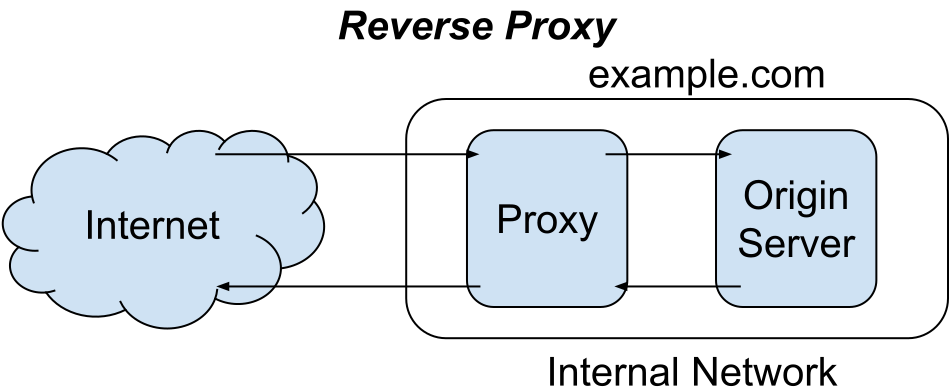
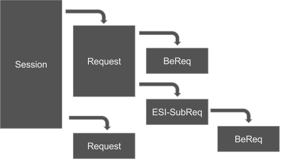
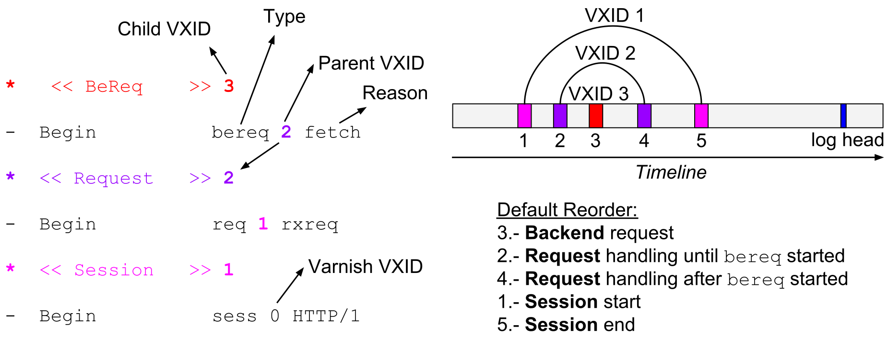
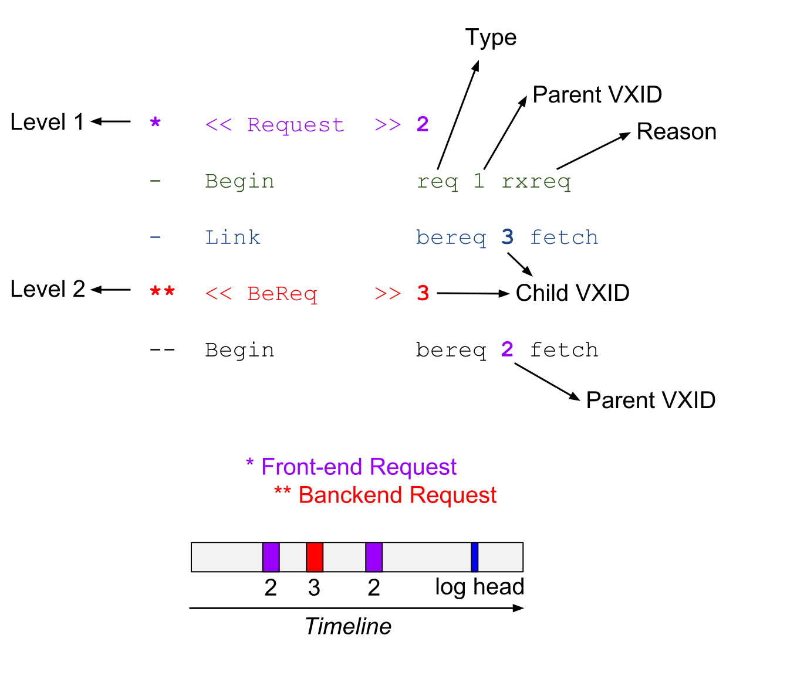
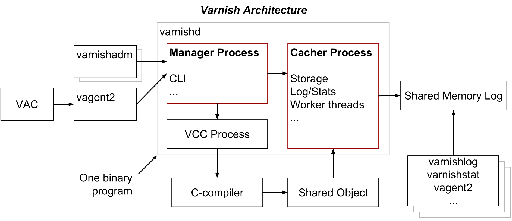
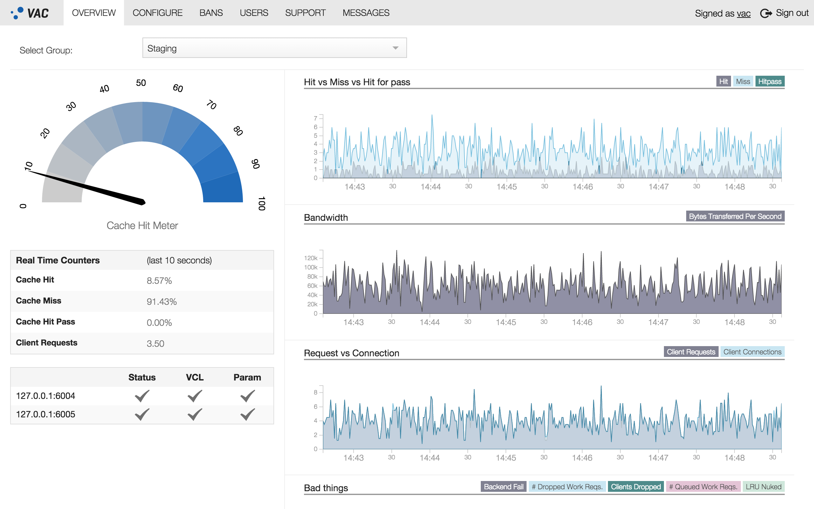
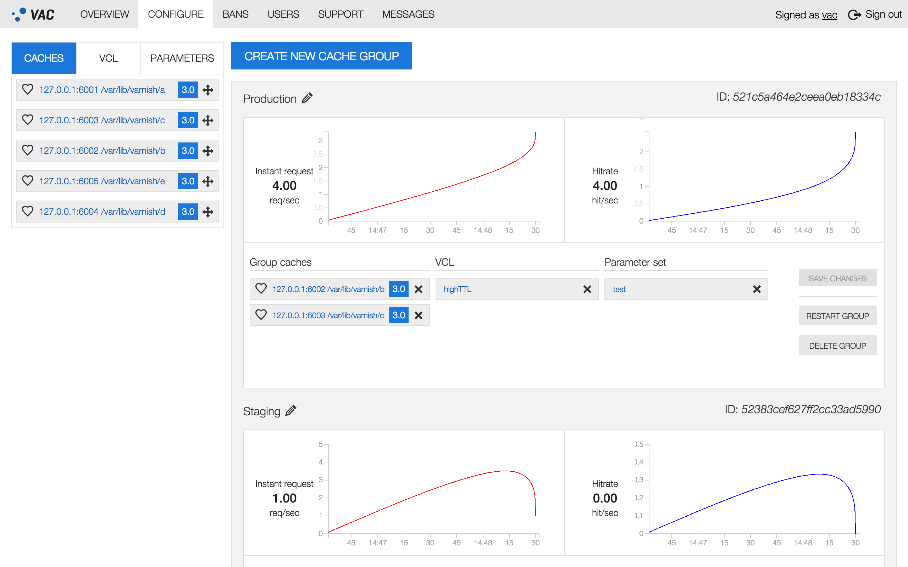
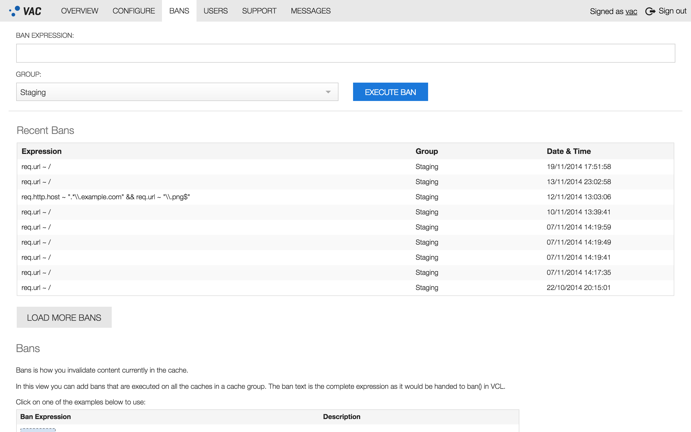
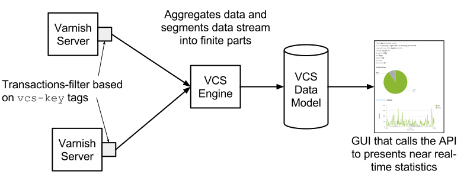
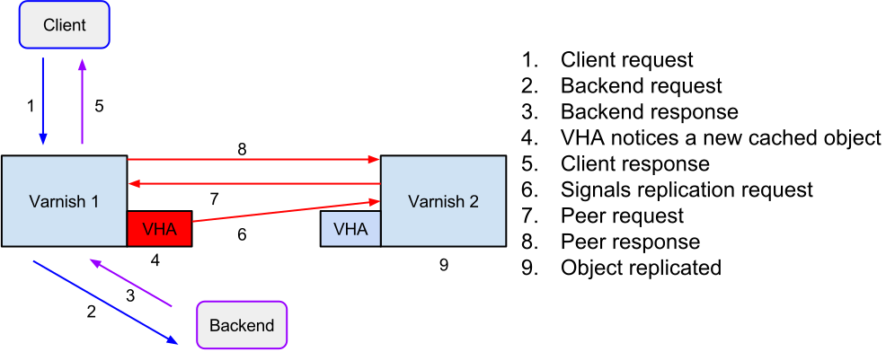

.. include:: util/frontpage.rst

.. include:: util/printheaders.rst

.. include:: build/version.rst

.. contents::
   :class: handout

.. include:: util/control.rst

.. include:: util/param.rst

.. raw:: pdf

   PageBreak coverPage

.. class:: heading1

   Abstract

The Varnish Book is the training material for Varnish Plus courses.
This book teaches such concepts to understand the theory behind Varnish Cache 4.
Covered are the Varnish finite state machine, design principles, HTTP, cache invalidation and more.
With these foundations, the book builds practical knowledge on Varnish Configuration Language (VCL), Varnish Test Code (VTC) and Varnish utility programs such as ``varnishlog``, ``varnishstat`` and ``varnishtest``.
Examples and exercises develop the needed skills to administrate and extend the functionality of Varnish.
Also included are appendices that explain how to develop Varnish Modules (VMODs) and how to use selected modules of Varnish Plus.

.. raw:: pdf

   PageBreak

.. class:: heading1

   Preface

- Course for Varnish Plus
- Learn specific features depending the course and your needs
- Necessary Background
- How to Use the Book
- Acknowledgments

.. TODO for trainer:
   
   - Tailor this slide!
   - Inform trainees what type of subscription they have and the services that they have access to
   - Inform trainees how long the amazon VM will last after the training session

.. container:: handout

   .. Common goal for Varnish Plus customers:

   **After finishing this course, you will be able to install and configure the Varnish server, and write effective VCL code.**
   The Varnish Book is designed for attendees of Varnish Plus courses.
   Most of the presented material in this book applies to both, the open source Varnish Cache and the commercial edition Varnish Cache Plus.
   Therefore, you can also refer to the Varnish Cache documentation at https://www.varnish-cache.org/docs/4.0/.

   Varnish Plus is a commercial suite by Varnish Software that offers products for scalability, customization, monitoring, and expert support services.
   The engine of Varnish Plus is Varnish Cache Plus, which is the enhanced commercial edition of Varnish Cache.
   Varnish Cache Plus should not be confused with Varnish Plus, a product offering by Varnish Software.
   Varnish Cache Plus is one of the software components available for Varnish Plus customers.

   For simplicity, the book refers to *Varnish Cache* or *Varnish Cache Plus* as **Varnish** when there is no difference between them.
   There is more information about differences between Varnish Cache and Varnish Cache Plus in the `Varnish Cache and Varnish Plus`_ chapter.

   .. instructors goal:

   The goal of this book is to make you confident when using Varnish.
   Varnish instructors focus on your area, needs or interest.
   Varnish courses are usually flexible enough to make room for it.

   The instructor will cover selected material for the course you take.
   The System Administration (Admin) course provides attendees with the necessary knowledge to troubleshoot and tune common parameters of a Varnish server.
   The Web Developer (Webdev) course teaches how to adapt web applications so that they work with Varnish, which guarantees a fast experience for visitors of any website.
   Besides that, other courses may also be taught with this book.

   .. TODO for author: "as visitors' requests scales": can we state a magnitude number? or at what level of scalability are we talking about?

.. raw:: pdf

   PageBreak

.. class:: heading2

   Necessary Background

.. TODO for instructor: tailor this slide!

The Admin course requires that you:

- have expertise in a shell on a Linux/UNIX machine, including editing text files and starting daemons,
- understand HTTP cache headers,
- understand regular-expressions, and
- be able to install the software listed below.

The Webdev course requires that you:

- have expertise in a shell on a Linux/UNIX machine, including editing text files and starting daemons,
- understand HTTP cache headers,
- understand regular-expressions, and
- be able to install the software listed below.

.. container:: handout

   You do not need background in theory or application behind Varnish to complete this course.
   However, it is assumed that you have experience and expertise in basic UNIX commands, and that you can install the following software:

   - Varnish Cache 4.x or Varnish Cache Plus 4.x,
   - Apache/2.4 or later,
   - HTTPie 0.8.0 or later,
   - PHP 5.4 or later, and
   - curl – command line tool for transferring data with URL syntax

   More specific required skills depend on the course you take.
   The book starts with the installation of Varnish and navigation of some of the common configuration files.
   This part is perhaps the most UNIX-centric part of the course.

.. Todo for the author: This organization is for the book as self instructive.
.. At the moment, the book is designed to be used under training.
   Organization of the Book and Course
   -----------------------------------

   TODO for instructor: tailor this slide

   Each chapter has the following structure:

     1) background,
     2) checklist,
     3) example(s),
     4) exercise(s), and 
     5) feedback.

   At the end of each chapter there is a **Fast Track** section, and it contains three parts:
     1) a review,
     2) exercise(s), and 
     3) feedback.

   .. container:: handout

      .. TODO presentation of outline

      The introduction presents background information of the relevant technologies behind Varnish.
      It presents the history and main design principles needed to understand Varnish.

      .. TODO for the author:
      .. complete this paragraph

      .. Each chapter teaches one **objective** and its **sub-objectives**, or component skills.
      .. The format of each sub-objective is of a five-part **lesson** including:

      The Fast Track can be used for various purposes:

      - As a preliminary test. If you know the information in the Fast Track and can do its exercises, you may skip the chapter.
      - As a test. If you can perform the exercises in the Fast Track, you have learned the important skills taught in the chapter.
      - As a express lesson. If you do not have the time to complete the entire chapter, you can use the Fast Track instead.
      - As a preview of the chapter. The Fast Track provides a concise overview of what you learn in the chapter.
      - As a review. Once you have completed the Varnish Book, you can use the Fast Tracks as a quick review.

      In Appendix A of the book, you will find the **Varnish Book Reference**.
      The Varnish Book Reference is a complete listing, by chapter, of all the checklists.
      Appendix x and C contain special purpose Varnish programs and supporting material respectively.
      Appendix x lists the Varnish Three Letter Acronyms.
      Appendix x describes what is new since Varnish 3.0.

      .. TODO for the author: include a glossary based on:
      .. https://www.varnish-cache.org/trac/wiki/VTLA

      .. TODO for the author: remove this comment when the organization has been completely implemented.

      Note: This organization is still not completely implemented.

.. raw:: pdf

   PageBreak

.. class:: heading2

   How to Use the Book

.. At the moment is a section to exclude it from compiling in the Makefile

- Most of the material in this book applies to both: Varnish Cache and Varnish Cache Plus.
  Parts that apply only to Varnish Cache Plus are clearly stated.
- Varnish caching mechanisms are different than in other caching technologies.
  Open your mind and try to think different when using Varnish.
- The instructor guides you through the book.
- Use the *manual pages* and help options.
- See `Appendix E: Varnish Three Letter Acronyms`_ for a list of acronyms.

.. - `Appendix E: Regular-Expressions in Varnish`_ explains basic concepts typically needed when administrating Varnish.

.. - To practice the course, use the Fast Track in the following way:

..   - Read the Review and Exercise parts of the Fast Track.
..   - If you can complete the exercise(s), you remember the most important parts.
..   - If not, you should repeat the chapter.

.. container:: handout

   .. Varnish Cache Course

   The Varnish Book is designed to be used as training material under the Varnish Plus course taught by a certified instructor.
   Under the course, the instructor guides you and selects the relevant sections to learn.
   However, you can also use this book as self-instructional material.

   .. If you use the book as self-instructional tutorial, it is recommended to complete the Fast Track of the chapter you want to read.

   .. Exercises

   There are almost always many ways to do an exercise.
   The solutions provided in `Appendix G: Solutions`_ are not necessarily better than yours.

   .. man pages and help commands

   Varnish installs several reference manuals that are accessible through the manual page command ``man``.
   You can issue the command ``man -k varnish`` to list the manual pages that mention Varnish in their short description.
   In addition, the ``vsl`` man page that explains the Varnish Shared memory Logging (VSL).
   This man page does not come out when issuing ``man -k varnish``, because it does not contain the word `varnish` in its short description.

   The command ``man varnishd``, for example, retrieves the manual page of the Varnish HTTP accelerator daemon.
   Also, some commands have a help option to print the usage of the command.
   For example, ``varnishlog -h`` prints the usage and options of the command with a short description of them.

   .. reference to Varnish Cache docs

   In addition, you should refer to the documentation of Varnish Cache and Varnish Cache Plus.
   This documentation provides you extended details on the topics covered in this book and more.
   To access to this documentation, please visit https://www.varnish-software.com/resources.

   .. Ubuntu

   The Varnish installation described in this book uses Ubuntu Linux 14.04 LTS (trusty), therefore most of the commands instructed in this book are for this Linux distribution.
   We point out some differences on how to configure Varnish for other Linux distributions, but you should reference your Linux distribution's documentation for more details.
   
   .. formats

   The book is written with different formatting conventions.
   Varnish Configuration Language (VCL) code uses the mono-spaced font type inside boxes::

      vcl 4.0;

      backend default {
	  .host = "127.0.0.1";
	  .port = "8080";
      }

      sub vcl_recv {
	  # Do request header transformations here.
	  if (req.url ~ "^/admin") {
	      return(pass);
	  }
      }

   The first occurrence of a new term is usually its *definition*, and appears in italics.
   File names are indicated like this: ``/path/to/yourfile``.
   Important notes, tips and warnings are also inside boxes, but they use the normal body text font type.

   .. TODO: To uncomment this when Appendix E is ready

   .. regex

   ..
      If you have some regular-expression experience, must of the overview in `Appendix E: Regular-Expressions in Varnish`_ will not be new.
      Even if this is the case, please glance over it anyway.
      Although you may be aware of the basic meaning of certain meta-characters, perhaps some of the ways of thinking at regular-expressions will be new for you.

.. raw:: pdf

   PageBreak

.. class:: heading2

   Resources, and Errata

- https://varnish-cache.org
- https://varnish-software.com/academy
-  `#varnish-hacking` and `#varnish` on `irc.linpro.net`.
- https://github.com/varnish/Varnish-Book/
- https://www.varnish-cache.org/docs/trunk/users-guide/troubleshooting.html
- https://www.varnish-cache.org/trac/wiki/VCLExamples

.. container:: handout

   This book is meant to be understandable to everyone who takes a Varnish Plus course and has the required skills.
   If you find something unclear, do not be shy and blame yourself, ask your instructor for help.
   You can also contact the Varnish open source community at https://varnish-cache.org.
   To book training, please look at https://varnish-software.com/academy.

   Additional examples from different Varnish versions are available at https://www.varnish-cache.org/trac/wiki/VCLExamples.
   These examples are maintained by the community.
   
   For those interested in development, the developers arrange weekly bug washes were recent tickets and development is discussed. 
   This usually takes place on Mondays around 13:00 CET on the IRC channel `#varnish-hacking` on `irc.linpro.net`.

   Errata, updates and general improvements of this book are available at its repository https://github.com/varnish/Varnish-Book.

.. class:: heading2

   Acknowledgments

In addition to the authors, the following deserve special thanks (in no particular order):

- Rubén Romero
- Dag Haavi Finstad
- Martin Blix Grydeland
- Reza Naghibi
- Federico G. Schwindt
- Dridi Boukelmoune
- Lasse Karstensen
- Per Buer
- Sevan Janiyan
- Kacper Wysocki
- Magnus Hagander
- Arianna Aondio
- Poul-Henning Kamp
- Guillaume Quintard
- Everyone who has participated on the training courses

.. raw:: pdf

   PageBreak oneColumn

Introduction
============

Table of contents:

- What is Varnish?
- Benefits of Varnish
- Open source / Free software
- Varnish Software: The company
- What is Varnish Plus?
- Varnish: more than a cache server
- History of Varnish
- Varnish Governance Board (VGB)

.. TODO Comparison of related software solutions such as: Apache mod_security, Squid, Nginx, and Apache Traffic Server (ATS) (reverse and forward proxy, generally comparable to Nginx and Squid).

What is Varnish?
----------------

.. figure 1



   Figure :counter:`figure`: Varnish is more than a reverse proxy

.. container:: handout

   .. What is Varnish?:

   Varnish is a reverse HTTP proxy, sometimes referred to as an HTTP accelerator or a web accelerator.
   A reverse proxy is a proxy server that appears to clients as an ordinary server.
   Varnish stores (caches) files or fragments of files in memory that are used to reduce the response time and network bandwidth consumption on future, equivalent requests.
   Varnish is designed for modern hardware, modern operating systems and modern work loads.

   .. Varnish use
   
   Varnish is more than a reverse HTTP proxy that caches content to speed up your server.
   Depending on the installation, Varnish can also be used as:

   - web application firewall,
   - DDoS attack defender,
   - hotlinking protector,
   - load balancer,
   - integration point,
   - single sign-on gateway,
   - authentication and authorization policy mechanism,
   - quick fix for unstable backends, and
   - HTTP router.

Varnish is Flexible
...................

Example of Varnish Configuration Language (**VCL**)::

      vcl 4.0;

      backend default {
	  .host = "127.0.0.1";
	  .port = "8080";
      }

      sub vcl_recv {
	  # Do request header transformations here.
	  if (req.url ~ "^/admin") {
	      return(pass);
	  }
      }

.. container:: handout

   Varnish is flexible because you can configure it and write your own caching policies in its Varnish Configuration Language (VCL).
   VCL is a domain specific language based on C.
   VCL is then translated to C code and compiled, therefore Varnish executes lightning fast.
   Varnish has shown itself to work well both on large (and expensive) servers and tiny appliances.

Varnish Cache and Varnish Plus
------------------------------

.. table 1

.. csv-table:: Table :counter:`table`: Topics Covered in This Book and Their Availability in Varnish Cache and Varnish Plus
   :name: Topics Covered in This Book and Their Availability in Varnish Cache and Varnish Plus
   :delim: ,
   :header-rows: 1
   :widths: 40,30,30
   :file: tables/varnish_cache_plus_offer_diff.csv

.. container:: handout

   .. Open Source / Free Software:

   Varnish Cache is an open source project, and free software. 
   The development process is public and everyone can submit patches, or just take a peek at the code if there is some uncertainty on how does Varnish Cache work.
   There is a community of volunteers who help each other and newcomers. 
   The BSD-like license used by Varnish Cache does not place significant restriction on re-use of the code, which makes it possible to integrate Varnish Cache in virtually any solution.

   Varnish Cache is developed and tested on GNU/Linux and FreeBSD. 
   The code-base is kept as self-contained as possible to avoid introducing out-side bugs and unneeded complexity. 
   Therefore, Varnish uses very few external libraries.

   .. Varnish Software:

   Varnish Software is the company behind Varnish Cache.
   Varnish Software and the Varnish community maintain a package repository of Varnish Cache for several common GNU/Linux distributions.

   .. Varnish Plus:

   Varnish Software also provides a commercial suite called Varnish Plus with software products for scalability, customization, monitoring and expert support services.
   The engine of the Varnish Plus commercial suite is the enhanced commercial edition of Varnish Cache.
   This edition is proprietary and it is called *Varnish Cache Plus*.

   .. Covered in this book:
   
   `Table 1 <#table-1>`_ shows the components covered in this book and their availability for Varnish Cache users and Varnish Plus customers.
   The covered components of Varnish Plus are described in the `Varnish Plus Software Components`_ chapter.
   For more information about the complete Varnish Plus offer, please visit https://www.varnish-software.com/what-is-varnish-plus.
   A list of supported platforms can be found in https://www.varnish-software.com/customers/#platforms.

   .. note::

      Varnish Cache Plus should not be confused with Varnish Plus, a product offering by Varnish Software.
      Varnish Cache Plus is one of the software components available for Varnish Plus customers.

Varnish Cache and Varnish Software Timeline
-------------------------------------------

- 2005: Ideas! Verdens Gang (www.vg.no, Norway's biggest newspaper) were looking for alternative cache solutions
- 2006: Work began:
  Redpill Linpro was in charge of project management, infrastructure and supporting development.
  Poul-Henning Kamp did the majority of the actual development.
- 2006: Varnish 1.0 is released
- 2008: Varnish 2.0 is released
- 2008: ``varnishtest`` is introduced
- 2009: The first Varnish User Group Meeting is held in London
  Roughly a dozen people participate from all around the world
- 2010: Varnish Software is born as a spin-off to Redpill Linpro AS
- 2011: Varnish 3.0 is released
- 2012: The fifth Varnish User Group Meeting is held in Paris
  Roughly 70 people participate on the User-day and around 30 on the developer-day!
- 2012: The Varnish Book is published
- 2013: Varnish Software chosen as a 2013 Red Herring Top 100 Europe company
- 2013: BOSSIE award winner
- 2013: Varnish Software receives World Summit on Innovation & Entrepreneurship Global Hot 100 award
- 2014: Varnish Plus is launched
- 2014: Varnish 4.0 is released
- 2015: Varnish API Engine is released
- 2015: Gartner names Varnish Software as a 2015 ‘Cool Vendor’ in Web-Scale Platforms
- 2015: Varnish Plus supports SSL/TLS
- 2016: Varnish in the cloud
- 2016: Varnish 5.0 is released

.. container:: handout

   VG, a large Norwegian newspaper, initiated the Varnish project in cooperation with Linpro. 
   The lead developer of the Varnish project, Poul-Henning Kamp, is an experienced FreeBSD kernel hacker.
   Poul-Henning Kamp continues to bring his wisdom to Varnish in most areas where it counts.

   From 2006 throughout 2008, most of the development was sponsored by VG, API, Escenic and Aftenposten, with project management, infrastructure and extra man-power provided by Redpill Linpro.
   At the time, Redpill Linpro had roughly 140 employees mostly centered around consulting services.

   Today Varnish Software is able to fund the core development with income from service agreements, in addition to offering development of specific features on a case-by-case basis.
   The interest in Varnish continues to increase.
   An informal study based on the list of most popular web sites in Norway indicates that about 75% or more of the web traffic that originates in Norway is served through Varnish.

   .. TODO for the author: reference for the informal study?

   .. VGB

   Varnish development is governed by the Varnish Governance Board (VGB), which thus far has not needed to intervene.
   The VGB consists of an architect, a community representative and a representative from Varnish Software.
   
   .. TODO for the editor: confirm the VGB positions
   
   As of November 2015, the VGB positions are filled by Poul-Henning Kamp (Architect), Rogier Mulhuijzen (Community) and Lasse Karstensen (Varnish Software).
   On a day-to-day basis, there is little need to interfere with the general flow of development.

What Is New in Varnish 4?
-------------------------

- Version statement ``vcl 4.0;``
- ``req.request`` is now ``req.method``
- ``vcl_fetch`` is now ``vcl_backend_response``
- Directors have been moved to the ``vmod_directors``
- Hash directors as a client directors 
- ``vcl_error`` is now ``vcl_backend_error``
- ``error()`` is now ``synth()``, and you must explicitly return it: ``return (synth(999, "Response"));``
- Synthetic responses in ``vcl_synth``
- Setting headers on synthetic response bodies made in ``vcl_synth`` are now done on ``resp.http`` instead of ``obj.http``.
- ``obj.*`` in ``vcl_error`` replaced by ``beresp.*`` in ``vcl_backend_error``
- ``hit_for_pass`` objects are created using ``beresp.uncacheable``
- ``req.*`` not available in ``vcl_backend_response``
- ``bereq.*`` in ``vcl_backend_response``
- ``vcl_*`` prefix reserved for builtin subroutines
- ``req.backend.healthy`` replaced by ``std.healthy(req.backend_hint)``
- ``client.port`` and ``server.port`` replaced by ``std.port(client.ip)`` and ``std.port(server.ip)``
- Cache invalidation with purges is now done via ``return(purge)`` in ``vcl_recv``
- ``obj.*`` is now read-only
- ``obj.last_use`` is retired
- ``vcl_recv`` must now return ``hash`` instead of ``lookup``
- ``vcl_hash`` must now return ``lookup`` instead of ``hash``
- ``vcl_pass`` must now return ``fetch`` instead of ``pass``
- ``restart`` in the backend is now ``retry``, this is now called ``return(retry)``, and jumps back up to ``vcl_backend_fetch``
- `default` VCL is now called `builtin` VCL
- The builtin VCL now honors ``Cache-Control: no-cache`` (and friends) to indicate uncacheable content from the backend
- ``remove`` keyword replaced by ``unset``
- ``X-Forwarded-For`` is now set before ``vcl_recv``
- ``session_linger`` has been renamed to ``timeout_linger`` and it is in seconds now (previously was milliseconds)
- ``sess_timeout`` is renamed to ``timeout_idle``
- Increasing ``sess_workspace`` is not longer necessary, you may need to increase either `workspace_backend` or `workspace_client`
- ``thread_pool_purge_delay`` is renamed to ``thread_pool_destroy_delay`` and it is in seconds now
- ``thread_pool_add_delay`` and ``thread_pool_fail_delay`` are in seconds now
- New parameter ``vcc_allow_inline_c`` to disable inline C in your VCL
- New query language to filter logs: ``-m`` option replaced by ``-q``

.. container:: handout

   The above list tries to summarize the most important changes from Varnish Cache 3 to Varnish Cache 4.
   For more information, please visit: https://www.varnish-cache.org/docs/trunk/whats-new/upgrading.html

   If you want to migrate your VCL code from Varnish 3 to Varnish 4, you may be interested in looking at the *varnish3to4* script.
   See the `VCL Migrator from Varnish 3 to Varnish 4`_ section for more information.

Design Principles
=================

Varnish is designed to:

- Solve real problems
- Run on modern hardware (64-bit multi-core architectures)
- Work with the kernel, not against it
- Translate Varnish Configuration Language (VCL) to C programming language
- Be extendible via Varnish Modules (VMODs)
- Reduce lock-contention via its workspace-oriented shared memory model

.. - Innovation, not regurgitation

.. container:: handout

   .. run on modern hardware

   The focus of Varnish has always been performance and flexibility.
   Varnish is designed for hardware that you buy today, not the hardware you bought 15 years ago. 
   This is a trade-off to gain a simpler design and focus resources on modern hardware.
   Varnish is designed to run on 64-bit architectures and scales almost proportional to the number of CPU cores you have available. 
   Though CPU-power is rarely a problem.

   .. memory

   32-bit systems, in comparison to 64-bit systems, allow you to allocate less amount of virtual memory space and less number of threads.
   The theoretical maximum space depends on the operating system (OS) kernel, but 32-bit systems usually are bounded to 4GB.
   You may get, however, about 3GB because the OS reserves some space for the kernel.

   .. work with the kernel

   Varnish uses a workspace-oriented memory-model instead of allocating the exact amount of space it needs at run-time.
   Varnish does not manage its allocated memory, but it delegates this task to the OS because the kernel can normally do this task better than a user-space program.

   Event filters and notifications facilities such as ``epoll`` and ``kqueue`` are advanced features of the OS that are designed for high-performance services like Varnish. 
   By using these, Varnish can move a lot of the complexity into the OS kernel which is also better positioned to decide which threads are ready to execute and when.

   .. VCL   

   Varnish uses the *Varnish Configuration Language* (VCL) that allows you to specify exactly how to use and combine the features of Varnish.
   VCL is translated to C programming language code.
   This code is compiled with a standard C compiler and then dynamically linked directly into Varnish at run-time.

   When you need functionalities that VCL does not provide, e.g., look for an IP address in a database, you can write raw C code in your VCL.
   That is in-line C in VCL.
   However, in-line C is strongly discouraged because in-line C is more difficult to debug, maintain and develop with other developers.
   Instead in adding in-line C, you should modularized your C code in Varnish modules, also known as VMODs.

   .. VMODs

   VMODs are typically coded in VCL and C programming language.
   In practice, a VMOD is a shared library with functions that can be called from VCL code.

   The standard (``std``) VMOD, included in Varnish Cache, extends the functionality of VCL.
   ``std`` VMOD includes non-standard header manipulation, complex header normalization and access to *memcached* among other functionalities.
   `Appendix D: VMOD Development`_ explains in more details how VMODs work and how to develop yours.

   .. shared memory

   The Varnish Shared memory Log (VSL) allows Varnish to log large amounts of information at almost no cost by having other applications parse the data and extract the useful bits.
   This design and other mechanisms decrease lock-contention in the heavily threaded environment of Varnish.

   .. TODO for the author: Move to fast track

   To summarize: Varnish is designed to run on modern hardware
   under real work-loads and to solve real problems. Varnish does not
   cater to the "I want to make Varnish run on my 486 just
   because"-crowd. If it does work on your 486, then that's fine, but
   that's not where you will see our focus. Nor will you see us
   sacrifice performance or simplicity for the sake of niche use-cases
   that can easily be solved by other means -- like using a 64-bit OS.

How objects are stored
----------------------

- Object: local store of HTTP response message
- Objects in Varnish are stored in memory and addressed by hash keys
- You can control the hashing
- Multiple objects can have the same hash key

.. container:: handout

	`Objects` are local stores of response messages as defined in https://tools.ietf.org/html/rfc7234.
	They are mapped with a hash key and they are stored in memory.
	References to objects in memory are kept in a hash tree.

	.. Cache control

	A rather unique feature of Varnish is that it allows you to control the input of the hashing algorithm.
	The key is by default made out of the HTTP Host header and the URL, which is sufficient and recommended for typical cases.
	However, you are able to create the key from something else.
	For example, you can use cookies or the user-agent of a client request to create a hash key.

	.. multiple objects

    HTTP specifies that multiple objects can be served from the same URL depending on the preferences of the client.
    For instance, content in gzip format is sent only to clients that indicate *gzip* support.
    Varnish stores a single compressed object under one hash key.

    Upon a client request, Varnish checks the ``Accept-Encoding`` header field.
    If the client does not accept gzip objects, Varnish decompresses the object on the fly and sends it to the client.

Object Lifetime
---------------

.. add this figure to the beginning of the book as reference

.. figure 2


   Figure :counter:`figure`: Object Lifetime

.. container:: handout

   `Figure 2 <#figure-2>`_ shows the lifetime of cached objects.
   A cached object has an origin timestamp ``t_origin`` and three duration attributes: 1) ``TTL``, 2) ``grace``, and 3) ``keep``.
   ``t_origin`` is the time when an object was created in the backend.
   An object lives in cache until ``TTL + grace + keep`` elapses.
   After that time, the object is removed by the Varnish daemon.

   In a timeline, objects within the time-to-live ``TTL`` are considered *fresh objects*.
   *Stale objects* are those within the time period ``TTL`` and ``grace``.
   Objects within ``t_origin`` and  ``keep`` are used when applying conditions with the HTTP header field ``If-Modified-Since``.

   The `VCL – vcl_backend_fetch`_ and
   `VCL – vcl_backend_response`_ sections explain how Varnish handles backend responses and how these duration attributes affect subsequent actions.

Getting Started
===============

In this chapter, you will:

- learn about the Varnish distribution,
- install Varnish, and
- cover basic Varnish configuration.

.. container:: handout

   Most of the commands you will type in this course require root privileges.
   You can get temporary root privileges by typing ``sudo <command>``, or permanent root privileges by typing ``sudo -i``.

   .. backend definition

   In Varnish terminology, a *backend* is the origin server.
   In other words, it is whatever server Varnish talks to fetch content.
   This can be any sort of service as long as it understands HTTP.
   Most of the time, Varnish talks to a web server or an application frontend server.
   In this book, we use *backend*, *origin server*, *web server* or *application frontend server* depending the context.

Varnish Distribution
--------------------

Utility programs part of the Varnish distribution:

- ``varnishd``
- ``varnishtest``
- ``varnishadm``
- ``varnishlog``
- ``varnishstat``
- and more

.. container:: handout

   The Varnish distribution includes several utility programs that you will use in this course.
   You will learn how to use these programs as you progress, but it is useful to have a brief introduction about them before we start.

   .. varnishd

   The central block of Varnish is the Varnish daemon ``varnishd``.
   This daemon accepts HTTP requests from clients, sends requests to a backend, caches the returned objects and replies to the client request.
   ``varnishd`` is further explained in the `Varnish Architecture`_ section.

   .. varnishtest

   ``varnishtest`` is a script driven program used to test your Varnish installation.
   ``varnishtest`` is very powerful because it allows you to create client mock-ups, fetch content from mock-up or real backends, interact with your actual Varnish configuration, and assert the expected behavior.
   ``varnishtest`` is also very useful to learn more about the behavior of Varnish.

   .. varnishadm

   ``varnishadm`` controls a running Varnish instance.
   The  ``varnishadm``  utility establishes a command line interface (CLI) connection to ``varnishd``.
   This utility is the only one that may affect a running instance of Varnish.
   You can use ``varnishadm`` to:

   - start and stop ``varnishd``,
   - change configuration parameters,
   - reload the Varnish Configuration Language (VCL),
   - view the most up-to-date documentation for parameters, and
   - more.

   `The Management Interface varnishadm`_ section explains in more detail this utility.

   .. varnishlog

   The Varnish log provides large amounts of information, thus it is usually necessary to filter it.
   For example, "show me only what matches X".
   ``varnishlog`` does precisely that.
   You will learn more about ``varnishlog`` in the `Examining Varnish Server's Output`_ chapter.

   .. varnishstat

   ``varnishstat`` is used to access **global counters**.
   It provides overall statistics, e.g the number of total requests, number of objects, and more.
   ``varnishstat`` is particularly useful when using it together with ``varnishlog`` to analyze your Varnish installation.
   The `varnishstat`_ section explains in detail this utility.

   .. others

   In addition, there are other utility programs such as ``varnishncsa``, ``varnishtop`` and ``varnishhist``.
   `Appendix B: Varnish Programs`_ explains them.

Exercise: Install Varnish
-------------------------

- Install Varnish
- Use packages provided by

  - varnish-software.com for Varnish Cache Plus
  - varnish-cache.org for Varnish Cache

- When you are done, verify your Varnish version, run ``varnishd -V``

.. container:: handout

   For official training courses, a ``varnish-plus`` package should already be
   available for installation. When in doubt, ask your instructor to confirm
   which package should be installed.

   You may skip this exercise if already have a well configured environment to test Varnish.
   In case you get stuck, you may look at the proposed solution.

.. table 3

.. csv-table:: Table :counter:`table`: Different Locations of the Varnish Configuration File
   :name: Different Locations of the Varnish Configuration File
   :delim: ;
   :header-rows: 2
   :file: tables/varnish_configuration_files.csv

[1] There is no configuration file.
Use the command ``chkconfig varnishlog/varnishncsa on/off`` instead.

[2] Create a *drop-in* systemd service file in ``/etc/systemd/system/varnish.service.d/customexec.conf``::

   [Service]
   ExecStart=
   ExecStart=/usr/sbin/varnishd -a :80 -T localhost:6082 -f \
   /etc/varnish/default.vcl -S /etc/varnish/secret -s malloc,256m

This file overrides the ``ExecStart`` option of the default configuration shipped with Varnish Cache.
Run ``systemctl daemon-reload`` to make sure systemd picks up the new configuration before restarting Varnish.

[3] Create a *drop-in* systemd service file in ``/etc/systemd/system/varnishlog.service.d/customexec.conf`` to customize your ``varnishlog`` configuration.

[4] Create a *drop-in* systemd service file in ``/etc/systemd/system/varnishncsa.service.d/customexec.conf``.
In this file you can for example set ``VARNISHNCSA_ENABLED=1``.

[5] There is no configuration file.
Use the command ``systemctl start/stop/enable/disable/ varnishlog/varnishncsa`` instead.

.. container:: handout

   The configuration file is used to give parameters and command line arguments to the Varnish daemon.
   This file also specifies the location of the VCL file.
   Modifications to this file require to run ``service varnish restart`` for the changes to take effect.

   The location of the Varnish configuration file depends on the operating system and whether it uses the ``init`` system of `SysV`, or `systemd`.
   `Table 3 <#table-3>`_ shows the locations for each system installation.

   .. Introduction to apt-get and yum

   To install packages on Ubuntu or Debian, use the command ``apt-get install <package>``, e.g., ``apt-get install varnish``. 
   For CentOS, RHEL or Fedora, use ``yum install <package>``.
   
   You might want to look at `Solution: Install Varnish`_, if you need help.

   If the command ``service varnish restart`` fail, try to start Varnish manually to get direct feedback from the shell.
   Command example::
     
        $ sudo /usr/sbin/varnishd -j unix,user=varnish,ccgroup=varnish \
        -P /var/run/varnish.pid -f /etc/varnish/default.vcl -a :80 -a :6081,PROXY \
        -T 127.0.0.1:6082 -t 120 -S /etc/varnish/secret \
        - s malloc,256MB -F

Exercise: Configure Varnish
---------------------------

- Configure listening ports for client requests and Varnish administration
- In CentOS 7:

  - ``/etc/varnish/varnish.params``
  - Variable substitution in ``/usr/lib/systemd/system/varnish.service``::

      -a ${VARNISH_LISTEN_ADDRESS}:${VARNISH_LISTEN_PORT}
      -T ${VARNISH_ADMIN_LISTEN_ADDRESS}:${VARNISH_ADMIN_LISTEN_PORT}

- Configure one backend in VCL file ``/etc/varnish/default.vcl``

.. container:: handout

   See `Table 3 <#table-3>`_ and locate the Varnish configuration file for your installation.
   Open and edit that file to listen to client requests on port ``80`` and have the management interface on port `1234`.

   In Ubuntu and Debian, this is configured with options ``-a`` and ``-T`` of variable  ``DAEMON_OPTS``.
   In CentOS, RHEL, and Fedora, use ``VARNISH_LISTEN_PORT`` and ``VARNISH_ADMIN_LISTEN_PORT`` respectively.

   In order for changes in the configuration file to take effect, `varnishd` must be restarted.
   The safest way to restart Varnish is by using ``service varnish restart``.

   The default VCL file location is ``/etc/varnish/default.vcl``.
   You can change this location by editing the configuration file.
   The VCL file contains the backend definitions.

   In this book, we use Apache as backend.
   Before continuing, make sure you have Apache installed and configured to listen on port ``8080``.
   See `Appendix F: Apache as Backend`_ if you do not know how to do it.

   Edit ``/etc/varnish/default.vcl`` to use Apache as backend::

     backend default {
       .host = "127.0.0.1";
       .port = "8080";
     }

   Varnish Cache Plus supports SSL/TLS encryption.
   To encrypt connections between Varnish and the backend, you specify it as follows::

      backend default {
        .host = "host.name";
        .port = "https";       # This defaults to https when SSL
        .ssl = 1;              # Turns on SSL support
        .ssl_nosni = 1;        # Disable SNI extension
        .ssl_noverify = 1;     # Don't verify peer
      }

   For Varnish to accept incoming encrypted connections, you need a terminator for encrypted connections such as `hitch` https://github.com/varnish/hitch.
   Varnish Plus 4.1 has integrated this functionality and you can easily configure it as detailed in `SSL/TLS frontend support with hitch`_.

VCL Reload
..........

- ``varnishd`` can reload VCL programs without restart

::

   service varnish reload

or::

   systemctl reload varnish

or::

   varnishadm vcl.load vcl01 /etc/varnish/default.vcl
   varnishadm vcl.use vcl01

.. container:: handout

   ``service varnish reload`` is a shortcut to reload VCL programs.
   ``varnishadm vcl.load <compiledVCL> <VCLsourcecode>`` compiles the VCL program you specify.
   You can have multiple compiled files in Varnish.
   To see them, run::

     varnishadm vcl.list

   To apply a compiled VCL program, type::

     varnishadm vcl.use <compiledVCL>

   This command does **not** restart ``varnishd``, it only reloads the compiled VCL code.

   The result of your configuration is resumed in `Table 4 <#table-4>`_.

   .. table 4

   .. csv-table:: Table :counter:`table`: Varnish and Backend Configuration
      :name: Varnish and Apache Configuration
      :delim: ;
      :widths: 20, 30, 50
      :header-rows: 1
      :file: tables/varnish_apache.csv

   `\* These files are for a SysV Ubuntu/Debian configuration`

   You can get an overview over services listening on TCP ports by issuing the command ``netstat -nlpt``.
   Within the result, you should see something like::

      tcp     0     0 0.0.0.0:80         0.0.0.0:*     LISTEN     9223/varnishd
      tcp     0     0 127.0.0.1:1234     0.0.0.0:*     LISTEN     9221/varnishd

   .. TOFIX: The compiled book has a half empty page here.

   .. warning::

     If you have Security-Enhanced Linux (SELinux), be aware that SELinux defines ports ``6081`` and ``6082`` for ``varnishd``.
     If you need to use another port number, you need either to disable SELinux or set the boolean ``varnishd_connect_any`` variable to 1.
     You can do that by executing the command ``sudo setsebool varnishd_connect_any 1``.

   .. tip::

     Issue the command ``man vcl`` to see all available options to define a backend.

   .. tip::

     You can also configure Varnish via the `Varnish Administration Console (VAC)`_.

     .. figure 3

     .. figure:: ui/img/vac_config.png
	:width: 100%

	Figure :counter:`figure`: GUI to configure Varnish via the `Varnish Administration Console (VAC)`_.

Test Varnish Using Apache as Backend
....................................

- Run ``http -p Hh localhost``
- Your output should look as::

   # http -p Hh localhost
   GET / HTTP/1.1
   Accept: */*
   Accept-Encoding: gzip, deflate, compress
   Host: localhost
   User-Agent: HTTPie/0.8.0

   HTTP/1.1 200 OK
   Accept-Ranges: bytes
   Age: 0
   Connection: keep-alive
   Content-Encoding: gzip
   Content-Length: 3256
   Content-Type: text/html
   Date: Wed, 18 Mar 2015 13:55:28 GMT
   ETag: "2cf6-5118f93ad6885-gzip"
   Last-Modified: Wed, 18 Mar 2015 12:53:59 GMT
   Server: Apache/2.4.7 (Ubuntu)
   Vary: Accept-Encoding
   Via: 1.1 varnish-plus-v4
   X-Varnish: 32770

.. container:: handout

   You can test your Varnish installation by issuing the command ``http -p Hh localhost``.
   If you see the HTTP response header field ``Via`` containing ``varnish``, then your installation is correct.

   The ``X-Varnish`` HTTP header field contains the Varnish Transaction ID (VXID) of the client request and if applicable, the VXID of the backend transaction that stored in cache the object delivered.
   ``X-Varnish`` is useful to find the correct log entries in the Varnish log.
   For a cache hit, ``X-Varnish`` contains both the ID of the current request and the ID of the request that populated the cache.
   You will learn more about VXIDs in the `Transactions`_ section.

   You can also define and test connectivity against any backend in ``varnishtest``.
   Learn how to it by doing the `Exercise: Test Apache as Backend with varnishtest`_.

The Management Interface ``varnishadm``
---------------------------------------

You can use the ``varnishadm`` utility to:

- start and stop the cacher (aka child) process
- change configuration parameters without restarting Varnish
- reload the Varnish Configuration Language (VCL) without restarting Varnish 
- view the most up-to-date documentation for parameters
- ``varnishadm help`` and ``man varnishadm``

.. container:: handout

   Varnish offers a management command line interface (CLI) to control a running Varnish instance.
   This interface implements a list of management commands in the ``varnishadm`` utility program.
   ``varnishadm`` establishes a connection to the Varnish daemon ``varnishd``.

   To connect to the management interface, issue the command ``varnishadm``.
   If there are many Varnish instances running in one machine, specify the instance with the ``-n`` option.
   Keep the following in mind when using the management interface:

   1. Changes take effect on the running Varnish daemon instance without need to restart it.
   2. Changes are not persistent across restarts of Varnish. 
      If you change a parameter and you want the change to persist after you restart Varnish,
      you need to store your changes in the configuration file of the boot script.
      The location of the configuration file is in `Table 3 <#table-3>`_

   ``varnishadm`` uses a non-encrypted key stored in a secret file to authenticate and connect to a Varnish daemon.
   You can now provide access to the interface on a per user basis by adjusting the read permission on the secret file.
   The location of the secret file is ``/etc/varnish/secret`` by default, but you can use the ``-S`` option to specify other location.
   The content of the file is a shared secret, which is a string generated under Varnish installation.
   
   The management interface authenticates with a challenge-response mechanism.
   Therefore, the shared secret is never transmitted, but a challenge and the response to the challenge.
   This authentication mechanism offers a reasonably good access control, but it does not protect the data transmitted over the connection.
   Therefore, it is very important to avoid eavesdroppers like in the man-in-the-middle attack.
   The simplest way to avoid eavesdroppers is to configure the management interface listening address of ``varnishd`` to listen only on localhost (127.0.0.1).
   You configure this address with the ``-T`` option of the ``varnishd`` command.

   .. tip::
      Varnish provides many on-line reference manuals.
      To learn more about ``varnishadm``, issue ``man varnishadm``.
      To check the Varnish CLI manual page, issue ``man varnish-cli``.

   .. tip::

      You can also access the ``varnishadm`` via the `Varnish Administration Console (VAC)`_.
      To do that, you just have to navigate to the `CONFIGURE` tab and click on the Varnish server you want to administrate.
      Then, ``varnishadm`` is ready to use in a terminal emulator right in your web browser.
      
      .. figure 4

      .. figure:: ui/img/vac_varnishadm.png
         :width: 100%

	 Figure :counter:`figure`: Access to ``varnishadm`` by clicking on the Varnish server that you want to administrate.

      .. figure 5

      .. figure:: ui/img/vac_cli.png
         :width: 100%

	 Figure :counter:`figure`: Terminal emulator in your web browser.

More About Varnish Configuration
--------------------------------

.. table 5

.. csv-table:: Table :counter:`table`: Varnish Configuration Types
   :name: configuration_types
   :delim: ;
   :widths: 25, 25, 50
   :header-rows: 1
   :file: tables/configuration_type.csv

The location of the configuration file is in `Table 3 <#table-3>`_.

.. table 6

.. csv-table:: Table :counter:`table`: How to reload Varnish
   :name: varnish_reload
   :delim: ;
   :widths: 40, 60
   :header-rows: 1
   :file: tables/varnish_reload.csv

Using the ``service`` commands is recommended, safe and fast.

.. container:: handout

   Command line options and tunable parameters are used to:
   1) define how Varnish should work with operating system and hardware, and
   2) set default values.
   Configuration in VCL defines how Varnish should interact with web servers and clients.

   Almost every aspect of Varnish can be reconfigured without restarting Varnish.
   Notable exceptions are:
   1) allocated memory size for caching,
   2) cache file location, 
   3) ownership (for user and group privileges) of the Varnish daemon, and
   4) the hashing algorithm.

   Some parameters changes require to restart Varnish to take effect.
   For example, the modification of the listening port.
   Other changes might not take effect immediately, but restart is not required.
   Changes to cache time-to-live (TTL), for instance, take effect only after the current cached objects expire.
   In this example, the value of the TTL parameter is only applicable to caches fetched after the TTL modification.

   ``param.show <parameter>`` outputs a description of ``parameter``.
   The description includes when and how modifications takes effect, and the default and current value of the parameter.

   There are other ways to reload VCL and make parameter-changes take effect, mostly using the ``varnishadm`` tool. 
   However, using the ``service varnish reload`` and ``service varnish restart`` commands is a good habit.

   .. note::

      If you want to know how the ``service varnish``-commands work, look at the script that runs behind the scenes. 
      The script is in ``/etc/init.d/varnish``.

   .. warning::

      The varnish script-configuration (located under `/etc/default/` or `/etc/sysconfig/`) is directly sourced as a shell script.
      Pay close attention to any backslashes (\\) and quotation marks that might move around as you edit the ``DAEMON_OPTS`` environmental variable.


Command Line Configuration
--------------------------

Relevant options for the course are:

-a <[hostname]:port>      listening address and port for client requests
-f <filename>             VCL file
-p <parameter=value>      set tunable parameters
-S <secretfile>           shared secret file for authorizing access to the management interface
-T <hostname:port>        listening address and port for the management interface
-s <storagetype,options>  where and how to store objects

.. container:: handout

   All the options that you can pass to the ``varnishd`` binary are
   documented in the ``varnishd(1)`` manual page (``man varnishd``).
   You may want to take a moment to skim over the options mentioned
   above.

   For Varnish to start, you must specify a backend.
   You can specify a backend by two means: 
   1) declare it in a VCL file, or
   2) use the ``-b`` to declare a backend when starting ``varnishd``.

   Though they are not strictly required, you almost always want to
   specify a ``-s`` to select a storage backend,  ``-a`` to make sure
   Varnish listens for clients on the port you expect and ``-T`` to
   enable a management interface, often referred to as a telnet
   interface.

   For both ``-T`` and ``-a``, you do not need to specify an IP, but
   can use ``:80`` to tell Varnish to listen to port 80 on all IPs
   available. Make sure you do not forget the colon, as ``-a 80``
   tells Varnish to listen to the IP with the decimal-representation
   "80", which is almost certainly not what you want. This is a result
   of the underlying function that accepts this kind of syntax.

   You can specify ``-p`` for parameters multiple times. The workflow
   for tuning Varnish parameters usually is that you first try the
   parameter on a running Varnish through the management interface to
   find the value you want.
   Then, you store the parameter and value in a configuration file.
   This file is read every time you start Varnish.

   The ``-S`` option specifies a file which contains a secret to be
   used for authentication. This can be used to authenticate with
   ``varnishadm -S`` as long as ``varnishadm`` can read the same secret
   file -- or rather the same content: The content of the file can be
   copied to another machine to allow ``varnishadm`` to access the
   management interface remotely.

   .. note::

      Varnish requires at least one backend, which is normally specified in the VCL file.
      The VCL file is passed to ``varnishd`` with the ``-f <filename.vcl>`` option.
      However, it is possible to start Varnish without a VCL file.
      In this case, the backend is passed directly to ``varnishd``  with the ``-b <hostname:port>`` option.
      ``-f`` and ``-b`` are mutually exclusive.

   .. tip::
      Type ``man varnishd`` to see all options of the Varnish daemon.

Defining a Backend in VCL
-------------------------

**/etc/varnish/default.vcl**

.. include:: vcl/backend.vcl
   :literal:

.. container:: handout

   The above example defines a backend named ``default``, where the name `default` is not special.
   Varnish uses the first backend you specify as default.
   You can specify many backends at the same time, but for now, we will only specify one to get started.

   .. tip::
      
      You can also add and edit your VCL code via the `Varnish Administration Console (VAC)`_.
      This interface also allows you to administrate your VCL files.

      .. figure 6

      .. figure:: ui/img/vac_vcl.png
	 :width: 100%
	 
	 Figure :counter:`figure`: GUI of `Varnish Administration Console (VAC)`_ with command line interface to edit your VCL code.

Exercise: Use the administration interface to learn, review and set Varnish parameters
--------------------------------------------------------------------------------------

#. Use ``param.show`` and  ``param.set`` from ``varnishadm`` to see and set the value of ``default_ttl`` and ``default_grace``
#. Refer to `Figure 2 <#figure-2>`_ to see the object's timeline

.. container:: handout

   Parameters can also be set in ``varnishtest`` as explained in `Setting Parameters in varnishtest`_.
   You will learn more about how to tune parameters in the `Tunable Parameters`_ section.

Exercise: Fetch Data Through Varnish
------------------------------------

- Execute ``http -p hH http://localhost/`` on the command line
- Pay attention to the ``Age`` response header field
- Compare and discuss the results from multiple executions

.. container:: handout

   ``-p hH`` specifies HTTPie to print only request and response headers, but not the content.
   The typical HTTP response is ``200 OK`` or ``404 File not found``.
   Feel free to try removing some of the options and observe the effect.
   For more information about the HTTPie command, type ``man http``.

   Testing Varnish with a web browser can be confusing, because web browsers have their own cache.
   Therefore, it is useful to double-check web browsers requests with HTTPie or ``varnishtest`` as explained in `Fetch Data with varnishtest`_.
   For more information about the ``Age`` response header field refer to the ``Age`` subsection.

Examining Varnish Server's Output
=================================

In this chapter you will learn about:

- log records,
- statistics out from global counters and the Varnish log,
- the log layout,
- transactions,
- the query language, and
- notable counters.

.. container:: handout
   
   .. Log data is in shared memory

   Varnish logs information of requests, caches and responses to `The Varnish Shared memory Log (VSL)`_.
   Logs are available through Varnish tools with a short delay, but usually not noticeable.
   The VSL is overwritten when filled-up in circular order.

   The memory log overwriting has two effects.
   On the one hand, there is no historic data, but on the other hand, there is an abundance of information accessible at a very high speed.
   Still, you can instruct Varnish to store logs in files.

   Varnish generates very large amounts of data, therefore it does not write logs to disk by default, but only to memory.
   However, if you need to enable logging to disk, as when debugging a crashing Varnish installation, you set ``VARNISHNCSA_ENABLED=1`` or ``VARNISHNCSA_ENABLED=1`` in ``/etc/default/varnishlog`` or ``/etc/default/varnishncsa`` respectively.
   `Table 3 <#table-3>`_ shows the location of the configuration file based on different platforms.

   Varnish provides specific tools to parse the content of logs: ``varnishlog``, ``varnishncsa``, ``varnishstat``, and ``varnishstat`` among others.
   ``varnishlog`` and ``varnishstat`` are the two most common used tools.

   .. tip::

      All utility programs have installed reference manuals.
      Use the ``man`` command to retrieve their manual pages.

Log Data Tools
--------------

**Tools to display detailed log records:**

- ``varnishlog`` is used to access request-specific data. It provides information about specific clients and requests.
- ``varnishncsa`` displays Varnish access logs in NCSA Common log format.
- ``varnishtest`` allows you to display log records and counters from your tests.

**Statistical tools:**

- ``varnishstat`` is used to access **global counters**.
- ``varnishtop`` reads the Varnish log and presents a continuously updated list of the most commonly occurring log entries.
- ``varnishhist`` reads the Varnish log and presents a continuously updated histogram showing the distribution of the last *N* requests by their processing.

.. container:: handout

   If you have multiple Varnish instances running in the same machine, you need to specify ``-n <name>`` both when starting Varnish and when using the tools.
   This option is used to specify the instance of ``varnishd``, or the location of the shared memory log.
   All tools (including ``varnishadm``) can also take a ``-n`` option.

   In this course, we focus on the two most important tools: ``varnishlog`` and ``varnishstat``.
   Unlike all other tools, ``varnishstat`` does not read entries from the Varnish log, but from global counters.
   You can find more details about the other Varnish tools ``varnishncsa``, ``varnishtop`` and ``varnishhist`` in `Appendix B: Varnish Programs`_.

Log Layout
----------

.. figure 7


   Figure :counter:`figure`: Log Layout Timeline

.. container:: handout

   Varnish logs transactions chronologically as `Figure 7 <#figure-7>`_ shows.
   The ``varnishlog`` is one of the most used tools and offers mechanisms to reorder transactions grouped by TCP session, frontend- or backend worker.
   We talk more on transactions in the next subsection.

   The various arguments of ``varnishlog`` are mostly designed to help you find exactly what you want, and filter out the noise.
   On production traffic, the amount of log data that Varnish produces is staggering, and filtering is a requirement for using ``varnishlog`` effectively.
   Next section explains transactions and how to reorder them.

   ``varnishtest`` starts a real ``varnishd`` process for each test, therefore it also logs in VSL.
   When your Varnish test fails or you run ``varnishtest`` in verbose mode, you can see the ``vsl`` entry for each Varnish log record.
   You can also use the ``logexpect`` to assert the expected behavior in your tests.

Transactions
------------

::

   $ varnishlog -g <session|request|vxid|raw> -d    


- You can see transactions in groups ``<session|request|vxid|raw>``
- The default is to group by ``vxid``
- The sooner a transaction ends, the sooner you see it
- ``-d`` reads all existing records in the shared memory log (VSL) instead of showing only last transactions
- See `Figure 8 <#figure-8>`_ and
  `Figure 9 <#figure-9>`_ in the book

.. figure 8



   Figure :counter:`figure`: Transactions Grouping

.. figure 9



   Figure :counter:`figure`: VXIDs in Log Layout

.. container:: handout

   .. Definition of transaction

   A transaction is one work item in Varnish and it is a set of log lines that belong together, e.g., a client request or a backend request.
   Varnish Transaction IDs (VXIDs) are applied to lots of different kinds of work items.
   A unique VXID is assigned to each type of transaction.
   The ``0`` VXID is reserved for everything that Varnish does but not part of a specific transaction.
   You can follow the VXID when you analyze the log through ``varnishlog`` or ``varnishtest``.

   Transaction types are:

      - ``session``: TCP session
      - ``request``: Transaction handled by the frontend- or backend worker

   .. More about VXID

   Varnish logs are grouped by VXID by default.
   For example, when viewing a log for a simple cache miss, you see logs in the order they end.
   That is: 1) backend request (``BeReq``), 2) client request (``Request``) and 3) session (``Session``).

   .. Transaction reasons

   Each transaction has a reason, for examples:

   - Client request
   - ESI request
   - restart
   - fetch

   To learn more about this topic in ``varnishtest``, refer to the section: `Example of Transactions in varnishtest`_.

Transaction Groups
..................

.. TODO for the author: consider to uncomment this lines:
.. the VSL-query man page describes the grouping modes and the transaction hierarchy
.. https://www.varnish-cache.org/docs/trunk/reference/vsl-query.html

- ``-g <session | request | vxid | raw>`` groups together transactions in ``varnishlog`` and ``varnishtest``
- Transaction groups are hierarchical
- Levels are equal to relationships (parents and children)::
 
    Level 1: Client request (cache miss)
      Level 2: Backend request
      Level 2: ESI subrequest (cache miss)
        Level 3: Backend request
        Level 3: Backend request (VCL restart)
        Level 3: ESI subrequest (cache miss)
          Level 4: Backend request
      Level 2: ESI subrequest (cache hit)

.. container:: handout

   .. Hierarchy
   .. client request
   .. ESI
   
   When grouping transactions, there is a hierarchy structure showing which transaction initiated what.    
   In client request grouping mode, the various work items are logged together with their originating client request.
   For example, a client request that triggers a backend request might trigger two more ESI subrequests, which in turn might trigger yet another ESI subrequest.

   All these requests together with the client response are arranged in the order they are initiated.
   This arrangement is easier to grasp than when grouping by VXID.
   The `Content Composition`_ section shows how to analyze the log for Edge Side Includes (ESI) transactions.

   .. Levels and relationships of transactions
   .. TODO for the author: explain that levels are equal to relationships.
   .. This explanation will probably go before when explaining subroutines.
   
   When a subrequest occurs in the log, the subrequest tells us about the relationship to its parent request through the ``Link`` statement. 
   This statement contains the VXID of the parent request.
   ``varnishlog`` indents its output based on the level of the request, making it easier to see the level of the current request.

Example of Transaction Grouping with ``varnishlog``
...................................................

.. This figure has 70% width to avoid that the label goes to a new page in pdf-slides format.

::

   $ varnishlog -g request -i Begin,Link -d

.. figure 10



   Figure :counter:`figure`: Example of Transaction Grouping with ``varnishlog``

.. container:: handout

   `Figure 10 <#figure-10>`_ shows a client request in a *cache miss* scenario.
   In the figure, ``varnishlog`` returns records grouped by request.
   For simplicity, we use the ``-i`` option to include only the ``Begin`` and ``Link`` tags.

   For more information about the format and content of all Varnish shared memory logging (VSL) tags, see the VSL man page by typing ``man vsl``.
   The workflow of Varnish is detailed in the `VCL Basics`_ chapter.

   To reproduce the example, issue ``http -p hH http://localhost/``, and then the ``varnishlog`` command as above.
   The ``-d`` option processes all recorded entries in Varnish log.
   To learn more about the available ``varnishlog`` options, enter ``varnishlog -h`` or see the ``varnishlog`` man page.

   ``varnishlog`` accepts all options that are syntactically correct.
   The output, however, might be different from your first interpretation.
   Therefore, you should make sure that your results make sense.

   Options ``-b`` and ``-c`` display only transactions coming from the backend and client communication respectively.
   You can verify the meaning of your results by double checking the filters, and separating your results with the ``-b`` and ``-c`` options.

   .. note::

      The `logexpect`_ command from ``varnishtest`` accepts the same arguments as ``varnishlog``.

Query Language
--------------

- Operates on transaction groups.
- Query expression is true if it matches one or more records, false otherwise.
- Supports:

  - string matching, e.g.: ``RespProtocol eq "HTTP/1.1"``
  - regex, e.g.: ``ReqMethod ~ "GET|POST"``
  - integer and float matching, e.g.: ``RespStatus == 200``
  - boolean operators, e.g.: ``RespStatus >= 500 and RespStatus < 600``
  - parenthesis hierarchy

- Operators: ``== != < <= > >= eq ne ~ !~``
- Operands: ``a-z A-Z 0-9 + - _ . *``

Examples of Varnish log queries::

  varnishlog -q 'VCL_call ~MISS'
  varnishlog -i Timestamp

Requests taking more than 5 seconds::

  varnishlog -q 'Timestamp:Fetch[2] > 5'

timestamp contains timing information for the varnish worker threads.

.. container:: handout

   .. Query Log Language

   The ``-q`` option allows you to add a query to ``varnishlog``. 
   Think of it as a sort of select filter for ``varnishlog``. 
   It works together with the grouping so that if the query matches some part of any of the work items in the transaction group, the whole group matches and gets displayed.

   Query expressions can be combined using boolean functions.
   In addition, there are many output control options, such as ``-i`` *taglist*.
   These options are output filters, thus they do not affect transaction matching.
   Output controls are applied last.

   .. syntax

   A query expression consists of record selection criteria, and optionally an operator and a value to match against the selected records::

     <record selection criteria> <operator> <operand>

   The ``<record selection criteria>`` determines what kind of records from the transaction group the expression applies to.
   The syntax is::

     {level}taglist:record-prefix[field]

   For example:

   - Response time exceeds 1⁄2 second ``Timestamp:Process[2] > 0.5``
   - Client requests connection closed ``ReqHeader:connection ~ close``
   - ESI miss (-g request) ``{3+}Begin ~ Bereq``

   Taglists are not case-sensitive, but we recommend you to follow the same format as declared in ``man vsl``.

   .. Benefits for others

   The grouping and the query log processing all happens in the ``varnishlog`` API.
   This means that other programs using this API automatically get grouping and query language, just as ``logexpect`` does.
   See `logexpect`_ to learn more about it.

   .. tip::

      ``man vsl-query`` shows you more details about query expressions.
      ``man vsl`` lists all *taglists* and their syntax.

Exercise: Filter Varnish Log Records
------------------------------------

.. varnishlog -I ReqURL:favicon\.ico$ -d

- Provoke Varnish to get the `Service Unavailable` (``RespStatus == 503``) response from the backend
- Use ``varnishlog`` to filter and print only this error

.. container:: handout

   There are multiple ways to provoke your backend fail.
   For example, misconfigure your backend in Varnish or stop your backend.

   You can filter and print specific messages from the ``varnishlog`` in many ways.
   The purpose of this exercise is to use the query option ``-q``, but you can also use the include tags option ``-i`` or ``-I`` and the ``grep`` command.
   
   .. note::

      You can also use ``varnishtest`` to provoke a `Service Unavailable` response and assert it by reading VSL with `logexpect`_.

.. TOFIX: Here there is an empty page in slides
.. Look at util/strip-class.gawk

``varnishstat``
---------------

.. TOFIX for the author: The values of Hitrate are not displayed in the HTML version. Fix it!

.. parsed-literal:: 
   :class: tinycode

   Uptime mgt:   1+23:38:08                                                                Hitrate n:       10      100      438
   Uptime child: 1+23:38:08                                                                   avg(n):   0.9967   0.5686   0.3870

   NAME                                               CURRENT       CHANGE      AVERAGE       AVG_10      AVG_100     AVG_1000
   MAIN.uptime                                           171488         1.00         1.00         1.00         1.00         1.00
   MAIN.sess_conn                                          1055         7.98          .           8.35         4.49         2.11
   MAIN.client_req                                         1055         7.98          .           8.35         4.49         2.11
   MAIN.cache_hit                                          1052         7.98          .           8.35         4.49         2.10
   MAIN.cache_miss                                            3         0.00          .           0.00         0.00         0.00
   MAIN.backend_conn                                          4         0.00          .           0.00         0.00         0.01
   MAIN.backend_toolate                                       3         0.00          .           0.00         0.00         0.01
   MAIN.backend_recycle                                       4         0.00          .           0.00         0.00         0.01
   MAIN.fetch_length                                          4         0.00          .           0.00         0.00         0.01
   MAIN.pools                                                 2         0.00          .           2.00         2.00         2.00
   MAIN.threads                                             200         0.00          .         200.00       200.00       200.00
   MAIN.threads_created                                     200         0.00          .           0.00         0.00         0.00
   MAIN.n_object                                              1         0.00          .           1.00         0.85         0.81
   MAIN.n_objectcore                                          3         0.00          .           3.00         2.85         2.81
   MAIN.n_objecthead                                          4         0.00          .           4.00         3.89         3.83
   MAIN.n_backend                                             1         0.00          .           1.00         1.00         1.00
   MAIN.n_expired                                             2         0.00          .           2.00         1.76         1.33
   MAIN.s_sess                                             1055         7.98          .           8.35         4.49         2.11
   MAIN.s_req                                              1055         7.98          .           8.35         4.49         2.11
   MAIN.s_fetch                                               3         0.00          .           0.00         0.00         0.00
   MAIN.s_req_hdrbytes                                   122380       926.07          .         968.24       520.74       244.35
   MAIN.s_resp_hdrbytes                                  376249      2854.04         2.00      2982.17      1602.59       751.87
   MAIN.s_resp_bodybytes                                3435094     25993.71        20.00     27177.59     14616.67      6858.74
   MAIN.backend_req                                           4         0.00          .           0.00         0.00         0.01
   MAIN.n_vcl                                                 1         0.00          .           0.00         0.00         0.00
   MAIN.bans                                                  1         0.00          .           1.00         1.00         1.00
   MAIN.n_gunzip                                              4         0.00          .           0.00         0.00         0.01

   MAIN.cache_hit                                                                                                         INFO
   Cache hits:
   Count of cache hits. A cache hit indicates that an object has been delivered to a client without fetching it from a
   backend server.

.. raw:: pdf

   PageBreak

.. table 7

.. csv-table:: Table :counter:`table`: Columns displayed in central area of ``varnishstat``
   :name: columns_central_area
   :delim: ;
   :widths: 20, 80
   :header-rows: 1
   :file: tables/columns_central_area.csv

.. container:: handout

   ``varnishstat`` looks only at counters, which give a good representation of the general health of Varnish.
   Counters, unlike the rest of the log, are not directly mapped to a single request, but represent how many times a specific action has occurred since Varnish started.
   These counters are easily found in VSL, and are typically polled at reasonable interval to give the impression of real-time updates. 

   ``varnishstat`` can be used to determine the request rate, memory usage, thread usage, number of failed backend connections, and more.
   ``varnishstat`` gives you information just about anything that is not related to a specific request.

   There are over a hundred different counters available.
   To increase the usefulness of ``varnishstat``, only counters with a value different from 0 are shown by default.

   ``varnishstat`` can be used interactively, or it can display the current values of all the counters with the ``-1`` option.
   Both methods allow you to specify specific counters using ``-f field1 -f field2 ..`` to limit the list.

   In interactive mode, ``varnishstat`` has three areas.
   The top area shows process uptime and hitrate information.
   The center area shows a list of counter values.
   The bottom area shows the description of the currently selected counter.

   .. intervals

   ``Hitrate n`` and ``avg(n)`` are related, where `n` is the number intervals.
   ``avg(n)``  measures the cache hit rate within `n` intervals.
   The default interval time is one second.
   You can configure the interval time with the ``-w`` option.

   Since there is no historical data of counters changes, ``varnishstat`` has to compute the average while it is running.
   Therefore, when you start ``varnishstat``, the values of ``Hitrate n`` start at 1, then they increase to 10, 100 and 1000.
   In the above example, the interval is one second.
   The hitrate average ``avg(n)`` show data for the last 10, 100, and 438 seconds.
   The average hitrate is 0.9967 (or 99.67%) for the last 10 seconds, 0.5686 for the last 100 seconds and 0.3870 for the last 438 seconds.

   In the above example, Varnish has served 1055 requests and is currently serving roughly 7.98 requests per second.
   Some counters do not have "per interval" data, but are *gauges* with values that increase and decrease.
   *Gauges* start with a ``g_`` prefix.

   .. tip::

      You can also see many parameters in real-time graphs with the `Varnish Administration Console (VAC)`_.

      .. figure 11

      .. figure:: ui/img/vac_hit_meter.png
         :width: 70%

         Figure :counter:`figure`: Cache Hit Meter

      .. figure 12

      .. figure:: ui/img/vac_hitrate.png
         :width: 100%

         Figure :counter:`figure`: Hit vs Miss vs Hit for Pass

      .. figure 13

      .. figure:: ui/img/vac_hitrate_req.png
         :width: 100%

         Figure :counter:`figure`: Req/sec, and Hit/sec

      .. figure 14

      .. figure:: ui/img/vac_realtime_counters.png
         :width: 70%

         Figure :counter:`figure`: Real Time Counters


      .. TODO for the author: State differences between VAC and VCS

   .. tip:: 

      If you need to collect statistics from more than a single Varnish server, `Varnish Custom Statistics (VCS)`_ allows you to do that.
      In addition, VCS allows you to define your metrics to collect and analyze aggregated statistics, for example:

        - A/B testing
        - Measuring click-through rate
	    - Track slow pages and cache misses
	    - Analyze what is "hot" right now in a news website
	    - Track changes in currency conversions in e-commerce
	    - Track changes in Stock Keeping Units (SKUs) behavior in e-commerce
	    - Track number of unique consumers of HLS/HDS/DASH video streams

Notable Counters
................

.. table 8

.. csv-table:: Table :counter:`table`: Notable counters in ``varnishstat``
   :name: notable_counters_table
   :delim: ;
   :widths: 30, 70
   :header-rows: 1
   :file: tables/notable_counters.csv

.. container:: handout

   Varnish provides a large number of counters for information and debugging purposes.
   `Table 8 <#table-8>`_ presents counters that are typically important.
   Other counters may be relevant only for Varnish developers when providing support.

   Counters also provide feedback to Varnish developers on how Varnish works in production environments.
   This feedback in turn allows Varnish to be developed according to its real usage.
   Issue ``varnishstat -1`` to list all counters with their current values.

   .. note::

      If you have many backends, consider to increase the size of the shared memory log.
      For that, see the option ``-l`` in the man page of ``varnishd``.

   .. tip::
      Remember that Varnish provides many reference manuals.
      To see all Varnish counter field definitions, issue ``man varnish-counters``.

Exercise: Try ``varnishstat`` and ``varnishlog`` together
---------------------------------------------------------

- Run ``varnishstat`` and ``varnishlog`` while performing a few requests.
- See, analyze and understand how counters and parameters change in ``varnishstat`` and ``varnishlog``.

.. container:: handout

   Counters are also accessible from ``varnishtest``.
   If you are done with this exercise and have still time, try to assert some counters as described in `Exercise: Assert Counters in varnishtest`_.

Tuning
======

*This chapter is for the system administration course only*

This section covers:

- Architecture
- Best practices
- Parameters

.. container:: handout

   Perhaps the most important aspect of tuning Varnish is writing effective VCL code.
   For now, however, we will focus on tuning Varnish for your hardware, operating system and network.
   To be able to do that, knowledge of Varnish architecture is helpful.

   It is important to know the internal architecture of Varnish for two reasons.
   First, the architecture is chiefly responsible for the performance, and second, it influences how you integrate Varnish in your own architecture.

   There are several aspects of the design that were unique to Varnish when it was originally implemented.
   Truly good solutions, regardless of reusing ancient ideas or coming up with something radically different, is the aim of Varnish.

Varnish Architecture
--------------------

.. figure 15



   Figure :counter:`figure`: Varnish Architecture

.. container:: handout

   `Figure 15 <#figure-15>`_ shows a block diagram of the Varnish architecture.
   The diagram shows the data flow between the principal parts of Varnish.

   The main block is the `Manager` process, which is contained in the ``varnishd`` binary program.
   The task of the Manager process is to delegate tasks, including caching, to child processes.
   The Manager process ensures that there is always a process for each task.
   The main driver for these design decisions is security, which is explain at `Security barriers in Varnish` https://www.varnish-cache.org/docs/trunk/phk/barriers.html.

   The Manager's command line interface (CLI) is accessible through:
   1) ``varnishadm`` as explained in `The Management Interface varnishadm`_ section,
   2) the Varnish Agent *vagent2*, or
   3) the `Varnish Administration Console (VAC)`_ (via *vagent2*)

   .. vagent2

   The Varnish Agent *vagent2* is an open source HTTP REST interface that exposes ``varnishd`` services to allow remote control and monitoring.
   *vagent2* offers a web UI as shown in `Figure 16 <#figure-16>`_, but you can write your own UI since *vagent2* is an open interface.
   Some features of *vagent2* are:

   - VCL uploading, downloading, persisting (storing to disk).
   - parameter viewing, storing (not persisting yet)
   - show/clear of panic messages
   - start/stop/status of ``varnishd``
   - banning
   - ``varnishstat`` in JSON format

   .. figure 16

   .. figure:: ui/img/vagent2.png
      :width: 100%

      Figure :counter:`figure`: Varnish Agent's HTML interface; designed to showcase the various features of the Varnish Agent.

   For more information about *vagent2* and installation instructions, please visit https://github.com/varnish/vagent2.

   Varnish Software has a commercial offering of a fully functional web UI called `Varnish Administration Console (VAC)`_.
   For more information about VAC, refer to the `Varnish Administration Console (VAC)`_ section.

   .. Shared object
   .. TODO

   .. Shared memory
   .. TODO

   .. varnishlog, etc.
   .. TODO

The Parent Process: The Manager
...............................

The *Manager* process is owned by the root user, and its main functions are:

- apply configuration changes (from VCL files and parameters)
- delegate tasks to child processes: *the Cacher* and the *VCL to C Compiler (VCC)*
- monitor Varnish
- provide a Varnish command line interface (CLI)
- initialize the child process: *the Cacher*

.. container:: handout

   The *Manager*  checks every few seconds whether the *Cacher* is still there.
   If the *Manager* does not get a reply within a given interval defined in ``ping_interval``, the *Manager* kills the *Cacher* and starts it up again.
   This automatic restart also happens if the *Cacher* exits unexpectedly, for example, from a segmentation fault or assert error.
   You can ping manually the cacher by executing ``varnishadm ping``.

   Automatic restart of child processes is a resilience property of Varnish.
   This property ensures that even if Varnish contains a critical bug that crashes the child, the child starts up again usually within a few seconds.
   You can toggle this property using the ``auto_restart`` parameter.

   .. note::

      Even if you do not perceive a lengthy service downtime, you should check whether the Varnish child is being restarted.
      This is important, because child restarts introduce extra loading time as ``varnishd`` is constantly emptying its cache.
      Automatic restarts are logged into ``/var/log/syslog``.

      To verify that the child process is not being restarted, you can also check its lifetime with the ``MAIN.uptime`` counter in ``varnishstat``.

      Varnish Software and the Varnish community at large occasionally get requests for assistance in performance tuning Varnish that turn out to be crash-issues.

The Child Process: The Cacher
.............................

Since the *Cacher* listens on public IP addresses and known ports, it is exposed to evil clients.
Therefore, for security reasons, this child process is owned by an unprivileged user, and it has no backwards communication to its parent, the *Manager*.

The main functions of the *Cacher* are:

- listen to client requests
- manage worker threads
- store caches
- log traffic
- update counters for statistics

.. container:: handout

   Varnish uses workspaces to reduce the contention between each thread when they need to acquire or modify memory.
   There are multiple workspaces, but the most important one is the session workspace, which is used to manipulate session data.
   An example is changing `www.example.com` to `example.com` before it is entered into the cache, to reduce the number of duplicates.

   It is important to remember that even if you have 5 MB of session workspace and are using 1000 threads, the actual memory usage is not 5 GB.
   The virtual memory usage will indeed be 5GB, but unless you actually use the memory, this is not a problem.
   Your memory controller and operating system will keep track of what you actually use.

   To communicate with the rest of the system, the child process uses the VSL accessible from the file system.
   This means that if a thread needs to log something, all it has to do is to grab a lock, write to a memory area and then free the lock. 
   In addition to that, each worker thread has a cache for log-data to reduce lock contention.
   We will discuss more about the `Threading Model`_ later in this chapter.

   The log file is usually about 80MB, and split in two. 
   The first part is counters, the second part is request data. 
   To view the actual data, a number of tools exist that parses the VSL.

   Since the log-data is not meant to be written to disk in its raw form, Varnish can afford to be very verbose. 
   You then use one of the log-parsing tools to extract the piece of information you want -- either to store it permanently or to monitor Varnish in real-time.

   .. TODO for the author: this can be an exercise.
   .. TODO for the author: consider to move panics to a troubleshooting section.

   If something goes wrong in the *Cacher*, it logs a detailed panic message to ``syslog``.
   For testing, you can induce panic to ``varnishd`` by issuing the command ``varnishadm debug.panic.worker`` or by pressing the *Induce Panic* button in the Varnish Agent web interface.

VCL Compilation
...............

- Command to print VCL code compiled to C language and exit::

   varnishd -C -f <vcl_filename>

- Useful to check whether your VCL code compiles correctly.

.. container:: handout

   Configuring the caching policies of Varnish is done in the Varnish Configuration Language (VCL).
   Your VCL is then translated by the VCC process to C, which is compiled by a normal C compiler – typically ``gcc``, and linked into the running Varnish instance.
   Since the VCL compilation is done outside of the child process, there is no risk of affecting the running Varnish instance by accidentally loading an ill-formatted VCL.

   As a result, changing configuration while running Varnish is very cheap.
   Policies of the new VCL takes effect immediately.
   However, objects cached with an older configuration may persist until they have no more old references or the  new configuration acts on them.

   A compiled VCL file is kept around until you restart Varnish completely, or until you issue ``vcl.discard`` from the management interface.
   You can only discard compiled VCL files after all references to them are gone.
   You can see the amount of VCL references by reading the parameter ``vcl.list``.

Storage Backends
----------------

- The storage option ``-s`` defines the size of your cache and where it is stored
- Use ``varnishd -s`` followed by one of the following methods to allocate space for the cache:

  - ``malloc``
  - ``file``
  - ``persistent`` (deprecated)
  - ``mse`` *Varnish Massive Storage Engine (MSE)* in **Varnish Plus** only

.. container:: handout

   .. malloc

   The ``-s <malloc[,size]>`` option calls ``malloc()`` to allocate memory space for every object that goes into the cache.
   If the allocated space cannot fit in memory, the operating system automatically swaps the needed space to disk.

   Varnish uses the *jemalloc* implementation.
   Although jemalloc emphasizes fragmentation avoidance, fragmentation still occurs.
   Jemalloc worst case of memory fragmentation is 20%, therefore, expect up to this percentage of additional memory usage.
   In addition to memory fragmentation you should consider an additional 5% overhead as described later in this section.

   .. file

   Another option is ``-s <file,path[,size[,granularity]]>``.
   This option creates a file on a filesystem to contain the entire cache.
   Then, the operating system maps the entire file into memory if possible.

   .. persistence
   .. varnish-cache/docs/phinx/phk/persistent.rst

   The ``-s file`` storage method does not retain data when you stop or restart Varnish!
   For persistence, use the option ``-s persistent``.
   The usage of this option, however, is strongly discouraged mainly because of consistency issues that might arise with it.

   .. MSE

   The Varnish `Massive Storage Engine` (MSE) option ``-s <mse,path[,path...]]>`` is an improved storage method for Varnish Plus only.
   MSE main improvements are decreased disk I/O load and lower storage fragmentation.
   MSE is designed to store and handle over 100 TB with persistence, which makes it very useful for video on demand setups.

   MSE uses a hybrid of two cache algorithms, least recently used (LRU) and least frequently used (LFU), to manage memory.
   Benchmarks show that this algorithm outperforms ``malloc`` and ``file``.
   MSE also implements a mechanism to eliminate internal fragmentation.

   The latest version of MSE requires a bookkeeping file.
   The size of this bookkeeping file depends on the cache size.
   Cache sizes in the order of gigabytes require a bookkeeping file of around 1% of the storage size.
   Cache sizes in the order of terabytes should have a bookkeeping file size around 0.5% of storage size.

   For detailed instructions on how to configure MSE, please refer to the Varnish Plus documentation.
   For more details about its features and previous versions, please visit https://info.varnish-software.com/blog/varnish-mse-persistence.

   .. Choosing the storage backend

   When choosing storage backend, use ``malloc`` if your cache will be contained entirely or mostly in memory.
   If your cache will exceed the available physical memory, you have two options: ``file`` or ``mse``.
   We recommend you to use MSE because it performs much better than ``file`` storage backend.

   .. overhead

   There is a storage overhead in Varnish, so the actual memory footprint of Varnish exceeds what the ``-s`` argument specifies if the cache is full.
   The current estimated overhead is 1kB per object.
   For 1 million objects, that means 1GB extra memory usage.
   This estimate might slightly vary between Varnish versions.
   
   In addition to the overhead per object, Varnish requires memory to manage the cache and handle its own operation.
   Our tests show that an estimate of 5% of overhead is accurate enough.
   This overhead applies equally to ``malloc``, ``file`` or ``mse`` options.

   For more details about memory usage in Varnish, please refer to https://info.varnish-software.com/blog/understanding-varnish-cache-memory-usage.
   
   .. note::

      As a rule of thumb use: ``malloc`` if the space you want to allocate fits in memory, if not, use ``file`` or ``mse``.
      Remember that there is about 5% memory overhead and do not forget to consider the memory needed for fragmentation in ``malloc`` or the disk space for the bookkeeping file in ``mse``.

The Varnish Shared memory Log (VSL)
-----------------------------------

- Avoid I/O operations
- Mount the shared memory log as `tmpfs`
- VSL is not persistent

.. container:: handout

   The Varnish Shared memory Log (VSL), sometimes called `shm-log` or `SHMLOG`, is used to log most data.
   VSL operates on a circular buffer.
   Therefore, there is no a start or an end of it, but you can issue ``varnishlog -d`` to see old log entries.

   VSL is 80MB large by default and is not persistent, unless you instruct Varnish to do otherwise.
   VSL is memory space mapped under ``/var/lib/varnish/``.
   To change the size of the VSL, see the option ``-l`` in the man page of ``varnishd``.

   .. I/O operations

   There is not much you have to do with the VSL, except ensure that it does not cause I/O operations.
   You can avoid I/O by mounting the VSL as a temporary file storage (`tmpfs`).
   This is typically configured in ``/etc/fstab``, and the `shm-log` is normally kept under ``/var/lib/varnish/`` or equivalent locations.
   You need to restart ``varnishd`` after mounting it as `tmpfs`.

   .. warning::

      Some Varnish distribution setup the `file` storage backend option ``-s file`` by default.
      Those distribution set a path that puts the storage file in the same directory as the shm-log.
      We discourage this practice.

Tunable Parameters
------------------

- In the CLI::

        param.show -l

- Do not fall for the copy/paste tips
- Test the parameters in CLI, then store them in the configuration file

.. container:: handout

   Varnish has many different parameters which can be adjusted to make
   Varnish act better under specific workloads or with specific software and
   hardware setups. They can all be viewed with ``param.show`` in the
   management interface ``varnishadm``.

   You can set up parameters in two different ways.
   In ``varnishadm``, use the command ``param.set <param> <value>``.
   Alternatively, you can issue the command ``varnishd -p param=value``.

   Remember that changes made in the management interface are not persistent.
   Therefore, unless you store your changes in a startup script, they will be lost when Varnish restarts.

   The general advice with regards to parameters is to keep it simple. 
   Most of the defaults are optimal.
   If you do not have a very specific need, it is generally better to use the default values.

   A few debug commands exist in the CLI, which can be revealed with ``help -d``. 
   These commands are meant exclusively for development or testing, and many of them are downright dangerous.

   .. tip::

      Parameters can also be configured via the `Varnish Administration Console (VAC)`_ as shown in the figure below.

      .. figure 17

      .. figure:: ui/img/vac_parameters.png
	 :width: 100%

	 Figure :counter:`figure`: GUI to configure parameters via the `Varnish Administration Console (VAC)`_.

Varnish Tuner
-------------

- Command ``varnishtuner``
- Suggested values for system variables and Varnish parameters are **installation specific**
- With or without user input
- Available for Varnish Plus only

Installation::

    yum install varnishtuner

or::

  apt-get install varnishtuner

.. container:: handout

   .. outside Varnish

   The biggest potential for improvement is outside Varnish. 
   First and foremost in tuning the network stack and the TCP/IP connection handling.
   
   .. history

   Varnish Tuner is a program toolkit based on the experience and documentation we have built.
   The toolkit tries to gather as much information as possible from your installation and decides which parameters need tuning.

   .. Specific per system

   The tuning advice that the toolkit gives is specific to that system.  
   The Varnish Tuner gathers information from the system it is running in.
   Based on that information, it suggests values for systems variables of your OS and parameters for your Varnish installation that can be beneficial to tune.
   Varnish Tuner includes the following information for each suggested system variable or parameter:

   - current value
   - suggested value
   - text explaining why it is advised to be changed

   .. user interaction

   ``varnishtuner`` requires by default user input to produce its output.
   If you are not sure about the requested input, you can instruct ``varnishtuner`` to do not suggest parameters that require user input.
   For this, you issue ``varnishtuner -n``.

   .. varnish plus

   Varnish Tuner is valuable to both experts and non-experts.
   Varnish Tuner is available for Varnish Plus series only.

   .. warning::

      Copying Varnish Tuner suggestions to other systems might not be a good idea.

Varnish Tuner Persistence
.........................

The output of ``varnishtuner`` updates every time you introduce a new input or execute a suggested command.
However, the result of the suggested commands are not necessarily persistent, which means that they do not survive a reboot or restart of Varnish Cache.
To make the tuning persistent, you can add do the following:

- Specify the Varnish parameters in the configuration file.
- Specify the ``sysctl`` system variables in ``/etc/sysctl.conf`` or in ``/etc/sysctl.d/varnishtuner.conf`` (if ``/etc/sysctl.d/`` is included).

To see the usage documentation of Varnish Tuner, execute: ``varnishtuner --help``.

Install Varnish Tuner
.....................

**Ubuntu Trusty 14.04**

Packages in our repositories are signed and distributed via https.
You need to enable https support in the package manager and install our public key first::

  apt-get install -y apt-transport-https
  curl https://<username>:<password>@repo.varnish-software.com/GPG-key.txt | 
  apt-key add -

You add the Varnish Plus repository o ``/etc/apt/sources.list.d/varnish-plus.list``::

  # Varnish Tuner
  deb https://<username>:<password>@repo.varnish-software.com/ubuntu 
  <distribution_codename> non-free

Where ``<distribution_codename>`` is the codename of  your Linux distribution, for example: trusty, debian, or wheezy.

Then::

  apt-get update
  apt-get install varnishtuner 

.. container:: handouts

    Above are the installation instructions for Ubuntu to get Varnish Tuner from our repositories.
    Replace the ``<username>`` and ``<password>`` with the ones of your Varnish Plus subscription.
    If you do not know them, please send an email to our support email to recover them. 

    **Red Hat Enterprise Linux 6**

    To install Varnish Plus on RHEL6, put the following lines into ``/etc/yum.repos.d/varnish-plus.repo``::

      [varnishtuner]
      name=Varnishtuner
      baseurl=https://<username>:<password>@repo.varnish-software.com/redhat/ \
      varnishtuner/el6
      enabled=1
      gpgcheck=0

Threading Model
---------------

- The child process runs multiple threads in two thread pools
- Threads accept new connections and delegate them
- One worker threads per client request – it's common to use hundreds of worker threads
- Expire-threads evict old content from the cache

.. table 9

.. csv-table:: Table :counter:`table`: Relevant threads in Varnish
   :name: relevant_threads
   :delim: ;
   :widths: 20, 40, 40
   :header-rows: 1
   :file: tables/relevant_threads.csv

.. container:: handout

   The child process runs multiple threads in two thread pools.
   The threads of these pools are called worker threads.
   `Table 9 <#table-9>`_ presents relevant threads.

   .. TODO for the author: Document each of the relevant threads in varnish-cache.org documentation and add a link here.
   .. For example:
   .. The cache-main cleans things like old VCL loaded files.
   
Threading Parameters
--------------------

- Thread pools can safely be ignored
- Start threads better sooner than later
- Maximum and minimum values are per thread pool

.. TODO for the author: verify the units for ``thread_pool_destroy_delay`` and ``thread_queue_limit``.

.. table 10

.. csv-table:: Table :counter:`table`: Threads parameters
   :name: thread_params
   :delim: ;
   :widths: 29, 20, 51
   :header-rows: 1
   :file: tables/thread_params.csv

.. container:: handout

   When tuning Varnish, think about the expected traffic. 
   The most important thread setting is the number of cache-worker threads.
   You may configure ``thread_pool_min`` and ``thread_pool_max``.
   These parameters are per thread pool.

   Although Varnish threading model allows you to use multiple thread pools, we recommend you to do not modify this parameter.
   Based on our experience and tests, we have seen that 2 thread pools are enough.
   In other words, the performance of Varnish does not increase when adding more than 2 pools.

   .. note::

      If you run across the tuning advice that suggests to have a thread pool per CPU core, rest assured that this is old advice. 
      We recommend to have at most 2 thread pools, but you may increase the number of threads per pool.

Details of Threading Parameters
...............................

- Default values have proved to be sufficient in most cases
- ``thread_pool_min`` and ``thread_pool_max`` are the most common threading parameters to tune.
- Run extra threads to avoid creating them on demand

.. container:: handout

   Varnish runs one thread per session, so the maximum number of threads is equal to the number of maximum sessions that Varnish can serve concurrently.
   If you seem to need more threads than the default, it is very likely that there is something wrong in your setup.
   Therefore, you should investigate elsewhere before you increase the maximum value.

   You can observe if the default values are enough by looking at ``MAIN.sess_queued`` through ``varnishstat``.
   Look at the counter over time, because it is fairly static right after startup.

   .. pools

   When tuning the number of threads, ``thread_pool_min`` and ``thread_pool_max`` are the most important parameters.
   Values of these parameters are per thread pool.
   The ``thread_pools`` parameter is mainly used to calculate the total number of threads.
   For the sake of keeping things simple, the current best practice is to leave ``thread_pools`` at the default |def_thread_pools|.

   Varnish operates with multiple pools of threads. 
   When a connection is accepted, the connection is delegated to one of these thread pools.
   Afterwards, the thread pool either delegates the connection request to an available thread, queue the request otherwise, or drop the connection if the queue is full. 
   By default, Varnish uses 2 thread pools, and this has proven sufficient for even the most busy Varnish server.

   .. Number of threads

   Varnish has the ability to spawn new worker threads on demand, and remove them once the load is reduced. 
   This is mainly intended for traffic spikes.
   It's a better approach to keep a few threads idle during regular traffic, than to run on a minimum amount of threads and constantly spawn and destroy threads as demand changes.
   As long as you are on a 64-bit system, the cost of running a few hundred threads extra is very low.

   The ``thread_pool_min`` parameter defines how many threads run for each thread pool even when there is no load. 
   ``thread_pool_max`` defines the maximum amount of threads that could be used per thread pool.
   That means that with the minimum defaults |def_thread_pool_min| and |def_thread_pool_max| of minimum and maximums threads per pool respectively, you have:

   - at least |def_thread_pool_min| * |def_thread_pools| worker threads at any given time
   - no more than |def_thread_pool_max| * |def_thread_pools| worker threads ever


   .. warning::

      New threads use preallocated workspace, which should be enough for the required task.
      If threads have not enough workspace, the child process is unable to process the task and it terminates.
      To avoid this situation, evaluate your setup and consider to increase the ``workspace_client`` or ``workspace_backend`` parameter.

Time Overhead per Thread Creation
.................................

- ``thread_pool_add_delay``: Wait at least this long after creating a thread.
- ``thread_pool_timeout``: Thread idle threshold.
- ``thread_pool_fail_delay``: After a failed thread creation, wait at least this long before trying to create another thread.

.. container:: handout

   Varnish can use several thousand threads, and has had this capability from the very beginning. 
   However, not all operating system kernels were prepared to deal with this capability.
   Therefore the parameter ``thread_pool_add_delay`` was added to ensure that there is a small delay between each thread that spawns.
   As operating systems have matured, this has become less important and the default value of ``thread_pool_add_delay`` has been reduced dramatically,
   from 20 ms to 2 ms.

   There are a few, less important parameters related to thread timing. 
   The ``thread_pool_timeout`` is how long a thread is kept around when there is no work for it before it is removed.
   This only applies if you have more threads than the minimum, and is rarely changed.

   Another less important parameter is the ``thread_pool_fail_delay``.
   After the operating system fails to create a new thread, ``thread_pool_fail_delay`` defines how long to wait for a re-trial.

System Parameters
-----------------

As Varnish has matured, fewer and fewer parameters require tuning.
The ``workspace_client`` and ``workspace_backend`` are parameters that could still be relevant.

- ``workspace_client`` – incoming HTTP header workspace from the client
- ``workspace_backend`` – bytes of HTTP protocol workspace for backend HTTP req/resp
- Tune it if you have many big headers or have a VMOD that uses too much memory
- Remember: it is virtual, not physical memory

.. container:: handout

    Workspaces are some of the things you can change with parameters. 
    Sometimes you may have to increase them to avoid running out of workspace.

	The ``workspace_client`` parameter states how much memory can be allocated for each HTTP session.
	This space is used for tasks like string manipulation of incoming headers.
	The ``workspace_backend`` parameter indicates how much memory can be allocated to modify objects returned from the backend.
	After an object is modified, its exact size is allocated and the object is stored read-only.

    As most of the parameters can be left unchanged, we will not go through all of them.
	You can take a look at the list of parameter by issuing ``varnishadm param.show -l`` to get information about what they can do.

Timers
------

.. table 11

.. csv-table:: Table :counter:`table`: Timers
      :name: timers table
      :delim: ;
      :widths: 30,20,35,15
      :header-rows: 1
      :file: tables/timers.csv

.. TODO for the author: verify the meaning of hiccoughs and "web page generation" in the table to be sure it is correct to use those words.

.. container:: handout

        The timeout-parameters are generally set to pretty good defaults, but you might have to adjust them for unusual applications.
	The default value of ``connect_timeout`` is |def_connect_timeout|.
	This value is more than enough when having the Varnish server and the backend in the same server room.
	Consider to increase the ``connect_timeout`` value if your Varnish server and backend have a higher network latency.

        Keep in mind that the session timeout affects how long sessions are kept around, which in turn affects file descriptors left open. 
	It is not wise to increase the session timeout without taking this into consideration.

        The ``cli_timeout`` is how long the management thread waits for the worker thread to reply before it assumes it is dead, kills it and starts it back up. 
	The default value seems to do the trick for most users today.

        .. warning::

	   If ``connect_timeout`` is set too high, it does not let Varnish handle errors gracefully.

	.. note::

           Another use-case for increasing ``connect_timeout`` occurs when virtual machines are involved as they can increase the connection time significantly.

	.. tip::
	   More information in https://info.varnish-software.com/blog/understanding-timeouts-varnish-cache .

Exercise: Tune ``first_byte_timeout``
-------------------------------------

- Access a slow resource on the backend
- Set ``first_byte_timeout`` to 1 second
- Check how Varnish times out the request to the backend

.. container:: handout

   For the purpose of this exercise we use a CGI script that waits 5 seconds before responding::

       http localhost/cgi-bin/sleep

   To check how ``first_byte_timeout`` impacts the behavior of Varnish, analyze the output of ``varnishlog`` and ``varnishstat``.

   Alternatively, you can use ``delay`` in a mock-up backend in ``varnishtest`` and assert VSL records and counters to verify the effect of ``first_byte_timeout``.
   The subsection `Solution: Tune first_byte_timeout and test it against mock-up server`_ shows you how to do it.

Exercise: Configure Threading
-----------------------------

- Change the ``thread_pool_min`` and ``thread_pool_max`` parameters to get 10 threads running at any given time, but never more than 20.
- Execute ``varnishadm param.show <parameter>`` to see parameter details.

.. TODO for the author: find out whether ``thread_pool_timeout`` is the one that modify the herder sleep time.  Explain it!
   - Does ``thread_pool_timeout`` affect already running threads?
     ``thread_pool_timeout`` affects only new threads, but try to find out how low you can set it, and what happens if it is too low.
   - Experiment with ``thread_pool_add_delay`` and ``thread_pool_timeout`` while watching ``varnishstat`` to see how thread creation and destruction is affected.
   - You can also try changing the ``thread_pool_stack`` variable to a lower value.

.. container:: handout

   .. It is **not** common to modify ``thread_pool_stack``, ``thread_pool_add_delay`` or ``thread_pool_timeout``. 

   These exercises are for educational purposes, and not intended as an encouragement to change the values.
   You can learn from this exercise by using ``varnishstat``, ``varnishadm`` and ``varnishstat``

   If you need help, see `Solution: Configure Threading with varnishadm and varnishstat`_ or `Solution: Configure Threading with varnishtest`_.

HTTP
====

*This chapter is for the web-developer course only*

This chapter covers:

- Protocol basics
- Requests and responses
- HTTP request/response control flow
- Statelessness and idempotence
- Cache related headers

.. container:: handout

   Varnish is designed to be used with HTTP semantics.
   These semantics are specified in the version called HTTP/1.1.
   This chapter covers the basics of HTTP as a protocol, its semantics and the caching header fields most commonly used.

Protocol Basics
---------------

.. figure 18

.. figure:: ui/img/httprequestflow.png
   :align: center
   :width: 100%

   Figure :counter:`figure`: HTTP request/response control flow diagram

- Hyper-Text Transfer Protocol, HTTP, is at the core of the web
- Specified by the IETF, there are two main versions: HTTP/1.1 and HTTP/2
- Varnish 4.0 supports HTTP/1.1

.. container:: handout

   HTTP is a networking protocol for distributed systems.
   It is the foundation of data communication for the web. 
   The development of this standard is done by the IETF and the W3C.
   In 2014, RFCs 723X were published to clarify HTTP/1.1 and they obsolete RFC 2616.

   A new version of HTTP called HTTP/2 has been released under RFC 7540.
   HTTP/2 is an alternative to HTTP/1.1 and does not obsolete the HTTP/1.1 message syntax.
   HTTP's existing semantics remain unchanged.

   The protocol allows multiple requests to be sent in serial mode over a single connection.
   If a client wants to fetch resources in parallel, it must open multiple connections.

Resources and Representations
.............................

- Resource: target of an HTTP request
- A resource may have different representations
- Representation: a particular instantiation of a resource
- A representation may have different states: past, current and desired

.. container:: handout

   Each resource is identified by a Uniform Resource Identifier (URI), as described in Section 2.7 of [RFC7230].
   A resource can be anything and such a thing can have different representations.
   A representation is an instantiation of a resource.
   An origin server, a.k.a. backend,  produces this instantiation based on a list of request field headers, e.g., ``User-Agent`` and ``Accept-encoding``.

   When an origin server produces different representations of one resource, it includes a ``Vary`` response header field.
   This response header field is used by Varnish to differentiate between resource variations.
   More details on this are in the `Vary`_ subsection.

   An origin server might include metadata to reflect the state of a representation.
   This metadata is contained in the validator header fields ``ETag`` and ``Last-Modified``.

   In order to construct a response for a client request, an algorithm is used to evaluate and select one representation with a particular state.
   This algorithm is implemented in Varnish and you can customize it in your VCL code.
   Once a representation is selected, the payload for a 200 (OK) or 304 (Not Modified) response can be constructed.

Requests and Responses
......................

- A request is a message from a client to a server that includes the method to be applied to a requested resource, the identifier of the resource, the protocol version in use and an optional message body
- A method is a token that indicates the method to be performed on a URI
- Standard request methods are: ``GET``, ``POST``, ``HEAD``, ``OPTIONS``, ``PUT``, ``DELETE``, ``TRACE``, or ``CONNECT``
- Examples of URIs are ``/img/image.png`` or ``/index.html``
- Header fields are allowed in requests and responses
- Header fields allow client and servers to pass additional information
- A response is a message from a server to a client that consists of a response status, headers and an optional message body

.. container:: handout

   .. Requests

   The first line of a request message is called `Request-Line`, whereas the first line of a response message is called `Status-Line`.
   The Request-Line begins with a method token, followed by the requested resource (URI) and the protocol version.

   .. Methods

   A request method informs the web server what sort of request this is:
   Is the client trying to fetch a resource (``GET``), update some data (``POST``) at the backend, or just get the headers of a resource (``HEAD``)?
   Methods are case-sensitive.

   .. Headers 

   After the Request-Line, request messages may have an arbitrary number of header fields.
   For example: ``Accept-Language``, ``Cookie``, ``Host`` and ``User-Agent``.

   .. Message Bodies and Responses

   Message bodies are optional but they must comply to the requested method.
   For instance, a ``GET`` request should not contain a request body, but a ``POST`` request may contain one.
   Similarly, a web server cannot attach a message body to the response of a ``HEAD`` request.

   .. Responses

   The Status-Line of a response message consists of the protocol version followed by a numeric status code and its associated textual phrase.
   This associated textual phrase is also called `reason`.
   Important is to know that the reason is intended for the human user.
   That means that the client is not required to examine the reason, as it may change and it should not affect the protocol.
   Examples of status codes with their reasons are: ``200 OK``, ``404 File Not Found`` and ``304 Not Modified``.

   Responses also include header fields after the Status-Line, which allow the server to pass additional information about the response.
   Examples of response header fields are: ``Age``, ``ETag``, ``Cache-Control`` and ``Content-Length``.

   .. note::

      Requests and responses share the same syntax for headers and message body, but some headers are request- or response-specific.

Request Example
...............

::

    GET / HTTP/1.1
    Host: localhost
    User-Agent: Mozilla/5.0 (Macintosh; U; Intel Mac OS X 10.5; fr; rv:1.9.2.16) \
    Gecko/20110319 Firefox/3.6.16
    Accept: text/html,application/xhtml+xml,application/xml;q=0.9,*/*;q=0.8
    Accept-Language: fr,fr-fr;q=0.8,en-us;q=0.5,en;q=0.3
    Accept-Encoding: gzip,deflate
    Accept-Charset: ISO-8859-1,utf-8;q=0.7,*;q=0.7
    Keep-Alive: 115
    Connection: keep-alive
    Cache-Control: max-age=0

.. container:: handout

   The above example is a typical HTTP request that includes a Request-Line, and headers, but no message body.
   The Request-Line consists of the ``GET`` request for the ``/`` resource and the ``HTTP/1.1`` version.
   The request includes the header fields ``Host``, ``User-Agent``, ``Accept``, ``Accept-Language``, ``Accept-Encoding``, ``Accept-Charset``, ``Keep-Alive``, ``Connection`` and ``Cache-Control``.

   Note that the ``Host`` header contains the hostname as seen by the browser.
   The above request was generated by entering http://localhost/ in the browser.
   Most browsers automatically add a number of headers.

   Some of the headers will vary depending on the configuration and state of the client.
   For example, language settings, cached content, forced refresh, etc.
   Whether the server honors these headers will depend on both the server in question and the specific header.

   The following is an example of an HTTP request using the ``POST`` method, which includes a message body::

     POST /accounts/ServiceLoginAuth HTTP/1.1
     Host: www.google.com
     User-Agent: Mozilla/5.0 (Macintosh; U; Intel Mac OS X 10.5; fr; rv:1.9.2.16) \
     Gecko/20110319 Firefox/3.6.16
     Accept: text/html,application/xhtml+xml,application/xml;q=0.9,*/*;q=0.8
     Accept-Language: fr,fr-fr;q=0.8,en-us;q=0.5,en;q=0.3
     Accept-Encoding: gzip,deflate
     Accept-Charset: ISO-8859-1,utf-8;q=0.7,*;q=0.7
     Keep-Alive: 115
     Connection: keep-alive
     Referer: https://www.google.com/accounts/ServiceLogin
     Cookie: GoogleAccountsLocale_session=en;[...]
     Content-Type: application/x-www-form-urlencoded
     Content-Length: 288

     ltmpl=default[...]&signIn=Sign+in&asts=

Response Example
................

::

    HTTP/1.1 200 OK
    Server: Apache/2.2.14 (Ubuntu)
    X-Powered-By: PHP/5.3.2-1ubuntu4.7
    Cache-Control: public, max-age=86400
    Last-Modified: Mon, 04 Apr 2011 04:13:41 +0000
    Expires: Sun, 11 Mar 1984 12:00:00 GMT
    Vary: Cookie,Accept-Encoding
    ETag: "1301890421"
    Content-Type: text/html; charset=utf-8
    Content-Length: 23562
    Date: Mon, 04 Apr 2011 09:02:26 GMT
    X-Varnish: 1886109724 1886107902
    Age: 17324
    Via: 1.1 varnish
    Connection: keep-alive

    [data]

.. container:: handout

   The example above is an HTTP response that contains a Status-Line, headers and message body.
   The Status-Line consists of the ``HTTP/1.1`` version, the status code ``200`` and the reason ``OK``.
   The response status code informs the client (browser) whether the server understood the request and how it replied to it.
   These codes are fully defined in https://tools.ietf.org/html/rfc2616#section-10, but here is an overview of them:

   - 1xx: Informational – Request received, continuing process
   - 2xx: Success – The action was successfully received, understood, and accepted
   - 3xx: Redirection – Further action must be taken in order to complete the request
   - 4xx: Client Error – The request contains bad syntax or cannot be fulfilled
   - 5xx: Server Error –  The server failed to fulfill an apparently valid request

HTTP Characteristics
--------------------

- HTTP is a stateless protocol
- Common methods: safe, idempotent and **cacheable**
- Most common cacheable request methods are ``GET`` and ``HEAD``

.. container:: handout

    HTTP is by definition a stateless protocol meaning that each request message can be understood in isolation.
    Hence, a server MUST NOT assume that two requests on the same connection are from the same user agent unless the connection is secured and specific to that agent.
    
    HTTP/1.1 persists connections by default.
    This is contrary to most implementations of HTTP/1.0, where each connection is established by the client prior to the request and closed by the server after sending the response.
    Therefore, for compatibility reasons, persistent connections may be explicitly negotiated as they are not the default behavior in HTTP/1.0 [https://tools.ietf.org/html/rfc7230#appendix-A.1.2].
    In practice, there is a header called ``Keep-Alive`` you may use if you want to control the connection persistence between the client and the server.

    A method is "safe" if it is read-only; i.e., the client request does not alter any state on the server.
    ``GET``, ``HEAD``, ``OPTIONS``, and ``TRACE`` methods are defined to be safe.
    An `idempotent` method is such that multiple identical requests have the same effect as a single request.
    ``PUT``, ``DELETE`` and safe requests methods are idempotent.

    **Cacheable methods** are those that allow to store their responses for future reuse.
    RFC7231 specifies ``GET``, ``HEAD`` and ``POST`` as cacheable.
    However, responses from ``POST`` are very rarely treated as cacheable.
    [https://tools.ietf.org/html/rfc7231#section-4.2]

Cache-related Headers Fields
----------------------------

- HTTP provides a list of headers fields to control cache behavior
- The most important caching header fields are:

   - ``Expires``
   - ``Cache-Control``
   - ``Etag``
   - ``Last-Modified``
   - ``If-Modified-Since``
   - ``If-None-Match``
   - ``Vary``
   - ``Age``

.. container:: handout

   A cached object is a local store of HTTP response messages.
   These objects are stored, controlled, retrieved and deleted by a subsystem, in this case Varnish.
   For this purpose, Varnish uses the caching header fields defined in https://tools.ietf.org/html/rfc7232 and https://tools.ietf.org/html/rfc7234.

   If a matched cache is valid, Varnish constructs responses from caches.
   As a result, the origin server is freed from creating and transmitting identical response bodies.

Constructing Responses from Caches
----------------------------------

When to serve a cached object?

- The cached object is properly **matched**: `cache-hit`
- The requested method and its matched object **allows** it
- The **freshness** of the cached object is acceptable

.. container:: handout

   When Varnish matches a request with a cached object (aka cache-hit), it evaluates whether the cache or origin server should be used to construct the response.
   There are many rules that should be taken into consideration when validating a cache.
   Most of those rules use caching header fields.

   This subsection describes first the concept of `cache-hit` and `cache-miss`.
   After that, it describes three header fields commonly used to effectively match caches.
   These fields are ``Vary``, ``Etag`` and ``If-None-Match``.

Cache Matching
--------------

.. figure 19

.. figure:: ui/img/httpcachehit.png
    :align: center
    :width: 100%

    Figure :counter:`figure`: *Cache-hit* control flow diagram

- Cache-hits are used to reuse, update or invalidate caches
- Objects may have variants (``Vary`` and ``Etag``)
 
.. figure 20

.. figure:: ui/img/httpcachemiss.png
    :align: center
    :width: 100%

    Figure :counter:`figure`: *Cache-miss* control flow diagram

.. container:: handout

   `Figure 19 <#figure-19>`_ shows the flow diagram of a *cache-hit*.
   A cache-hit occurs when the requested object (URI) matches a stored HTTP response message (cache).
   If the matched stored message is valid to construct a response for the client, Varnish serves construct a response and serves it without contacting the origin server.

   `Figure 20 <#figure-20>`_ shows the flow diagram of a *cache-miss*.
   A *cache-miss* happens when Varnish does not match a cache.
   In this case, Varnish forwards the request to the origin server.

``Vary``
........

- Selects a representation of a resource
- Be careful when using ``Vary``
- Wrong usage can create a very large number of cached objects and reduce efficiency

.. container:: handout

   If the origin server sends ``Vary`` in a response, Varnish does **not** use this response to satisfy a later request unless the later request has the same values for the listed fields in ``Vary`` as the original request.
   As a consequence, ``Vary`` expands the cache key required to match a new request to the stored cache entry.

   ``Vary`` is one of the trickiest headers to deal with when caching.
   A caching server like Varnish does not necessarily understand the semantics of a header, or what part triggers different variants of a response.
   In other words, an inappropriate use of ``Vary`` might create a very large number of cached objects, and reduce the efficiency of your cache server.
   Therefore, you must be extremely cautious when using ``Vary``.

   .. bad usage

   Caching objects taking into consideration all differences from requesters creates a very fine-grained caching policy.
   This practice is not recommended, because those cached objects are most likely retrieved only by their original requester.
   Thus, fine-grained caching strategies do not scale well.
   This is a common mistake if ``Vary`` is not used carefully.

   An example of wrong usage of ``Vary`` is setting ``Vary: User-Agent``.
   This tells Varnish that for absolutely *any* difference in ``User-Agent``, the response from the origin server *might* look different.
   This is not optimal because there are probably thousands of `User-Agent` strings out there.

   Another example of bad usage is when using ``Vary: Cookie`` to differentiate a response.
   Again, there could be a very large number of cookies and hence a very large number of cached objects, which are going to be retrieved most likely only by their original requesters.

   .. good usage

   The most common usage of ``Vary`` is ``Vary: Accept-Encoding``, which tells Varnish that the content might look different depending on the request ``Accept-Encoding`` header.
   For example, a web page can be delivered compressed or uncompressed depending on the client.
   For more details on how to use ``Vary`` for compressions, refer to https://www.varnish-cache.org/docs/trunk/users-guide/compression.html.

   .. TODO for the author: Add compression to the Saving a Request chapter.
      Add varnishtest g00007.vtc
   
   One way to assist ``Vary`` is by building the response body from cached and non-cached objects.
   We will discuss this further in the `Content Composition`_ chapter.

   Varnish Test Cases (VTC) in ``varnishtest`` can also help you to understand and isolate the behavior of ``Vary``.
   For more information about it, refer to the subsection `Understanding Vary in varnishtest`_.

   .. note::

      Varnish can handle ``Accept-Encoding`` and ``Vary: Accept-Encoding``, because Varnish has support for gzip compression.

``ETag``
........

- An *Entity Tag* (``ETag``) is metadata to differentiate between multiple states of a resource's representation
- A differentiator key of presentations in addition to ``Vary``
- An ``ETag`` is a validator header field
- Response header field

.. container:: handout

   Origin servers normally add metadata to further describe the representation of a resource.
   This metadata is used in conditional requests.
   "Conditional requests are HTTP requests that include one or more header fields indicating a precondition to be tested before applying the method semantics to the target resource" [RFC7232].
   ``ETag`` is a validator header field.

   The ``ETag`` header field provides a state identifier for the requested variant (resource representation).
   ``ETags`` are used to differentiate between multiple states based on changes over time of a representation.
   In addition, ``ETags`` are also used differentiate between multiple representations based on content negotiation regardless their state.

   Example of an `ETag` header::

       ETag: "1edec-3e3073913b100"

   The response ``ETag`` field is validated against the request ``If-None-Match`` header field.
   We will see the details of ``If-None-Match`` later in this subsection, but before, we learn about the other validator header field: ``Last-Modified``.

``Last-Modified``
.................

- Time-based state of presentations
- Validator header field
- Response header field

.. container:: handout

   The ``Last-Modified`` response header field is a timestamp that indicates when the variant was last modified.
   This headers may be used in conjunction with ``If-Modified-Since`` and ``If-None-Match``.

   Example of a ``Last-Modified`` header::

       Last-Modified: Wed, 01 Sep 2004 13:24:52 GMT

   ``ETag`` and ``Last-Modified`` are validator header fields, which help to differentiate between representations.
   Normally, origin servers send both fields in successful responses.
   Whether you use one, another or both, depends on your use cases.
   Please refer to Section 2.4 in https://tools.ietf.org/html/rfc7232#section-2.4 for a full description on when to use either of them.

``If-None-Match``
.................

- Precondition Header Field
- Request header field
- Validates local caches against ``ETag``

.. container:: handout

   A client that has obtained a response message and stored it locally, may reuse the obtained ``ETag`` value in future requests to validate its local cache against the selected cache in Varnish.
   The obtained value from an ``ETag`` is sent from the client to Varnish in the request ``If-None-Match`` header field.
   In fact, a client may have stored multiple resource representations and therefore a client may send an ``If-None-Match`` field with multiple ``ETag`` values to validate.

   The purpose of this header field is to reuse local caches without compromising its validity.
   If the local cache is valid, Varnish replies with a 304 (Not Modified) response, which does not include a message body.
   In this case, the client reuses its local cache to construct the requested resource.

   Example of an `If-None-Match` header::

       If-None-Match: "1edec-3e3073913b100"

   .. figure 21

   .. figure:: ui/img/httpifnonematch.png
      :align: center
      :width: 100%

      Figure :counter:`figure`: If-None-Match control diagram.

``If-Modified-Since``
.....................

- Validates local caches by modification date
- Precondition Header Field
- Request header field

.. container:: handout

   A request containing an ``If-Modified-Since`` header field indicates that the client wants to validate one or more of its local caches by modification date.
   If the requested representation has not been modified since the time specified in this field, Varnish returns a 304 (not modified) response.
   A 304 response does not contain message body.
   This behavior is similar to as when using ``If-None-Match``.

   Example of an `If-Modified-Since` header::

       If-Modified-Since: Wed, 01 Sep 2004 13:24:52 GMT

   .. figure 22

   .. figure:: ui/img/httpifmodifiedsince.png
      :align: center
      :height: 1235px

      Figure :counter:`figure`: If-Modified-Since control flow diagram.

   .. tip::

      The subsection `Understanding Last-Modified and If-Modified-Since in varnishtest`_ explains further these concepts with a practical VTC example.

Allowance
---------

- How to control which caches can be served?
- ``Cache-Control`` and ``Pragma`` (for backwards compatibility only)

.. container:: handout

   Varnish allows you to validate whether the stored response (cache) can be reused or not.
   Validation can be done by checking whether the presented request does not contain the ``no-cache`` directive.
   This subsection reviews two common header fields, ``Cache-Control`` and ``Pragma``, to check caching allowance.

``Cache-Control``
.................

The ``Cache-Control`` header field specifies directives that **must** be applied by all caching mechanisms (from proxy cache to browser cache).

.. table 12

.. csv-table:: Table :counter:`table`: Most common ``cache-control`` argument for each context
   :name: Cache-control argument for each context
   :delim: |
   :header-rows: 1
   :file: tables/cache-control.csv

.. container:: handout

   `Table 12 <#table-12>`_  summarizes the directives you may use for each context.
   The most relevant directives of ``Cache-Control`` are:

   - ``public``: The response may be cached by any cache.
   - ``no-store``: The response body **must not** be stored by any cache mechanism.
   - ``no-cache``: Authorizes a cache mechanism to store the response in its cache but it **must not** reuse it without validating it with the origin server first.
      In order to avoid any confusion with this argument think of it as a "store-but-do-no-serve-from-cache-without-revalidation" instruction.
   - ``max-age``: Specifies the period in seconds during which the cache is considered fresh.
   - ``s-maxage``: Like ``max-age`` but it applies only to public caches.


   Example of a ``Cache-Control`` header::

       Cache-Control: public, max-age=2592000

   A more hands-on explanation as VTC can be found in the subsection `Understanding Cache-Control in varnishtest`_.

   .. Note::

       Cache-Control **always** overrides Expires.

   .. Note::

       By default, Varnish does not care about the ``Cache-Control`` request header.  
       If you want to let users update the cache via a force refresh you need to do it yourself.

``Pragma``
..........

- Only for legacy
- Treat ``Pragma: no-cache`` as ``Cache-Control: no-cache``

.. container:: handout

   The ``Pragma`` **request** header is a legacy header and should no longer be used.
   Some applications still send headers like ``Pragma: no-cache`` but this is for backwards compatibility reasons **only**.
   Any proxy cache should treat ``Pragma: no-cache`` as ``Cache-Control: no-cache``, and should not be seen as a reliable header especially when used as a response header.

Freshness
---------

- Fresh object: age has not yet exceeded its freshness lifetime
- Stale object: has exceeded its freshness lifetime, i.e., expired object

.. container:: handout

   When reusing a stored response (cached object), you should always check its freshness and evaluate whether to deliver expired objects or not.
   A response's freshness lifetime is the length of time between its generation by the origin server and its expiration time.
   A stale (expired) object can also be reused, but only after further validation with the origin server.

   As defined in RFC7234 [https://tools.ietf.org/html/rfc7234#section-4.2]:

      *A response's age is the time that has passed since it was generated by, or successfully validated with, the origin server.
      The primary mechanism for determining freshness is for an origin server to provide an explicit expiration time in the future, using
      either the ``Expires`` header field or the ``max-age`` response directive.*

``Age``
.......

- Response header field calculated at the cache server, i.e., Varnish
- Varnish sends an additional response header field, ``Age``, to indicate the age of the cache
- Clients (and Varnish) will use the ``Age`` header field to determine the freshness of a cache
- ``max-age``-based equation: ``cache duration = max-age - Age``
- ``Age`` can be used to disallow caches at the client side

.. container:: handout

   Consider what happens if you let Varnish cache content for a week.
   If Varnish does not calculate the `age` of a cached object, Varnish might happily inform clients that the content is fresh, but the cache could be older than the maximum allowed ``max-age``.
   By `age` we mean an estimate amount of time since the response was generated or successfully validated at the origin server.

   Client browsers calculate a *cache duration* based on the ``Age`` header field and the ``max-age`` directive from ``Cache-Control``.
   If this calculation results in a negative number, the browser does not cache the response locally.
   Negative cache duration times, however, do not prevent browsers from using the received object.
   Varnish does the same, if you put one Varnish server in front of another.

.. TODO for the author: where?

   We will see in later chapters how we can handle this in Varnish.

Exercise: Use `article.php` to test ``Age``
~~~~~~~~~~~~~~~~~~~~~~~~~~~~~~~~~~~~~~~~~~~

#. Copy ``article.php`` from ``Varnish-Book/material/webdev/`` to  ``/var/www/html/``
#. Send a request to `article.php` via Varnish, and see the response ``Age`` header field in ``varnishlog -g request -i ReqHeader,RespHeader``
#. Click the link several times and refresh your browser. Can you identify patterns?
#. Analyze the output of ``varnishstat -f MAIN.client_req -f MAIN.cache_*`` in addition to ``varnishlog``
#. Can you use the ``Age`` field to determine whether Varnish made a cache hit?
#. What is the difference between caching time in Varnish and the client?
#. Use different browsers and analyze whether their internal caches work different

.. container:: handout

   You might encounter that different browsers have different behaviors.
   Some of them might cache content locally, and their behavior when refreshing might be different, which can be very confusing.
   This just highlights that Varnish is not the only part of your web-stack that parses and honors cache-related headers.
   There might also be other caches along the way which you do not control, like a company-wide proxy server.

   Since browsers might interpret cache headers differently, it is a good idea to control them in your cache server.
   In the next chapters, you will learn how to modify the response headers Varnish sends.
   This also allows your origin server to emit response headers that should be seen and used by Varnish only, not in your browser.

   When browsers decide to load a resource from their local cache, requests are never sent.
   Therefore this exercise and these type of tests are not possible to be simulated in ``varnishtest``.

   .. This explanation is irrelevant for this exercise
   .. By using `s-maxage` instead of `max-age` we limit the number of clients to cache servers, but even `s-maxage` will be used by caching proxies which you do not control.

   .. TODO for the author:
   .. This was part of Exercise: Avoid caching a page.
   ..  It might be relevant to mention this and or update it in this chapter.
   ..  Varnish obeys only the first HTTP header field it finds of ``s-maxage`` in ``Cache-Control``, ``max-age`` in ``Cache-Control`` or the ``Expire`` header.
   ..  However, it is often necessary to check the values of other headers too -- ``vcl_backend_*`` are the places to do that.

    .. tip::

       Take a look at ``r00956.vtc`` in ``Varnish-Cache/bin/varnishtest/tests/`` to get an idea on how to test ``Age`` in ``varnishtest``.

``Expires``
...........

- Used to stale objects
- Response header field only

.. container:: handout

   The ``Expires`` **response** header field gives the time after which the response is considered stale.
   Normally, a stale cache item should not be returned by any cache (proxy cache or client cache).
   The syntax for this header is::

       Expires: GMT formatted date

   It is recommended not to define ``Expires`` too far in the future.
   Setting it to 1 year is usually enough.
   The use of ``Expires`` does not prevent the cached object from being updated.
   For example, if the name of the resource is updated.

   ``Expires`` and ``Cache-Control`` do more or less the same job, but ``Cache-Control`` gives you more control. 
   The most significant differences between these two headers is:

       - ``Cache-Control`` uses relative times in seconds
       - ``Cache-Control`` is both a **request** and a **response** header field.
       - ``Expires`` always returns an absolute time
       - ``Expires`` is a **response** header field only
   
   .. tip::

      To learn more about the behavior of ``Expires``, refer to the subsection `Understanding Expires in varnishtest`_.

Availability of Header Fields
-----------------------------

.. table 13

.. csv-table:: Table :counter:`table`: Summary of HTTP header fields and their scope
   :name: Summary of HTTP header fields and their scope
   :delim: |
   :header-rows: 1
   :file: tables/header-availability.csv

Exercise: Test Various Cache Headers Fields with a Real Browser
---------------------------------------------------------------

**Against a real backend:**

#. Use `httpheadersexample.php` via your Varnish server to experiment and get a sense of what it is all about.
#. Copy the PHP file from ``Varnish-Book/material/webdev/`` to  ``/var/www/html/``
#. Use ``varnishstat -f MAIN.client_req -f MAIN.cache_hit`` and ``varnishlog -g request -i ReqHeader,RespHeader`` to analyze the responses.
#. Try every link several times by clicking on them and refreshing your browser.
#. Analyze the response in your browser and the activity in your Varnish server.
#. Discuss what happens when having the ``Cache-Control`` and ``Expires`` fields in the third link.
#. When testing ``Last-Modified`` and ``If-Modified-Since``, does your browser issue a request to Varnish?
   If the item was in cache, does Varnish query the origin server?
#. Try the ``Vary`` header field from two different browsers.

.. container:: handout

   When performing this exercise, try to see if you can spot the patterns.
   There are many levels of cache on the web, and you have to consider them in addition to your Varnish installation.
   If it has not happened already, it is likely that the local cache of your browser will confuse you at least a few times through this course.
   When that happens, pull up ``varnishlog``, ``varnishstat`` and another browser, or use client mock-ups in ``varnishtest`` instead of browsers.

VCL Basics
==========

.. TODO for the author:
   Add the robustness principle: liberal to whatever you receive, conservative: consistent in what you send.
   https://en.wikipedia.org/wiki/Robustness_principle

In this chapter, you will learn the following topics:

- The Varnish Configuration Language (VCL) is a domain-specific language
- VCL as a finite state machine
- States as subroutines
- Varnish includes built-in subroutines
- Available functions, legal return actions and variables

.. container:: handout

   .. Definition of VCL

   The Varnish Configuration Language (VCL) is a domain-specific language designed to describe request handling and document caching policies for Varnish Cache.
   When a new configuration is loaded, the VCC process, created by the Manager process, translates the VCL code to C.
   This C code is compiled typically by ``gcc`` to a shared object.
   The shared object is then loaded into the cacher process.

   .. Section overview

   This chapter focuses on the most important tasks to write effective VCL code.
   For this, you will learn the basic syntax of VCL, and the most important VCL built-in subroutines: ``vcl_recv`` and ``vcl_backend_response``.
   All other built-in subroutines are taught in the next chapter.

   .. tip::

      Remember that Varnish has many reference manuals.
      For more details about VCL, check its manual page by issuing ``man vcl``.

Varnish Finite State Machine
----------------------------

.. Todo for the author: consider to create state tables as B.4 State Tables in Real Time Streaming Protocol 2.0 (RTSP).

- VCL workflow seen as a finite state machine – See `Figure 23 <#figure-23>`_ in the book
- States are conceptualized and implemented as subroutines, e.g., ``sub vcl_recv``
- Built-in subroutines start with ``vcl_``, which is a reserved prefix
- ``return (action)`` terminates subroutines, where ``action`` is a keyword that indicates the next step to do

**Snippet from vcl_recv subroutine**

.. include:: vcl/snippet-vcl_recv.vcl
   :literal:

.. TODO for the editor:
   Slides are missing the state machine graph.

.. TODO for the author:
   Add this ``pipe``-example: websockets go in pipe

.. container:: handout

   .. figure 23

   .. figure:: ui/img/simplified_fsm.svg
      :align: center
      :width: 70%

      Figure :counter:`figure`: Simplified Version of the Varnish Finite State Machine

   .. raw:: pdf

      PageBreak

   .. State machine

   VCL is often described as a finite state machine.
   Each state has available certain parameters that you can use in your VCL code.
   For example: response HTTP headers are only available after ``vcl_backend_fetch`` state.

   `Figure 23 <#figure-23>`_ shows a simplified version of the Varnish finite state machine.
   This version shows by no means all possible transitions, but only a typical set of them.
   `Figure 24 <#figure-24>`_ and
   `Figure 25 <#figure-25>`_ show the detailed version of the state machine for the **frontend** and **backend**  worker respectively.

   .. Subroutines

   States in VCL are conceptualized as subroutines, with the exception of the *waiting* state described in `Waiting State`_
   Subroutines in VCL take neither arguments nor return values.
   Each subroutine terminates by calling ``return (action)``, where ``action`` is a keyword that indicates the desired outcome.
   Subroutines may inspect and manipulate HTTP header fields and various other aspects of each request.
   Subroutines instruct how requests are handled.

   Subroutine example::
   
     sub pipe_if_local {
       if (client.ip ~ local) {
         return (pipe);
       }
     }

   
   To call a subroutine, use the ``call`` keyword followed by the subroutine's name::

     call pipe_if_local;

   .. Built in subroutines

   Varnish has built-in subroutines that are hook into the Varnish workflow.
   These built-in subroutines are all named ``vcl_*``.
   Your own subroutines cannot start their name with ``vcl_``.

Detailed Varnish Request Flow for the Client Worker Thread
----------------------------------------------------------

- `Figure 24 <#figure-24>`_ shows the detailed request flow diagram of the backend worker.
- The grayed box is detailed in `Figure 25 <#figure-25>`_.

.. This slide does not contain bullets because it conflicts with the size of the diagram.

.. TODO for the author: Double check that "client worker thread" has been introduced at this point.
.. TODO for the author: Remove the name of functions "cnt_*"
.. TODO for the author: Double check that the available variables are correct and not confusing.
.. TODO for the editor: To have different sizes for vertical tall figures for slide-pdf format.

.. container:: handout

   .. figure 24

   .. figure:: ui/img/detailed_fsm.svg
      :align: center
      :width: 65%

      Figure :counter:`figure`: Detailed Varnish Request Flow for the Client Worker Thread

.. raw:: pdf

   PageBreak oneColumn

The VCL Finite State Machine
----------------------------

- Each request is processed separately
- Each request is independent from others at any given time
- States are related, but isolated
- ``return(action);`` exits the current state and instructs Varnish to proceed to the next state
- Built-in VCL code is always present and appended below your own VCL

.. container:: handout

   Before we begin looking at VCL code, we should learn the fundamental concepts behind VCL.
   When Varnish processes a request, it starts by parsing the request itself.
   Later, Varnish separates the request method from headers, verifying that it is a valid HTTP request and so on.
   When the basic parsing has completed, the very first policies are checked to make decisions.

   Policies are a set of rules that the VCL code uses to make a decision.
   Policies help to answer questions such as: should Varnish even attempt to find the requested resource in the cache?
   In this example, the policies are in the ``vcl_recv`` subroutine.

   .. warning::
   
      If you define your own subroutine and execute ``return (action);`` in it, control is passed to the Varnish Run Time (VRT) environment.
      In other words, your ``return (action);`` skips the built-it subroutine.

VCL Syntax
----------

- VCL files start with ``vcl 4.0;``
- //, # and /\* foo \*/ for comments
- Subroutines are declared with the ``sub`` keyword
- No loops, state-limited variables
- Terminating statements with a keyword for next action as argument of the ``return()`` function, i.e.: ``return(action)``
- Domain-specific
- ``include "foo.vcl";`` to include a VCL file
- ``import foo;`` to load Varnish modules (VMODs)

.. TODO for the author:
   give a reference to .el highlighting lisp file for emacs

.. container:: handout

   .. comments

   Starting with Varnish 4.0, each VCL file must start by declaring its version with a special ``vcl 4.0;`` marker at the top of the file.
   If you have worked with a programming language or two before, the basic syntax of Varnish should be reasonably straightforward.
   VCL is inspired mainly by C and Perl.
   Blocks are delimited by curly braces, statements end with semicolons, and comments may be written as in C, C++ or Perl according to your own preferences.

   .. subroutines

   Subroutines in VCL neither take arguments, nor return values.
   Subroutines in VCL can exchange data only through HTTP headers.

   .. TODO for the author: Double check that 'context' is defined.

   VCL has terminating statements, not traditional return values.
   Subroutines end execution when a ``return(*action*)`` statement is made.
   The *action* tells Varnish what to do next.
   For example, "look this up in cache", "do not look this up in the cache", or "generate an error message".
   To check which actions are available at a given built-in subroutine, see the `Legal Return Actions`_ section or see the manual page of VCL.

   VCL has two directives to use contents from another file.
   These directives are ``include`` and ``import``, and they are used for **different** purpose.

   ``include`` is used to insert VCL code from another file.
   Varnish looks for files to include in the directory specified by the ``vcl_dir`` parameter of ``varnishd``.
   Note the quotation marks in the ``include`` syntax.

   ``import`` is used to load VMODs and make available their functions into your VCL code.
   Varnish looks for VMODs to load in the directory specified by the ``vmod_dir`` parameter of ``varnishd``.
   Note the lack of quotation marks in the ``import`` syntax.

   You can use the ``include`` and ``import`` in ``varnishtest``.
   To learn more on how to test your VCL code in a VTC, refer to the subsection `VCL in varnishtest`_.

VCL Built-in Functions and Keywords
-----------------------------------

**Functions:**

- ``regsub(str, regex, sub)``
- ``regsuball(str, regex, sub)``
- ``ban(boolean expression)``
- ``hash_data(input)``
- ``synthetic(str)``

**Keywords:**

- ``call subroutine``
- ``return(action)``
- ``new``
- ``set``
- ``unset``

All functions are available in all subroutines, except the listed in the table below.

.. table 14

.. csv-table:: Table :counter:`table`: Specific Function Availability
   :name: Specific Function Availability
   :delim: ,
   :header-rows: 1
   :file: tables/subroutine_functions.csv

.. container:: handout

   VCL offers many simple to use built-in functions that allow you to modify strings, add bans, restart the VCL state engine and return control to the Varnish Run Time (VRT) environment.
   This book describes the most important functions in later sections, so the description at this point is brief.

   .. regsub and regsuball

   ``regsub()`` and ``regsuball()`` take a string ``str`` as input, search it with a regular-expression ``regex`` and replace it with another string.
   ``regsub()`` changes only the first match, and ```regsuball()`` changes all occurrences.

   .. ban

   The ``ban(boolean expression)`` function invalidates all objects in cache that match the boolean expression.
   *banning* and *purging* in detailed in the `Cache Invalidation`_ chapter.

Legal Return Actions
--------------------

.. table 15

.. csv-table:: Table :counter:`table`: VCL built-in subroutines and their legal returns at the frontend (client) side
   :name: subroutines_legal_returns_client
   :delim: ,
   :widths: 16,9,9,8,9,8,8,8,8,8,9
   :header-rows: 1
   :file: tables/subroutine_legal_returns_client.csv

.. table 16

.. csv-table:: Table :counter:`table`: VCL built-in subroutines and their legal returns at the backend side, ``vcl.load``, and ``vcl.discard``
   :name: subroutines_legal_returns_backend
   :delim: ,
   :header-rows: 1
   :widths: 30,18,9,10,12,9,9,9
   :file: tables/subroutine_legal_returns_backend.csv

.. container:: handout

   .. Acknowledgment: Table layout by Matouš Jan Fialka.

   The table above shows the VCL built-in subroutines and their legal returns.
   ``return`` is a built-in keyword that ends execution of the current VCL subroutine and continue to the next ``action`` step in the request handling state machine.
   Legal return actions are: `lookup`, `synth`, `purge`, `pass`, `pipe`, `fetch`, `deliver`, `hash`, `restart`, `retry`, and `abandon`.

   .. note::
      In Varnish 4 ``purge`` is used as a return action.

Variables in VCL subroutines
----------------------------

.. table 17

.. csv-table:: Table :counter:`table`: Variable Availability in VCL subroutines
   :name: Variable Availability in VCL subroutines
   :delim: ,
   :widths: 25,15,15,15,15,15
   :header-rows: 1
   :file: tables/variable_availability.csv

.. container:: handout

   `Table 17 <#table-17>`_ shows the availability of variables in each VCL subroutine and whether the variables are readable (R) or writable (W).
   The variables in this table are listed per subroutine and follow the prefix ``req.``, ``bereq.``, ``beresp.``, ``obj.``, or ``resp.``.
   However, predefined variables does not strictly follow the table, for example, ``req.restarts`` is readable but not writable.
   In order to see the exact description of predefined variables, consult the VCL man page or ask your instructor.

   Most variables are self-explanatory but not how they influence each other, thus a brief explanation follows:
   Values of request (``req.``) variables are automatically assigned to backend request (``bereq.``) variables.
   However, those values may slightly differ, because Varnish may modify client requests.
   For example, ``HEAD`` requests coming from clients may be converted to ``GET`` requests towards the backend.
   
   Changes in backend response (``beresp.``) variables affect response (``resp.``) and object (``obj.``) variables.
   Many of the ``obj.`` variables are set in ``resp.``, which are to be sent to the clients.

   Additional variable prefixes from `Table 17 <#table-17>`_ are; ``client.``, ``server.``, ``local``, ``remote``, and ``storage.``.
   These prefixes are accessible from the subroutines at the frontend (client) side.
   Yet another variable is ``now``, which is accessible from all subroutines.

   Support for global variables with a lifespan across transactions and VCLs is achieved with the variable VMOD.
   This VMOD keeps the variables and its values as long as the VMOD is loaded.
   Supported data types are strings, integers and real numbers.
   For more information about the variable VMOD, please visit https://github.com/varnish/varnish-modules/blob/master/docs/vmod_var.rst.

   .. note::

      Recall that every transaction in Varnish is always in a state, and each state is represented by its correspondent subroutine.

Built-in ``vcl_recv``
---------------------

.. include:: vcl/default-vcl_recv.vcl
   :literal:

- We will revisit ``vcl_recv`` after we learn more about built-in functions, keywords, variables and return actions

.. container:: handout

   The built-in VCL for ``vcl_recv`` is designed to ensure a safe caching policy even with no modifications in VCL.
   It has two main uses:

   #. Only handle recognized HTTP methods.
   #. Cache requests with ``GET`` and ``HEAD`` headers.

   Policies for no caching data are to be defined in your VCL.
   Built-in VCL code is executed right after any user-defined VCL code, and is always present.
   You can not remove built-in subroutines, however, you can avoid them if your VCL code reaches one of the terminating actions: ``pass``, ``pipe``, ``hash``, or ``synth``.
   These terminating actions return control from the VRT (Varnish Run-Time) to Varnish.

   For a well-behaving Varnish server, most of the logic in the built-in VCL is needed.
   Consider either replicating all the built-in VCL logic in your own VCL code, or let your client requests be handled by the built-in VCL code.

   We will revisit and discuss in more detail the ``vcl_recv`` subroutine in ``VCL Built-in Subroutines``, but before, let's learn more about built-in functions, keywords, variables and return actions

   .. TODO: Consider to mention why SPDY is not supported in Varnish.
   .. https://www.varnish-software.com/blog/why-i-dont-spdy

Exercise: Configure ``vcl_recv`` to avoid caching all requests to the URL ``/admin``
....................................................................................

#. Find and open the ``built-in.vcl`` code, and analyze the ``vcl_recv`` subroutine
#. Create your VCL code to avoid caching all URLs under ``/admin``
#. Compile your VCL code to C language, and analyze how the ``built-in.vcl`` code is appended

.. container:: handout

  If you need help, see `Solution: Configure vcl_recv to avoid caching all requests to the URL /admin`_.

Detailed Varnish Request Flow for the Backend Worker Thread
-----------------------------------------------------------

- See `Figure 25 <#figure-25>`_ in the book
- Review of return actions: ``fetch``, ``deliver``, ``retry`` and  ``abandon``

.. container:: handout

   .. TODO for the editor: improve layout of this figure

   .. figure 25

   .. figure:: ui/img/detailed_fsm_backend.svg
      :width: 100%

   `Figure 25 <#figure-25>`_ shows the ``vcl_backend_fetch``, ``vcl_backend_response`` and ``vcl_backend_error`` subroutines.
   These subroutines are the backend-counterparts to ``vcl_recv``.
   You can use data provided by the client in ``vcl_recv`` or even ``vcl_backend_fetch`` to define your caching policy.
   An important difference is that you have access to ``bereq.*`` variables in ``vcl_backend_fetch``.

   As detailed in `Legal Return Actions`_, ``vcl_backend_fetch`` can return ``fetch`` or ``abandon``, ``vcl_backend_response`` can return ``deliver``, ``retry`` or ``abandon``, and ``vcl_backend_error`` can return ``deliver`` or ``retry``.

   The ``fetch`` action transmits the request to the backend.
   The ``abandon`` action discards any possible response from the backend.
   The ``deliver`` action builds a response with the response from the backend and send it to the client.

   An important difference between ``deliver`` and ``abandon`` is that ``deliver`` stores the response in the cache, whereas ``abandon`` does not.
   You can leverage this difference with stale objects.
   For example, in ``5xx`` server error, you might want to build a response with an stale object instead of sending the error to the client.

   The ``retry`` action re-enters ``vcl_backend_fetch`` as further detailed in `retry Return Action`_.
   The functionality of these return actions are the same for the subroutines where they are valid.
   You will learn more about ``vcl_backend_fetch`` in the next chapter, but before we review ``vcl_backend_response`` because the backend response is normally processed there.

VCL – ``vcl_backend_response``
------------------------------

- Override cache time for certain URLs
- Strip ``Set-Cookie`` header fields that are not needed
- Strip buggy ``Vary`` header fields
- Add helper-headers to the object for use in banning (more information in later sections)
- Sanitize server response
- Apply other caching policies

.. container:: handout

   `Figure 25 <#figure-25>`_ shows that ``vcl_backend_response`` may terminate with one of the following actions: ``deliver``, ``retry`` and ``abandon``.
   The ``deliver`` terminating action may or may not insert the object into the cache depending on the response of the backend.
   The ``retry`` action makes Varnish to transmit the request to the backend again by calling the ``vcl_backend_fetch`` subroutine.
   The ``abandon`` action discards any response from the backend.

   Backends might respond with a ``304`` HTTP headers.
   ``304`` responses happen when the requested object has not been modified since the timestamp ``If-Modified-Since`` in the HTTP header.
   If the request hits a non fresh object (see `Figure 2 <#figure-2>`_), Varnish adds the ``If-Modified-Since`` header with the value of ``t_origin`` to the request and sends it to the backend.

   ``304`` responses do not contain a message body.
   Thus, Varnish builds the response using the body from cache.
   ``304`` responses update the attributes of the cached object.

``vcl_backend_response``
........................

**built-in vcl_backend_response**

.. include:: vcl/default-vcl_backend_response.vcl
   :literal:

.. container:: handout

   The ``vcl_backend_response`` built-in subroutine is designed to avoid caching in conditions that are most probably undesired.
   For example, it avoids caching responses with cookies, i.e., responses with ``Set-Cookie`` HTTP header field.
   This built-in subroutine also avoids *request serialization* described in the `Waiting State`_ section.

   To avoid *request serialization*, ``beresp.uncacheable`` is set to ``true``, which in turn creates a ``hit-for-pass`` object.
   The `hit-for-pass`_ section explains in detail this object type.

   If you still decide to skip the built-in ``vcl_backend_response`` subroutine by having your own and returning ``deliver``, be sure to **never** set ``beresp.ttl`` to ``0``.
   If you skip the built-in subroutine and set ``0`` as TTL value, you are effectively removing objects from cache that could eventually be used to avoid *request serialization*.

   .. note::

      Varnish 3.x has a *hit_for_pass* return action.
      In Varnish 4, this action is achieved by setting ``beresp.uncacheable`` to ``true``.
      The `hit-for-pass`_ section explains this in more detail.

.. TOFIX: Here there is an empty page in slides
.. Look at util/strip-class.gawk

The Initial Value of ``beresp.ttl``
...................................

Before Varnish runs ``vcl_backend_response``, the ``beresp.ttl`` variable has already been set to a value. 
``beresp.ttl`` is initialized with the first value it finds among:

- The ``s-maxage`` variable in the ``Cache-Control`` response header field
- The ``max-age`` variable in the ``Cache-Control`` response header field
- The ``Expires`` response header field
- The ``default_ttl`` parameter.

Only the following status codes will be cached by default:

.. TODO for the author:
   Verify 204 and 308 in source code

- 200: OK
- 203: Non-Authoritative Information
- 300: Multiple Choices
- 301: Moved Permanently
- 302: Moved Temporarily
- 304: Not modified
- 307: Temporary Redirect
- 410: Gone
- 404: Not Found

.. TODO for the author:
   Find the right place to add the following:
   DDoS attackers use scripts to create a bunch of 404 and replace useful cache objects.
   How do you mitigate it?: pick the junk Varnish server to do not evict rightful

.. container:: handout

   You can cache other status codes than the ones listed above, but you have to set the ``beresp.ttl`` to a positive value in ``vcl_backend_response``.
   Since ``beresp.ttl`` is set before ``vcl_backend_response`` is executed, you can modify the directives of the ``Cache-Control`` header field without affecting ``beresp.ttl``, and vice versa.
   ``Cache-Control`` directives are defined in RFC7234 Section 5.2.

   A backend response may include the response header field of maximum age for shared caches ``s-maxage``.
   This field overrides all ``max-age`` values throughout all Varnish servers in a multiple Varnish-server setup.
   For example, if the backend sends ``Cache-Control: max-age=300, s-maxage=3600``, all Varnish installations will cache objects with an ``Age`` value less or equal to 3600 seconds.
   This also means that responses with ``Age`` values between 301 and 3600 seconds are not cached by the clients' web browser, because ``Age`` is greater than ``max-age``.

   A sensible approach is to use the ``s-maxage`` directive to instruct Varnish to cache the response.
   Then, remove the ``s-maxage`` directive using ``regsub()`` in ``vcl_backend_response`` before delivering the response.
   In this way, you can safely use ``s-maxage`` as the cache duration for Varnish servers, and set ``max-age`` as the cache duration for clients.

   .. warning::

      Bear in mind that removing or altering the ``Age`` response header field may affect how responses are handled downstream.
      The impact of removing the ``Age`` field depends on the HTTP implementation of downstream intermediaries or clients.

      For example, imagine that you have a three Varnish-server serial setup.
      If you remove the ``Age`` field in the first Varnish server, then the second Varnish server will assume ``Age=0``.
      In this case, you might inadvertently be delivering stale objects to your client.

Example: Setting TTL of .jpg URLs to 60 seconds
...............................................

.. include:: vcl/cache_jpg.vcl
   :literal:

.. container:: handout

   The above example caches all URLs ending with .jpg for 60 seconds.
   Keep in mind that the built-in VCL is still executed.
   That means that images with a ``Set-Cookie`` field are not cached.

   .. TODO for the editor: double check builtin or built-in for consistency

Example: Cache .jpg for 60 seconds only if ``s-maxage`` is not present
......................................................................

.. include:: vcl/cache_jpg_smaxage.vcl
   :literal:

.. container:: handout
   
   The purpose of the above example is to allow a gradual migration to using a backend-controlled caching policy.
   If the backend does not supply ``s-maxage``, and the URL is a jpg file, then Varnish sets ``beresp.ttl`` to 60 seconds.

   The ``Cache-Control`` response header field can contain a number of directives.
   Varnish parses this field and looks for ``s-maxage`` and ``max-age``.

   By default, Varnish sets ``beresp.ttl`` to the value of ``s-maxage`` if found.
   If ``s-maxage`` is not found, Varnish uses the value ``max-age``.
   If neither exists, Varnish uses the ``Expires`` response header field to set the TTL.
   If none of those header fields exist, Varnish uses the default TTL, which is 120 seconds.

   The default parsing and TTL assignment are done before ``vcl_backend_response`` is executed.
   The TTL changing process is recorded in the ``TTL`` tag of ``varnishlog``.

Exercise: Avoid Caching a Page
..............................

- Write a VCL which avoids caching the index page at all
- Your VCL should cover both resource targets: `/` and `/index.html`

.. container:: handout

   When trying this out, remember that Varnish keeps the ``Host`` header field in ``req.http.host`` and the requested resource in ``req.url``.
   For example, in a request to `http://www.example.com/index.html`, the `http://` part is not seen by Varnish at all, ``req.http.host`` has the value `www.example.com` and ``req.url`` the value `/index.html`.
   Note how the leading ``/`` is included in ``req.url``.

   If you need help, see `Solution: Avoid caching a page`_.

Exercise: Either use s-maxage or set TTL by file type
.....................................................

Write a VCL that:

- uses ``Cache-Control: s-maxage`` when present,
- caches ``.jpg`` for 30 seconds if ``s-maxage`` is not present,
- caches ``.html`` for 10 seconds if ``s-maxage`` isn't present, and
- removes the ``Set-Cookie`` header field if ``s-maxage`` **or** the above rules indicate that Varnish should cache.

.. container:: handout

   If you need help, see `Solution: Either use s-maxage or set TTL by file type`_.

   .. tip::

      Divide and conquer!
      Most somewhat complex VCL tasks are easily solved when you divide the tasks into smaller problems and solve them individually.
      Try solving each part of the exercise by itself first.

   .. note::

      Varnish automatically parses ``s-maxage`` for you, so you only need to check if it is there or not.
      Remember that if ``s-maxage`` is present, Varnish has already used it to set ``beresp.ttl``.

Waiting State
-------------

- *Request serialization* is a non desired side-effect that is handled in the `vcl_backend_response`_  subroutine
- Designed to improve response performance

.. container:: handout

    The *waiting* state is reached when a request *n* arrives while a previous identical request 0 is being handled at the backend.
    In this case, request 0 is set as *busy* and all subsequent requests *n* are queued in a waiting list.
    If the fetched object from request 0 is cacheable, all *n* requests in the waiting list call the lookup operation again.
    This retry will hopefully hit the desired object in cache.
    As a result, only one request is sent to the backend.

    The *waiting* state is designed to improve response performance.
    However, a counterproductive scenario, namely *request serialization*, may occur if the fetched object is uncacheable, and so is recursively the next request in the waiting list.
    This situation forces every single request in the waiting list to be sent to the backend in a serial manner.
    Serialized requests should be avoided because their performance is normally poorer than sending multiple requests in parallel.
    The built-in `vcl_backend_response`_  subroutine avoids *request serialization*.

Summary of VCL Basics
---------------------

- VCL is all about policies
- Built-in VCL subroutines map the Varnish finite state machine
- Each request is handled independently
- Recommendation: Building a VCL file is done one line at a time

.. container:: handout

   VCL provides subroutines that allow you to affect the handling of any single request almost anywhere in the execution chain.
   This provides pros and cons as any other programming language.

   This book is not a complete reference guide to how you can deal with every possible scenario in VCL, but if you master the basics of VCL you can solve complex problems that nobody has thought about before.
   And you can usually do it without requiring too many different sources of documentation.

   Whenever you are working on VCL, you should think of what that exact line you are writing has to do.
   The best VCL is built by having many independent sections that do not interfere with each other more than what they have to.

   Remember that there is a built-in VCL.
   **If your own VCL code does not reach a return statement, the built-in VCL subroutine is executed after yours.**
   If you just need a little modification of a subroutine, you can use the code from  ``{varnish-source-code}/bin/varnishd/builtin.vcl`` as a template.

VCL Subroutines
===============

- Typical subroutines to customize: ``vcl_recv``, ``vcl_pass``, ``vcl_backend_fetch``, ``vcl_backend_response``, ``vcl_hash``, ``vcl_hit``, ``vcl_miss``, ``vcl_deliver``, and ``vcl_synth``
- If your VCL subroutine does return, you skip the built-in VCL subroutine
- The built-in VCL subroutines **are always** appended to yours

.. container:: handout

   This chapter covers the VCL subroutines where you customize the behavior of Varnish.
   VCL subroutines can be used to: add custom headers, change the appearance of the Varnish error message, add HTTP redirect features in Varnish, purge content, and define what parts of a cached object is unique.
   After this chapter, you should know where to add your custom policies and you will be ready to dive into more advanced features of Varnish and VCL.

   .. Note::

      It is strongly advised to let the default built-in subroutines whenever is possible.
      The built-in subroutines are designed with safety in mind, which often means that they handle any flaws in your VCL code in a reasonable manner.

   .. Tip::

      Looking at the code of built-in subroutines can help you to understand how to build your own VCL code.
      Built-in subroutines are in the file ``/usr/share/doc/varnish/examples/builtin.vcl.gz`` or ``{varnish-source-code}/bin/varnishd/builtin.vcl``.
      The first location may change depending on your distro.

VCL – ``vcl_recv``
------------------

.. TODO for the author:
   Letting client input to decide your caching policy can make DDoS attack

- Normalize client input
- Pick a backend web server
- Re-write client-data for web applications
- Decide caching policy based on client input
- Access Control Lists (ACL)
- Security barriers, e.g., against SQL injection attacks
- Fixing mistakes, e.g., ``index.htlm`` -> ``index.html``

.. container:: handout

   ``vcl_recv`` is the first VCL subroutine executed, right after Varnish has parsed the client request into its basic data structure. 
   ``vcl_recv`` has four main uses:

   #. Modifying the client data to reduce cache diversity. E.g., removing any leading "www." in the ``Host:`` header.
   #. Deciding which web server to use.
   #. Deciding caching policy based on client data.
      For example; no caching POST requests but only caching specific URLs.
   #. Executing re-write rules needed for specific web applications.

   In ``vcl_recv`` you can perform the following terminating actions:

   `pass`: It passes over the cache *lookup*, but it executes the rest of the Varnish request flow.
   `pass` does not store the response from the backend in the cache.

   `pipe`: This action creates a full-duplex pipe that forwards the client request to the backend without looking at the content.
   Backend replies are forwarded back to the client without caching the content.
   Since Varnish does no longer try to map the content to a request, any subsequent request sent over the same keep-alive connection will also be piped.
   Piped requests do not appear in any log.

   `hash`: It looks up the request in cache.

   `purge`: It looks up the request in cache in order to remove it.
   
   `synth` - Generate a synthetic response from Varnish.
   This synthetic response is typically a web page with an error message.
   `synth` may also be used to redirect client requests.

   It's also common to use ``vcl_recv`` to apply some security measures.
   Varnish is not a replacement for intrusion detection systems, but can still be used to stop some typical attacks early. 
   Simple `Access Control Lists (ACLs)`_ can be applied in ``vcl_recv`` too.

   For further discussion about security in VCL, take a look at the Varnish Security Firewall (VSF) application at https://github.com/comotion/VSF.
   The VSF supports Varnish 3 and above.
   You may also be interested to look at the Security.vcl project at https://github.com/comotion/security.vcl.
   The Security.vcl project, however, supports only Varnish 3.x.

   .. tip::

      The built-in ``vcl_recv`` subroutine may not cache all what you want, but often it's better not to cache some content instead of delivering the wrong content to the wrong user.
      There are exceptions, of course, but if you can not understand why the default VCL does not let you cache some content, it is almost always worth it to investigate why instead of overriding it.

.. TOFIX: Here there is an empty page in slides
.. Look at util/strip-class.gawk

Revisiting built-in ``vcl_recv``
................................

.. include:: vcl/default-vcl_recv.vcl
   :literal:

Example: Basic Device Detection
...............................

One way of serving different content for mobile devices and desktop browsers is to run some simple parsing on the `User-Agent` header.
The following VCL code is an example to create custom headers.
These custom headers differentiate mobile devices from desktop computers.

.. include:: vcl/example-normalize_user_agent.vcl
   :literal:

You can read more about different types of device detection at
https://www.varnish-cache.org/docs/trunk/users-guide/devicedetection.html

.. container:: handout

   This simple VCL will create a request header called `X-Device` which will contain either ``mobile`` or ``desktop``. 
   The web server can then use this header to determine what page to serve, and inform Varnish about it through ``Vary: X-Device``.

   It might be tempting to just send ``Vary: User-Agent``, but that requires you to normalize the `User-Agent` header itself because there are many tiny variations in the description of *similar* `User-Agents`.
   This normalization, however, leads to loss of detailed information of the browser.
   If you pass the `User-Agent` header without normalization, the cache size may drastically inflate because Varnish would keep possibly hundreds of different variants per object and per tiny `User-Agent` variants.
   For more information on the ``Vary`` HTTP response header, see the `Vary`_ section.

   .. note::

      If you do use ``Vary: X-Device``, you might want to send ``Vary: User-Agent`` to the users `after` Varnish has used it.
      Otherwise, intermediary caches will not know that the page looks different for different devices.


.. TODO for the author: mention Varnish Mobile Device Detection, powered by dotMobi’s DeviceAtlas.
.. https://www.varnish-software.com/product/varnish-mobile-device-detection

Exercise: Rewrite URL and Host Header Fields
............................................

#. Copy the ``Host`` header field (``req.http.Host``) and URL (``req.url``) to two new request headers: ``req.http.x-host`` and ``req.http.x-url``.
#. Ensure that `www.example.com` and `example.com` are cached as one, using ``regsub()``.
#. Rewrite all URLs under `http://sport.example.com` to
   `http://example.com/sport/`. For example:
   `http://sport.example.com/index.html` to
   `http://example.com/sport/index.html`.
#. Use HTTPie to verify the result.

- Extra: Make sure `/` and `/index.html` are cached as one object.
- Extra 2: Make the redirection work for any domain with `sport.` at the front.
  E.g: `sport.example.com`, `sport.foobar.example.net`, `sport.blatti`, etc.

.. container:: handout

   For the first point, use ``set req.http.headername = "value";`` or ``set req.http.headername = regsub(...);``.

   In point 2, change ``req.http.host`` by calling the function ``regsub(str, regex, sub)``.
   `str` is the input string, in this case, ``req.http.host``.
   `regex` is the regular-expression matching whatever content you need to change.
   Use ``^`` to match what begins with *www*, and ``\.`` to finish the regular-expression, i.e. `^www\.`.
   `sub` is what you desire to change it with, an empty string ``""`` can be used to remove what matches `regex`.

   For point 3, you can check host headers with a specific domain name, for example: ``if (req.http.host == "sport.example.com")``.
   An alternative is to check for all hosts that start with *sport*, regardless the domain name: ``if (req.http.host ~ "^sport\.")``.
   In the first case, setting the host header is straight forward: ``set req.http.host = "example.com"``.
   In the second case, you can set the host header by removing the string that precedes the domain name ``set req.http.host = regsub(req.http.host,"^sport\.", "");``
   Finally, you rewrite the URL in this way: ``set req.url = regsub(req.url, "^", "/sport");``.

   To simulate client requests, you can either use HTTPie or ``varnishtest``.
   If you need help, see `Solution: Rewrite URL and Host Header Fields`_.

   .. tip::
      Remember that ``man vcl`` contains a reference manual with the syntax and details of functions such as ``regsub(str, regex, sub)``.
      We recommend you to leave the default VCL file untouched and create a new file for your VCL code.
      Remember to update the location of the VCL file in the Varnish configuration file and reload it.

VCL – ``vcl_pass``
------------------

- Called upon entering *pass* mode

.. include:: vcl/default-vcl_pass.vcl
   :literal:

.. container:: handout

   The ``vcl_pass`` subroutine is called after a previous subroutine returns the *pass* action.
   This actions sets the request in *pass* mode.
   ``vcl_pass`` typically serves as an important *catch-all* for features you have implemented in ``vcl_hit`` and ``vcl_miss``.
   
   ``vcl_pass`` may return three different actions: *fetch*, *synth*, or *restart*.
   When returning the *fetch* action, the ongoing request proceeds in *pass* mode.
   Fetched objects from requests in *pass* mode are not cached, but passed to the client.
   The *synth* and *restart* return actions call their corresponding subroutines.

hit-for-pass
............

- Used when an object should not be cached
- *hit-for-pass* object instead of fetched object
- Has TTL

.. container:: handout

   Some requested objects should not be cached.
   A typical example is when a requested page contains the ``Set-Cookie`` response header, and therefore it must be delivered only to the client that requests it.
   In this case, you can tell Varnish to create a *hit-for-pass* object and stores it in the cache, instead of storing the fetched object.
   Subsequent requests are processed in *pass* mode.

   When an object should not be cached, the ``beresp.uncacheable`` variable is set to *true*.
   As a result, the `cacher process` keeps a hash reference to the *hit-for-pass* object.
   In this way, the lookup operation for requests translating to that hash find a *hit-for-pass* object.
   Such requests are handed over to the ``vcl_pass`` subroutine, and proceed in *pass* mode.

   As any other cached object, *hit-for-pass* objects have a TTL.
   Once the object's TTL has elapsed, the object is removed from the cache.

VCL – ``vcl_backend_fetch``
---------------------------

.. include:: vcl/default-vcl_backend_fetch.vcl
   :literal:

.. container:: handout

   ``vcl_backend_fetch`` can be called from ``vcl_miss`` or ``vcl_pass``.
   When ``vcl_backend_fetch`` is called from ``vcl_miss``, the fetched object may be cached.
   If ``vcl_backend_fetch`` is called from ``vcl_pass``, the fetched object is **not** cached even if ``obj.ttl`` or ``obj.keep`` variables are greater than zero.
   
   A relevant variable is ``bereq.uncacheable``.
   This variable indicates whether the object requested from the backend may be cached or not.
   However, all objects from *pass* requests are never cached, regardless the ``bereq.uncacheable`` variable.

   ``vcl_backend_fetch`` has two possible terminating actions, *fetch* or *abandon*.
   The *fetch* action sends the request to the backend, whereas the *abandon* action calls the ``vcl_synth`` subroutine.
   The built-in ``vcl_backend_fetch`` subroutine simply returns the ``fetch`` action.

   The backend response is processed by ``vcl_backend_response`` or ``vcl_backend_error`` depending on the response from the server.
   If Varnish receives a syntactically correct HTTP response, Varnish pass control to ``vcl_backend_response``.
   Syntactically correct HTTP responses include HTTP ``5xx`` error codes.
   If Varnish does not receive a HTTP response, it passes control to ``vcl_backend_error``.

VCL – ``vcl_hash``
------------------

- Defines what is unique about a request.
- ``vcl_hash`` is always visited after ``vcl_recv`` or when another subroutine returns the ``hash`` action keyword.

.. include:: vcl/default-vcl_hash.vcl
   :literal:

.. container:: handout

   .. definition

   ``vcl_hash`` defines the hash key to be used for a cached object. 
   Hash keys differentiate one cached object from another.
   The default VCL for ``vcl_hash`` adds the hostname or IP address, and the requested URL to the cache hash.

   .. Use of

   One usage of ``vcl_hash`` is to add a user-name in the cache hash to identify user-specific data.
   However, be warned that caching user-data should only be done cautiously.
   A better alternative might be to hash cache objects per session instead.

   .. return

   The ``vcl_hash`` subroutine returns the ``lookup`` action keyword.
   Unlike other action keywords, ``lookup`` is an operation, not a subroutine.
   The next state to visit after ``vcl_hash`` depends on what ``lookup`` finds in the cache.

   .. busy object

   When the lookup operation does not match any hash, it creates an object with a `busy` flag and inserts it in cache.
   Then, the request is sent to the ``vcl_miss`` subroutine.
   The `busy` flag is removed once the request is handled, and the object is updated with the response from the backend.

   Subsequent similar requests that hit `busy` flagged objects are sent into a *waiting list*.
   This waiting list is designed to improve response performance, and it is explain the `Waiting State`_ section.

   .. note::
      One cache hash may refer to one or many object variations.
      Object variations are created based on the `Vary`_ header field.
      It is a good practice to keep several variations under one cache hash, than creating one hash per variation.

VCL – ``vcl_hit``
-----------------

- Executed after the lookup operation, called by ``vcl_hash``, finds (hits) an object in the cache.

.. include:: vcl/default-vcl_hit.vcl
   :literal:

.. container:: handout

   The ``vcl_hit`` subroutine typically terminate by calling ``return()`` with one of the following keywords:
   ``deliver``, ``restart``, or ``synth``.

   .. <<, or ``pass``.
   .. ``fetch`` and ``pass`` are other possible action returns inside ``vcl_hit``.
   .. The ``fetch`` return action typically returns control to the ``vcl_miss`` or ``vcl_pass`` subroutines.
   .. ``fetch`` may return control to the ``vcl_miss`` or ``vcl_pass`` subroutine.
   .. If the requested object has a *busy* state, it is handled by ``vcl_miss``, because ...
   .. Otherwise, the client request is handled by ``vcl_pass``, because ...
   .. The second case happens when ..
   ..

   ``deliver`` returns control to ``vcl_deliver`` if the ``TTL + grace time`` of an object has not elapsed.
   If the elapsed time is more than the ``TTL``, but less than the ``TTL + grace time``, then ``deliver`` calls for *background fetch* in parallel to ``vcl_deliver``.
   The background fetch is an asynchronous call that inserts a *fresher* requested object in the cache.
   Grace time is explained in the `Grace Mode`_ section.

   ``restart`` restarts the transaction, and increases the restart counter.
   If the number of restarts is higher than ``max_restarts`` counter, Varnish emits a *guru meditation* error.

   ``synth(status code, reason)`` returns the specified status code to the client and abandon the request.


   .. TODO for the author: to include this note, include the explanation about ``fetch`` and ``pass`` as possible return actions in ``vcl_fetch``.

   .. note:
      
      Although ``vcl_hit`` can return control to ``vcl_pass``, the semantics are **not** the same as the *hit-for-pass* concept.
      ``vcl_hit`` subroutine is not executed if the lookup function finds a *hit-for-pass* object.
      For more information about *hit-for-pass* objects, refer to Section #.
      TODO for the author: update reference to Section #.

VCL – ``vcl_miss``
------------------

- Subroutine called if a requested object is not found by the lookup operation.
- Contains policies to decide whether or not to attempt to retrieve the document from the backend, and which backend to use.

.. include:: vcl/default-vcl_miss.vcl
   :literal:

.. container:: handout

   The subroutines ``vcl_hit`` and ``vcl_miss`` are closely related.
   It is rare that you customize them, because modification of HTTP request headers is typically done in ``vcl_recv``.
   However, if you do not wish to send the ``X-Varnish`` header to the backend server, you can remove it in ``vcl_miss`` or ``vcl_pass``.
   For that case, you can use ``unset bereq.http.x-varnish;``.

VCL – ``vcl_deliver``
---------------------

- Common last exit point for all request workflows, except requests through ``vcl_pipe``
- Often used to add and remove debug-headers

.. include:: vcl/default-vcl_deliver.vcl
   :literal:

.. container:: handout

   The ``vcl_deliver`` subroutine is simple, and it is also very useful to modify the output of Varnish. 
   If you need to remove a header, or add one that is not supposed to be stored in the cache, ``vcl_deliver`` is the place to do it.

   The variables most useful and common to modify in ``vcl_deliver`` are:

   ``resp.http.*``
        Headers that are sent to the client. They can be set and unset.

   ``resp.status``
       The status code (200, 404, 503, etc).

   ``resp.reason``
       The HTTP status message that is returned to the client.

   ``obj.hits``
       The count of cache-hits on this object.
       Therefore, a value of ``0`` indicates a miss.
       This variable can be evaluated to easily reveal whether a response comes from a cache hit or miss.

   ``req.restarts``
        The number of restarts issued in VCL - 0 if none were made.

VCL – ``vcl_synth``
-------------------

- Used to generate content within Varnish
- Error messages can be created here
- Other use cases: redirecting users (301/302 redirects)

**vcl/default-vcl_synth.vcl**:

.. include:: vcl/default-vcl_synth.vcl
   :literal:

.. container:: handout

   You can create synthetic responses, e.g., personalized error messages, in ``vcl_synth``.
   To call this subroutine you do::

     return (synth(status_code, "reason"));

   Note that ``synth`` is not a keyword, but a function with arguments.
  
   You must explicitly return the ``status code`` and ``reason`` arguments for ``vcl_synth``.
   Setting headers on synthetic response bodies are done on ``resp.http``.

   .. note::

      From ``vcl/default-vcl_synth.vcl``, note that ``{"`` and ``"}`` can be used to make multi-line strings. 
      This is not limited to the ``synthetic()`` function, but one can be used anywhere.

   .. note::

      A ``vcl_synth`` defined object is never stored in cache, contrary to a ``vcl_backend_error`` defined object, which may end up in cache.
      ``vcl_synth`` and ``vcl_backend_error`` replace ``vcl_error`` from Varnish 3.

Example: Redirecting requests with ``vcl_synth``
................................................

.. TODO for the rst editor: remove obsolete vcl files from the git repository.

.. include:: vcl/redirect.vcl
   :literal:

.. container:: handout

   Redirecting with VCL is fairly easy – and fast.
   Basic HTTP redirects work when the HTTP response is either *301 Moved Permanently* or *302 Found*.
   These response have a Location header field telling the web browser where to redirect.
   
   .. note:: 
      
      The *301* response can affect how browsers prioritize history and how search engines treat the content.
      *302* responses are temporary and do not affect search engines as *301* responses do.   

Exercise: Modify the HTTP response header fields
------------------------------------------------

- Add a header field holding the string ``HIT`` if the requested resource was found in cache, or ``MISS`` otherwise
- "Rename" the ``Age`` header field to ``X-Age``

.. container:: handout

   If you need help, see `Solution: Modify the HTTP response header fields`_.

Exercise: Change the error message
----------------------------------

- Make the default error message more friendly.

.. container:: handout

   If you need help, see `Solution: Change the error message`_.

Cache Invalidation
==================

- Cache invalidation is an important part of your cache policy
- Varnish automatically invalidates expired objects
- You can proactively invalidate objects with Varnish
- You should define your cache invalidation rules **before caching objects** specially in production environments

.. container:: handout

   There are four mechanisms to invalidate caches in Varnish:

   1) HTTP PURGE

     - Use the ``vcl_purge`` subroutine
     - Invalidate caches explicitly using objects' hashes
     - ``vcl_purge`` is called via ``return(purge)`` from ``vcl_recv``
     - ``vcl_purge`` removes all variants of an object from cache, freeing up memory
     - The ``restart`` return action can be used to update immediately a purged object

   2) Banning

     - Use the built-in function ``ban(regex)``
     - Invalidates objects in cache that match the regular-expression
     - Does not necessarily free up memory at once
     - Also accessible from the management interface

   3) Force Cache Misses

     - Use ``req.hash_always_miss`` in ``vcl_recv``
     - If set to true, Varnish disregards any existing objects and always (re)fetches from the backend
     - May create multiple objects as side effect
     - Does not necessarily free up memory at once

   4) Surrogate keys

     - For websites with the need for cache invalidation at a very large scale
     - Varnish Software's implementation of surrogate keys
     - Flexible cache invalidation based on cache tags
     - Available as hashtwo VMOD in Varnish Plus 4.0
     - Available as xkey VMOD in Varnish Cache 4.1 and later

Purge - Bans - Cache Misses - Surrogate Keys
--------------------------------------------

Which and when to use?

.. table 18

.. csv-table:: Table :counter:`table`: Comparison Between: Purge, Softpurge, Bans, Force Cache Misses and Surrogate keys (hashtwo/xkey)
   :name: purge_ban_hash2_force
   :header-rows: 1
   :widths: 14,18,18,18,18,18
   :file: tables/purge_ban_hash2_force.csv

.. container:: handout

   Whenever you deal with caching, you have to eventually deal with the challenge of cache invalidation, or content update.
   Varnish has different mechanisms to addresses this challenge, but which one to use?

   There is rarely a need to pick only one solution, as you can implement many of them.
   However, you can try to answer the following questions:

   - Am I invalidating one or many specific objects?
   - Do I need to free up memory or just replace the content?
   - How long time does it take to replace the content?
   - Is this a regular or a one-off task?

   or follow these guidelines:

   - If you need to invalidate more than one item at a time, consider using *bans* or *hashtwo/xkey*.
   - If it takes a long time to pull content from the backend into Varnish, consider forcing cache misses by using ``req.hash_always_miss``.

   The rest of the chapter teaches you more about these cache invalidation mechanisms.

   .. note::
      Purge and hashtwo/xkey work very similar.
      The main difference is that they act on different hash keys.

HTTP PURGE
----------

- If you know exactly what to remove, use ``HTTP PURGE``
- Frees up memory, removes all ``Vary:``-variants of the object
- Leaves it to the next client to refresh the content
- Often combined with ``return(restart);``
- As easy as handling any other HTTP request

.. container:: handout

   A purge is what happens when you pick out an object from the cache and discard it along with its variants.
   A resource can exist in multiple ``Vary:``-variants.
   For example, you could have a desktop version, a tablet version and a smartphone version of your site, and use the ``Vary`` HTTP header field in combination with device detection to store different variants of the same resource.

   Usually a purge is invoked through HTTP with the method ``PURGE``.
   A ``HTTP PURGE`` is another request method just as ``HTTP GET``.
   Actually, you can call the ``PURGE`` method whatever you like, but ``PURGE`` has become the de-facto naming standard.
   Squid, for example, uses the ``PURGE`` method name for the same purpose.

   Purges apply to a specific object, since they use the same lookup operation as in ``vcl_hash``.
   Therefore, purges find and remove objects really fast!

   There are, however, two clear down-sides.
   First, purges cannot use regular-expressions, and second, purges evict content from cache regardless the availability of the backend.
   That means that if you purge some objects and the backend is down, Varnish will end up having no copy of the content.

VCL – ``vcl_purge``
...................

- You may add actions to be executed once the object and its variants is purged
- Called after the purge has been executed

.. include:: vcl/default-vcl_purge.vcl
   :literal:

.. note::

   Cache invalidation with purges is done by calling ``return (purge);`` from ``vcl_recv`` in Varnish 4.
   The keyword ``purge;`` from Varnish 3 has been retired.

Example: ``PURGE``
..................

**vcl/purge.vcl**

.. include:: vcl/purge.vcl
   :literal:

.. container:: handout

   In the example above, ``return (purge)`` ends execution of ``vcl_recv`` and jumps to ``vcl_hash``.
   When ``vcl_hash`` calls ``return(lookup)``, Varnish purges the object and then calls ``vcl_purge``.

   You can test this code with HTTPie by issuing::

      http -p hH --proxy=http:http://localhost PURGE www.example.com

   Alternatively, you can test it with ``varnishtest`` as in the subsection `PURGE in varnishtest`_.

   In order to control the IP addresses that are allowed to send ``PURGE``, you can use Access Control Lists (ACLs).
   A purge example using ACLs is in the `Access Control Lists (ACLs)`_ section.

Exercise: ``PURGE`` an article from the backend
...............................................

.. TODO for the author: Add a description of the main idea in this exercise:
   Those with permissions can initiate invalidation.
   You can come with either direct invalidation or another component like VAC if you have a complex infrastructure.

- Send a ``PURGE`` request to Varnish from your backend server after an article is published. 

  - Simulate the article publication.
  - The result is that the article is evicted in Varnish.

.. container:: handout

   You are provided with ``article.php``, which fakes an article.
   It is recommended to create a separate php file to implement purging.

   **article.php**

   .. include:: material/webdev/article.php
      :literal:

   If you need help, see `Solution: PURGE an article from the backend`_.

   .. tip::
      Remember to place your php files under ``/var/www/html/``.

``PURGE`` with ``restart`` return action
........................................

- Start the VCL processing again from the top of ``vcl_recv``
- Any changes made are kept

.. include:: vcl/PURGE-and-restart.vcl
   :literal:

.. container:: handout

   The ``restart`` return action allows Varnish to re-run the VCL state machine with different variables.
   This is useful in combination with PURGE, in the way that a purged object can be immediately restored with a new fetched object.

   Every time a `restart` occurs, Varnish increments the ``req.restarts`` counter.
   If the number of restarts is higher than the ``max_restarts`` parameter, Varnish emits a *guru meditation* error.
   In this way, Varnish safe guards against infinite loops.

   .. warning::

      Restarts are likely to cause a hit against the backend, so do not increase ``max_restarts`` thoughtlessly.

``Softpurge``
-------------

- Sets TTL to 0
- Allows Varnish to serve stale content to users if the backend is unavailable
- Asynchronous and automatic backend fetching to update object

.. container:: handout

   Softpurge is cache invalidation mechanism that sets TTL to 0 but keeps the grace value of a cached object.
   This is useful if you want to build responses using the cached object while updating it.
   
   Softpurge is a VMOD part of varnish-modules https://github.com/varnish/varnish-modules.
   For installation and usage details, please refer to its own documentation https://github.com/varnish/varnish-modules/blob/master/docs/vmod_softpurge.rst.

   .. tip::

      The xkey VMOD has the softpurge functionality too.

Banning
-------

- Use ``ban`` to invalidate caches on cache hits
- Frees memory on ban patterns matching
- Examples in the ``varnishadm`` command line interface:

  - ``ban req.url ~ /foo``
  - ``ban req.http.host ~ example.com && obj.http.content-type ~ text``
  - ``ban.list``

- Example in VCL:

  - ``ban("req.url ~ /foo");``

- Example of VCL code to act on ``HTTP BAN`` request method::

    sub vcl_recv {
        if (req.method == "BAN") {
            ban("req.http.host == " + req.http.host + 
	        " && req.url == " + req.url);
            # Throw a synthetic page so the request won't go to the backend.
            return(synth(200, "Ban added"));
        }
    }

.. container:: handout


   .. ban regex

   Banning in the context of Varnish refers to adding a *ban expression* that prohibits Varnish to serve certain objects from the cache.
   Ban expressions are more useful when using regular-expressions.
   
   .. making cached objects obsolete

   Bans work on objects already in the cache, i.e., it does not prevent new content from entering the cache or being served.
   Cached objects that match a ban are marked as obsolete. 
   Obsolete objects are expunged by the expiry thread like any other object with ``obj.ttl == 0``.

   .. ban expressions

   Ban expressions match against ``req.*`` or ``obj.*`` variables.
   Think about a ban expression as; "the requested URL starts with ``/sport``", or "the cached object has a header field with value matching ``lighttpd``".
   You can add ban expressions in three ways: 1) VCL code, 2) use a customized HTTP request method, or 3) issuing commands in the ``varnishadm`` CLI.

   .. ban-list

   Ban expressions are inserted into a ban-list.
   The ban-list contains:

   - ID of the ban,
   - timestamp when the ban entered the ban-list,
   - counter of objects that have matched the ban expression,
   - a ``C`` flag for *completed* that indicates whether a ban is invalid because it is duplicated,
   - the ban expression.

   To inspect the current ban-list, issue the ``ban.list`` command in the CLI::

     0xb75096d0 1318329475.377475    10      obj.http.x-url ~ test0
     0xb7509610 1318329470.785875    20C     obj.http.x-url ~ test1

   .. ban-list entry
   .. TODO for the author: To consider to include, clarify and elaborate this paragraph.
   .. Every single cached object points to a ban-list entry.
   .. This ban-list entry is the last entry that the object is checked against.

   .. ban-list pointer update
   .. TODO for the author: In order to include this paragraph, explain "top of list", and clarify whether bans previous to the current pointed ban are ever checked on again.
   .. Whenever Varnish retrieves something from the cache, it checks whether the ban-list pointer of the object is pointing to the top of the ban-list.
   .. If it does not point to the top of the list, Varnish tests the object against all new entries on the ban-list.
   .. Then, if the object does not match any of them, Varnish updates the ban-list pointer of the object.

   Varnish tests bans whenever a request hits a cached object.
   A cached object is checked against bans added after the last checked ban.
   That means that each object checks against a ban expression only once.

   .. ban lurker

   Bans that match only against ``obj.*`` are also checked by a background worker thread called the *ban lurker*.
   The parameter ``ban_lurker_sleep`` controls how often the *ban lurker* tests ``obj.*`` bans.
   The ban lurker can be disabled by setting ``ban_lurker_sleep`` to 0.

   .. ban best practices

   Bans can be free memory in a very scalable manner if used properly.
   Bans free memory only after a ban expression hits an object.
   However, since bans do not prevent new backend responses to be inserted in the cache, client requests that trigger the eviction of an object will most likely insert a new one.
   Therefore, ban lurker banning is more effective when freeing memory, as we shall see next.

   .. note::

      You should avoid ban expressions that match against ``req.*``, because these expressions are tested only by client requests, not the ban lurker.
      In other words, a ``req.*`` ban expression will be removed from the ban list only after a request matches it.
      Consequently, you have the risk of accumulating a very large number of ban expressions.
      This might impact CPU usage and thereby performance.

      Therefore, we recommend you to avoid ``req.*`` variables in your ban expressions, and to use ``obj.*`` variables instead.
      Ban expressions using only ``obj.*`` are called *lurker-friendly bans*.

   .. note::

      If the cache is completely empty, only the last added ban stays in the ban-list.

   .. tip::

      You can also execute ban expressions via the `Varnish Administration Console (VAC)`_.

      .. figure 26

      .. figure:: ui/img/vac_bans.png
	 :width: 100%

	 Figure :counter:`figure`: Executing ban expressions via the `Varnish Administration Console (VAC)`_.

Lurker-Friendly Bans
....................

- Ban expressions that match only against ``obj.*``
- Evaluated asynchronously by the *ban lurker* thread
- Similar to the concept of *garbage collection*

.. container:: handout

   Ban expressions are checked in two cases: 1) when a request hits a cached object, or 2) when the ban lurker  *wakes up*.
   The first case is efficient only if you know that the cached objects to be banned are frequently accessed.
   Otherwise, you might accumulate a lot of ban expressions in the ban-list that are never checked.
   The second case is a better alternative because the ban lurker can help you keep the ban-list at a manageable size.
   Therefore, we recommend you to create ban expressions that are checked by the ban lurker.
   Such ban expressions are called *lurker-friendly bans*.

   *Lurker-friendly ban* expressions are those that use only ``obj.*``, but not ``req.*`` variables.
   Since *lurker-friendly ban* expressions lack of ``req.*``, you might need to copy some of the ``req.*`` contents into the ``obj`` structure.
   In fact, this copy operation is a mechanism to preserve the context of client request in the cached object.
   For example, you may want to copy useful parts of the client context such as the requested URL from ``req`` to ``obj``.

   .. raw:: pdf

      PageBreak

   The following snippet shows an example on how to preserve the context of a client request in the cached object::

      sub vcl_backend_response {
         set beresp.http.x-url = bereq.url;
      }

      sub vcl_deliver {
         # The X-Url header is for internal use only
         unset resp.http.x-url;
      }

   Now imagine that you just changed a blog post template that requires all blog posts that have been cached.
   For this you can issue a ban such as::

      $ varnishadm ban 'obj.http.x-url ~ ^/blog'

   Since it uses a *lurker-friendly ban* expression, the ban inserted in the ban-list will be gradually evaluated against all cached objects until all blog posts are invalidated.
   The snippet below shows how to insert the same expression into the ban-list in the ``vcl_recv`` subroutine::

      sub vcl_recv {
         if (req.method == "BAN") {
   
         # Assumes the ``X-Ban`` header is a regex,
            # this might be a bit too simple.

            ban("obj.http.x-url ~ " + req.http.x-ban);
            return(synth(200, "Ban added"));
         }
      }

Exercise: Write a VCL program using *purge* and *ban*
-----------------------------------------------------

- Write a VCL program that handles the ``PURGE`` and ``BAN`` HTTP methods.
- When handling the ``BAN`` method, use the request header fields ``req.http.x-ban-url`` and ``req.http.x-ban-host``
- Use `Lurker-Friendly Bans`_
- To build further on this, you can also use the ``REFRESH`` HTTP method that fetches new content, using ``req.hash_always_miss``, which is explained in the next subsection

.. container:: handout

   To test this exercise, you can use HTTPie::

     http -p hH PURGE http://localhost/testpage
     http -p hH BAN http://localhost/ 'X-Ban-Url: .*html$' \
                                      'X-Ban-Host: .*\.example\.com'
     http -p hH REFRESH http://localhost/testpage

   For information on cache invalidation in ``varnishtest``, refer to the subsection `Cache Invalidation in varnishtest`_.
   If you need help, see `Solution: Write a VCL program using purge and ban`_.

Force Cache Misses
------------------

- ``set req.hash_always_miss = true;`` in ``vcl_recv``
- Causes Varnish to look the object up in cache, but ignore any copy it finds
- Useful way to do a controlled refresh of a specific object
- If the server is down, the cached object is left untouched
- Useful to refresh slowly generated content

.. container:: handout

   Setting a request in *pass* mode instructs Varnish to always ask a backend for content, without storing the fetched object into cache.
   The ``vcl_purge`` removes old content, but what if the web server is down?

   Setting ``req.has_always_miss`` to ``true`` tells Varnish to look up the content in cache, but always miss a hit.
   This means that Varnish first calls ``vcl_miss``, then (presumably) fetches the content from the backend, cache the updated object, and deliver the updated content.

   The distinctive behavior of ``req.hash_always_miss`` occurs when the backend server is down or unresponsive.
   In this case, the current cached object is untouched.
   Therefore, client requests that do not enable ``req.hash_always_miss`` keep getting the old and untouched cached content.

   .. TODO: what happen with those that send ``req.hash_always_miss=true;``? What do they get in case that the server is down?

   Two important use cases for using ``req.hash_always_miss`` are when you want to:
   1) control who takes the penalty for waiting around for the updated content (e.g. a script you control), and 
   2) ensure that content is not evicted before it is updated.

   .. note::

      Forcing cache misses do not evict old content.
      This means that causes Varnish to have multiple copies of the content in cache.
      In such cases, the newest copy is always used.
      Keep in mind that duplicated objects will stay as long as their time-to-live is positive.

Hashtwo/Xkey (Varnish Software Implementation of Surrogate Keys)
----------------------------------------------------------------

- Hashtwo or xkey are the Varnish Software's implementation of surrogate keys
- Hashtwo is available in Varnish Cache Plus 3.x and 4.0 only
- Xkey is open source and is available in Varnish Cache 4.1 or later
- Cache invalidation based on cache tags
- Adds patterns easily to be matched against
- Highly scalable

.. container:: handout

   The idea is that you can use any arbitrary string for cache invalidation.
   You can then key your cached objects on, for example, product ID or article ID.
   In this way, when you update the price of a certain product or a specific article, you have a key to evict all those objects from the cache.

   So far, we have discussed *purges* and *bans* as methods for cache invalidation.
   Two important distinctions between them is that *purges* remove a single object (with its variants), whereas *bans* perform cache invalidation based on matching expressions.
   However, there are cases where none of these mechanisms are optimal.

   *Hashtwo/xkey* creates a second hash key to link cached objects based on cache tags.
   This hash keys provide the means to invalidate cached objects with common cache tags.

   In practice, *hashtwo/xkey* create cache invalidation patterns, which can be tested and invalidated immediately just as *purges* do.
   In addition, *hashtwo/xkey* is much more efficient than *bans* because of two reasons:
   1) looking up *hash keys* is much more efficient than traversing ban-lists, and
   2) every time you test a ban expression, it checks every object in the cache that is older than the ban itself.

   The hashtwo and xkey VMOD are pre-built for supported versions and can be installed using regular package managers from the Varnish Software repositories.
   Once your repository is properly configured, as indicated in `Solution: Install Varnish`_, issue the following commands to install the hashtwo VMOD:

   On Debian or Ubuntu::
   
     apt-get install libvmod-hashtwo

   On Red Hat Enterprise Linux::
   
     yum install libvmod-hashtwo

   Finally, you can use this VMOD by importing it in your VCL code::

     import hashtwo;

   Xkey is a part of varnish-modules https://github.com/varnish/varnish-modules.
   For installation and usage details, please refer to its own documentation https://github.com/varnish/varnish-modules/blob/master/docs/vmod_xkey.rst.

   .. tip::

      The xkey VMOD has a softpurge function as well.

Example Using Hashtwo or Xkey
.............................

- Use case: E-commerce site
- Same logic for hashtwo and xkey
- HTTP response header from web page containing three products: ``8155054``, ``166412`` and ``234323``::

     HTTP/1.1 200 OK
     Server: Apache/2.2.15
     X-HashTwo: 8155054
     X-HashTwo: 166412
     X-HashTwo: 234323

- HTTP request header to purge pages containing product ``166412``::

     GET / HTTP/1.1
     Host: www.example.com
     X-HashTwo-Purge: 166412

- VCL example code for hashtwo::

     import hashtwo;

     sub vcl_recv {
       if (req.http.X-HashTwo-Purge) {
	 if (hashtwo.purge(req.http.X-HashTwo-Purge) != 0) {
	    return (purge);
	 } else {
	   return (synth(404, "Key not found"));
	 }
       }
     }

.. container:: handout

   .. Most of the content in this subsection comes from ``man vmod_hashtwo``.

   On an e-commerce site the backend application adds the ``X-HashTwo`` HTTP header field for every product that is included in a web page.
   The header for a certain page might look like the one above.
   If you use xkey instead of hashtwo, you should rename that header so you do not get confused.

   Normally the backend is responsible for setting these headers.
   If you were to do it in VCL, it will look something like this::

     sub vcl_backend_response {
       set beresp.http.X-HashTwo = "secondary_hash_key";
     }

   In the VCL code above, the hashtwo key to be purged is the value in the ``X-HashTwo-Purge`` HTTP header.
   In order to keep the web pages in sync with the database, you can set up a trigger in your database.
   In that way, when a product is updated, an HTTP request towards Varnish is triggered.
   For example, the request above invalidates every cached object with the matching hashtwo header in ``hashtwo.purge(req.http.X-HashTwo-Purge)`` or ``xkey.purge(req.http.X-Key-Purge)`` for the xkey VMOD.

   After purging, Varnish should respond something like::

     HTTP/1.1 200 Purged
     Date: Thu, 24 Apr 2014 17:08:28 GMT
     X-Varnish: 1990228115
     Via: 1.1 Varnish

   The objects are now cleared.

   .. warning::

      You should protect purges with ACLs from unauthorized hosts.

Saving a Request
================

*This chapter is for the system administration course only*

.. TODO for the editor: sub-columns is not reflected in PDF formats
.. A temporary solution is using bold in the first column

.. table 19

.. csv-table:: Table :counter:`table`: Connotation of Saving a Request
   :name: connotation_saving_request
   :header-rows: 1
   :stub-columns: 1
   :widths: 40,20,20,20
   :file: tables/saving_request.csv

.. container:: handout

   Varnish offers many mechanisms to save a request.
   By saving a request we mean:

   #. Rescue: mechanisms to handle requests when backends are in problematic situations.
   #. Economization: mechanisms to spend less resources, i.e., send less requests to the backend.
   #. Protection: mechanisms to restrict access cache invalidation from unauthorized entities.

   `Table 19 <#table-19>`_ shows how different mechanisms are mapped to their saving meaning.
   This chapter explains how to make your Varnish setup more robust by using these mechanisms.

Directors
---------

- Loadable VMOD
- Contains 1 or more backends
- All backends must be known
- Selection methods:

  - round-robin
  - fallback
  - random

    - seeded with a random number
    - seeded with a hash key

**Round-robin director example:**

.. include:: vcl/director_example.vcl
   :literal:

.. container:: handout

   Varnish can have several backends defined, and it can set them together into clusters for load balancing purposes.
   Backend directors, usually just called directors, provide logical groupings of similar web servers by re-using previously defined backends.
   A director must have a name.

   There are several different director selection methods available, they are: random, round-robin, fallback, and hash.
   The next backend to be selected depends on the selection method.
   You can specify the timeout before unsued backend connections are closed by setting the ``backend_idle_timeout`` parameter.
   How to tune this and other parameters is further explained in the `Tuning`_ section.

   A *round-robin* director takes only a backend list as argument.
   This director type picks the first backend for the first request, then the second backend for the second request, and so on.
   Once the last backend have been selected, backends are selected again from the top.
   If a health probe has marked a backend as sick, a round-robin director skips it.

   A *fallback* director will always pick the first backend unless it is sick,
   in which case it would pick the next backend and so on. A director is also
   considered a backend so you can actually stack directors. You could for
   instance have directors for active and passive clusters, and put those
   directors behind a fallback director.

   *Random* directors are seeded with either a random number or a hash key.
   Next section explains their commonalities and differences.

   .. note::

      Health probes are explain in the `Health Checks`_ section.

   .. note::

      Directors are defined as loadable VMODs in Varnish 4.
      See the `vmod_directors <https://varnish-cache.org/docs/4.1/reference/vmod_directors.generated.html>`_ man page for more information and examples.

.. warning::

      If you declare backend servers, but do not use them, ``varnishd`` returns error by default.
      You can avoid this situation by turning off the runtime parameter ``vcc_err_unref``.
      However, this practice is strongly discouraged.
      Instead, we advise to declare only what you use.

Random Directors
................

- *Random* director: seeded with a random number
- *Hash* director: seeded with hash key typically from a URL or a client identity string

*Hash director that uses client identity for backend selection*

.. include:: vcl/director_hash_example.vcl
   :literal:

.. container:: handout

   .. description of random directors

   The *random* director picks a backend randomly.
   It has one per-backend parameter called ``weight``, which provides a mechanism for balancing the selection of the backends.
   The selection mechanism of the random director may be regarded as traffic distribution if the amount of traffic is the same per request and per backend.
   The random director also has a director-wide counter called ``retries``, which increases every time the director selects a sick backend.

   .. commonalities

   Both, the *random* and *hash* director select a backend randomly.
   The difference between these two is the seed they use.
   The *random* director is seeded with a random number, whereas the *hash* director is seeded with a hash key.

   .. hash directors

   *Hash* directors typically use the requested URL or the client identity (e.g. session cookie) to compute the hash key.
   Since the hash key is always the same for a given input, the output of the *hash* director is always the same for a given hash key.
   Therefore, *hash* directors always select the same backend for a given input.
   This is also known as *sticky* session load balancing.
   You can learn more about sticky sessions in https://www.varnish-software.com/blog/proper-sticky-session-load-balancing-varnish.

   Hash directors are useful to load balance in front of other Varnish caches or other web accelerators.
   In this way, cached objects are not duplicated across different cache servers.

   .. note::

      In Varnish 3 there is a *client* director type, which is removed in Varnish 4.
      This *client* director type is a special case of the *hash director*.
      Therefore, the semantics of a *client* director type are achieved using ``hash.backend(client.identity)``.

Health Checks
-------------

- Poke your web server every N seconds
- Affects backend selection
- ``std.healthy(req.backend_hint)``
- Set using ``.probe``
- Varnish allows at most ``.threshold`` amount of failed probes within a set of the last ``.window`` probes
- ``varnishlog``: Backend_health

.. TODO for the author: To verify the VCL code for health: health.vcl and health_request.vcl.

.. include:: vcl/health.vcl
   :literal:

.. container:: handout

   You can define a health check for each backend.
   A health check defines a *probe* to verify whether a backend replies on a given URL every given interval.
   
   The above example causes Varnish to send a request to  http://server1.example.com/healthtest every 4 seconds.
   This probe requires that at least 3 requests succeed within a sliding window of 5 request.

   Varnish initializes backends marked as sick.
   ``.initial`` is another variable of ``.probe``.
   This variable defines how many times the *probe* must succeed to mark the backend as healthy.
   The ``.initial`` default value is equal to ``.threshold – 1``.

   When Varnish has no healthy backend available, it attempts to use a *graced* copy of the cached object that a request is looking for.
   The next section `Grace Mode`_ explains this concept in detail.

   You can also declare standalone probes and reuse them for several backends.
   It is particularly useful when you use directors with identical behaviors, or when you use the same health check procedure across different web applications.

   .. include:: vcl/health_standalone.vcl
     :literal:

   .. note::

      Varnish does **not** send a Host header  with health checks.
      If you need that, you can define an entire request using ``.request`` instead of ``.url``.

      .. include:: vcl/health_request.vcl
         :literal:

   .. note::

      The ``healthy`` function is implemented as VMOD in Varnish 4.
      ``req.backend.healthy`` from Varnish 3 is replaced by ``std.healthy(req.backend_hint)``.
      Do not forget to include the import line: ``import std;``

Analyzing health probes
.......................

- ``Backend_health`` tag in ``varnishlog -g raw -i Backend_health``

   .. parsed-literal:: 
      :class: tinycode

      # varnishlog -g raw -i Backend_health
      0 Backend_health - default Still healthy 4--X-RH 5 3 5 0.012166 0.013693 HTTP/1.0 200 OK

- ``varnishadm debug.health`` in Varnish 4.0 or ``varnishadm backend.list -p`` in Varnish 4.1::

      Backend default is Healthy
      Current states  good:  5 threshold:  3 window:  5
      Average responsetime of good probes: 0.016226
      Oldest                                                    Newest
      ================================================================
      44444444444444444444444444444444444444444444--44----444444444444 Good IPv4
      XXXXXXXXXXXXXXXXXXXXXXXXXXXXXXXXXXXXXXXXXXXX--XX----XXXXXXXXXXXX Good Xmit
      RRRRRRRRRRRRRRRRRRRRRRRRRRRRRRRRRRRRRRRRRRRR--RR----RRRRRRRRRRRR Good Recv
      HHHHHHHHHHHHHHHHHHHHHHHHHHHHHHHHHHHHHHHHHHHH--HH----HHHHHHHHHHHH Happy

- ``varnishadm backend.list``::

      Backend name                   Refs   Admin      Probe
      default(127.0.0.1,,8081)       1      probe      Healthy 4/5

.. container:: handout

   .. varnishlog

   Every health test is recorded in the shared memory log with ``0`` VXID (see `Transactions`_).
   If you want to see ``Backend_health`` records in ``varnishlog``, you have to change the default grouping by XVID to raw::

     varnishlog -g raw -i Backend_health

   ``Backend_health`` records are led by ``0``, which is the VXID number.
   The rest of the probe record is in the following format::

     Backend_health - %s %s %s %u %u %u %f %f %s
		      |  |  |  |  |  |  |  |  |
		      |  |  |  |  |  |  |  |  +- Probe HTTP response
		      |  |  |  |  |  |  |  +---- Average response time
		      |  |  |  |  |  |  +------- Response time
		      |  |  |  |  |  +---------- Probe window size
		      |  |  |  |  +------------- Probe threshold level
		      |  |  |  +---------------- Number of good probes in window
		      |  |  +------------------- Probe window bits
		      |  +---------------------- Status message
		      +------------------------- Backend name
   
   Most of the fields are self-descriptive, but we clarify next the `Probe window bits` and `Status message`.

   The `Probe window bits` field details the last probe with the following format::

     %c %c %c %c %c %c %c
     |  |  |  |  |  |  |
     |  |  |  |  |  |  +- H -- Happy
     |  |  |  |  |  +---- R -- Good Received (response from the backend received)
     |  |  |  |  +------- r -- Error Received (no response from the backend)
     |  |  |  +---------- X -- Good Xmit (Request to test backend sent)
     |  |  +------------- x -- Error Xmit (Request to test backend not be sent)
     |  +---------------- 6 -- Good IPv6
     +------------------- 4 -- Good IPv4

   `Status message` is a two word state indicator, which can be:

   - Still healthy
   - Back healthy
   - Still sick
   - Went sick

   Note that `Still` indicates unchanged state, `Back` and `Went` indicate a change of state.
   The second word, `healthy` or `sick`, indicates the present state.

   .. 
     ``varnishadm debug.health`` in Varnish 4.0
     ``varnishadm backend.list -p`` in Varnish 4.1

   Another method to analyze health probes is by calling ``varnishadm debug.health`` in Varnish 4.0 or ``varnishadm backend.list -p`` in Varnish 4.1.
   This command presents first data from the last ``Backend_health`` log::

     Backend default is Healthy
     Current states  good:  5 threshold:  3 window:  5
     Average responsetime of good probes: 0.016226
      
   and the last 64 window bits of probes::

      Oldest                                                    Newest
      ================================================================
      44444444444444444444444444444444444444444444--44----444444444444 Good IPv4
      XXXXXXXXXXXXXXXXXXXXXXXXXXXXXXXXXXXXXXXXXXXX--XX----XXXXXXXXXXXX Good Xmit
      RRRRRRRRRRRRRRRRRRRRRRRRRRRRRRRRRRRRRRRRRRRR--RR----RRRRRRRRRRRR Good Recv
      HHHHHHHHHHHHHHHHHHHHHHHHHHHHHHHHHHHHHHHHHHHH--HH----HHHHHHHHHHHH Happy     

Demo: Health Probes
...................

See the power of health probes!

.. container:: handout

   Suggested steps for the demo:

   #. Configure a probe as shown in `Health Checks`_.
   #. For Varnish 4.0, run ``watch -n.5 varnishadm debug.health`` in one terminal
   #. For Varnish 4.1, run ``watch -n.5 varnishadm backend.list -p`` in one terminal
   #. Start and stop your backend
      For this, you might want to simulate very quickly a backend with the command ``python -m SimpleHTTPServer [port]``.
   #. The watch command makes the effect of an animated health prober!

   

Grace Mode
----------

- A `graced` object is an object that has expired, but is kept in cache for a given `grace` time
- `Grace mode` is when Varnish uses a `graced` object
- Grace mode is a feature to mitigate the accumulation of requests for expired objects
- Grace mode allows Varnish to build responses from expired objects
- ``beresp.grace`` defines the time that Varnish keeps an object after ``beresp.ttl`` has elapsed

.. container:: handout

   .. motivation and definition

   The main goal of `grace mode` is to avoid requests to pile up whenever a popular object has expired in cache.
   To understand better grace mode, recall `Figure 2 <#figure-2>`_ which shows the lifetime of cached objects.
   When possible, Varnish delivers a fresh object, otherwise Varnish builds a response from a stale object and triggers an asynchronous refresh request.
   This procedure is also known as ``stale-while-revalidate``.

   .. use cases

   The typical way to use grace is to store an object for several hours after its ``TTL`` has elapsed.
   In this way, Varnish has always a copy to be delivered immediately, while fetching a new object asynchronously.
   This asynchronous fetch ensures that graced objects do not get older than a few seconds, unless there are no available backends.

   The following VCL code illustrates a typical use of grace:

   .. include:: vcl/grace.vcl
      :literal:

   Graced objects are those with a grace time that has not yet expired.
   The grace time is stored in ``obj.grace``, which default is 10 seconds.
   You can change this value by three means:

   1) by parsing the HTTP ``Cache-Control`` field ``stale-while-revalidate`` that comes from the backend,
   2) by setting the variable ``beresp.grace`` in VCL, or
   3) by changing the grace default value with ``varnishadm param.set default_grace <value>``.

   Varnish 4.1 parses ``stale-while-revalidate`` automatically from the ``Cache-Control`` header field.
   For example, when receiving ``"Cache-Control: max-age=5, stale-while-revalidate=30"``, Varnish 4.1 sets ``obj.ttl=5`` and ``obj.grace=30`` automatically.
   To see a working example on how Varnish works with ``Cache-Control``, see the VTC in `Understanding Grace using varnishtest`_.

   .. note::

      ``obj.ttl`` and ``obj.grace`` are countdown timers.
      Objects are valid in cache as long as they have a positive remaining time equal to ``obj.ttl`` + ``obj.grace``.

Timeline Example
................

Backend response HTTP Cache-Control header field::

   "Cache-control: max-age=60, stale-while-revalidate=30"

or set in VCL::

   set beresp.ttl = 60s;
   set beresp.grace = 30s;

- 50s: Normal delivery
- 62s: Normal cache miss, but grace mode possible
- 80s: Normal cache miss, but grace mode possible
- 92s: Normal cache miss, object is removed from cache

.. container:: handout

   In this timeline example, it is assumed that the object is never refreshed.
   If you do not want that objects with a negative ``TTL`` are delivered, set ``beresp.grace = 0``.
   The downside of this is that all grace functionality is disabled, regardless any reason.

Exercise: Grace
...............

#. Copy the following CGI script in ``/usr/lib/cgi-bin/test.cgi``::

        #!/bin/sh
        sleep 10
        echo "Content-type: text/plain"
        echo "Cache-control: max-age=10, stale-while-revalidate=20"
        echo
        echo "Hello world"
	date

#. Make the script executable.
#. Issue ``varnishlog -i VCL_call,VCL_return`` in one terminal.
#. Test that the script works outside Varnish by typing ``http http://localhost:8080/cgi-bin/test.cgi`` in another terminal.
#. Send a single request, this time via Varnish, to cache the response from the CGI script. This should take 10 seconds.
#. Send three requests: one before the TTL (10 seconds) elapses, another after 10 seconds and before 30 seconds, and a last one after 30 seconds.
#. Repeat until you understand the output of ``varnishlog``.
#. Play with the values of ``max-age`` and ``stale-while-revalidate`` in the CGI script, and the ``beresp.grace`` value in the VCL code.

.. container:: handout

   With this exercise you should see that as long as the cached object is within its TTL, Varnish delivers the cached object as normal.
   Once the TTL expires, Varnish delivers the graced copy, and asynchronously fetches an object from the backend.
   Therefore, after 10 seconds of triggering the asynchronous fetch, an updated object is available in the cache.

``retry`` Return Action
-----------------------

- Available in ``vcl_backend_response`` and ``vcl_backend_error``
- Re-enters ``vcl_backend_fetch``
- Any changes made are kept
- Parameter ``max_retries`` safe guards against infinite loops
- Counter ``bereq.retries`` registers how many retries are done

.. include:: vcl/retry.vcl
   :literal:

.. container:: handout

   The ``retry`` return action is available in ``vcl_backend_response`` and ``vcl_backend_error``.
   This action re-enters the ``vcl_backend_fetch`` subroutine. 
   This only influences the backend thread, the client-side handling is not affected.

   You may want to use this action when the backend fails to respond.
   In this way, Varnish can retry the request to a different backend.
   For this, you must define multiple backends.

   .. TODO for the author: to create an example with two different selection mechanisms:

   You can use directors to let Varnish select the next backend to try.
   Alternatively, you may use ``bereq.backend`` to specifically select another backend.

   ``return (retry)`` increments the ``bereq.retries`` counter.
   If the number of retries is higher than ``max_retries``, control is passed to ``vcl_backend_error``.

   .. note::

      In Varnish 3.0 it is possible to do ``return (restart)`` after the backend response failed.
      This is now called ``return (retry)``, and jumps back up to ``vcl_backend_fetch``.

   .. TODO for the author: Think or ask around for meaningful examples of ``restart`` as a mechanism for backends in problematic situations.

Saint Mode
----------

- Saint mode is implemented as a backend director with the following capabilities:

  - Fine-grained health checks; maintains a blacklist of relations between objects and backends
  - Objects have a blacklist TTL
  - Backends in the blacklist have a threshold of related objects

    - Backends with objects below the threshold can be selected to serve other objects
    - Backends with objects above the threshold are marked as sick for all objects

- Available in Varnish Cache 4.1 or later

.. container:: handout

   Saint mode complements regular `Health Checks`_ by marking backend sicks for specific object.
   Saint mode is a VMOD that maintains a blacklist of objects and related backends.
   Each blacklisted object has a TTL, which denotes the time it stays in the blacklist.

   .. partially and fully sick backend

   If the number of blacklisted objects for a backend are below a threshold, the backend is considered partially sick.
   Requests for blacklisted objects might be sent to another backend.
   When the number of blacklisted objects for a backend exceeds a threshold, the backend is marked as sick for all requests.

   .. example

   **vcl/saintmode.vcl** below is typical usage of saint mode.
   In this example, a request with a ``500`` response status would be retried to another backend.

   .. include:: vcl/saintmode.vcl
      :literal:   

   An alternative is to build the response with a stale object.
   For that, you would ``return(abandon)``, ``restart`` the request in ``vcl_synth``, check for ``req.restarts`` in ``vcl_recv``.
   To get a better idea on how to do it, please take a look the ``stale-if-error`` snippet in https://github.com/fgsch/vcl-snippets/blob/master/v4/stale-if-error.vcl.

   .. fine-grained debugging?

   The fine-grained checks of saint mode help to spot problems in malfunctioning backends.
   For example, if the request for the object *foo* returns ``200 OK`` HTTP response without content (``Content-Length = 0``), you can blacklist that specific object for that specific backend.
   You can also print the object with ``std.log`` and filter it in ``varnishlog``.

   .. note::

      For more information, please refer to its own documentation in https://github.com/varnish/varnish-modules/blob/master/docs/vmod_saintmode.rst.

Tune Backend Properties
-----------------------

.. include:: vcl/backend_properties.vcl
   :literal:

.. container:: handout

   If a backend has not enough resources, it might be advantageous to set ``max_connections``.
   So that a limited number of simultaneous connections are handled by a specific backend.
   All backend-specific timers are available as parameters and can be overridden in VCL on a backend-specific level.

   .. tip::

      Varnish only accepts hostnames for backend servers that resolve to a maximum of one IPv4 address `and` one IPv6 address.
      The parameter ``prefer_ipv6`` defines which IP address Varnish prefer.

Access Control Lists (ACLs)
---------------------------

- An ACL is a list of IP addresses
- VCL programs can use ACLs to define and control the IP addresses that are allowed to *purge*, *ban*, or do any other regulated task.
- Compare with ``client.ip`` or ``server.ip``

.. TOVERIFY: be consistent with comments in VCL snippets

.. include:: vcl/acl.vcl
   :literal:

.. container:: handout

   An Access Control List (ACL) declaration creates and initializes a named list of IP addresses and ranges, which can later be used to match client or server IP addresses.
   ACLs can be used for anything. 
   They are typically used to control the IP addresses that are allowed to send ``PURGE`` or *ban* requests, or even to avoid the cache entirely.

   You may also setup ACLs to differentiate how your Varnish servers behave.
   You can, for example, have a single VCL program for different Varnish servers.
   In this case, the VCL program evaluates ``server.ip`` and acts accordingly.

   ACLs are fairly simple to create.
   A single IP address or hostname should be in quotation marks, as ``"localhost"``.
   ACL uses the CIDR notation to specify IP addresses and their associated routing prefixes.
   In Varnish's ACLs the slash "``/``" character is appended outside the quoted IP address, for example ``"192.168.1.0"/24``.

   To exclude an IP address or range from an ACL, and exclamation mark "``!``" should precede the IP quoted address.
   For example ``!"192.168.1.23"``.
   This is useful when, for example, you want to include all the IP address in a range except the gateway.

   .. warning::

      If you declare ACLs, but do not use them, ``varnishd`` returns error by default.
      You can avoid this situation by turning off the runtime parameter ``vcc_err_unref``.
      However, this practice is strongly discouraged.
      Instead, we advise to declare only what you use.

Compression
-----------

- Where to compress? backend or Varnish?
- Parameter to toggle: ``http_gzip_support``
- VCL variable ``beresp.do_gzip`` to zip and ``beresp.do_gunzip`` to unzip

::

   sub vcl_backend_response {
       if (beresp.http.content-type ~ "text") {
          set beresp.do_gzip = true;
       }
   }

- Avoid compressing already compressed files
- Works with ESI

.. container:: handout

   It is sensible to compress objects before storing them in cache.
   Objects can be compressed either at the backend or your Varnish server, so you have to make the decision on where to do it.
   Factors that you should take into consideration are:

   - where to store the logic of what should be compressed and what not
   - available CPU resources

   Also, keep in mind that files such as JPEG, PNG, GIF or MP3 are already compressed.
   So you should avoid compressing them again in Varnish.
   
   By default, ``http_gzip_support`` is on, which means that Varnish follows the behavior described in https://www.varnish-cache.org/docs/trunk/phk/gzip.html and https://www.varnish-cache.org/docs/trunk/users-guide/compression.html.
   If you want to have full control on *what* is compressed and *when*, set the ``http_gzip_support`` parameter to off, and activate compression based on specific rules in your VCL code.
   Implement these rules in ``vcl_backend_response`` and then set ``beresp.do_gzip`` or ``beresp.do_gunzip`` as the example above.

   If you compose your content using Edge Side Includes (ESI), you should know that ESI and gzip work together.
   Next chapter explains how to compose your content using Varnish and Edge Side Includes (ESI).

   .. note::

      Compression in Varnish uses and manipulates the ``Accept-Encoding`` and ``Content-Encoding`` HTTP header fields.
      ``Etag`` validation might also be weakened.
      Refer to https://www.varnish-cache.org/docs/trunk/phk/gzip.html and https://www.varnish-cache.org/docs/trunk/users-guide/compression.html for all details about compression.

Content Composition
===================

*This chapter is for the web-developer course only*

This chapter teaches you how to glue content from independent sources into one web page.

- Cookies and how to work with them
- Edge Side Includes (ESI) and how to compose a single client-visible page out of multiple objects
- Combining ESI and Cookies
- AJAX and masquerading AJAX requests through Varnish

.. container:: handout

   .. TODO for the author: To elaborate an introduction.

A Typical Website
-----------------

Most websites follow a pattern: they have easily distinguishable parts:

- A front page
- Articles or sub-pages
- A login-box or "home bar"
- Static elements, like CSS, JavaScript and graphics

To truly utilize Varnish to its full potential, start by analyzing the structure of the website.
Ask yourself this:

- What makes web pages in your server different from each other?
- Does the differences apply to entire pages, or only parts of them?
- How can I let Varnish to know those differences?

.. container:: handout

   Beginning with the static elements should be easy. 
   Previous chapters of this book cover how to handle static elements.
   How to proceed with dynamic content?

   An easy solution is to only cache content for users that are not logged in.
   For news-papers, that is probably enough, but not for web-shops.

   Web-shops re-use objects frequently.
   If you can isolate the user-specific bits, like the shopping cart, you can cache the rest.
   You can even cache the shopping cart, if you tell Varnish when to change it.

   The most important lessons is to start with what you know.

Cookies
-------

- **Be careful when caching cookies!**
- Cookies are frequently used to identify unique users, or user's choices. 
- They can be used for anything from identifying a user-session in a web-shop to opting for a mobile version of a web page.
- Varnish can handle cookies coming from two different sources:

- ``req.http.Cookie`` header field from clients
- ``beresp.http.Set-Cookie`` header field from servers

.. container:: handout

   By default Varnish does not cache a page if ``req.http.Cookie`` or ``beresp.http.Set-Cookie`` are present.
   This is for two main reasons:
   1) to avoid littering the cache with large amount of copies of the same content, and
   2) to avoid delivering cookie-based content to a wrong client.

   It is far better to either cache multiple copies of the same content for each user or **cache nothing** at all, than caching personal, confidential or private content and deliver it to a wrong client.
   In other words, the worst is to jeopardize users' privacy for saving backend resources.
   Therefore, it is strongly advised to take your time to write a correct VCL program and test it thoroughly before caching cookies in production deployments.

   Despite cookie-based caching being discouraged, Varnish can be forced to cache content based on cookies.
   If a client request contains ``req.http.Cookie``, use ``return (hash);`` in ``vcl_recv``.
   If the cookie is a ``Set-Cookie`` HTTP response header field from the server, use ``return (deliver);`` in ``vcl_backend_response``.

   .. note::

      If you need to handle cookies, consider using the ``cookie`` VMOD from https://github.com/lkarsten/libvmod-cookie.
      This VMOD handles cookies with convenient parsing and formatting functions without the need of regular-expressions.

``Vary`` and Cookies
....................

- Used to cache content that varies on cookies
- By default, Varnish **does not store** responses when cookies are involved
- The ``Vary`` response header field can be used to store responses that are based on the value of cookies
- Cookies are widely used, but not ``Vary: Cookie``

.. container:: handout

   Varnish uses a different hash value for each cached resource.
   Resources with several representations, i.e. variations containing the ``Vary`` response header field, share the same hash value in Varnish.
   Despite this common hash value, caching based on the ``Vary: Cookie`` response header is not advised, because of its poor performance.
   For a more detailed explanation on ``Vary``, please refer to the `Vary`_ subsection.

   .. note:: 

      Consider using `Edge Side Includes`_ to let Varnish build responses that combine content with and without cookies, i.e. combining caches and responses from the origin server.

Best Practices for Cookies
..........................

- Remove all cookies that you do not need
- Organize the content of your web site in a way that let you easily determine if a page needs a cookie or not. For example:

   - ``/common/`` -- no cookies
   - ``/user/`` -- has user-cookies
   - ``/voucher/`` -- has only the voucher-cookie
   - etc.

- Add the ``req.http.Cookie`` request header to the cache hash by issuing ``hash_data(req.http.cookie);`` in ``vcl_hash``.
- Never cache a ``Set-Cookie`` header.
  Either remove the header before caching or do not cache the object at all.
- To ensure that all cached pages are stripped of ``Set-Cookie``, finish ``vcl_backend_response`` with something similar to::

    if (beresp.ttl > 0s) {
        unset beresp.http.Set-cookie;
    }

Exercise: Handle Cookies with ``Vary`` and ``hash_data`` with HTTPie
....................................................................

In this exercise you have to use two cache techniques; first ``Vary`` and then ``hash_data()``.
The exercise uses the ``Cookie`` header field, but the same rules apply to any other field.
For that, prepare the testbed and test with HTTPie:

#. Copy the file ``material/webdev/cookies.php`` to ``/var/www/html/cookies.php``.
#. Send different requests in HTTPie changing ``/cookies.php`` and ``user=Alice`` for ``/article.html`` and ``user=Bob``, e.g.::

    http http://localhost/cookies.php "Cookie: user=Alice"

.. vary

**Vary: Part 1**:

#. Write a VCL program to force Varnish to cache client requests with cookies.
#. Send two client requests for the same URL; one for user Alice and one for user Bob.
#. Does Varnish use different backend responses to build and deliver the response to the client?
#. Make ``cookies.php`` send the ``Vary: Cookie`` response header field, then analyze the response to the client.
#. Remove ``beresp.http.Vary`` in `vcl_backend_response` and see if Varnish still honors the ``Vary`` header.

.. purge vary

**Vary: Part 2**:

#. Purge the cached object for resource ``/cookies.php``.
#. Check if it affects all, none or just one of the objects in cache (e.g: change the value of the cookie and see if the ``PURGE`` method has purged all of them).

.. hash_data

**hash_data(): Part 1**:

#. Write another VCL program or add conditions to differentiate requests handled by ``Vary`` and ``hash_data()``.
#. Add ``hash_data(req.http.Cookie);`` in `vcl_hash`.
#. Check how multiple values of ``Cookie`` give individual cached objects.

.. purge hash_data

**hash_data(): Part 2**:

#. Purge the cache again and check the result after using ``hash_data()`` instead of ``Vary: Cookie``.

.. container:: handout

   This exercise is all about ``Vary`` and hash mechanisms.
   These mechanisms can also be tested and learned through ``varnishtest``.
   If you have time and curious enough, please do the `Exercise: Handle Cookies with Vary and hash_data() in varnishtest`_.
   After solving these exercises, you will understand very well how ``Vary`` and ``hash_data();`` work.

Edge Side Includes
------------------

- What is ESI?
- How to use ESI?
- Testing ESI without Varnish
- ESI has a linear growth complexity
- Serial ESI available in Varnish Cache
- Parallel ESI in Varnish Plus only

.. figure 27

.. figure:: ui/img/esi.png
   :align: center
   :width: 50%

   Figure :counter:`figure`: Web page assembling using ESI via Varnish

.. container:: handout

   Edge Side Includes or ESI is a small markup language for dynamic web page assembly at the reverse proxy level.
   The reverse proxy analyses the HTML code, parses ESI specific markup and assembles the final result before flushing it to the client.
   `Figure 27 <#figure-27>`_ depicts this process.

   With ESI, Varnish can be used not only to deliver objects, but to glue them together. 
   The most typical use case for ESI is a news article with a most recent news box at the side. 
   The article itself is most likely written once and possibly never changed, and can be cached for a long time. 
   The box at the side with most recent news, however, changes frequently.
   With ESI, the article can include a most recent news box with a different TTL.

   When using ESI, Varnish fetches the news article from a web server, then parses the ``<esi:include src="/url" />`` ESI tag, and fetches the URL via a normal request.
   Either finding it already cached or getting it from a web server and inserting it into cache.
   
   The TTL of the ESI element can be 5 minutes while the article is cached for two days.
   Varnish delivers the two different objects in one glued page.
   Thus, Varnish updates parts independently and makes possible to combine content with different TTL.

Basic ESI usage
...............

Enabling ESI in Varnish is simple enough:

.. include:: vcl/esi_basic.vcl
   :literal:

To include a page in another, the ``<esi:include>`` ESI tag is used::

   <esi:include src="/url" />

You can also strip off cookies per ESI element.
This is done in `vcl_recv`.

.. container:: handout

    Varnish only supports three ESI tags:

    - ``<esi:include>``: calls the page defined in the ``src`` attribute and replaces the ESI tag with the content of ``src``.
    - ``<esi:remove>``: removes any code inside this opening and closing tag.
    - ``<!--esi ``(content)`` -->``: Leaves ``(content)`` unparsed. E.g., the following does not process the ``<esi:include>`` tag::

        <!--esi
            This ESI tag is not processed: <esi:include src="example">
        -->

    ``varnishtest`` is a useful tool to understand how ESI works.
    The subsection `Understanding ESI in varnishtest`_ contains a Varnish Test Case (VTC) using ESI.

    .. note::

       Varnish outputs ESI parsing errors in ``varnishstat`` and ``varnishlog``.

Example: Using ESI
..................

Copy ``material/webdev/esi-date.php`` to ``/var/www/html/``.
This file contains an ESI include tag:

.. include:: material/webdev/esi-date.php
   :literal:

Copy ``material/webdev/esi-date.cgi`` to ``/usr/lib/cgi-bin/``.
This file is a simple CGI that outputs the date of the server:

.. include:: material/webdev/esi-date.cgi
   :literal:

For ESI to work, load the following VCL code:

.. include:: vcl/esi_date.vcl
   :literal:

Then reload your VCL (see `Table 6 <#table-6>`_ for reload instructions) and issue the command ``http http://localhost/esi-date.php``.
The output should show you how Varnish replaces the ESI tag with the response from ``esi-date.cgi``.
Note the different TTLs from the glued objects.

Exercise: Enable ESI and Cookies
................................

#. Use ``material/webdev/esi-top.php`` and ``material/webdev/esi-user.php`` to test ESI.
#. Visit ``esi-top.php`` and identify the ESI tag.
#. Enable ESI for ``esi-top.php`` in VCL and test.
#. Strip all cookies from ``esi-top.php`` and make it cache.
#. Let ``esi-user.php`` cache too. It emits ``Vary: Cookie``, but might need some help.

.. container:: handout

   See the suggested solutions of `Exercise: Handle Cookies with Vary and hash_data() in varnishtest`_ to get an idea on how to solve this exercise.
   Try to avoid ``return (hash);`` in ``vcl_recv``  and ``return (deliver);`` in ``vcl_backend_response`` as much as you can.
   This is a general rule to make safer Varnish setups.

   During the exercise, make sure you understand all the cache mechanisms at play.
   You can also try removing the ``Vary: Cookie`` header from ``esi-user.php``.

   You may also want to try ``PURGE``.
   If so, you have to purge each of the objects, because purging just ``/esi-top.php`` does not purge ``/esi-user.php``.

   .. TODO for the author: To create a solution for this exercise.
   .. TODO for the author: Explain the difference between maxage and s-maxage described in the php files and write a solution for varnishtest.

Testing ESI without Varnish
...........................

- Test ESI Using JavaScript to fill in the blanks.

.. container:: handout

   During development of different web pages to be ESI-glued by Varnish, you might not need Varnish all the time.
   One important reason for this, is to avoid caching during the development phase.
   There is a solution based on JavaScript to interpret ESI syntax without having to use Varnish at all.
   You can download the library at the following URL:

   - http://www.catalystframework.org/calendar/static/2008/esi/ESI_Parser.tar.gz

   Once downloaded, extract it in your code base, include ``esiparser.js`` and include the following JavaScript code to trigger the ESI parser:

   .. code-block:: javascript

        $(document).ready( function () { do_esi_parsing(document); });

   .. TODO for the author: Create an example using the ESI_Parser

Masquerading AJAX requests
--------------------------

+------------------------------+-------------------------------+
| .. image:: ui/img/ajaxok.png |  .. image:: ui/img/ajaxko.png |
|   :align: center             |     :align: center            |
|   :width: 900px              |     :width: 900px             |
+------------------------------+-------------------------------+
| This works                   | This does not work            |
+------------------------------+-------------------------------+

.. container:: handout

    With AJAX it is not possible by default to send requests across another domain.
    This is a security restriction imposed by browsers.
    If this represents an issue for your web pages, you can be easily solve it by using Varnish and VCL.

Exercise: write a VCL that masquerades XHR calls
................................................

``material/webdev/ajax.html``

.. include:: material/webdev/ajax.html
   :literal:

Use the provided ``ajax.html`` page.
Note that function ``getNonMasqueraded()`` fails because the origin is distinct to the ``google.com`` domain.
Function ``getMasqueraded()`` can do the job if a proper VCL code handles it.
Write the VCL code that masquerades the Ajax request to ``http://www.google.com/robots.txt``.

If you need help, see `Solution: Write a VCL that masquerades XHR calls`_.

Varnish Plus Software Components
================================

.. TODO for the author: To fix the hyperlink to VAC and VCS.
.. They are not correctly linked because the targets are defined after their references.

The Varnish Plus offer of software products includes:

   - Varnish Massive Storage Engine (MSE) described in `Storage Backends`_,
   - Hashtwo (Varnish Software Implementation of Surrogate Keys) described in `Hashtwo/Xkey (Varnish Software Implementation of Surrogate Keys)`_,
   - `Varnish Tuner`_
   - `Varnish Administration Console (VAC)`_,
   - `Varnish Custom Statistics (VCS)`_,
   - `Varnish High Availability (VHA)`_,
   - `SSL/TLS frontend support with hitch`_,
   - and more.

.. container:: handout

   For more information about the complete Varnish Plus offer and their documentation, please visit:

   - https://www.varnish-software.com/what-is-varnish-plus
   - https://www.varnish-software.com/resources/

Varnish Administration Console (VAC)
------------------------------------

- Single point of control for simultaneous administration of multiple Varnish Cache servers
- VAC provides:

  + GUI
  + API
  + Super Fast Purger

- VAC has its own documentation

.. container:: handout

   .. introduction

   The Varnish Administration Console (VAC) consists of a GUI and an API.
   VAC is most commonly used in production environments where real-time graphs and statistics help identify bottlenecks and issues within Varnish Cache servers.
   VAC is a management console for groups of Varnish Cache servers, also known as cache groups.
   A cache group is a collection of Varnish Cache servers that have identical configuration.
   Attributes on a cache group includes:

   - One or more Varnish Cache servers
   - Active Varnish Configuration Language (VCL) file
   - Homogeneous parameter configuration across all servers in a group

   VAC distributes and store VCL files for you.
   A parameter set is a list of Varnish cache parameters.
   These parameters can be applied to one or more cache groups simultaneously, as long as all cache groups consist of cache servers of the same version.

   VAC ships with a JSON-based RESTful API to integrate your own systems with the VAC.
   All actions performed via the user interface can be replicated with direct access to the API.
   This includes fetching all real-time graph data.

   .. The Super Fast Purger

   The Super Fast Purger is a high performance cache invalidation delivery mechanism for multiple installations of Varnish.
   Super Fast Purger is capable of distributing purge requests to cache groups across data centers via the Restful interface.
   Super Fast Purger uses HMAC as security mechanism to protect your purge requests and thus ensure data integrity.

   .. installation

   In order to install VAC on either Debian/Ubuntu or Red Hat Enterprise, one would require access to the Varnish Plus Software repository.
   As a Varnish Plus customer, you have access to the installation guide document.
   This document has instructions to install, configure, maintain, and troubleshoot your VAC installation
   If you have any questions on how to set up your repository or where to obtain the VAC installation guide, please ask the instructor or send us an email to support@varnish-software.com.

   .. more resources

   ..  rst2sphinx.iawk does not support multiple targets in one sentence, therefore each reference is in a new line

   `Figures 26 <#figure-26>`_,
   `Figures 27 <#figure-27>`_ and
   `Figures 28 <#figure-28>`_ show screenshots of the GUI.
   You may also be interested in trying the VAC demo at https://vacdemo.varnish-software.com.
   The instructor of the course provides you the credentials.

Overview Page of the Varnish Administration Console
...................................................

.. figure 28



   Figure :counter:`figure`: Overview page of the Varnish Administration Console

Configuration Page of the Varnish Administration Console
........................................................

.. TODO for the author: update screenshot to contain instances of Varnish 4

.. figure 29



   Figure :counter:`figure`: Configuration page of the Varnish Administration Console

Banning Page of the Varnish Administration Console
..................................................

.. figure 30



   Figure :counter:`figure`: Banning page of the Varnish Administration Console

Varnish Custom Statistics (VCS)
-------------------------------

- Data stream management system (DSMS) for your Varnish servers
- Real-time statistics engine to aggregate, display and analyze user web traffic
- Provides an API to retrieve statistics
- Provides a GUI that presents lists and charts to get a quick overview of the key metrics that matters you

.. figure 31



   Figure :counter:`figure`: VCS Data Flow

.. container:: handout

   Varnish Custom Statistics (VCS) is our data stream management system (DSMS) implementation for Varnish.
   VCS allows you to analyze the traffic from multiple Varnish servers in near real-time to compute traffic statistics and detect critical conditions.
   This is possible by continuously extracting transactions with the ``vcs-key`` tags in your VSL.
   Thus, VCS does not slow down your Varnish servers.

   .. vcs-key

   You can add as many custom ``vcs-key`` tags as you need in your VCL code.
   This allows you to define your own metrics.

   .. Examples:

   VCS can be used to produce statistical data or even apply complex event processing techniques.
   Thus, VCS offers endless opportunities for tracking all aspects of websites' behavior.
   Typical cases include:

   - A/B testing
   - Measuring click-through rate
   - Track slow pages and cache misses
   - Analyze what is "hot" right now in a news website
   - Track changes in currency conversions in e-commerce
   - Track changes in Stock Keeping Units (SKUs) <behavior in e-commerce
   - Track number of unique consumers of HLS/HDS/DASH video streams

   VCS is a great tool when you want to test some functionality in your backend.
   For that, you can separate your requests into different groups, handle their requests accordingly, analyze the results and conclude whether your new functionality should be applied to all groups.
   This type of tests are called *A/B testing*.
   If you want to learn how to implement A/B testing in Varnish, please refer to https://www.varnish-software.com/blog/live-ab-testing-varnish-and-vcs.

   .. demo
   
   `Figure 32 <#figure-32>`_ and 
   `Figure 33 <#figure-33>`_ are screenshots of the VCS GUI.
   These screenshots are from the demo on http://vcsdemo.varnish-software.com.
   Your instructor can provide you credential for you to try the demo online.

   .. note::
      
      For further details on VCS, please look at its own documentation at https://www.varnish-software.com/resources/.

VCS Data Model
..............

- Represents a finite relation from an infinite stream.
- Uses time-based tumbling windows
- API to query data model
- API outputs in JSON and JSONP format

..
   Windows are temporal context in event-triggered/based systems

..   
   TODO for the editor: sub-columns in table 20 is not reflected in PDF formats
   A temporary solution is using bold in the first column

.. table 20

.. csv-table:: Table :counter:`table`: Data model in VCS
   :name: Database in VCS
   :delim: ,
   :stub-columns: 1
   :file: tables/vcs-db.csv


.. container:: handout

   .. Time-based Tumbling Windows

   VCS uses the time-based tumbling windows technique to segment the data stream into finite parts.
   These windows are created based on the ``vcs-key`` tag that you specify in your VCL code.
   Each window aggregates the data within a configurable period of time.

   .. table description

   `Table 20 <#table-20>`_ shows the data model in VCS.
   This table is basically a representation of two windows seen as two records in a conventional database.
   In this example, data shows two windows of 30 seconds based on the ``example.com`` ``vcs-key``.
   For presentation purposes in this page, the distribution of this table is of a database that grows from left to right.

   .. Data Model

   The VCS data model has the following fields:

   ``vcs-key``
      common key name for transactions making this record
   
   ``timestamp``
      Timestamp at the start of the window

   ``n_req``
      Number of requests

   ``n_req_uniq``
      Number of unique requests, if configured

   ``n_miss``
      Number of backend requests (i.e. cache misses)
      Number of hits can be calculated as ``n_hit = n_req - n_miss``

   ``avg_restart``
      Average number of VCL restarts triggered per request

   ``n_bodybytes``
      Total number of bytes transferred for the response bodies

   ``ttfb_miss``
      Average time to first byte for requests that ended up with a backend request

   ``ttb_hit``
      Average time to first byte for requests that were served directly from varnish cache

   ``resp_1xx`` -- ``resp_5xx``
      Counters for response status codes.

   ``reqbytes``
      Number of bytes received from clients.

   ``respbytes``
      Number of bytes transmitted to clients.

   ``berespbytes``
      Number of bytes received from backends.

   ``bereqbytes``
      Number of bytes transmitted to backends.

   You can think of each window as a record of a traditional database that resides in memory.
   This database is dynamic, since the engine of VCS updates it every time a new window (record) is available.
   VCS provides an API to retrieve this data from the table above in JSON format::

      {
       "example.com": [
	   {
	       "timestamp": "2013-09-18T09:58:30",
	       "n_req": 76,
	       "n_req_uniq": "NaN",
	       "n_miss": 1,
	       "avg_restarts": 0.000000,
	       "n_bodybytes": 10950,
	       "ttfb_miss": 0.000440,
	       "ttfb_hit": 0.000054,
	       "resp_1xx": 0,
	       "resp_2xx": 76,
	       "resp_3xx": 0,
	       "resp_4xx": 0,
	       "resp_5xx": 0,
	       ...
	   },
	   {
	       "timestamp": "2013-09-18T09:58:00",
	       "n_req": 84,
	       "n_req_uniq": "NaN",
	       "n_miss": 0,
	       "avg_restarts": 0.000000,
	       "n_bodybytes": 12264,
	       "ttfb_miss": "NaN",
	       "ttfb_hit": 0.000048,
	       "resp_1xx": 0,
	       "resp_2xx": 84,
	       "resp_3xx": 0,
	       "resp_4xx": 0,
	       "resp_5xx": 0,
	       ...
	   },

	   ...
	   ]
      }

VCS API
.......

- API provides ready-to-use queries
- Queries over HTTP
- Top-most sorting
- Results in JSON and JSONP format

Examples:

For ``vcs-key`` with names ending with ``.gif``, retrieve a list of the top 10::

   /match/(.*)%5C.gif$/top

Find a list of the top 50 slowest backend requests::

   /all/top_ttfb/50

.. container:: handout

   The VCS API queries the VCS data model and the output is in JSON format.
   The API responds to requests for the following URLs:

   ``/key/<vcs-key>``
      Retrieves stats for a single ``vcs-key``.
      ``<vcs-key>`` name must be URL encoded.

   ``/match/<regex>``
      Retrieves a list of ``vcs-key`` matching the URL encoded regular-expression. 
      Accepts the query parameter ``verbose=1``, which displays all stats collected for the ``<vcs-keys>`` matched.

   ``/all``
      Retrieves a list of all the ``<vcs-keys>`` currently in the data model.

   For ``/match/<regex>`` and ``/all``, VCS can produce sorted lists.
   For that, you can append one of the following sorting commands.

   ``/top``
      Sort based on number of requests.

   ``/top_ttfb``
      Sort based on the ``ttfb_miss`` field.

   ``/top_size``
      Sort based on the ``n_bodybytes`` field.

   ``/top_miss``
      Sort based on the ``n_miss`` field.

   ``/top_respbytes``
      Sort based on number of bytes transmitted to clients.

   ``/top_reqbytes``
      Sort based on number of bytes received from clients.

   ``/top_berespbytes``
      Sort based on number of bytes fetched from backends.

   ``/top_bereqbytes``
      Sort based on number of bytes transmitted to backends.

   ``/top_restarts``
      Sort based on the ``avg_restarts`` field.

   ``/top_5xx``, ``/top_4xx``, ..., ``/top_1xx``
      Sort based on number of HTTP response codes returned to clients for 5xx, 4xx, 3xx, etc.

   ``/top_uniq``
      Sort based on the ``n_req_uniq`` field.

   Further, a ``/k`` parameter can be appended, which specifies the number of keys to include in the top list.
   If no ``k`` value is provided, the top 10 is displayed.

   .. note::

      For installation instructions, please refer to http://files.varnish-software.com/pdfs/installation-guide_vcs-latest.pdf.
      Once you have installed all necessary components, take a look at the man pages of ``vstatd`` and ``vstatdprobe`` for more documentation.

Screenshots of GUI
..................

- VCS provides its own GUI
- You can interact with the API via this GUI
- Screenshots from http://vcsdemo.varnish-software.com/

.. container:: handout

   .. figure 32

   .. figure:: ui/img/vcsui_header_2.png
      :width: 100%

      Figure :counter:`figure`: Header of Varnish Custom Statistics

| 

|

   .. figure 33 

   .. figure:: ui/img/vcs-ui-chart.png
      :width: 100%

      Figure :counter:`figure`: Summary of metrics with time based graphs

Varnish High Availability (VHA)
-------------------------------

- Content replicator
- Increases resiliency and performance
- Two-server, circular, multi-master replication
- Requests to replicate content against Varnish servers, not the backend

.. figure 34



   Figure :counter:`figure`: VHA Sequence Diagram

.. container:: handout

   The Varnish High Availability agent (*vha-agent*) is a content replicator with the aim of copying the cached objects from an origin Varnish server to a neighboring Varnish server.
   This increases resiliency and performance, specially when backend traffic surges.

   .. What about increased complexity?

   *vha-agent* reads the log of Varnish, and for each object insertion detected it fires a request to the neighboring Varnish server.
   This server fetches the object from the origin Varnish server.
   As a result, the same object is cached in both servers with only one single backend fetch.

   This solution requires *vha-agent* to be installed on the origin Varnish server, and some simple VCL configuration on the replicated Varnish server.
   Ideally, *vha-agent* is installed on both servers so they can both replicate object insertions from each other in an active/active configuration.

   Typical uses of VHA include:

   - Business critical Varnish installations
   - Any multi-cache Varnish setup
   - Multi node CDN POP installations

   The replication of cached objects may bring the need for multiple cache invalidation.
   For that purpose, you can use the `Varnish Administration Console (VAC)`_.
   Remember: you should define the rules on how to invalidate cached objects before caching them in production environments.

SSL/TLS frontend support with hitch
-----------------------------------

- Varnish supports SSL/TLS encryption

  - Backend encryption in Varnish Cache Plus
  - Client encryption in Varnish Cache Plus 4.1 with *hitch*

- Hitch: network proxy that terminates SSL/TLS connections and forwards the unencrypted traffic
- Configuration file: ``/etc/hitch/hitch.conf``
- Configure Varnish to listen to ``PROXY`` requests in ``/etc/varnish/varnish.params``

.. container:: handout

   Backend encryption is useful for deployments with geographically distributed origin servers such as CDNs.
   Varnish supports SSL/TLS encryption to secure communication on both: backend and frontend without third-party solutions.
   SSL/TLS configuration for connections between Varnish and the backend is described in `Exercise: Configure Varnish`_.

   Varnish Plus integrates hitch_, which can have tens of thousands of listening sockets and hundreds of thousands of certificates.
   Following are the steps to configure Varnish to accept SSL/TLS connections with hitch.

   #. Install hitch::

	$ yum install hitch

   #. Create a key ``.pem`` file::

	$ /etc/pki/tls/certs/make-dummy-cert your-cdn.pem

      For the purposes of this book, we create a *dummy* key and certification file concatenated in the ``.pem`` file.
      See https://github.com/varnish/hitch/blob/master/docs/certificates.md for alternative methods.

   #. Configure hitch in ``/etc/hitch/hitch.conf``::

	frontend = "[*]:443"
	backend = "[127.0.0.1]:6081"
	pem-file = "/path/to/your-cdn.pem"
	ciphers = "EECDH+AESGCM:EDH+AESGCM:AES256+EECDH:AES256+EDH"
	prefer-server-ciphers = off
	ssl-engine = ""
	workers = 1
	backlog = 100
	keepalive = 3600
	chroot = ""
	user = "hitch"
	group = "hitch"
	quiet = off
	syslog = on
	syslog-facility = "daemon"
	daemon = on
	write-ip = off
	write-proxy-v1 = on
	write-proxy-v2 = off
	proxy-proxy = off
	sni-nomatch-abort = off

   #. If your server is behind a firewall, ensure it can accept HTTPS connections.

   #. In ``/etc/varnish/varnish.params``, configure Varnish Plus to listen to
      ``PROXY`` requests on port ``6081``::

	DAEMON_OPTS="-a :6081,PROXY"

   #. Start hitch::

	$ service hitch start

      At the moment of writing this text, ``service hitch start`` did not output starting errors.  
      You should check whether hitch has started, if not, try the following command to debug::

	$ /usr/sbin/hitch --pidfile=/run/hitch/hitch.pid \
	--config=/etc/hitch/hitch.conf

   .. note::

      Hitch has its own documentation at https://github.com/varnish/hitch

.. _hitch: https://github.com/varnish/hitch

Appendix A: Resources
=====================

Community driven:

- https://www.varnish-cache.org
- https://www.varnish-cache.org/docs
- http://repo.varnish-cache.org
- https://www.varnish-cache.org/trac/wiki/VCLExamples
- Public mailing lists: https://www.varnish-cache.org/trac/wiki/MailingLists
- Public IRC channel: ``#varnish`` at ``irc.linpro.no``

Commercial:

- https://www.varnish-software.com/resources
- http://planet.varnish-cache.org
- https://www.varnish-software.com
- http://repo.varnish-software.com (for service agreement customers)
- support@varnish-software.com (for existing customers, with SLA)
- sales@varnish-software.com

Appendix B: Varnish Programs
============================

Varnish Shared memory Log (VSL) tools:

- ``varnishlog``
- ``varnishncsa``
- ``varnishhist``
- ``varnishtop``

Administration:

- ``varnishadm``

Global counters:

- ``varnishstat``

Design and debug:

- ``varnishtest``

.. container:: handout

   ``varnishlog``, ``varnishadm`` and ``varnishstat`` are explained in the `Examining Varnish Server's Output`_ chapter.
   Next sections explain ``varnishtop``, ``varnishncsa``, and ``varnishhist``.

``varnishtop``
--------------

::

   $varnishtop -i BereqURL,RespStatus

   list length 5                                                 trusty-amd64

	7.20 RespStatus     200
	5.26 RespStatus     404
	0.86 BereqURL       /test.html
	0.68 BereqURL       /
	0.39 BereqURL       /index.html

- Group tags and tag-content by frequency

.. container:: handout

   ``varnishtop`` groups tags and their content together to generate a sorted list of the most frequently appearing tag/tag-content pair.
   This tool is sometimes overlooked, because its usefulness is visible after you start filtering. 
   The above example lists status codes that Varnish returns.

   Two of the perhaps most useful variants of ``varnishtop`` are:

   - ``varnishtop -i BereqURL``: creates a list of URLs requested at the backend.
     Use this to find out which URL is the most fetched.
   - ``varnishtop -i RespStatus``: lists what status codes Varnish returns to clients.

   ``varnishtop`` uses the ``varnishlog`` API, therefore you may also combine tag lists as in the above example.
   Even more, you may apply `Query Language`_ ``-q`` options.
   For example, ``varnishtop -q 'respstatus > 400'`` shows you counters for responses where client seem to have erred.

   .. TODO for the author: to make an example with -g

   Some other possibly useful examples are:

   - ``varnishtop -i ReqUrl``: displays what URLs are most frequently requested from clients.
   - ``varnishtop -i ReqHeader -C 'User-Agent:.*Linux.*'``: lists ``User-Agent`` headers that contain the regular-expression and ignoring case ``Linux`` string.
     This example is useful to filter requests from Linux users, since most web browsers in Linux report themselves as Linux.
   - ``varnishtop -i RespStatus``: lists status codes received in clients from backends.
   - ``varnishtop -i VCL_call``: shows what VCL functions are used.
   - ``varnishtop -i ReqHeader -I Referrer`` shows the most common referrer addresses.

``varnishncsa``
---------------

::

   10.10.0.1 - - [24/Aug/2008:03:46:48 +0100] "GET \
   http://www.example.com/images/foo.png HTTP/1.1" 200 5330 \
   "http://www.example.com/" "Mozilla/5.0"

.. container:: handout

   If you already have tools in place to analyze NCSA Common log format, ``varnishncsa`` can be used to print the VSL in this format.
   ``varnishncsa`` dumps everything pointing to a certain domain and subdomains.

   Filtering works similar to ``varnishlog``.

``varnishhist``
---------------

::

   1:1, n = 71                                                    localhost

			 #
			 #
			 #
			 #
			 ##
			###
			###
			###
			###
			###
		     |  ###
		     |  ###
		   | |  ###
		   |||| ###                    #
		   |||| ####                   #
		   |##|#####   #           #   #  # #
   +-------+-------+-------+-------+-------+-------+-------+-------+-------
   |1e-6   |1e-5   |1e-4   |1e-3   |1e-2   |1e-1   |1e0    |1e1    |1e2

.. container:: handout

   The ``varnishhist`` utility reads the VSL and presents a continuously updated histogram showing the distribution of the last *n* requests.
   ``varnishhist`` is particularly useful to get an idea about the performance of your Varnish Cache server and your backend.

   The horizontal axis shows a time range from 1e-6 (1 microsecond) to 1e2 (100 seconds).
   This time range shows the internal processing time of your Varnish Cache server and the time it takes to receive a response from the backend.
   Thus, this axis does not show the time perceived at the client side, because other factors such as network delay may affect the overall response time.

   Hits are marked with a pipe character ("``|``"), and misses are marked with a hash character ("``#``").
   These markers are distributed according to the time taken to process the request.
   Therefore, distributions with more markers on the left side represent a faster performance.

   When the histogram grows in vertical direction more than what the terminal can display, the 1:*m* rate changes on the left top corner.
   Where *m* represent the number of times that each marker is found.
   On the right top corner, you can see the name of the host.

Exercise: Try ``varnishstat``, ``varnishlog`` and ``varnishhist``
-----------------------------------------------------------------

- Send a few requests to Varnish using ``http -p hH http://localhost/``
- verify you have some cached objects using ``varnishstat``
- look at the communication with the clients, using ``varnishlog``.
  Try sending various headers and see them appear in ``varnishlog``.
- Install ``siege``
- Run ``siege`` against ``localhost`` while looking at ``varnishhist``

``varnishtest``
---------------

.. This subsection is based on http://blog.zenika.com/index.php?post/2012/08/27/Introducing-varnishtest.

- Script driven program used to test the configuration of Varnish, run regression tests, and develop VMODs
- Useful for system administrators, web developers, and VMODs developers

.. container:: handout

   Varnish is distributed with many utility programs.
   ``varnishtest`` is a script driven program that allows you create client mock-ups, simulate transactions, fetch content from mock-up or real backends, interact with your actual Varnish configuration and assert expected behaviors.

   You can use ``varnishtest`` when configuring your Varnish installation, i.e., writing VCL code, or developing VMODs.
   ``varnishtest`` has its own language: the *Varnish Test Case (VTC) language*.
   This language has a fairly simple syntax.
   In fact, when designing your caching algorithm or any other functionality in Varnish, we recommend you first to write *Varnish Test Cases* (VTCs) as part of your design.
   VTCs are also useful to reproduce bugs when filing a bug report.

   There are many ``.vtc`` files included in Varnish Cache under ``bin/varnishtest/tests/``.
   Think about those files as a learning source.
   Further documentation of ``varnishtest`` is found in its man page, ``bin/varnishtest/tests/README`` and https://www.varnish-cache.org/docs/trunk/reference/varnishtest.html.

The Varnish Test Case (VTC) Language
....................................

- Test against simulated or real backends
- Starts real instance of ``varnishd``
- Simulates clients
- Asserts using ``expect``
- ``expect`` supports regular expressions

**b00001.vtc**

.. include:: vtc/b00001.vtc
   :literal:

.. container:: handout

   .. introduction

   ``varnishtest`` does not follow the unit testing framework (up/test/assert/tear down) nor behavior-driven development (given/when/then).
   Depending on your use case, there might be test preparations, executions and assertions all over the place.
   VTC is not compiled but simply interpreted on the fly.

   .. file naming convention

   There is a naming convention for VTC files.
   Files starting with ``b`` as the example above contain basic functionality tests.
   The naming scheme is in ``Varnish-Cache/bin/varnishtest/tests/README`` or https://raw.githubusercontent.com/varnish/Varnish-Cache/master/bin/varnishtest/tests/README.

   .. varnish test name

   All VTC programs start by naming the test::

     varnishtest "Varnish as Proxy"

   .. origin server (backend)

   In this example we declare a simulated origin server::

     server s1 {
       rxreq
       txresp
     } -start

   All server declarations must start with ``s``.
   In the code above, ``s1`` receives a request ``rxreq``, and transmits a response ``txresp``.
   ``-start`` boots ``s1`` and makes available the macros ``${s1_addr}`` and ``${s1_port}`` with the IP address and port of your simulated backend.
   You may also start a declaration at a later point in your code, for example ``server s1 -start``.

   .. Varnish server

   To declare an instance of your real Varnish server::

     varnish v1 -arg "-b ${s1_addr}:${s1_port}" -start

   ``varnish v1`` declares an instance of your real Varnish server, i.e., ``varnishd``.
   The names for Varnish servers must start with ``v``.
   This instance is controlled by the manager process, and ``-start`` forks a child, which is the actual cacher process.
   You will learn about the manager and cacher in `The Parent Process: The Manager`_ and `The Child Process: The Cacher`_ sections.

   There are many ways to configure ``varnishd``.
   On way is by passing arguments with ``-arg`` as in ``-arg "-b ${s1_addr}:${s1_port}"``.
   ``-b`` is a ``varnishd`` option to define the backend.
   In this case, we use the IP address and port of the simulated backend ``s1``, but you can also use a real backend.
   Therefore, ``varnishtest`` can be used as integration tool when testing your real backend.

   There are other ways to define backends.
   The most common one is perhaps by defining them in your VCL code, as we shall see in the next section.

   To simulate a client::

      client c1 {
        txreq
        rxresp
        expect resp.http.via ~ "varnish"
      } -run

   Simulated clients in ``varnishtest`` start with ``c``.
   In this example, ``c1`` transmits one request and receives one response.

   Since Varnish is a proxy, we expect to receive the response from the backend via Varnish.
   Therefore, ``c1`` expects ``varnish`` in the ``via`` HTTP header field.
   We use tilde ``~`` as match operator of regular-expressions because the exact text in ``resp.http.via`` depends on the Varnish version you have installed.

   Finally, you start client ``c1`` with the ``-run`` command.

Synchronization in Varnish Tests
................................

- Varnish is a multi-threaded program
- Use ``-wait`` as synchronization mechanism
- ``-run``: ``-start -wait``

.. container:: handout

   You might have noticed that we used ``-start`` for ``v1``, but ``-run`` for ``c1``.
   The difference between these commands is that ``-run`` executes ``-start -wait``.

   Varnish is a multi-threaded program.
   Therefore, each instance in ``varnishtest``, i.e., ``s1``, ``v1`` and ``c1``, is executed by a different thread.
   Sometimes, you will need some sort of synchronization mechanism to ensure you avoid race conditions or other non-intuitive behaviors.
   For those cases, you can use the ``-wait`` command.

   ``-wait`` tells the executor of ``varnishtest`` to wait for a given instance to complete before proceeding to the next instruction in your VTC program.
   To illustrate this, see the difference between::

      varnishtest "Synchronized"

      server s1 {
	      rxreq
	      txresp
      }

      server s1 -start

      client c1 -connect ${s1_sock} {
	      txreq
	      rxresp
      }

      # -run: -start - wait
      client c1 -run

      server s1 -wait

   and::

      varnishtest "Unsynchronized"

      server s1 {
	      rxreq
	      txresp
      }

      server s1 -start -wait

      client c1 -connect ${s1_sock} {
	      txreq
	      rxresp
      }

      client c1 -run

   The second test fails in comparison to the first one, because ``varnishtest`` times out while waiting for ``s1`` to receive a request and transmit a response.
   Therefore, you typically start Varnish servers with the ``-start`` command, but start clients with the ``-run`` command.

   .. note::

      You will learn more about the `Threading Model`_ of Varnish in its own section.

   .. note::

      Note that we do not instantiate a Varnish server in the examples, but connect the client directly to the server.
      For that purpose we use ${s1_sock}.
      This macro translates to the IP address and port of ``s1``.

Running Your Varnish Test Cases
...............................

::

   $varnishtest b00001.vtc
   #     top  TEST b00001.vtc passed (1.458)

.. container:: handout

   To run your test, you simply issue the command above.
   By default, ``varnishtest`` outputs the summary of passed tests, and a verbose output for failed tests only.
   If you want to always get a verbose output, run ``varnishtest`` with the ``-v`` option.

   A passed test means that you have the most basic Varnish configuration correct in the testbed ``varnishtest``.
   In the next section we explain how to configure Varnish in the way you normally would do after your tests have passed or when the ``varnishtest`` testbed is not enough for your needs.

   There is much more to explain about ``varnishtest``, but before that, you must learn more about the fundamentals of Varnish.
   We will introduce new concepts and make a more advanced use of ``varnishtest`` as we progress in the book.

.. TODO for the author: Add vtctrans

Exercise: Test Apache as Backend with ``varnishtest``
.....................................................

- Use VTC to test the ``Server`` and ``Via`` HTTP header fields.

.. container:: handout

   In this exercise you have to define a backend pointing to your Apache server and use assertions with ``expect``.
   If you need help, take a look at `Solution: Test Apache as Backend with varnishtest`_.

Setting Parameters in ``varnishtest``
.....................................

**vtc/b00003.vtc**

.. include:: vtc/b00003.vtc
   :literal:

.. container::

   Parameters can also be set in ``varnishtest``.
   To execute commands via the CLI, you have three options: ``-cli "command"``, ``-cliok "command"`` and ``-clierr "status" "command"``.
   ``-cli`` executes a command without checking the return status.
   ``-clickok`` executes a command and expects it to return OK 200 status.
   ``-clickerr`` executes a command and checks whether the expected return ``status`` matches.

   .. note::

      You have to instruct ``varnishtest`` to assert the expected behavior as much as you can.
      For example, ``varnish v1 -cli "param.set default_ttl -1"`` does not fail because ``-cli`` does not assert the return status.

   .. note::

      The macro ${bad_ip} translates to 192.0.2.255.
      This IP address is for test use only, and it is used here because we do not need a backend to set parameters in Varnish.
      However, we must always declare at least one backend when ``varnishd`` is to be started.

   .. note::

      Note that we do not start ``v1``, because in this example, we do not need to start the cacher process.

Fetch Data with ``varnishtest``
...............................

**vtc/b00004.vtc**

.. include:: vtc/b00004.vtc
   :literal:

.. container::

   You can use the ``delay`` command in ``varnishtest``.
   The unit of the command are seconds and it also accepts float numbers.
   For more information about the ``Age`` response header field refer to the `Age`_ subsection.

   The ``Age`` value depends on the time to live (TTL) value of the cached object.
   We will learn more about it in `The Initial Value of beresp.ttl`_ section.

Understanding ``Expires`` in ``varnishtest``
............................................

**b00008.vtc**

.. include:: vtc/b00008.vtc
   :literal:

.. container:: handout

   In Varnish, an expired object is an object that has exceeded the ``TTL + grace + keep`` time.
   In the example above, the ``Expires`` header field sets ``TTL`` to 1, and changes ``default_grace`` from ``10`` to ``2``.
   ``default_keep`` is already ``0``, but we show it explicitly anyway.

   .. tip::

      Take a look at ``s00000.vtc`` and ``s00001.vtc`` in ``Varnish-Cache/bin/varnishtest/tests/``.

   .. tip::

      To get more information about ``n_expire``, issue ``man varnish-counters``.

Example of Transactions in ``varnishtest``
..........................................

::

   $varnishtest -v b00001.vtc

   (...)
   **** v1    0.3 vsl|          0 CLI             - Rd vcl.load "boot" (...)
   (...)
   **** v1    0.4 vsl|       1000 Begin           c sess 0 HTTP/1
   (...)
   **** v1    0.4 vsl|       1002 Begin           b bereq 1001 fetch
   (...)
   **** v1    0.4 vsl|       1002 End             b
   **** v1    0.4 vsl|       1001 Begin           c req 1000 rxreq
   (...)
   **** v1    0.4 vsl|       1001 End             c
   (...)
   **** v1    0.4 vsl|       1000 End             c
   (...)
   **** v1    0.5 vsl|          0 CLI             - EOF on CLI connection (...)

.. container:: handout

   Above is a snippet of how Varnish logs are displayed in ``varnishtest``.
   ``varnishtest`` does not group logs by default as ``varnishlog`` does.
   Still, ``varnishtest`` allows you to group the transactions for assertions with the command ``logexpect``.

   ``varnishtest`` starts client transactions in ``1000``.
   Note the VXID ``0`` for Varnish specific records.

``logexpect``
.............

- Allows you to assert log records
- Uses ``varnishlog`` API
- Supports regular expressions

.. include:: vtc/l00000.vtc
   :literal:

.. container:: backend::

   ``logexpect`` is a program that uses the ``varnishlog`` API.
   Therefore, it is able to group and query the Varnishlog just as ``varnishlog`` does.
   In addition, ``logexpect`` allows you to assert what you are expecting to appear in VSL.

   Note ``logexpect l1 -wait`` at the end of the VTC script above.
   Without it, the test would finish successfully without concluding the assert in ``l1``, because ``varnishtest`` would not wait for it.
   ``-wait`` instructs the executor of ``varnishtest`` to wait until ``l1`` is done.

   Below is the synopsis of arguments and options of ``logexpect``::

      -v <varnish-instance>
      -d <0|1> (head/tail mode)
      -g <grouping-mode>
      -q <query>

      vsl arguments (vsl_arg.c)
      -b                   Only display backend records
      -c                   Only display client records
      -C                   Caseless regular-expressions
      -i <taglist>         Include tags
      -I <[taglist:]regex> Include by regex
      -L <limit>           Incomplete transaction limit
      -T <seconds>         Transaction end timeout

      logexpect lN -v <id> [-g <grouping>] [-d 0|1] [-q query] [vsl arguments] {
	 expect <skip> <vxid> <tag> <regex>
      }

      skip: [uint|*]               Max number of record to skip
      vxid: [uint|*|=]             vxid to match
      tag:  [tagname|*|=]          Tag to match against
      regex:                       regular-expression to match against (optional)
      *:                           Match anything
      =:                           Match value of last successfully matched record

Exercise: Assert Counters in ``varnishtest``
............................................

- Write a Varnish test to check the counters for cache misses, cache hits, and number of cached objects.
- Use ``cache_miss``, ``cache_hit``, and ``n_object`` counters respectively.

.. container:: handout

   If you need help, take a look at `Solution: Assert Counters in varnishtest`_.

Understanding ``Vary`` in ``varnishtest``
.........................................

**vtc/c00002.vtc**

.. include:: vtc/c00002.vtc
   :literal:

.. container:: handout

   In ``c00002.vtc``, ``c1`` requests ``/same-url`` three times.
   Since the backend ``s1`` returns ``Vary: Foobar``, Varnish maps the cached object to both ``req.url`` and ``http.foobar``.
   Therefore, the second request misses the cached object and fetches from ``s1`` a new variation mapped to ``Foobar: 2``.

   The third request from ``c1`` matches both ``req.url`` and ``http.foobar`` values from the first request.
   Thus, this request does not trigger a backend request.

   Recall that ``X-Varnish`` contains the transaction ID of the client request and if applicable, the ID of the backend transaction that stored the object delivered.
   You can see this behavior in the third request.
   That also means that the VXID counting does not increase to ``1006`` in the third client request.
 
   If your backend returns ``Vary:``, it must also handle situations when clients do not send the request header to identify a variation.
   For example, when ``c1`` does not send ``Footbar:``::

        txreq -url "/same-url"
        rxresp

   your backend should handle the lack of that header field specifically.
   You can test it as the following assertion shows::

        rxreq
	expect req.http.foobar == <undef>
        txresp -hdr "Vary: Foobar" -hdr "Snafu: 3" -body "3333\n"

   Be aware that the lack of a header field sent by a client is not the same as sending the field with an empty value.
   Therefore, requests like::

     txreq -hdr "Foobar:  "

   should be handled in your backend specifically.
   You can test it as::

     rxreq
     expect req.http.foobar == ""
     txresp -hdr "Vary: Foobar" -hdr "Snafu: 4" -body "4444\n"

   ``c00002.vtc`` is a modified version for teaching purposes from ``Varnish-Cache/bin/varnishtest/tests/c00004.vtc``.
   We advise you to look at the many tests included in ``Varnish-Cache``.

   .. conditional requests

   Next we cover four important header fields used in conditional requests.
   Two validator fields: ``ETag`` and ``Last-Modified``; and two precondition header fields: ``If-None-Match`` and ``If-Modified-Since``.

Understanding ``Last-Modified`` and ``If-Modified-Since`` in ``varnishtest``
............................................................................

**vtc/b00007.vtc**

.. include:: vtc/b00007.vtc
   :literal:

.. container:: handout

   The example above is a modified version of ``Varnish-Cache/bin/varnishtest/tests/b00039.vtc`` and it shows the usage of ``Last-Modified`` and ``If-Modified-Since`` header fields.
   The example introduces how to insert VCL code in ``varnishtest``::

      sub vcl_backend_response {
         set beresp.ttl = 2s;
	 set beresp.grace = 5s;
	 # beresp.was_304 is ``true`` if the response from the backend was
	 # a positive result of a conditional fetch (``304 Not Modified``).
	 set beresp.http.was-304 = beresp.was_304;
      }

   You will learn all details about VCL in the following sections, but for now it is enough to understand that this code sets the time to live TTL and grace time of cached objects to 2 and 5 seconds respectively.
   Recall the object lifetime from `Figure 2 <#figure-2>`_ to understand the expected behavior.

   The code also adds a HTTP response header field ``was-304`` with the boolean value of the ``beresp.was_304``.
   This variable is set to ``true`` if the response from the backend was a positive result of a conditional fetch (``304 Not Modified``).

   We hope that this exercise motivates you to use ``varnishtest`` when designing your cache policies.
   As you can see, ``varnishtest`` is very precise when testing caching objects against different time settings.

   .. note::

      ``beresp.was_304`` is a variable available in Varnish 4.1

Understanding ``Cache-Control`` in ``varnishtest``
..................................................

**b00009.vtc**

.. include:: vtc/b00009.vtc
   :literal:

.. container:: handout

   The example above shows how ``Cache-control: max-age=3`` overwrites ``TTL`` for cached objects.
   The default ``TTL`` is 120 seconds, but we set it here to 1 just to explicitly show that the cached object is not expired after a delay of 2 seconds, because ``max-age=3``.
   Therefore, the second assert::

     expect resp.bodylen == 3

   is 3 but not 6 (size of ``FOOBAR``).

   If you are curious, you can remove::

     -hdr "Cache-control: max-age=3"

   from the first ``txresp``, and you will that the second request will contain a body length of 5.

   .. tip::

      Take a look at ``b00941.vtc``, ``b00956.vtc`` and ``r01578.vtc`` in ``Varnish-Cache/bin/varnishtest/tests/`` to learn more.

VCL in ``varnishtest``
......................

**vtc/b00000.vtc:**

.. include:: vtc/b00000.vtc
   :literal:

.. container:: handout

   ``varnishtest`` allows you to insert VCL code with the ``-vcl`` directive  when declaring a Varnish server.
   This VCL code is inserted above the subroutines in built-in code in ``{varnish-source-code}/bin/varnishd/builtin.vcl``.
   Since ``builtin.vcl`` already includes ``vcl 4.0;``, you do not need to add it in ``varnishtest``.

   ``varnishtest`` allows you insert VCL code from an external file using the ``include "foo.vcl";`` directive, or load VMODs using the ``import foo;`` directive.
   For examples on how to use ``include`` and ``import``, refer to the available VTC files in your Varnish distribution under the directory ``varnish-cache-plus/bin/varnishtest/tests/``.

``PURGE`` in ``varnishtest``
............................

**vtc/b00012.vtc**

.. include:: vtc/b00012.vtc
   :literal:

.. container:: handout

   The example above is a modification of ``Varnish-Cache/bin/varnishtest/tests/b00036.vtc``.
   In this VTC you can see how the second request of ``c1`` is constructed out from the cached object.
   After purging the implicit resource ``/``, the third request from ``c1`` fetches a new object from ``s1``.

   A quick way for you to double check the ``acl`` authorization is by changing the IP address in it.
   So you should see that the ``PURGE`` request coming from ``localhost`` will not pass the condition::

      if (!client.ip ~ purgers)

Cache Invalidation in ``varnishtest``
.....................................

::

     client c1 {
        txreq -req BAN
	rxres
     } -run

.. container:: handout

   You can send ``PURGE``, ``BAN`` and ``REFRESH`` requests in  ``varnishtest``, so your VCL program acts accordingly.
   Remember that you still need specify the requested ``URL`` in ``txreq`` if the URL is other than root ``/``.
   We advise you to search for ``purge`` and ``ban`` in ``Varnish-Cache/bin/varnishtest/tests/`` to learn more on how to invalidate caches.

Understanding Grace using ``varnishtest``
.........................................

**Varnish-Cache/bin/varnishtest/tests/b00043.vtc**:

.. include:: vtc/b00043.vtc
   :literal:

.. container:: handout

   This example shows you how the HTTP response header field ``Cache-Control`` sets ``max-age`` to ``ttl`` and ``stale-while-revalidate`` to ``grace``.
   ``ttl`` and ``grace`` are attributes of cached objects.
   The VCL code in ``v1`` includes these attributes in the HTTP response header fields ``http.ttl`` and ``http.grace`` that are sent to the client.
   ``c1`` asserts the values of these fields.

Exercise: Handle Cookies with ``Vary`` and ``hash_data()`` in ``varnishtest``
.............................................................................

In this exercise you have to use two cache techniques; first ``Vary`` and then ``hash_data``.
The exercise uses the ``Cookie`` header field, but the same rules apply to any other field.

.. vary

**Vary: Part 1**:

#. Write a VTC program that forces Varnish to cache client requests with cookies.
#. Send two client requests for the same URL; one for user Alice and one for user Bob.
#. Does Varnish use different backend responses to build and deliver the response to the client?
#. Make the your simulated server send the ``Vary: Cookie`` response header field, then analyze the response to the client.
#. Remove ``beresp.http.Vary`` in `vcl_backend_response` and see if Varnish still honors the ``Vary`` header.

.. purge vary

**Vary: Part 2**:

#. Purge the cached object for resource ``/cookies.php``.
#. Check if it affects all, none or just one of the objects in cache (e.g: change the value of the cookie and see if the ``PURGE`` method has purged all of them).

.. hash_data

**hash_data(): Part 1**:

#. Write another VTC program or add conditions and asserts to differentiate requests handled by ``Vary`` and ``hash_data()``.
#. Add ``hash_data(req.http.Cookie);`` in `vcl_hash`.
#. Check how multiple values of ``Cookie`` give individual cached objects.

.. purge hash_data

**hash_data(): Part 2**:

#. Purge the cache again and check the result after using ``hash_data()`` instead of ``Vary: Cookie``.

.. container:: handout

   This exercise is all about ``Vary`` and hash mechanisms.
   After this exercise, you should have a very good idea on how ``Vary`` and ``hash_data()`` work.
   If you need help, see `Solution: Handle Cookies with  Vary in varnishtest`_ or `Solution: Handle Cookies with  hash_data() in varnishtest`_.

Understanding ESI in ``varnishtest``
....................................

**Varnish-Cache/bin/varnishtest/tests/e00004.vtc**:

.. include:: vtc/e00004.vtc
   :literal:

.. container:: handout

   ``e00004.vtc`` shows how ESI substitution works.
   When Varnish reads ``<!--esi <esi:include src="/body"/> -->``, it triggers a request with URL ``/body``.
   The result of this request replaces the ``<!--esi -->`` tag.

   Since there are two different requests, one for the root ``/`` resource and other for the ``/body`` resource, you can handle their cached objects separately.
   For example, you can set different TTLs for them or apply different invalidation policies.

   We have counted the expected body length after the substitution and assert it in the VTC, but if you do not trust us, you can easily see the replacement by executing::

     varnishtest -v e00004.vtc | grep "chunk|"

   In the result::

     **** c1    0.4 chunk| \n
     **** c1    0.4 chunk| \t\t<html>\n
     **** c1    0.4 chunk| \t\tBefore include\n
     **** c1    0.4 chunk| \t\t
     **** c1    0.4 chunk| \n
     **** c1    0.4 chunk| \t\tIncluded file\n
     **** c1    0.4 chunk| \t \n
     **** c1    0.4 chunk| \t\tAfter include\n
     **** c1    0.4 chunk| \t

   you can see the HTML document after ESI has been processed.

Appendix C: Extra Material
==========================

This appendix contains code needed for some exercises.

.. TOFIX: Here there is an empty page in slides
.. Look at util/strip-class.gawk

.. TODO for the author: To list and reference the content of this appendix to their respective exercises

ajax.html
---------

.. include:: material/webdev/ajax.html
   :literal:

article.php
-----------

.. include:: material/webdev/article.php
   :literal:

cookies.php
-----------

.. include::  material/webdev/cookies.php
   :literal:

.. TOFIX: Here there is an empty page in slides
.. Look at util/strip-class.gawk

esi-top.php
-----------

.. include:: material/webdev/esi-top.php
   :literal:

.. TOFIX: Here there is an empty page in slides
.. Look at util/strip-class.gawk

esi-user.php
------------

.. include:: material/webdev/esi-user.php
   :literal:

.. TOFIX: Here there is an empty page in slides
.. Look at util/strip-class.gawk

httpheadersexample.php
----------------------

.. include:: material/webdev/httpheadersexample.php
   :literal:

.. TOFIX: Here there is an empty page in slides
.. Look at util/strip-class.gawk

purgearticle.php
----------------

.. include:: material/webdev/purgearticle.php
   :literal:

.. TOFIX: Here there is an empty page in slides
.. Look at util/strip-class.gawk

test.php
--------

.. include:: material/webdev/test.php
   :literal:

.. TOFIX: Here there is an empty page in slides
.. Look at util/strip-class.gawk

set-cookie.php
--------------

.. include:: material/webdev/set-cookie.php
   :literal:

VCL Migrator from Varnish 3 to Varnish 4
----------------------------------------

- *varnish3to4* is a script that assists you migrating a VCL file from Varnish 3 to 4.
- Download it from https://github.com/fgsch/varnish3to4

.. container:: handout

   The script aims to replace most of the syntactical changes in VCL code from Varnish 3 to Varnish 4, but it is not exhaustive.
   That said, you should use it under your own responsibility.

   You can download the script from https://github.com/fgsch/varnish3to4.
   Usage and up-to-date details about the script is at the same web address.

Appendix D: VMOD Development
============================

- VMOD basics
- ``varnishtest``

::

     < Hello, World! >

         \   ^__^
          \  (oo)\_______
             (__)\       )\/\
	                ||----w |
                 ||     ||

.. container:: handout

   This appendix explains the concepts you should know to develop your own VMODs.
   The appendix takes you through the simplest possible VMOD: the `Hello, World` VMOD.

   To learn most out of this appendix, you should have understood at least the following chapters of this book:
   `Design Principles`_, `Getting Started`_, `VCL Basics`_, `VCL Subroutines`_.

VMOD Basics
-----------

- What is a VMOD
- When to use in-line C or VMODs?
- The workspace memory model
- ``varnishtest``

.. container:: handout

   .. What is a VMOD?

   A VMOD is a shared library with some C functions which can be called from VCL code.
   The standard (std) VMOD, for instance, is a VMOD included in Varnish Cache.
   We have already used the std VMOD in this book to check whether a backend is healthy by calling ``std.healthy()``.   

   .. When to use in-line C or VMODs?

   VCL is the domain specific language of Varnish.
   This language is very powerful and efficient for most tasks of a cache server.
   However, sometimes you might need more functionalities, e.g., look up an IP address in a database.
   
   VCL allows you to add inline C code, but this is not the most convenient approach.
   If you use the memory management API provided by Varnish, your VMODs are generally easier to maintain, more secure, and much easier to debug in collaboration with other developer.
   In addition, VMODs do not require to reload VCL files to take effect.

   When writing VMODs, you should test them towards ``varnishtest``.
   In fact, we recommend you first to write your tests as part of your design, and then implement your VMOD.
   Therefore, we introduce next ``varnishtest`` before proceeding with the implementation the VMOD itself.

``varnishtest`` script program
------------------------------

.. TODO for the author: Document varnishtest commands

.. This subsection is based on http://blog.zenika.com/index.php?post/2012/08/27/Introducing-varnishtest.

- Script driven program used to test programs written in VCL and VMODs

.. container:: handout

   With ``varnishtest`` you can create mock-ups of clients and origin servers to interact with your Varnish installation.
   This is useful to simulate transactions and provoke a specific behavior.
   You can use ``varnishtest`` when writing VCL code or VMODs.
   ``varnishtest`` is also useful to reproduce bugs when filing a bug report.

   The best way to learn how to create Varnish tests is by running the ones included in Varnish Cache and then write your own tests based on them.
   Tests of Varnish Cache are in ``bin/varnishtest/tests/``.
   You should also take a look at the README file ``bin/varnishtest/tests/README`` to learn about the naming convention.

VTC
...

.. TODO: explain that this test is not the same in libvmod-example.
.. before passing to cowsay, write an exercise for the student to run the varnish test for libvmod-example.

**helloworldtest.vtc**::

   varnishtest "Hello, World"

   server s1 {
      rxreq
      txresp
   } -start

   varnish v1 -vcl+backend {
      sub vcl_deliver {
         set resp.http.hello = "Hello, World";
      }
   } -start

   client c1 {
      txreq -url "/"
      rxresp
      expect resp.http.hello == "Hello, World"
   }

   varnish v1 -expect cache_miss == 0
   varnish v1 -expect cache_hit == 0

   client c1 -run

   varnish v1 -expect cache_miss == 1
   varnish v1 -expect cache_hit == 0

   client c1 -run
   client c1 -run

   varnish v1 -expect cache_miss == 1
   varnish v1 -expect cache_hit == 2

.. container:: handout

   .. introduction

   ``varnishtest`` does not follow the unit testing framework (up/test/assert/tear down) nor behavior-driven development (given/when/then).
   Depending on your use case, there might be test preparations, executions and assertions all over the place.
   VTC is not compiled but simply interpreted on the fly.
   When run, the above script simulates an origin server ``s1``, starts a real Varnish instance ``v1``, and simulates a client ``c1``.

   .. origin server (backend)

   ``server s1`` declares a simulated origin server that receives a request ``rxreq``, and transmits a response ``txresp``.
   The ``-start`` directive makes an instance of that declaration to be started.
   ``-start`` can also be at a later point in your code as ``server s1 -start``.

   .. Varnish server

   ``varnish v1 -vcl+backend`` declares an instance of your real Varnish server and loads the VCL code inside the brackets.
   ``varnishtest`` controls ``v1`` through the manager process (see `The Parent Process: The Manager`_).
   The ``+backend`` directive injects the backend (origin server ``s1``) to the VCL code.
   Alternatively, you might want to add backends manually, for example::

     varnish v1 -vcl {
        backend default {
	   .host = "${s1_addr}";
	   .port = "${s1_port}";
	}
     }

   Once ``s1`` is started, the macros ``${s1_addr}`` and ``${s1_port}`` with the IP address and port of your simulated backend are automatically made available.
   Since ``varnishtest`` launches a real ``varnishd`` instance, it is possible to use a real backend instead of mock servers.
   Thus, you can test your actual backend.

   .. client (frontend)

   ``client c1`` declares a simulated client that transmits a request ``txreq`` for the slash URL: ``-url "/"``. 
   ``c1`` receives a response ``rxresp``.

   .. assertions

   ``varnishtest`` supports assertions with the keyword ``expect``.
   For example, ``c1`` expects the response header field ``resp.http.hello`` with value ``Hello, World``.
   Assertions can be inside the declaration of the origin server and client, but not inside the Varnish server.
   Since Varnish is a proxy, checking requests and responses in it is irrelevant.
   Instead, you have access to the counters exposed by ``varnishstat`` at any time::

     varnish v1 -expect counter == value

   Assertions are evaluated by reading the shared memory log, which ensures that your assertions are tested against a real Varnish server.
   Therefore, Varnish tests might take a bit longer than what you are used to in other testing frameworks.
   Finally, ``client c1 -run`` starts the simulated client ``c1``.

   You will learn how to extend this script to test your VMOD later in this chapter, but before, run and analyze the output of ``helloworldtest.vtc`` to understand ``varnishtest`` better.

Run Your Varnish Tests
......................

::

   $varnishtest helloworldtest.vtc
      top  TEST helloworldtest.vtc passed (1.554)

.. container:: handout

   To run your test, you simply issue ``varnishtest helloworldtest.vtc``
   By default, ``varnishtest`` outputs the summary of passed tests, and a verbose output for failed tests.
   It is strongly recommended that you look at the verbose output to understand what happens under the hood.
   For that, you run ``varnishtest`` with the ``-v`` option.

   Later in this appendix, when testing VMODs, we will call ``make check`` instead of typing ``varnishtest`` in the command line.
   ``make check`` calls ``varnishtest`` with the needed options.

   .. TODO for the author:
      Explain how to read varnishtest output:
      Use ``awk`` to parse the output, because it can be interleaved due to the nature of async transactions in Varnish

   .. note::

      ``man varnishtest`` shows you all options

Hello, World! VMOD
------------------

- Build Varnish Cache from source
- Try ``libvmod-example``

.. container:: handout

   VMODs require the source code from Varnish Cache that you are running.
   The easiest way to be sure you have everything in place, is to build your Varnish Cache from source.
   Although you can also develop VMODs against a Varnish installation from a package repository.
   The git repository and building instructions are at ``https://github.com/varnish/Varnish-Cache.git``.
   
   Once you have built Varnish Cache, build the ``libvmod-example`` from https://github.com/varnish/libvmod-example by following the instructions in the repository.
   When building the ``libvmod-example``, make sure that its branch matches with the branch version of Varnish-Cache.
   For example, to build ``libvmod-example`` against Varnish Cache 4.0, make sure that you checkout the branch 4.0 in both, the ``libvmod-example`` and ``Varnish-Cache``.

   .. TODO for the author: To explain that some VMODs are shipped in the main distribution and others are in the github repository.

   Next, we explain the content inside ``libvmod-example``.

Declaring and Documenting Functions
...................................

- VCC: VCL to C Compiler

.. - VRT: Varnish Run Time – functions called from compiled code

**vmod_example.vcc**::

  $Module example
  $Init init_function
  $Function STRING hello(STRING)

**vcc_if.h**::

  struct VCL_conf;
  struct vmod_priv;

  /* Functions */
  VCL_STRING vmod_hello(VRT_CTX, VCL_STRING);
  int init_function(struct vmod_priv *, const struct VCL_conf *);

.. container:: handout

   In ``vmod_example.vcc`` you declare the module name, initialization function and other functions you need.
   Definitions are stored in files with ``.vcc`` extension.
   Please note the ``$`` sign leading the definitions in the ``vmod_example.vcc``.

   ::

      $Module example

   The first line gives the name to the module.

   ::

      $Init init_function

   The second line declares an optional initial function, which is called when a VCL program loads this VMOD.

   ::

      $Function STRING hello(STRING)

   The third line declares the only function in this VMOD.
   
   The source tree is based on ``autotools`` to configure the building.
   When you run the ``Makefile``,it passes ``vmod_example.vcc`` to the script ``vmodtool.py`` (included in Varnish Cache) and translates the VCC code to C.
   The translation is stored in ``vcc_if.h`` and ``vcc_if.c``, and since they are machine generated, you should not modify them.

   .. man pages

   The ``.vcc`` file also contains the documentation that is used to generate the man page of your VMOD.
   The documentation is parsed by ``vmodtool.py`` and stored in ``src/vmod_example.man.rst``.
   This RST file is then used to create the man page when compiling your VMOD.

   We advise you to write the documentation of your VMOD in the ``.vcc`` file, but if you prefer to have it in another location, such as the ``README.rst`` file, you can change the source for documentation in ``Makefile.am``.
   For example, change from::

     vmod_example.3: src/vmod_example.man.rst

   to::

     vmod_example.3: README.rst

   Next, you implement the ``hello`` functions in the ``vmod_example.c``.

Implementing Functions
......................

**vmod_example.c**::

   VCL_STRING
   vmod_hello(const struct vrt_ctx *ctx, VCL_STRING name)
   {
      char *p;
      unsigned u, v;

      u = WS_Reserve(ctx->ws, 0); /* Reserve some work space */
      p = ctx->ws->f;         /* Front of workspace area */
      v = snprintf(p, u, "Hello, %s", name);
      v++;
      if (v > u) {
         /* No space, reset and leave */
         WS_Release(ctx->ws, 0);
         return (NULL);
      }
      /* Update work space with what we've used */
      WS_Release(ctx->ws, v);
      return (p);
   }

.. container::  handout

   You reserve the memory you need by calling ``WS_Reserve(ctx->ws, 0)``.
   It is important to release the memory you used with ``WS_Release(ctx->ws, v)``, otherwise you are introducing a memory leak.

The Workspace Memory Model
..........................

.. figure 35


   Figure :counter:`figure`: Work Space Memory Model

.. container:: handout

   Every worker thread has its own workspace ``ws`` in virtual memory.
   This workspace is a contiguous ``char array`` defined in ``cache/cache.h`` as::

     struct ws {
        unsigned                magic;
	#define WS_MAGIC        0x35fac554
        char                    id[4];          /* identity */
        char                    *s;             /* (S)tart of buffer */
        char                    *f;             /* (F)ree/front pointer */
        char                    *r;             /* (R)eserved length */
        char                    *e;             /* (E)nd of buffer */
     };

   ``magic`` and ``WS_MAGIC`` are used for sanity checks by workspace functions.
   The ``id`` field is self descriptive.
   The parts that most likely you are interested in are the ``SFRE`` fields.

   ``s`` and ``e`` point to the start and end of the ``char array`` respectively.
   ``f`` points to the currently available memory, it can be seen as a head that moves forward every time memory is allocated.
   ``f`` can move up to the end of the buffer pointed by ``e``.

   ``r`` points to the reserved memory space of the workspace.
   This space is reserved to allow incremental allocation.
   You should remember to release this space by calling ``WS_Release(struct ws *ws, unsigned bytes)`` once your VMOD does not need it any longer.
    
   The ``cache/cache.h`` is automatically included when you compile your ``.vcc`` file.
   Next, we describe in detail the headers that are included in ``vmod_example.c``.

Headers
.......

::

   #include "vrt.h"
   #include "cache/cache.h"

   #include "vcc_if.h"

.. container:: handout

   The ``vrt.h`` header provides data structures and functions needed by compiled VCL programs and VMODs.
   ``cache.h`` declares the function prototypes for the workspace memory model among others.
   These functions are implemented in ``cache_ws.c``.

   **cache.h**::

      void WS_Init(struct ws *ws, const char *id, void *space, unsigned len);
      unsigned WS_Reserve(struct ws *ws, unsigned bytes);
      void WS_MarkOverflow(struct ws *ws);
      void WS_Release(struct ws *ws, unsigned bytes);
      void WS_ReleaseP(struct ws *ws, char *ptr);
      void WS_Assert(const struct ws *ws);
      void WS_Reset(struct ws *ws, char *p);
      char *WS_Alloc(struct ws *ws, unsigned bytes);
      void *WS_Copy(struct ws *ws, const void *str, int len);
      char *WS_Snapshot(struct ws *ws);
      int WS_Overflowed(const struct ws *ws);
      void *WS_Printf(struct ws *ws, const char *fmt, ...) __printflike(2, 3);

   ``vcc_if.h`` is generated out from the definitions in your ``.vcc`` file.
   This header contains the declaration of your VMOD functions in C code.

Exercise: Build and Test ``libvmod_example``
............................................

::

   $./autogen.sh
   $./configure
   $make
   $make check
   #make install

- Examine how ``libvmod_example`` is imported in ``src/tests/test01.vtc``

.. container:: handout

   The source tree is based on *travis* and  *Autotools* to configure the building.
   More detailed building instructions are in:
   https://github.com/varnish/libvmod-example/blob/master/README.rst

   Note that ``make check`` calls ``varnishtest`` with the needed options.

   .. other sources for learning more bout travis:

      https://github.com/varnish/libvmod-example/blob/4.0/.travis.yml
      https://github.com/mbgrydeland/libvmod-fsbackend/blob/4.1/.travis.yml
      http://docs.travis-ci.com/user/customizing-the-build/

Cowsay: Hello, World!
---------------------

#. Use ``rename-vmod-script`` to rename ``libvmod-example``
#. Create tests
#. Define and document functions in ``vmod_cowsay.vcc`` file
#. Implement functions in ``vmod_cowsay.c`` file
#. ``make``, ``make check`` and ``make install`` your VMOD

.. container:: handout

   In this subsection you will learn how to build your own VMOD on top of ``libvmod-example``.
   ``rename-vmod-script`` prepares a basic VMOD that can be extended to your needs::

     $./rename-vmod-script your_vmod_name

   We have prepared a *cowsay* VMOD for you to follow easier this subsection, but you can create your own VMOD from scratch as we explain further.
   The *cowsay* VMOD adds the output of the Linux program, which generates ASCII pictures of a cow or a different animal with a message.
   You can download the code of the cowsay VMOD from https://github.com/aondio/libvmod-cowsay.git.

Cowsay Varnish Tests
....................

**test01.vtc**::

   varnishtest "Test cowsay header"

   server s1 {
	  rxreq
	  txresp
   } -start

   varnish v1 -vcl+backend {
	   import cowsay from "${vmod_topbuild}/src/.libs/libvmod_cowsay.so";
	   sub vcl_recv {
	       if (req.url ~ "/cowsay") {
		   set req.http.x-cow = cowsay.cowsay_canonical();
		   }
	   }

	   sub vcl_deliver {
		   set resp.http.x-cow = req.http.x-cow;
	   }
   } -start

   client c1 {
   txreq -url "/cowsay"
   rxresp
   expect resp.http.x-cow == "Cowsay: Hello World!"
   } -run

..   - To call ``cowsay`` Perl script from VMOD, follow http://perldoc.perl.org/perlembed.html.

Snippet of **test02.vtc**::

   sub vcl_recv {
	   if (req.url ~ "/cowsay") {
		   return(synth(700, "OK"));
	   }
   }

   sub vcl_synth {
	   if (resp.status == 700) {
		   set resp.status = 200;
		   set resp.http.Content-Type = "text/plain; charset=utf-8";
		   synthetic(cowsay.cowsay_vsb());
                   return (deliver);
            }
   }

   ...

   client c1 {
	   txreq -url "/cowsay"
	   rxresp
	   expect resp.body == {** mybody **
    ^__^
    (oo)\_______
    (__)\       )\/\
	 ||----w |
	 ||     ||
   }
   } -run

Snippet of **test03.vtc**::

   sub vcl_recv {
	   if (req.url ~ "/cowsay" || req.url ~ "/bunny") {
		   return(synth(700, "OK"));
	   }
   }

   sub vcl_synth {
	   if (resp.status == 700) {
		   set resp.status = 200;
		   set resp.http.Content-Type = "text/plain; charset=utf-8";
		   if (req.url ~ "/cowsay"){
		       synthetic(cowsay.cowsay_friends("cow", "moo"));
		   }
		   if (req.url ~ "/bunny"){
		       synthetic(cowsay.cowsay_friends("bunny", "Varnish"));
		   }
		   return (deliver);
		   }
	   }

   ...

   client c1 {
	   txreq -url "/cowsay"
	   rxresp
	   expect resp.body == {** moo **

    ^__^
    (oo)\_______
    (__)\       )\/\
	 ||----w |
	 ||     ||
   }
   } -run

   client c2 {
	   txreq -url "/bunny"
	   rxresp
	   expect resp.body == {** Varnish **
    (\/)
    (..)
   (")(")
   }
   } -run

.. container::  handout

   We advise you to start designing your tests.
   ``test01.vtc``, ``test02.vtc`` and ``test03.vtc`` are examples in https://github.com/franciscovg/libvmod-cowsay.git.
   ``test01.vtc`` shows how the HTTP response header field is assigned.
   When client ``c1`` requests the ``/cowsay`` URL, Varnish server ``v1`` assigns the output of the VMOD function ``cowsay_canonical()`` to the HTTP request header field ``req.http.x-cow``.
 
   ``test02.vtc`` shows how to alter the message body in the ``vcl_synth`` subroutine.
   In this second test, we use ``cowsay.cowsay_vsb()``, which return the cowsay ASCII picture.
   The important difference between ``cowsay_canonical()`` and ``cowsay.cowsay_vsb()`` is the library used to manipulate the returned string.
   We discuss this difference later in this section.

   ``test03.vtc`` reuses most of ``test02.vtc``.
   ``test03.vtc`` replaces ``cowsay.cowsay_vsb()`` for ``cowsay.cowsay_friends(arg1, arg2)``, and adds some basic conditions.
   ``cowsay.cowsay_friends()`` returns the ASCII figure given in ``arg1``, which utters ``arg2``.
   After the design of your tests, you declare the functions in the ``.vcc`` file and implement them in the ``.c`` file.

Exercise: Add Assertions To Your Varnish Tests
~~~~~~~~~~~~~~~~~~~~~~~~~~~~~~~~~~~~~~~~~~~~~~

- Add more assertions using the keyword ``expect`` to check values of Varnish counters

.. TODO for the author: create a solution

``vmod_cowsay.vcc``
...................

::

   $Function STRING cowsay_canonical()
   $Function STRING cowsay_vsb()
   $Function STRING cowsay_friends(STRING, STRING)

.. container:: handout

   ``cowsay_canonical()`` uses the canonical string library, and ``cowsay_vsb()`` uses the Varnish String Buffer string library.
   The VSB library is very useful to manipulate strings.
   Therefore we recommend you to use it instead of the canonical string libraries.
   
   .. note::
      
      Although VCL allows it, we do not recommend to assign multiple lines to HTTP context header fields.

``vmod_cowsay.c``
.................

::

   int
   init_function(struct vmod_priv *priv, const struct VCL_conf *conf)
   {
        /* init global state valid for the whole VCL life */
        cow =
            "\n ^__^\n"
            " (oo)\\_______\n"
            " (__)\\       )\\/\\\n"
            "      ||----w |\n"
            "      ||     ||\n";
        /* this 'cow' is now available for every other functions that will
           be defined in this vmod */
        return (0);
   }

::

   VCL_STRING
   vmod_cowsay_friends(VRT_CTX, VCL_STRING animal, VCL_STRING talk)
   {
        unsigned  u;
        struct vsb *vsb;
        u = WS_Reserve(ctx->ws, 0);
        vsb = VSB_new(NULL, ctx->ws->f, u, VSB_AUTOEXTEND);
        if(!strcmp(animal, "cow")) {
                VSB_printf(vsb, "** %s **\n", talk);
                VSB_cat(vsb, cow);
        }

        if(!strcmp(animal, "bunny")) {
                VSB_printf(vsb, "** %s **\n", talk);
                VSB_cat(vsb, baby_bunny());
        }
        VSB_finish(vsb);
        WS_Release(ctx->ws, VSB_len(vsb) + 1);
        return (vsb->s_buf);
   }

.. container:: handout

   We explain here two relevant functions in this file.
   The first is the ``init_function()``, where we declare a global variable holding the cow figure.
   The second part is the ``vmod_cowsay_friends()`` function, where we use string manipulation functions provided by VSB.
   ``vmod_cowsay_vsb()`` is a simplified version of ``vmod_cowsay_friends()``.
   The implementation of ``cowsay_canonical()`` is practically the same as ``vmod_hello()``.

   Finally, it is time to ``make``, ``make check`` and ``make install`` your VMOD.
   Note that ``make check`` calls ``varnishtest`` with the needed options.

Resources
---------

- https://www.varnish-cache.org/vmods

.. container:: handout

   The best way to learn more about VMODs is by writing them and seeing how others VMOD works.
   There are many VMODs written by the Varnish community and Varnish Software.
   Please take a look at the list in https://www.varnish-cache.org/vmods. 

   In addition, you can also look at the following blogs, which were used, besides other sources, to write this section:

   - http://blog.zenika.com/index.php?post/2012/08/21/Creating-a-Varnish-module
   - http://blog.zenika.com/index.php?post/2012/08/27/Introducing-varnishtest
   - http://blog.zenika.com/index.php?post/2013/07/31/Creating-a-Varnish-4-module

.. 
   Additional Notes

   - Different versions of VMODs at the same time are supported only in FreeBSD
   - VMODs upgrading supported only in FreeBSD at the moment

Appendix E: Varnish Three Letter Acronyms
=========================================

VAV
   Varnish Arg Vector -- Argv parsing.

VBE
   Varnish Back End -- Code for contacting backends (bin/varnishd/cache_backend.c)

VBP
   Varnish Backend Polling -- Health checks of backends (bin/varnishd/cache_backend_poll.c)

VCA
   Varnish Connection Acceptor -- The code that receives/accepts the TCP connections (bin/varnishd/cache_acceptor.c)

VCC
   VCL to C Compiler -- The code that compiles VCL to C code. (lib/libvcl)

VCL
   Varnish Configuration Language -- The domain-specific programming language used for configuring a varnishd.

VCT
   Varnish CType(3) -- Character classification for RFC2616 and XML parsing.

VDD
   Varnish (Core) Developer Day -- Quarterly invite-only meeting strictly for Varnish core (C) developers, packagers and VMOD hackers.

VEV
   Varnish EVent -- library functions to implement a simple event-dispatcher.

VGB
   Varnish Governing Board -- May or may not exist. If you need to ask, you are not on it.

VGC
   Varnish Generated Code -- Code generated by VCC from VCL.

VIN
   Varnish Instance Naming -- Resolution of -n arguments.

VLU
   Varnish Line Up -- library functions to collect stream of bytes into lines for processing. (lib/libvarnish/vlu.c)

VRE
   Varnish Regular-Expression -- library functions for regular-expression based matching and substring replacement. (lib/libvarnish/vre.c)

VRT
   Varnish Run Time -- functions called from compiled code. (bin/varnishd/cache_vrt.c)

VRY
   VaRY -- Related to processing of Vary: HTTP headers. (bin/varnishd/cache_vary.c)

VSL
   Varnish Shared memory Log -- The log written into the shared memory segment for varnish{log,ncsa,top,hist} to see.

VSB
   Varnish string Buffer -- a copy of the FreeBSD "sbuf" library, for safe string handling.

VSC
   Varnish Statistics Counter -- counters for various stats, exposed via varnishapi.

VSS
   Varnish Session Stuff -- library functions to wrap DNS/TCP. (lib/libvarnish/vss.c)

VTC
   Varnish Test Code -- a test-specification for the varnishtest program.

VTLA
   Varnish Three Letter Acronym -- No rule without an exception.

VUG
   Varnish User Group meeting -- Half-yearly event where the users and developers of Varnish Cache gather to share experiences and plan future development.

VWx
   Varnish Waiter 'x' -- A code module to monitor idle sessions.

VWE
   Varnish Waiter Epoll -- epoll(2) (linux) based waiter module.

VWK
   Varnish Waiter Kqueue -- kqueue(2) (freebsd) based waiter module.

VWP
   Varnish Waiter Poll -- poll(2) based waiter module.

VWS
   Varnish Waiter Solaris -- Solaris ports(2) based waiter module.

.. TOFIX: Slides do not show properly VWS

Appendix F: Apache as Backend
=============================

- Install Apache.
  We will use it as backend.
- All commands are executed as ``root`` user
  
.. container:: handout
	       
   To install Apache in Ubuntu or Debian, type the command::

     $ apt-get install apache2

   For CentOS, RHEL or Fedora::

     $ yum install httpd

   ``curl`` is the tool typically used to transfer data from or to a server, but you might want to use something else, like ``HTTPie``, which has a very pretty color printing in the terminal.
   To install *HTTPie* in Ubuntu or Debian::

     $ apt-get install httpie

   .. Remember to create the testing resource in /var/www/html/

   Next:

   #. Verify that Apache works by typing ``http -h localhost``.
      You should see a ``200 OK`` response from Apache.
   #. Change Apache's port from 80 to 8080.
      In Ubuntu or Debian, you do this in ``/etc/apache2/ports.conf`` and ``/etc/apache2/sites-enabled/000-default.conf``.
      In CentOS, RHEL or Fedora, edit ``/etc/httpd/conf/httpd.conf``.
   #. Restart Apache.
      In Ubuntu or Debian type ``service apache2 restart``.
      In CentOS, RHEL or Fedora::

    	$ systemctl enable httpd.service
	    $ apachectl start

   #. Verify that Apache listens on port ``8080``::

        http -h localhost:8080

Appendix G: Solutions
=====================

This appendix contains the solutions of exercises throughout the book.

Solution: Install Varnish
-------------------------

- Solution for systemd Ubuntu and Debian
- Solution for systemd Fedora/RHEL7+/CentOS 7+

.. container:: handout

  Varnish is already distributed in many package repositories, but those packages might contain an outdated Varnish version.
  Therefore, we recommend you to use the packages provided by varnish-software.com for *Varnish Cache Plus* or varnish-cache.org for *Varnish Cache*.
  Please be advised that we only provide packages for LTS releases, not all the intermediate releases.
  However, these packages might still work fine on newer releases.

  All software related to **Varnish Cache Plus** including VMODs are available in RedHat and Debian package repositories.
  These repositories are available on http://repo.varnish-software.com/, using your customer specific username and password.

  All the following commands are for **systemd Ubuntu or Debian** and must be executed with root permissions.
  First, make sure you have ``apt-transport-https``::

    $ apt-get install apt-transport-https

  To use the **varnish-software.com** repository and install **Varnish Cache Plus** 4.0 or 4.1 on Ubuntu 14.04 trusty::

    $ curl https://<username>:<password>@repo.varnish-software.com/GPG-key.txt \
      | apt-key add -

  To use the **varnish-cache.org** repository and install **Varnish Cache** 4.0 or 4.1 on Ubuntu 14.04 trusty::

    $ curl https://repo.varnish-cache.org/ubuntu/GPG-key.txt | apt-key add -
    $ echo "deb https://repo.varnish-cache.org/ubuntu/ trusty varnish-4.0" >> \
      /etc/apt/sources.list.d/varnish-cache.list

  If you are installing Varnish Cache 4.1, replace ``varnish-4.0`` for ``varnish-4.1`` in the command above.

  If you are installing **Varnish Cache Plus** 4.0 or 4.1, add the repositories for VMODs in ``/etc/apt/sources.list.d/varnish-4.0-plus.list`` or ``/etc/apt/sources.list.d/varnish-4.1-plus.list`` respectively::

     # Remember to replace 4.x, DISTRO and RELEASE with what applies to your system.
     # 4.x=(4.0|4.1)
     # DISTRO=(debian|ubuntu),
     # RELEASE=(precise|trusty|wheezy|jessie)

     # Varnish Cache Plus 4.x and VMODs
     deb https://<username>:<password>@repo.varnish-software.com/DISTRO RELEASE \
     varnish-4.x-plus

     # non-free contains VAC, VCS, Varnish Tuner and proprietary VMODs.
     deb https://<username>:<password>@repo.varnish-software.com/DISTRO RELEASE \
     non-free

  Re-synchronize the package index files of your repository::

     $ apt-get update

  To install **Varnish Cache Plus** and VMODs::

     $ apt-get install varnish-plus
     $ apt-get install varnish-plus-vmods-extra

  To install **Varnish-Cache**::

     $ apt-get install varnish

  Finally, verify the version you have installed::

     $ varnishd -V

  To use Varnish Cache Plus 4.0 or 4.1 repositories on **systemd Fedora/RHEL7+/CentOS 7+**, put the following in ``/etc/yum.repos.d/varnish-4.0-plus.repo`` or ``/etc/yum.repos.d/varnish-4.1-plus.repo``, and change ``4.x`` for the version you want to install::

     [varnish-4.x-plus]
     name=Varnish Cache Plus
     baseurl=https://<username>:<password>@repo.varnish-software.com/redhat
     /varnish-4.x-plus/el$releasever
     enabled=1
     gpgcheck=0

     [varnish-admin-console]
     name=Varnish Administration Console
     baseurl=
     https://<username>:<password>@repo.varnish-software.com/redhat
     /vac/el$releasever
     enabled=1
     gpgcheck=0

     [varnishtuner]
     name=Varnish Tuner
     baseurl=
     https://<username>:<password>@repo.varnish-software.com/redhat
     /varnishtuner/el$releasever
     enabled=1
     gpgcheck=0


  Then, execute the following::

    $ yum update
    $ yum install varnish-plus
    $ yum install varnish-plus-vmods-extra

  Finally, verify the version you have installed::

    $ varnishd -V

  .. note::

    More details on Varnish Plus installation can be found at http://files.varnish-software.com/pdfs/varnish-cache-plus-manual-latest.pdf

Solution: Test Apache as Backend with ``varnishtest``
-----------------------------------------------------

**vtc/b00002.vtc**

.. include:: vtc/b00002.vtc
   :literal:

Solution: Assert Counters in ``varnishtest``
--------------------------------------------

**vtc/b00005.vtc**

.. include:: vtc/b00005.vtc
   :literal:

Solution: Tune ``first_byte_timeout`` and test it against mock-up server
------------------------------------------------------------------------

**vtc/b00006.vtc**

.. include:: vtc/b00006.vtc
   :literal:

.. container:: handout

   In this example, we introduce ``-vcl+backend`` and ``feature`` in VTC.
   ``-vcl+backend`` is one way to pass inline VCL code and backend to ``v1``.
   In this example, ``v1`` receives no inline VCL injects declaration of the backend ``s1``.
   Thus, ``-vcl+backend{}`` is equivalent to ``-arg "-b ${s1_addr}:${s1_port}"`` in this case.

   ``feature`` checks for features to be present in the test environment.
   If the feature is not present, the test is skipped.
   ``SO_RCVTIMEO_WORKS`` checks for the socket option ``SO_RCVTIMEO`` before executing the test.

   ``b00006.vtc`` is copied from ``Varnish-Cache/bin/varnishtest/tests/b00023.vtc``
   We advise you to take a look at the many tests under ``Varnish-Cache/bin/varnishtest/tests/``.
   You will learn so much about Varnish when analyzing them.

Solution: Configure ``vcl_recv`` to avoid caching all requests to the URL ``/admin``
------------------------------------------------------------------------------------

VCL code::

  vcl 4.0;

  backend default {
    .host = "127.0.0.1";
    .port = "8080";
  }

  sub vcl_recv {
    if (req.url ~ "^/admin") {
      return(pass);
    }
  }

Command to compile and visualize result in ``less``::

  varnishd -C -f recv.vcl 2>&1 | less

.. container:: handout

  In this suggested solution, the backend is configured to a local IP address and port.
  Since we are not running this code, you can configure it as you want.

  Note the use of the match comparison operator ``~`` in regular expression.

  In the output of the compiler you should be able to find your VCL code and the built-in VCL code appended to it.

Solution: Configure Threading with ``varnishadm`` and ``varnishstat``
---------------------------------------------------------------------

- Use ``varnishadm param.set`` to set the value of ``thread_pool_min`` and ``thread_pool_max``.
- Remember that the values are per thread pool, the default value for ``thread_pools`` is 2.
- Monitor the `MAIN.threads` counter in ``varnishstat`` to see how many threads are running while performing this exercise.

Solution: Configure Threading with ``varnishtest``
--------------------------------------------------

**c00001.vtc**

.. TODO for the author: find out what is the herder time in c00001.vtc and how ``thread_pool_timeout`` affects it

.. include:: vtc/c00001.vtc
   :literal:

.. container:: handout

   The test above shows you how to set parameters in two ways; passing the argument ``-p`` to ``varnishd`` or calling ``param.set``.
   ``-p vsl_mask=+WorkThread`` is used to turn on ``WorkThread`` debug logging.

   The test proves that ``varnishd`` starts with the number of threads indicated in ``thread_pool_min``.
   Changes in ``thread_pool_min`` and ``thread_pool_max`` are applied by the thread herder, which handles the thread pools and adds or removes threads if necessary.
   To learn more about other maintenance threads, visit https://www.varnish-cache.org/trac/wiki/VarnishInternals.

   ``c00001.vtc`` is a simplified version of ``Varnish-Cache/bin/varnishtest/tests/r01490.vtc``.

Solution: Rewrite URL and Host Header Fields
--------------------------------------------

::

 sub vcl_recv {

     set req.http.x-host = req.http.host;
     set req.http.x-url = req.url;

     set req.http.host = regsub(req.http.host, "^www\.", "");

     /* Alternative 1 */
     if (req.http.host == "sport.example.com") {
         set req.http.host = "example.com";
         set req.url = "/sport" + req.url;
      }

      /* Alternative 2 */
      if (req.http.host ~ "^sport\.") {
        set req.http.host = regsub(req.http.host,"^sport\.", "");
        set req.url = regsub(req.url, "^", "/sport");
      }
 }

.. container:: handout

   You can test this solution via HTTPie or ``varnishtest``.

   Using HTTPie::

     http -p hH --proxy=http:http://localhost sport.example.com/index.html

   Then you verify your results by issuing the following command and analyzing the output::

     varnishlog -i ReqHeader,ReqURL

   ``varnishtest`` solution:

.. include:: vtc/b00010.vtc
   :literal:

Solution: Avoid caching a page
------------------------------

::

   // Suggested solution A
   sub vcl_recv {
	if (req.url ~ "^/index\.html" || req.url ~ "^/$") {
		return(pass);
	}
   }

   // Suggested solution B
   sub vcl_backend_response {
       if (bereq.url ~ "^/index\.html" || bereq.url ~ "^/$") {
	  set beresp.uncacheable = true;
       }
   }


.. TOVERIFY: Solution B was previously done in vcl_backend_fetch
   Documentation in ``man vcl`` suggests that this should be done as before, using bereq.uncacheable.
   Double check what is correct and update man page if needed.

.. container:: handout

   Usually it is most convenient to do as much as possible in ``vcl_recv``.
   The usage of ``bereq.uncacheable`` in ``vcl_backend_fetch`` creates a *hit-for-pass* object.
   See the `hit-for-pass`_ section for detailed description about this type of object.

Solution: Either use ``s-maxage`` or set TTL by file type
---------------------------------------------------------

.. include:: vcl/s-maxage_cookies_filetypes.vcl
   :literal:

.. container:: handout

        There are many ways to solve this exercise, and this solution is only one of them.
	The first condition checks the presence of ``s-maxage`` and handles ``.jpg`` and ``.html`` files to make them cacheable for 30 and 10 seconds respectively.
	If ``s-maxage`` is present with a positive TTL, we consider the response cacheable by removing ``beresp.http.Set-Cookie``.

Solution: Modify the HTTP response header fields
------------------------------------------------

.. include:: vcl/modify_headers.vcl
   :literal:

Solution: Change the error message
----------------------------------

**vcl/customized_error.vcl**

.. include:: vcl/customized_error.vcl
   :literal:

.. container:: handout

   The suggested solution forces a ``503`` error by misconfiguring ``.port`` in the `default` backend.
   You can also force a 503 response by using ``${bad_ip}`` in ``varnishtest``.
   The macro ``${bad_ip}`` translates to 192.0.2.255.

   **vtc/b00011.vtc**

   .. include:: vtc/b00011.vtc
      :literal:

   Note that in the proposed solution the client receives a ``200`` response code.

Solution: ``PURGE`` an article from the backend
-----------------------------------------------

**purgearticle.php**

.. include:: material/webdev/purgearticle.php
   :literal:

.. raw:: pdf

   PageBreak

**solution-purge-from-backend.vcl**

.. In v3, purge was called in vcl_hit and vcl_miss.
.. purge is not available in those subroutines in v4.

.. include:: vcl/solution-purge-from-backend.vcl
   :literal:

.. TODO for the author: doublecheck the new with the old code of vcl/PURGE-and-restart.vcl.

Solution: Write a VCL program using purge and ban
-------------------------------------------------

.. In the book v3, PURGE was checked also in vcl_hit and vcl_miss.
.. This is not possible in v4.

.. include:: vcl/solution-bans-etc.vcl
   :literal:

Solution: Handle Cookies with  ``Vary`` in ``varnishtest``
----------------------------------------------------------

**vtc/c00003.vtc**

.. include:: vtc/c00003.vtc
   :literal:

.. container:: handout

   ``Vary`` and ``hash_data()`` might behave very similar at first sight and they might even seem like alternatives for handling cookies.
   However, cached objects are referenced in different ways.

   If Varnish is forced to store responses with cookies, ``Vary`` ensures that Varnish stores resources per URL and Cookie.
   If ``Vary: Cookie`` is used, objects are purged in this way::

     txreq -req PURGE -url "/cookie.php"

   but something different is needed when using ``hash_data(req.http.Cookie)``, as you can see it in the next suggested solution.

Solution: Handle Cookies with  ``hash_data()`` in ``varnishtest``
-----------------------------------------------------------------

**vtc/c00004.vtc**

.. include:: vtc/c00004.vtc
   :literal:

.. container:: handout

      ``hash_data(req.http.Cookie)`` adds the request header field ``Cookie`` to the hash key.
      So Varnish can discern between backend responses linked to a specific request header field.

      To purge cached objects in this case, you have to specify the header field used in ``hash_data()``::

	txreq -req PURGE -url "/cookie.php" -hdr "Cookie: user: Alice"

Solution: Write a VCL that masquerades XHR calls
------------------------------------------------

``vcl/solution-vcl_fetch-masquerade-ajax-requests.vcl``

.. include:: vcl/solution-vcl_fetch-masquerade-ajax-requests.vcl
   :literal:

Note that the ``getMasqueraded()`` works now after being processed in ``vcl_recv()``.
