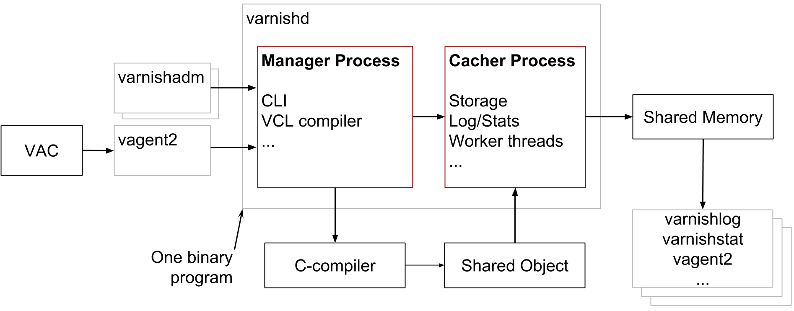
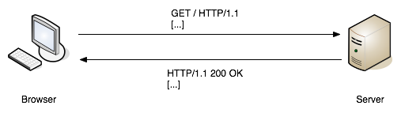
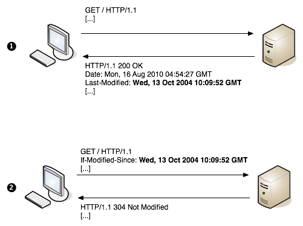
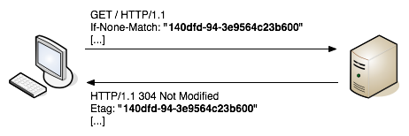
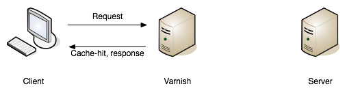
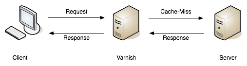
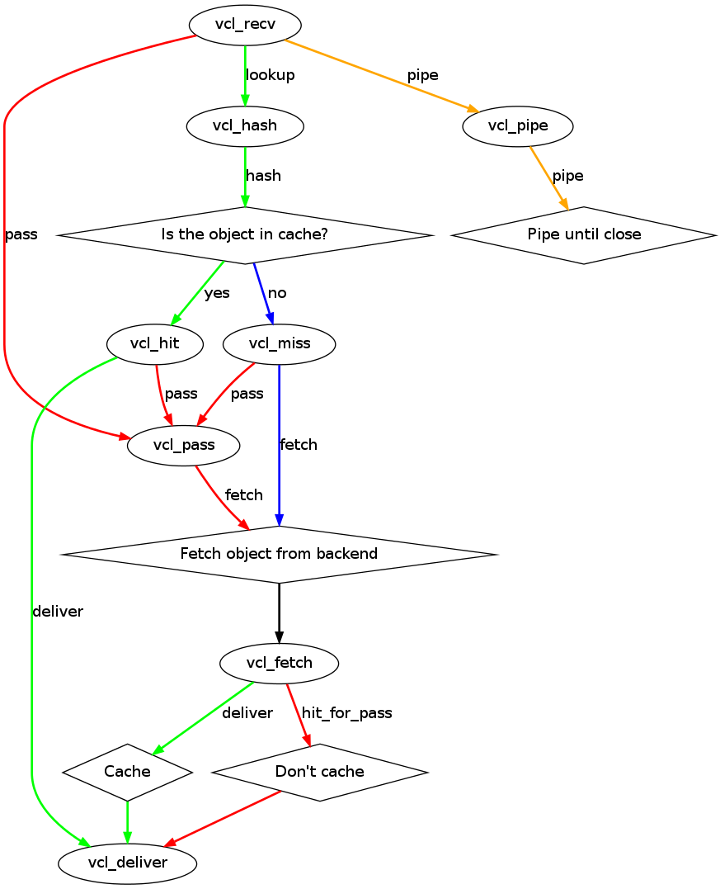
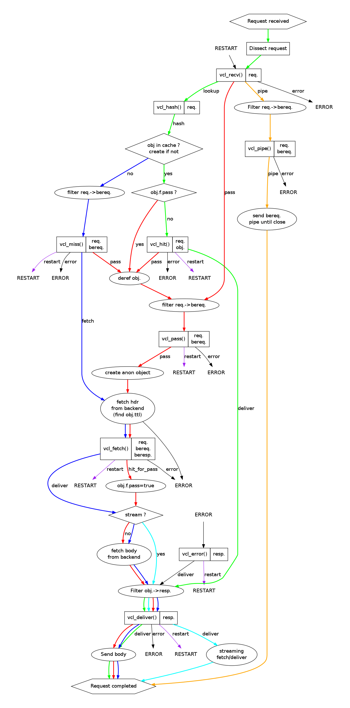
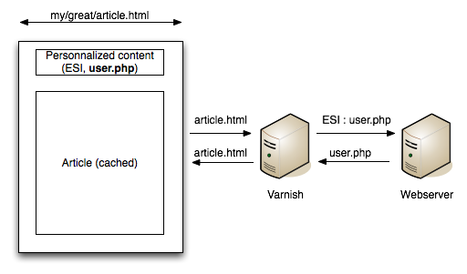

.. include:: util/frontpage.rst

.. include:: build/version.rst

.. contents::
   :class: handout

.. include:: util/printheaders.rst

.. include:: util/control.rst

.. include:: util/param.rst

.. raw:: pdf

   PageBreak oneColumn

Introduction
============

- About the course
- Goals and prerequisites
- Introduction to Varnish
- History
- Design Principles

About the course
----------------

The course is split in two:

1. Architecture, command line tools, installation, parameters, etc
2. The Varnish Configuration Language

The course has roughly 50% exercises and 50% instruction, and you will find
all the information on the slides in the supplied training material.

The supplied training material also has additional information for most
chapters.

The Varnish Book includes the material for both the `Varnish System
Administration` course and the `Varnish for Web developers` course.

.. container:: handout

   The agenda is adjusted based on the progress made. There is usually
   ample time to investigate specific aspects of Varnish that may be of
   special interest to some of the participants.

   The exercises will occasionally offer multiple means to reach the same
   goals. Specially when you start working on VCL, you will notice that
   there are almost always more than one way to solve a specific problem,
   and it isn't necessarily given that the solution offered by the
   instructor or this course material is better than what you might come up
   with yourself.

   Always feel free to interrupt the instructor if something is unclear.

Goals and Prerequisites
-----------------------

Prerequisites:

- Comfortable working in a shell on a Linux/UNIX machine, including editing
  text files and starting daemons.
- Basic understanding of HTTP and related internet protocols

Goals:

- Thorough understanding of Varnish
- Understanding of how VCL works and how to use it

.. container:: handout

   The course is oriented around a GNU/Linux server-platform, but the
   majority of the tasks only require minimal knowledge of GNU/Linux.

   The course starts out by installing Varnish and navigating some of the
   common configuration files, which is perhaps the most UNIX-centric part
   of the course. Do not hesitate to ask for help.

   The goal of the course is to make you confident when using Varnish and
   let you adjust Varnish to your exact needs. If you have any specific
   area you are particularly interested in, the course is usually flexible
   enough to make room for it.

Introduction to Varnish
-----------------------

- What is Varnish?
- Open Source / Free Software
- History
- Varnish Governance Board (VGB)

.. container:: handout

   Varnish is a reverse HTTP proxy, sometimes referred to as a HTTP
   accelerator or a web accelerator.  It stores files or fragments of
   files in memory, allowing them to be served quickly. It is
   essentially a key/value store, that usually uses the URL as a
   key. It is designed for modern hardware, modern operating systems
   and modern work loads.

   At the same time, Varnish is flexible. The Varnish Configuration
   Language is lightning fast and allows the administrator to express their
   wanted policy rather than being constrained by what the Varnish
   developers want to cater for or could think of. Varnish has shown itself
   to work well both on large (and expensive) servers and tiny appliances.

   Varnish is also an open source project, and free software. The
   development process is public and everyone can submit patches, or just
   take a peek at the code if there is some uncertainty as to how Varnish
   works. There is a community of volunteers who help each other and
   newcomers. The BSD-like license used by Varnish does not place
   significant restriction on re-use of the code, which makes it possible
   to integrate Varnish in virtually any solution.

   Varnish is developed and tested on GNU/Linux and FreeBSD. The code-base
   is kept as self-contained as possible to avoid introducing out-side bugs
   and unneeded complexity. As a consequence of this, Varnish uses very few
   external libraries.

   Varnish development is governed by the Varnish Governance Board (VGB),
   which thus far has not needed to intervene. The VGB consists of an
   architect, a community representative and a representative from Varnish
   Software. As of March 2012, the positions are filled by Poul-Henning
   Kamp (Architect), Rogier Mulhuijzen (Community) and Kristian Lyngstøl
   (Varnish Software). On a day-to-day basis, there is little need to
   interfere with the general flow of development.

   For those interested in development, the developers arrange weekly bug
   washes were recent tickets and development is discussed. This usually
   takes place on Mondays around 12:00 CET on the IRC channel
   `#varnish-hacking` on `irc.linpro.net`.

Design principles
-----------------

- Solve real problems
- Optimize for modern hardware (64-bit, multi-core, etc)
- Work with the kernel, not against it
- Innovation, not regurgitation

.. container:: handout

        The focus of Varnish has always been performance and flexibility.
        That has required some sacrifices.

        Varnish is designed for hardware that you buy today, not the
        hardware you bought 15 years ago. Varnish is designed to run
        on 64-bit architectures and will scale almost proportional to
        the number of CPU cores you have available. Though CPU-power
        is rarely a problem.

        If you choose to run Varnish on a 32-bit system, you are limited to
        3GB of virtual memory address space, which puts a limit on the
        number of threads you can run and the size of your cache. This is a
        trade-off to gain a simpler design and reduce the amount of work
        Varnish needs to do. The 3GB limit depends on the operating system
        kernel. The theoretical maximum is 4GB, but your OS will reserve
        some of that for the kernel. This is called the user/kernel split.

        Varnish does not keep track of whether your cache is on disk or in
        memory. Instead, Varnish will request a large chunk of memory and
        leave it to the operating system to figure out where that memory
        really is. The operating system can generally do a better job than
        a user-space program.

        Accept filters, epoll and kqueue are advanced features of the
        operating system that are designed for high-performance services
        like Varnish. By using these, Varnish can move a lot of the
        complexity into the OS kernel which is also better positioned to
        know what threads are ready to execute when.

        In addition, Varnish uses a configuration language that is
        translated to C-code, compiled with a normal C compiler and
        then dynamically linked directly into Varnish at
        run-time. This has several advantages. The most practical of
        which is the freedom you get as a system administrator. You
        can use VCL to decide how you want to interface with Varnish,
        instead of having a developer try to predict every possible
        scenario. The fact that it boils down to C and a C compiler
        also gives you very high performance, and if you really wanted
        to, you could by-pass the VCL to C translation and write raw C
        code (this is called in-line C in VCL). In short: Varnish
        provides the features, VCL allow you to specify exactly how
        you use and combine them.

        With Varnish 3 you also have Varnish Modules or simply vmods. These
        modules let you extend the functionality of the VCL language by
        pulling in custom-written features. Some examples include
        non-standard header manipulation, access to memcached or complex
        normalization of headers.

        The shared memory log allows Varnish to log large amounts of
        information at almost no cost by having other applications parse
        the data and extract the useful bits. This reduces the
        lock-contention in the heavily threaded environment of Varnish.
        Lock-contention is also one of the reasons why Varnish uses a
        workspace-oriented memory-model instead of allocating the
        exact amount of space it needs at run-time.

        To summarize: Varnish is designed to run on modern hardware
        under real work-loads and to solve real problems. Varnish does not
        cater to the "I want to make Varnish run on my 486 just
        because"-crowd. If it does work on your 486, then that's fine, but
        that's not where you will see our focus. Nor will you see us
        sacrifice performance or simplicity for the sake of niche use-cases
        that can easily be solved by other means - like using a 64-bit OS.

How objects are stored
----------------------

- Objects in Varnish are stored in a hash
- You can control the hashing
- Multiple objects can have the same hash key

.. container:: handout

	Varnish has, as mentioned, a key/value store in its
	core. Objects are stored in memory and a reference to this
	object is kept in a hash tree.

	A rather unique feature of Varnish is that you can actually
	control what goes into the hashing algorithm that Varnish uses
	to store data. Typically the key is made out of the HTTP Host
	header and the URL, but you're actually able to override this
	if you should choose to do so.

	The HTTP protocol specifies that there can be multiple objects
	that can be served on the same URL, depending on the
	preferences of the client. For instance, serving gzip'ed
	content to a client that doesn't indicate gzip support doesn't
	make much sense and Varnish might look at the Various objects
	stored at that key to pick out the one that matches.

Getting started
===============

In this chapter, we will:

 - Install and test a backend
 - Install Varnish
 - Make Varnish and the backend-server work together
 - Cover basic configuration

.. container:: handout

        You want to use packages for your operating system whenever
        possible.

        If the computer you will be using throughout this course has
        Varnish 3.0.0 or more recent available through the package system,
        you are encouraged to use that package if you do not feel you need
        the exercise in installing from source.

        We will be using Apache as a web server.

        This course is about Varnish, but we need an operating system to
        test. For the sake of keeping things simple, the course uses Debian
        as a platform. You will find several references to differences
        between Debian and Red Hat where they matter the most, but for the
        most part, this course is independent on the operating system in
        use.

Configuration
-------------

Varnish has two categories of configuration:

- Command line configuration and tunable parameters
- VCL

To re-load Varnish configuration, you have several commands:

+-------------------------------+-----------------------------------------+
| Command                       | Result                                  |
+===============================+=========================================+
| ``service varnish restart``   | Completely restarts Varnish, using the  |
|                               | operating system mechanisms. Your cache |
|                               | will be flushed.                        |
+-------------------------------+-----------------------------------------+
| ``service varnish reload``    | Only reloads VCL. Cache is not affected.|
+-------------------------------+-----------------------------------------+
| ``varnishadm vcl.load ..``    | Can be used to manually reload VCL. The |
| and ``varnishadm vcl.use ..`` | ``service varnish reload`` command does |
|                               | this for you automatically.             |
+-------------------------------+-----------------------------------------+
| ``varnishadm param.set ...``  | Can be used to set parameters without   |
|                               | restarting Varnish.                     |
+-------------------------------+-----------------------------------------+

Using the ``service`` commands is recommended. It's safe and fast.

.. container:: handout

        Tunable parameters and command line arguments are used to define
        how Varnish should work with operating system and hardware in
        addition to setting some default values, while VCL define how
        Varnish should interact with web servers and clients.

        Almost every aspect of Varnish can be reconfigured without
        restarting Varnish. Notable exceptions are cache size and
        location, the username and group that Varnish runs as and
        hashing algorithm.

        While you can change the values, some changes might require
        restarting the child to take effect (modifying the listening
        port, for instance) or might not be visible
        immediately. Changes to how long objects are cached, for
        instance, usually only take effect after the currently cached
        objects expire and are fetched again. Issuing ``param.show
        <parameter>`` will give you a description of the parameter,
        when and how it takes effect and the default and current
        value.

Command line configuration
--------------------------

-a <[hostname]:port>      listen address
-f <filename>             VCL
-p <parameter=value>      set tunable parameters
-S <secretfile>           authentication secret for management
-T <hostname:port>        Management interface
-s <storagetype,options>  where and how to store objects

.. container:: handout

        All the options that you can pass to the ``varnishd`` binary are
        documented in the ``varnishd(1)`` manual page (``man varnishd``).
        You may want to take a moment to skim over the options mentioned
        above.

        The only option that is strictly needed to start Varnish is the
        ``-f`` to specify a VCL file.

        Though they are not strictly required, you almost always want to
        specify a ``-s`` to select a storage backend,  ``-a`` to make sure
        Varnish listens for clients on the port you expect and ``-T`` to
        enable a management interface, often referred to as a telnet
        interface.

        Both for ``-T`` and ``-a``, you do not need to specify an IP, but
        can use ``:80`` to tell Varnish to listen to port 80 on all IPs
        available. Make sure you don't forget the colon, as ``-a 80`` will
        tell Varnish to listen to the IP with the decimal-representation
        "80", which is almost certainly not what you want. This is a result
        of the underlying function that accept this kind of syntax.

        You can specify ``-p`` for parameters multiple times. The workflow
        for tuning Varnish parameters usually means that you first try the
        parameter on a running Varnish through the management interface to
        find the value you want, then store it in a configuration file that
        will pass it to Varnish with ``-p`` next time you start it up. We
        will look at these files later on.

        The ``-S`` option specifies a file which contains a secret to be
        used for authentication. This can be used to authenticate with
        ``varnishadm -S`` as long as varnishadm can read the same secret
        file - or rather the same content: The content of the file can be
        copied to another machine to allow varnishadm to access the
        management interface remotely.

        .. note::

           It is possible to start Varnish without a VCL file using the
           ``-b`` option instead of ``-f``:

           -b <hostname:port>        backend address

           Since the ``-b`` option is mutually exclusive with the ``-f``
           option, we will only use the ``-f`` option. You can use ``-b``
           if you do not intend to specify any VCL and only have a single
           web server.

Configuration files
-------------------

Most Varnish-installations use two configuration-files. One of them is used
by the operating system to start Varnish, while the other contains your
VCL.

+------------------------------+-----------------------------------------+
| File                         | Usage                                   |
+==============================+=========================================+
| ``/etc/default/varnish``     | Used for parameters and command line    |
|                              | arguments. When you change this, you    |
|                              | need to run ``service varnish restart`` |
|                              | for the changes to take effect.         |
|                              | On RedHat-based OS's, this is kept in   |
|                              | ``/etc/sysconfig/varnish`` instead.     |
+------------------------------+-----------------------------------------+
| ``/etc/varnish/default.vcl`` | The VCL file. You can change the file   |
|                              | name by editing `/etc/default/varnish`  |
|                              | if you want to, but it's normal to use  |
|                              | the default name. This contains your    |
|                              | VCL and backend-definitions. After      |
|                              | changing this, you can run either       |
|                              | ``service varnish reload``, which will  |
|                              | not restart Varnish, or you can run     |
|                              | ``service varnish restart``, which      |
|                              | empties the cache.                      |
+------------------------------+-----------------------------------------+

.. container:: handout

   There are other ways to reload VCL and make parameter-changes take
   effect, mostly using the ``varnishadm`` tool. However, using the
   ``service varnish reload`` and ``service varnish restart`` commands is a
   good habit.

   .. note::

      If you want to know how the ``service varnish``-commands work, you
      can always look at the script that runs behind the scenes. If you are
      used to UNIX-like systems, it will come as no surprise that the
      script can be found in ``/etc/init.d/varnish``.

   .. warning::

      The script-configuration (located in `/etc/sysconfig` or
      `/etc/default`) is directly sourced as a shell script. Pay close
      attention to any backslashes (\\) and quotation marks that might move
      around as you edit the DAEMON_OPTS environmental variable.

Defining a backend in VCL
-------------------------

/etc/varnish/default.vcl

.. include:: vcl/backend.vcl
   :literal:

.. container:: handout

   In Varnish terminology, a backend-server is whatever server Varnish
   talks to to fetch content. This can be any sort of service as long as it
   understands HTTP. Most of the time, Varnish talks to a web server or an
   application frontend server.

   You almost always want to use VCL so we might as well get started.

   The above example defines a backend named ``default``. The name
   `default` is not special, and the real default backend that Varnish will
   use is the first backend you specify.

   You can specify many backends at the same time, but for now, we will
   only specify one to get started.

Exercise: Installation
-----------------------

You can install packages on Debian with ``apt-get install <package>``. E.g:
``apt-get install apache2``. For Red Hat, the tool would be ``yum install
<package>``.

#. Install ``apache2`` and verify it works by browsing to `http://localhost/`.
   You probably want to change ``localhost`` with whatever the hostname of
   the machine you're working is.
#. Change Apache's ports from 80 to 8080, in `/etc/apache2/ports.conf` and
   `/etc/apache2/sites-enabled/000-default`.
#. Install Varnish
#. Modify the Varnish configuration file so Varnish listens on port `80`,
   has a management interface on port `1234` and uses `127.0.0.1:8080` as
   the backend.
#. Start Varnish using ``service varnish start``.

The end result should be:

+------------+------------------------+--------------------------------------------+
| Service    | Result                 | Related config-files                       |
+============+========================+============================================+
| Apache     | Answers on port `8080` | ``/etc/apache2/ports.conf`` and            |
|            |                        | ``/etc/apache2/sites-enabled/000-default`` |
+------------+------------------------+--------------------------------------------+
| Varnish    | Answers on port `80`   | ``/etc/default/varnish``                   |
+------------+------------------------+--------------------------------------------+
| Varnish    | Talks to apache on     | ``/etc/varnish/default.vcl``               |
|            | `localhost:8080`       |                                            |
+------------+------------------------+--------------------------------------------+

.. container:: handout

   Varnish Software and the Varnish community maintains a package
   repository for several common GNU/Linux distributions. If your system
   does not have sufficiently up-to-date packages, visit
   https://www.varnish-cache.org/releases and find a package for your
   distribution.

   Once you have modified the ``/etc/default/varnish``-file, it should look
   something like this (comments removed)::

        NFILES=131072
        MEMLOCK=82000
        INSTANCE=$(uname -n)
        DAEMON_OPTS="-a :80 \
                     -T localhost:1234 \
                     -f /etc/varnish/default.vcl \
                     -s malloc,256m"

   .. tip::

      You can get an overview over services listening on TCP ports by
      issuing the command ``netstat -nlpt``.

Exercise: Fetch data through Varnish
------------------------------------

#. Install ``libwww-perl``
#. Execute ``GET -Used http://localhost:80/`` (on the command line)
#. Compare the results from multiple executions.

.. container:: handout

        GET and HEAD is actually the same tool; lwp-request. A HTTP HEAD request
        tells the web server - or Varnish in this case - to only reply with the
        HTTP headers, while GET returns everything.

        ``GET -Used`` tells lwp-request to do a GET-request, print the
        request headers (U), print the response status code (s), which is
        typically "200 OK" or "404 File not found", print the response
        headers "-e" and finally to not display the content of the
        response. Feel free to try removing some of the options observe the
        effect.

        GET is also useful to generate requests with custom headers, as you can
        supply extra headers with ``-H "Header: value"``, which can be used
        multiple times.

        You may also be familiar with firebug, an add-on for Firefox used
        for web development and related affairs. This too can show you the
        response headers.

        Web browsers have their own cache which you may not immediately be
        able to tell if you're using or not. It's often helpful to
        double-check with GET or HEAD if you are in doubt if what you're
        seeing is coming from Varnish or is part of your browser cache.

Log data
--------

Varnish provides a great deal of log data in real-time. The two most important tools to process that log data is:

- Varnishlog, used to access request-specific data (An extended access log,
  provides information about specific clients and requests.).
- varnishstat, used to access global counters (Provides overall statistics,
  e.g the number of total requests, number of objects and more.).
- If you have multiple Varnish instances on the same machine, you need to
  specify ``-n <name>`` both when starting Varnish and when starting the
  corresponding tools.

In addition the ``varnishncsa``-tool is often used to write apache-like log
files.

.. container:: handout

   If you look for logging data for Varnish you may discover that
   `/var/log/varnish/` is either non-existent or empty. There's a reason
   for that.

   Varnish logs all its information to a shared memory log which is
   overwritten repeatedly every time it's filled up. To use the log data,
   you need to use specific tools to parse the content.

   The downside is that you don't have historic data unless you set it up
   yourself, which is not covered in this chapter, but the upside is that
   you get an abundance of information when you need it.

   Through the course you will become familiar with varnishlog and
   varnishstat, which are the two most important tools you have at your
   disposal.

   .. note::

      If you want to log to disk you should take a look at
      ``/etc/default/varnishlog`` or ``/etc/default/varnishncsa`` (or the
      ``syconfig`` equivalents). This will allow you to run ``varnishncsa``
      or ``varnishlog`` as a service in the background that writes to disk.

      Keep in mind that ``varnishlog`` generates large amounts of data,
      though. You may not want to log all of it to disk.

   .. note::

      All log tools (and varnishadm) takes an ``-n`` option. Varnish itself
      also takes a ``-n`` option. This is used to specify a name for
      ``varnishd``, or the location of the shared memory log. On most
      installations ``-n`` is not used, but if you run multiple Varnish
      instances on a single machine you need to use ``-n`` to distinguish
      one varnish-instance from another.

varnishlog
----------

::

   97 ReqStart     c 10.1.0.10 50866 117511506
   97 RxRequest    c GET
   97 RxURL        c /style.css
   97 RxProtocol   c HTTP/1.1
   97 RxHeader     c Host: www.example.com
   97 VCL_call     c recv lookup
   97 VCL_call     c hash hash
   97 Hit          c 117505004
   97 VCL_call     c hit deliver
   97 Length       c 3218
   97 VCL_call     c deliver deliver
   97 TxProtocol   c HTTP/1.1
   97 TxStatus     c 200
   97 TxResponse   c OK
   97 TxHeader     c Content-Length: 3218
   97 TxHeader     c Date: Sat, 22 Aug 2008 01:10:10 GMT
   97 TxHeader     c X-Varnish: 117511501 117505004
   97 TxHeader     c Age: 2
   97 TxHeader     c Via: 1.1 varnish
   97 ReqEnd       c 117511501 1227316210.534358978 \
        1227316210.535176039  0.035283089 0.000793934 0.000023127

.. container:: handout

   The above output is a single cache hit, as processed by Varnish. When
   you are dealing with several thousand requests per second you need
   filtering.

   The displayed data is categorized as follows:

   1. The number on the left is a semi-unique identifier of the request. It
      is used to distinguish different requests.
   2. Each piece of log information belongs to a tag, as seen on the second
      left-most column. TxHeader, RxHeader, VCL_call etc. You can use
      those tags for intelligent filtering.
   3. Varnishlog will try to decipher if a request is related to a client
      (c), backend (b) or "misc" (-). This can be used to filter the log.
      The misc-category will contain data related to thread-collection,
      object expiry and similar internal data.
   4. The tag-specific content. E.g: the actual URL, the name and content
      of a HTTP header and so on.

   Since varnishlog displays all data in the log unless you filter it,
   there is a lot of data that you can safely ignore, and some data you
   should focus on. The following table demonstrates some tags and values
   that are useful. Since the tags them self are somewhat generic, you do
   not have a "Response header sent to a client"-header, but a "Sent
   Header" (`TxHeader`) tag, and it's up to you to interpret if that means
   it was sent to a client or a web server.

Varnishlog tag examples
-----------------------

+---------------+---------------------------+----------------------------+
| Tag           | Example value             | Description                |
+===============+===========================+============================+
| ``RxURL``     | ``/index.html``           | Varnish received a URL,    |
|               |                           | the only scenario where    |
|               |                           | Varnish receives a URL is  |
|               |                           | from a client, thus: a     |
|               |                           | client sent us this URL.   |
+---------------+---------------------------+----------------------------+
| ``TxURL``     | ``/index.html``           | Varnish sent a URL,        |
|               |                           | the only scenario where    |
|               |                           | Varnish sends a URL is     |
|               |                           | to a backend, thus: this   |
|               |                           | is part of a backend       |
|               |                           | request.                   |
+---------------+---------------------------+----------------------------+
| ``RxHeader``  | ``Host: www.example.com`` | A received header.         |
|               |                           | Either a request           |
|               |                           | header or                  |
|               |                           | a response header          |
|               |                           | backend. Since we          |
|               |                           | know the `Host`-header is  |
|               |                           | a request header, we can   |
|               |                           | assume it's from a client. |
+---------------+---------------------------+----------------------------+
| ``TxHeader``  | ``Host: example.com``     | A header Varnish sent.     |
|               |                           | Either a request header    |
|               |                           | or a  response header.     |
|               |                           | Since we know the          |
|               |                           | `Host`-header is a request |
|               |                           | header we can assume it is |
|               |                           | a header Varnish sent to a |
|               |                           | backend.                   |
+---------------+---------------------------+----------------------------+
| ``RxRequest`` | ``GET``                   | Received request method.   |
|               |                           | Varnish only receives      |
|               |                           | requests from clients.     |
+---------------+---------------------------+----------------------------+
| ``TxStatus``  | ``200``                   | Status code Varnish sent.  |
|               |                           | Only sent to clients.      |
+---------------+---------------------------+----------------------------+
| ``RxStatus``  | ``500``                   | Status code Varnish        |
|               |                           | received from a backend.   |
+---------------+---------------------------+----------------------------+
| ``ReqEnd``    | 1048725851                | The "End of request" entry |
|               | 1352290440.688310385      | has various timing details |
|               | 1352290440.688468695      | for debugging. The first   |
|               | 0.000107288 0.000083208   | number is the XID, the     |
|               | 0.000075102               | second is the time the     |
|               |                           | request started and the    |
|               |                           | second is when it finished.|
|               |                           | The fourth number is       |
|               |                           | time from accepting the    |
|               |                           | connection to processing   |
|               |                           | of the request started.    |
|               |                           | The fifth number is time   |
|               |                           | from request processing    |
|               |                           | started to delivery (e.g:  |
|               |                           | VCL execution and backend  |
|               |                           | fetching). The sixth and   |
|               |                           | last number is how long    |
|               |                           | the delivery itself took.  |
+---------------+---------------------------+----------------------------+

varnishlog options
------------------

-b                Only show traffic to backend.
-c                Only show traffic to client.
-O                Do not group by request.
-m <tag:filter>   Show *requests* where the <tag> matches <filter>. Example:
                  ``varnishlog -m TxStatus:500`` to show requests
                  returned to a client with status code 500.

.. container:: handout

   -n <name>            The name of the Varnish instance, or path to the shmlog.
                        Useful for running multiple instances of Varnish.
   -i <tag[,tag][..]>   Only show the specified tags.
   -I <regex>           Filter the tag provided by -i, using the regular expression for -I.

   Some examples of useful command-combinations:

   +--------------------------------+---------------------------------------------------+
   | Command                        | Description                                       |
   +================================+===================================================+
   | ``varnishlog -c``              | Only show client-requests for the url             |
   | ``-m RxURL:/specific/url/``    | `/specific/url`..                                 |
   +--------------------------------+---------------------------------------------------+
   | ``varnishlog -O -i ReqEnd``    | Only show the ReqEnd tag. Useful to spot sporadic |
   |                                | slowdown. Watch the last three values of it.      |
   +--------------------------------+---------------------------------------------------+
   | ``varnishlog -O -i TxURL``     | Only show the URLs sent to backend servers. E.g:  |
   |                                | Cache misses and content not cached.              |
   +--------------------------------+---------------------------------------------------+
   | ``varnishlog -O -i RxHeader``  | Show the Accept-Encoding request header.          |
   | ``-I Accept-Encoding``         |                                                   |
   +--------------------------------+---------------------------------------------------+
   | ``varnishlog -b``              | Show backend requests using the POST method.      |
   | ``-m TxRequest:POST``          |                                                   |
   +--------------------------------+---------------------------------------------------+
   | ``varnishlog -O``              | Only shows the URL sent to a backend server and   |
   | ``-i TxURL,TxHeader``          | all headers sent, either to a client or backend.  |
   +--------------------------------+---------------------------------------------------+

   .. warning::

      ``varnishlog`` sometimes accept arguments that are technically
      incorrect, which can have surprising results on filtering. Make sure
      you double-check the filter logic. You most likely want to specify -b
      or -c too.

varnishstat
-----------

::

    0+00:44:50                                                   foobar
    Hitrate ratio:       10      100      175
    Hitrate avg:     0.9507   0.9530   0.9532

          574660       241.00       213.63 Client connections accepted
         2525317       937.00       938.78 Client requests received
         2478794       931.00       921.48 Cache hits
            7723         3.00         2.87 Cache hits for pass
          140055        36.00        52.07 Cache misses
           47974        12.00        17.83 Backend conn. success
          109526        31.00        40.72 Backend conn. reuses
           46676         5.00        17.35 Backend conn. was closed
          156211        41.00        58.07 Backend conn. recycles
          110500        34.00        41.08 Fetch with Length
           46519         6.00        17.29 Fetch chunked
             456         0.00         0.17 Fetch wanted close
            5091          .            .   N struct sess_mem
            3473          .            .   N struct sess
           53570          .            .   N struct object
           50070          .            .   N struct objecthead
              20          .            .   N struct vbe_conn

.. container:: handout

   varnishstat gives a good representation of the general health of
   Varnish, including cache hit rate, uptime, number of failed backend
   connections and many other statistics.

   There are over a hundred different counters available. To increase the
   usefulness of varnishstat, only counters with a value different from
   0 is shown by default.

   varnishstat can be executed either as a one-shot tool which simply
   prints the current values of all the counters, using the ``-1`` option,
   or interactively. Both methods allow you to specify specific counters
   using ``-f field1,field2,...`` to limit the list.

   In interactive mode, varnishstat starts out by printing the uptime(45
   minutes, in the example above) and hostname(foobar).

   The `Hitrate ratio` and `Hitrate avg` are related. The Hitrate average
   measures the cache hit rate for a period of time stated by `hitrate
   ratio`. In the example above, the hitrate average for the last 10
   seconds is 0.9507 (or 95.07%), 0.9530 for the last 100 seconds and
   0.9532 for the last 175 seconds. When you start varnishstat, all of
   these will start at 1 second, then grow to 10, 100 and 1000. This is
   because varnishstat has to compute the average while it is running;
   there is no historic data of counters available.

   The bulk of varnishstat is the counters. The left column is the raw
   value, the second column is change per second in real time and the
   third column is change per second on average since Varnish started.
   In the above example Varnish has served 574660 requests and is
   currently serving roughly 241 requests per second.

   Some counters do not have 'per second' data. These are counters which
   both increase and decrease.

   There are far too many counters to keep track of for non-developers, and
   many of the counters are only there for debugging purposes. This allows
   you to provide the developers of Varnish with real and detailed data
   whenever you run into a performance issue or bug. It allows the
   developers to test ideas and get feedback on how it works in production
   environments without creating special test versions of Varnish. In
   short: It allows Varnish to be developed according to how it is used.

   In addition to some obviously interesting counters, like `cache_hit` and
   `client_conn`, some counters of note are:

   +-----------------+------------------------------------------------+
   | Counter         | Description                                    |
   +=================+================================================+
   | `client_drop`   | This counts clients Varnish had to drop due to |
   |                 | resource shortage. It should be 0.             |
   +-----------------+------------------------------------------------+
   | `cache_hitpass` | Hitpass is a special type of cache miss.       |
   |                 | It will be covered in the VCL chapters, but    |
   |                 | it can often be used to indicate if something  |
   |                 | the backend sent has triggered cache misses.   |
   +-----------------+------------------------------------------------+
   | `backend_fail`  | Counts the number of requests to backends that |
   |                 | fail. Should have a low number, ideally 0, but |
   |                 | it's not unnatural to have backend failures    |
   |                 | once in a while. Just make sure it doesn't     |
   |                 | become the normal state of operation.          |
   +-----------------+------------------------------------------------+
   | `n_object`      | Counts the number of objects in cache.         |
   |                 | You can have multiple variants of the same     |
   |                 | object depending on your setup.                |
   +-----------------+------------------------------------------------+
   | `n_wrk`,        | Thread counters. During normal operation,      |
   | `n_wrk_queued`, | the `n_wrk_queued` counter should not grow.    |
   | `n_wrk_drop`    | Once Varnish is out of threads, it will queue  |
   |                 | up requests and `n_wrk_queued` counts how many |
   |                 | times this has happened. Once the queue is     |
   |                 | full, Varnish starts dropping requests without |
   |                 | answering. `n_wrk_drop` counts how many times  |
   |                 | a request has been dropped. It should be 0.    |
   +-----------------+------------------------------------------------+
   | `n_lru_nuked`   | Counts the number of objects Varnish has had   |
   |                 | to evict from cache before they expired to     |
   |                 | make room for other content. If it is always   |
   |                 | 0, there is no point increasing the size of    |
   |                 | the cache since the cache isn't full. If it's  |
   |                 | climbing steadily a bigger cache could improve |
   |                 | cache efficiency.                              |
   +-----------------+------------------------------------------------+
   | `esi_errors`,   | If you use Edge Side Includes (ESI), these     |
   | `esi_warnings`  | somewhat hidden counters can be helpful to     |
   |                 | determine if the ESI syntax the web server is  |
   |                 | sending is valid.                              |
   +-----------------+------------------------------------------------+
   | `uptime`        | Varnish' uptime. Useful to spot if Varnish has |
   |                 | been restarted, either manually or by bugs.    |
   |                 | Particularly useful if a monitor tool uses it. |
   +-----------------+------------------------------------------------+

The management interface
------------------------

Varnish offers a management interface (Historically called the Telnet
interface.), assuming it was started with a ``-T`` option. You can use the
management interface to:

- Change parameters without restarting varnish
- Reload VCL
- View the most up-to-date documentation for parameters

There are a few other uses too which you can read about using the
``help``-command after you connect to the management interface with
``varnishadm``.

The ``service varnish reload`` command uses the management interface to
reload VCL without restarting Varnish.

.. container:: handout

   Keep the following in mind when using the management interface:

   1. Any changes you make are done immediately on the running Varnish
      instance.
   2. Changes are not persistent across restarts of Varnish. If you change
      a parameter and you want the change to apply if you restart Varnish,
      you need to also store it in the regular configuration for the boot
      script.

   Because the management interface is not encrypted, only has limited
   authentication and still allows almost total control over Varnish, it is
   important to protect it. Using the ``-S`` option offers reasonably good
   access control, but does not protect against more elaborate attacks,
   like man in the middle attacks -- the interface is not encrypted.

   The simplest way to protect the management interface is to only have it
   listen on localhost (127.0.0.1). Combined with the secret file, you can
   now offer access to the interface on a user-by-user basis by adjusting
   the read permission on the secret file. The secret file usually lives in
   ``/etc/varnish/secret``. The content is not a password, but a shared
   secret (it is never transmitted over the interface).

   .. note::

      Newer Varnish-versions will automatically detect the correct
      arguments for ``varnishadm`` using the shared memory log. For older
      versions, you always had to specify at least the ``-T``-option when
      using varnishadm.

      This automatic detection relies on the ``-n`` option since
      ``varnishadm`` needs to find the shared memory log.

      For remote access you will always specify ``-T`` and ``-S`` since a
      remote ``varnishadm`` can't read the shared memory log.

Exercise: Try out the tools
---------------------------

#. Run ``varnishstat`` and ``varnishlog`` while performing a few requests.
#. Make ``varnishlog`` only print client-requests where the `RxURL`-tag
   contains ``/favicon.ico``.
#. Use ``varnishadm`` to determine the default value for the
   ``default_ttl``-parameter, and what it does.

.. container:: handout

   As you are finishing up this exercise, you hopefully begin to see the
   usefulness of the various Varnish tools. ``varnishstat`` and
   ``varnishlog`` are the two most used tools, and are usually what you
   need for sites that are not in production yet.

   The various arguments for ``varnishlog`` are mostly designed to help you
   find exactly what you want, and filter out the noise. On production
   traffic, the amount of log data that Varnish produces is staggering, and
   filtering is a requirement for using ``varnishlog`` effectively.

Tuning
======

*This chapter is for the system administration course only*

This chapter will cover:

- Architecture
- Best practices
- Parameters

.. container:: handout

   Tuning Varnish is two-fold. Perhaps the most important aspect of it is
   is getting your VCL straight. For now, though, we will focus on tuning
   Varnish for your hardware, operating system and network.

   To be able to do that, knowledge of the process- and thread-architecture
   is helpful.

   The internal architecture of Varnish is of some interest, both because
   it is chiefly responsible for the performance you will be able to
   achieve with Varnish, and because it affects how you integrate Varnish
   in your own architecture.

   There are several aspects of the design that was unique to Varnish when
   it was originally implemented. Truly good solutions is the aim of
   Varnish, regardless of whether that means reusing ancient ideas or
   coming up with something radically different.

Process Architecture
--------------------

The multi-process architecture:

.. class:: handout

The management process
......................

Varnish has two main processes: the management process and the child
process.  The management process apply configuration changes (VCL and
parameters), compile VCL, monitor Varnish, initialize Varnish and provides
a command line interface, accessible either directly on the terminal or
through a management interface.

The management process polls the child process every few seconds to see if
it's still there. If it doesn't get a reply within a reasonable time, the
management process will kill the child and start it back up again. The same
happens if the child unexpectedly exits, for example from a segmentation
fault or assert error.

This ensures that even if Varnish does contain a critical bug, it will
start back up again fast. Usually within a few seconds, depending on the
conditions.

All of this is logged to syslog. This makes it crucially important to
monitor the syslog, otherwise you may never even know unless you look for
them, because the perceived downtime is so short.

.. note::

   Varnish Software and the Varnish community at large occasionally get
   requests for assistance in performance tuning Varnish that turn out to
   be crash-issues. Because the Varnish management thread starts the child
   up so fast, the users don't even notice the down time, only the extra
   loading time as Varnish is constantly emptying its cache.

   This is easily avoidable by paying attention to syslog and the `uptime`
   counter in ``varnishstat``.

.. raw:: pdf

   PageBreak

.. class:: handout

The child process
.................

The child process consist of several different types of threads, including,
but not limited to:

- Acceptor thread to accept new connections and delegate them.
- Worker threads - one per session. It's common to use hundreds of worker
  threads.
- Expiry thread, to evict old content from the cache.

Varnish uses workspaces to reduce the contention between each thread when
they need to acquire or modify memory. There are multiple workspaces, but
the most important one is the session workspace, which is used to
manipulate session data. An example is changing `www.example.com` to
`example.com` before it is entered into the cache, to reduce the number of
duplicates.

It is important to remember that even if you have 5MB of session workspace
and are using 1000 threads, the actual memory usage is not 5GB. The virtual
memory usage will indeed be 5GB, but unless you actually use the memory,
this is not a problem. Your memory controller and operating system will
keep track of what you actually use.

To communicate with the rest of the system, the child process uses a shared
memory log accessible from the file system. This means that if a thread
needs to log something, all it has to do is grab a lock, write to a memory
area and then free the lock. In addition to that, each worker thread has a
cache for log data to reduce lock contention.

The log file is usually about 80MB, and split in two. The first part is
counters, the second part is request data. To view the actual data, a
number of tools exist that parses the shared memory log. Because the
log-data is not meant to be written to disk in its raw form, Varnish can
afford to be very verbose. You then use one of the log-parsing tools to
extract the piece of information you want - either to store it permanently
or to monitor Varnish in real-time.

.. class:: handout

VCL compilation
................

Configuring the caching policies of Varnish is done in the Varnish
Configuration Language (VCL). Your VCL is then interpreted by the
management process into to C and then compiled by a normal C compiler -
typically gcc. Lastly, it is linked into the running Varnish instance.

As a result of this, changing configuration while Varnish is running is
very cheap. Varnish may want to keep the old configuration around for a bit
in case it still has references to it, but the policies of the new VCL
takes effect immediately.

Because the compilation is done outside of the child process, there is
no risk of affecting the running Varnish by accidentally loading an
ill-formated VCL.

A compiled VCL file is kept around until you restart Varnish completely, or
until you issue ``vcl.discard`` from the management interface. You can only
discard compiled VCL files after all references to them are gone, and the
amount of references left is part of the output of ``vcl.list``.

Storage backends
----------------

Varnish supports different methods of allocating space for the
cache, and you choose which one you want with the ``-s`` argument.

- file
- malloc
- persistent (experimental)

.. note::

    As a Rule of thumb use: malloc if it fits in memory, file if it doesn't.
    Expect around 1kB of overhead per object cached.

.. container:: handout

        They approach the same basic problem from two different angles.
        With the `malloc`-method, Varnish will request the entire size of
        the cache with a malloc() (memory allocation) library call. The
        operating system divides the cache between memory and disk by
        swapping out what it can't fit in memory.

        The alternative is to use the `file` storage backend, which instead
        creates a file on a filesystem to contain the entire cache, then
        tell the operating system through the mmap() (memory map) system
        call to map the entire file into memory if possible.

        The `file` storage method does not retain data when you stop or
        restart Varnish! This is what persistent storage is for. When ``-s
        file`` is used, Varnish does not keep track of what is written to
        disk and what is not. As a result, it's impossible to know whether
        the cache on disk can be used or not — it's just random data.
        Varnish will not (and can not) re-use old cache if you use ``-s
        file``.

        While `malloc` will use swap to store data to disk, `file` will use
        memory to cache the data instead. Varnish allow you to choose
        between the two because the performance of the two approaches have
        varied historically.

        The persistent storage backend is similar to file, but
        experimental. It does not yet gracefully
        handle situations where you run out of space. We only recommend
        using persistent if you have a large amount of data that you must
        cache and are prepared to work with us to track down bugs.

        When choosing storage backend, the rule of thumb is to use malloc
        if your cache will be contained entirely or mostly in memory, while
        the file storage backend performs far better when you need a large
        cache that exceeds the physical memory available. This might vary
        based on the kernel you use, but seems to be the case for 2.6.18
        and later Linux kernel, in addition to FreeBSD.

        It is important to keep in mind that the size you specify with the
        ``-s`` argument is the size for the actual cache. Varnish has an
        overhead on top of this for keeping track of the cache, so the
        actual memory footprint of Varnish will exceed what the '-s'
        argument specifies if the cache is full. The current estimate
        (subject to change on individual Varnish-versions) is that about
        1kB of overhead needed for each object. For 1 million objects, that
        means 1GB extra memory usage.

        In addition to the per-object overhead, there is also a fairly
        static overhead which you can calculate by starting Varnish without
        any objects. Typically around 100MB.

The shared memory log
---------------------

Varnish' shared memory log is used to log most data. It's sometimes called
a shm-log, and operates on a round-robin capacity.

There's not much you have to do with the shared memory log, except ensure
that it does not cause I/O. This is easily accomplished by putting it on a
tmpfs.

.. container:: handout

   This is typically done in '/etc/fstab', and the shmlog is normally kept
   in '/var/lib/varnish' or equivalent locations. All the content in that
   directory is safe to delete.

   The shared memory log is not persistent, so do not expect it to contain
   any real history.

   The typical size of the shared memory log is 80MB. If you want to see
   old log entries, not just real-time, you can use the ``-d`` argument for
   `varnishlog`: ``varnishlog -d``.

   .. warning::

      Some packages will use ``-s file`` by default with a path that puts
      the storage file in the same directory as the shmlog. You want to
      avoid this.

Tunable parameters
------------------

- In the CLI::

        param.show -l

- Don't fall for the copy/paste tips
- Test the parameters in CLI, then store them in the configuration file

.. container:: handout

        Varnish has many different parameters which can be adjusted to make
        Varnish act better under specific workloads or with specific software and
        hardware setups. They can all be viewed with ``param.show`` in the
        management interface and set with the ``-p`` option passed to
        Varnish - or directly in the management interface.

        Remember that changes made in the management interface are not stored
        anywhere, so unless you store your changes in a startup script, they will
        be lost when Varnish restarts.

        The general advice with regards to parameters is to keep it simple. Most
        of the defaults are very good, and even though they might give a small
        boost to performance, it's generally better to use safe defaults if you
        don't have a very specific need.

        A few hidden commands exist in the CLI, which can be revealed with
        ``help -d``. These are meant exclusively for development or
        testing, and many of them are downright dangerous. They are hidden
        for a reason, and the only exception is perhaps ``debug.health``,
        which is somewhat common to use.

Threading model
---------------

- The child process runs multiple threads
- Worker threads are the bread and butter of the Varnish architecture
- Utility-threads
- Balance

.. container:: handout

   The child process of Varnish is where the magic takes place. It consists
   of several distinct threads performing different tasks. The following
   table lists some interesting threads, to give you an idea of what goes
   on. The table is not complete.

   +---------------+---------------------------+------------------------+
   | Thread-name   | Amount of threads         | Task                   |
   +===============+===========================+========================+
   | cache-worker  | One per active connection | Handle requests        |
   +---------------+---------------------------+------------------------+
   | cache-main    | One                       | Startup                |
   +---------------+---------------------------+------------------------+
   | ban lurker    | One                       | Clean bans             |
   +---------------+---------------------------+------------------------+
   | acceptor      | One                       | Accept new connections |
   +---------------+---------------------------+------------------------+
   | epoll/kqueue  | Configurable, default: 2  | Manage thread pools    |
   +---------------+---------------------------+------------------------+
   | expire        | One                       | Remove old content     |
   +---------------+---------------------------+------------------------+
   | backend poll  | One per backend poll      | Health checks          |
   +---------------+---------------------------+------------------------+

   Most of the time, we only deal with the cache-worker threads when
   configuring Varnish. With the exception of the amount of thread pools,
   all the other threads are not configurable.

   For tuning Varnish, you need to think about your expected traffic. The
   thread model allows you to use multiple thread pools, but time and
   experience has shown that as long as you have 2 thread pools, adding
   more will not increase performance.

   The most important thread setting is the number of worker threads.

   .. note::

      If you run across tuning advice that suggests running one thread pool
      for each CPU core, rest assured that this is old advice. Experiments
      and data from production environments have revealed that as long as
      you have two thread pools (which is the default), there is nothing to
      gain by increasing the number of thread pools.

Threading parameters
--------------------

- Thread pools can safely be ignored
- Maximum: Roughly 5000 (total)
- Start them sooner rather than later
- Maximum and minimum values are per thread pool

.. class:: handout

Details of threading parameters
...............................

While most parameters can be left to the defaults, the exception
is the number of threads.

Varnish will use one thread for each session and the number of
threads you let Varnish use is directly proportional to how many
requests Varnish can serve concurrently.

The available parameters directly related to threads are:

=========================  ====================================
Parameter                  Default value
=========================  ====================================
thread_pool_add_delay      |def_thread_pool_add_delay|
thread_pool_add_threshold  |def_thread_pool_add_threshold|
thread_pool_fail_delay     |def_thread_pool_fail_delay|
thread_pool_max            |def_thread_pool_max|
thread_pool_min            |def_thread_pool_min|
thread_pool_purge_delay    |def_thread_pool_purge_delay|
thread_pool_stack          |def_thread_pool_stack|
thread_pool_timeout        |def_thread_pool_timeout|
thread_pools               |def_thread_pools|
thread_stats_rate          |def_thread_stats_rate|
=========================  ====================================

Among these, ``thread_pool_min`` and ``thread_pool_max`` are most
important. The ``thread_pools`` parameter is also of some importance, but
mainly because it is used to calculate the final number of threads.

Varnish operates with multiple pools of threads. When a connection is
accepted, the connection is delegated to one of these thread pools. The
thread pool will further delegate the connection to available thread if one
is available, put the connection on a queue if there are no available
threads or drop the connection if the queue is full. By default, Varnish
uses 2 thread pools, and this has proven sufficient for even the most busy
Varnish server.

For the sake of keeping things simple, the current best practice is to
leave thread_pools at the default |def_thread_pools|.

.. class:: handout

Number of threads
.................

Varnish has the ability to spawn new worker threads on demand, and remove
them once the load is reduced. This is mainly intended for traffic spikes.
It's a better approach to try to always keep a few threads idle during
regular traffic than it is to run on a minimum amount of threads and
constantly spawn and destroy threads as demand changes. As long as you are
on a 64-bit system, the cost of running a few hundred threads extra is very
limited.

The ``thread_pool_min`` parameter defines how many threads will be running
for each thread pool even when there is no load. ``thread_pool_max``
defines the maximum amount of threads that will be used per thread pool.

The defaults of a minimum of |def_thread_pool_min| and maximum
|def_thread_pool_max| threads per thread pool and
|def_thread_pools| will result in:

- At any given time, at least |def_thread_pool_min| *
  |def_thread_pools| worker threads will be running
- No more than |def_thread_pool_max| * |def_thread_pools| threads
  will run.

We rarely recommend running with more than 5000 threads. If you seem to
need more than 5000 threads, it's very likely that there is something not
quite right about your setup, and you should investigate elsewhere before
you increase the maximum value.

For minimum, it's common to operate with 500 to 1000 threads minimum
(total). You can observe if this is enough through varnishstat, by looking
at the `N queued work requests` (``n_wrk_queued``) counter over time. It
should be fairly static after startup.

.. class:: handout

Timing thread growth
....................

Varnish can use several thousand threads, and has had this capability from
the very beginning. Not all operating system kernels were prepared to deal
with this, though, so the parameter ``thread_pool_add_delay`` was added
which ensures that there is a small delay between each thread that spawns.
As operating systems have matured, this has become less important and the
default value of ``thread_pool_add_delay`` has been reduced dramatically,
from 20ms to 2ms.

There are a few, less important parameters related to thread timing. The
``thread_pool_timeout`` is how long a thread is kept around when there is
no work for it before it is removed. This only applies if you have more
threads than the minimum, and is rarely changed.

Another less important parameter is the ``thread_pool_fail_delay``, which defines how long to wait
after the operating system denied us a new thread before we try again.

System parameters
-----------------

As Varnish has matured, fewer and fewer parameters require tuning. The
``sess_workspace`` is one of the parameters that could still pose a
problem.

- ``sess_workspace`` - incoming HTTP header workspace (from client)
- Common values range from the default of |def_sess_workspace| to 10MB
- ESI typically requires exponential growth
- Remember: It's all virtual - not physical memory.

.. container:: handout

        Workspaces are some of the things you can change with parameters. The
        session workspace is how much memory is allocated to each HTTP session for
        tasks like string manipulation of incoming headers. It is also
        used to modify the object returned from a web server before the
        precise size is allocated and the object is stored read-only.

        Some times you may have to increase the session workspace to avoid
        running out of workspace.

        As most of the parameters can be left unchanged, we will not go through
        all of them, but take a look at the list ``param.show`` gives you
        to get an impression of what they can do.

        .. note:::

           Varnish 2.0 had a ``obj_workspace`` which you may see references
           to in older documentation. This was the workspace for
           manipulating an object. Manipulation of an object is now done on
           the session workspace in ``vcl_fetch``, then a precise amount of
           memory is allocated for the object, thus removing the need for a
           tunable obj_workspace.

Timers
------

======================= =========================== ======================== ===========
Parameter               Default                     Description              Scope
======================= =========================== ======================== ===========
connect_timeout         |def_connect_timeout|       OS/network latency       Backend
first_byte_timeout      |def_first_byte_timeout|    Page generation?         Backend
between_bytes_timeout   |def_between_bytes_timeout| Hiccoughs?               Backend
send_timeout            |def_send_timeout|          Client-in-tunnel         Client
sess_timeout            |def_sess_timeout|          keep-alive timeout       Client
cli_timeout             |def_cli_timeout|           Management thread->child Management
======================= =========================== ======================== ===========

.. container:: handout

        The timeout-parameters are generally set to pretty good defaults, but
        you might have to adjust them for unusual applications. The connection
        timeout is tuned for a geographically close web server, and might have to
        be increased if your Varnish server and web server are not close.

        Keep in mind that the session timeout affects how long sessions are kept
        around, which in turn affects file descriptors left open. It is not wise to
        increase the session timeout without taking this into consideration.

        The ``cli_timeout`` is how long the management thread waits for the worker
        thread to reply before it assumes it is dead, kills it and starts it back
        up. The default value seems to do the trick for most users today.

        .. note::

           The ``connect_timeout`` is |def_connect_timeout| by default.
           This is more than enough time for the typical setup where
           Varnish talks to a backend in the same server room - but it may
           be too short if Varnish is using a remote backend which may have
           more latency. If this is set too high, it will not let Varnish
           handle errors gracefully.

           An other use-case for increasing ``connect_timeout`` occurs when
           virtual machines are involved in the stack, as they can increase
           the connection time significantly.

Exercise: Tune first_byte_timeout
---------------------------------

#. Create a small CGI script in /usr/lib/cgi-bin/test.cgi containing::

        #! /bin/sh
        sleep 5
        echo "Content-type: text/plain"
        echo "Cache-control: max-age=0"
        echo
        echo "Hello world"
	date

#. Make it executable.
#. Test that it works outside of Varnish.
#. Start Varnish, test that it works through Varnish.
#. Set ``first_byte_timeout`` to 2s.
#. Check that it doesn't work.

Exercise: Configure threading
-----------------------------

While performing this exercise, watch the `n_wrk` counter in
``varnishstat`` to determine the number of threads that are running.

#. Start Varnish.
#. Change the ``thread_pool_min`` and ``thread_pool_max`` parameters to get.
   100 threads running at any given time, but never more than 400.
#. Make the changes work across restarts of Varnish.

Extra: Experiment with ``thread_pool_add_delay`` and
``thread_pool_timeout`` while watching ``varnishstat`` to see how thread
creation and destruction is affected. Does ``thread_pool_timeout`` affect
already running threads?

.. container:: handout

   You can also try changing the ``thread_pool_stack`` variable to a low
   value. This will only affect new threads, but try to find out how low
   you can set it, and what happens if it's too low.

   .. note::

      It's not common to modify ``thread_pool_stack``,
      ``thread_pool_add_delay`` or ``thread_pool_timeout``. These extra
      assignments are for educational purposes, and not intended as an
      encouragement to change the values.

HTTP
====

*This chapter is for the webdeveloper course only*

This chapter covers:

- Protocol basics
- Requests and responses
- HTTP request/response control flow
- Statelessness and idempotence
- Cache related headers

.. container:: handout

   HTTP is at the heart of Varnish, or rather the model HTTP represents.

   This chapter will cover the basics of HTTP as a protocol, how it's used
   in the wild, and delve into caching as it applies to HTTP.

Protocol basics
---------------

- Hyper-Text Transfer Protocol, HTTP, is at the core of the web
- Specified by the IETF, the latest version (HTTP/1.1) is available from
  http://tools.ietf.org/html/rfc2616
- A request consists of a request method, headers and an optional request
  body.
- A response consists of a response status, headers and an optional
  response body.
- Multiple requests can be sent over a single connection, in serial.
- Clients will open multiple connections to fetch resources in parallel.

.. container:: handout

    HTTP is a networking protocol for distributed systems. It is the foundation of
    data communication for the Web. The development of this standard is done by the
    IETF and the W3C. The latest version of the standard is HTTP/1.1.

    A new version of HTTP called HTTP bis is under development, you can follow
    the work document at http://datatracker.ietf.org/wg/httpbis/charter/.
    Basically HTTP bis will be HTTP/1.1 with new features for example a better
    caching of web pages.

Requests
--------

- Standard request methods are: `GET`, `POST`, `HEAD`, `OPTIONS`, `PUT`,
  `DELETE`, `TRACE`, or `CONNECT`.
- This is followed by a URI, e.g:  `/img/image.png` or `/index.html`
- Usually followed by the HTTP version
- A new-line (CRLF), followed by an arbitrary amount of CRLF-separated
  headers (`Accept-Language`, `Cookie`, `Host`, `User-Agent`, etc).
- A single empty line, ending in CRLF.
- An optional message body, depending on the request method.

.. container:: handout

   Each request has the same, strict and fairly simple pattern. A request
   method informs the web server what sort of request this is: Is the
   client trying to fetch a resource (`GET`), or update some data(`POST`)?
   Or just get the headers of a resource (`HEAD`)?

   There are strict rules that apply to the request methods. For instance,
   a `GET` request can not contain a request body, but a `POST` request
   can.

   Similarly, a web server can not attach a request body to a response to a
   `HEAD` body.

Request example
---------------

::

    GET / HTTP/1.1
    Host: localhost
    User-Agent: Mozilla/5.0 (Macintosh; U; Intel Mac OS X 10.5; fr; rv:1.9.2.16) Gecko/20110319 Firefox/3.6.16
    Accept: text/html,application/xhtml+xml,application/xml;q=0.9,*/*;q=0.8
    Accept-Language: fr,fr-fr;q=0.8,en-us;q=0.5,en;q=0.3
    Accept-Encoding: gzip,deflate
    Accept-Charset: ISO-8859-1,utf-8;q=0.7,*;q=0.7
    Keep-Alive: 115
    Connection: keep-alive
    Cache-Control: max-age=0

.. container:: handout

   The above is a typical HTTP `GET` request for the ``/`` resource.

   Note that the ``Host``-header contains the hostname as seen by the
   browser. The above request was generated by entering http://localhost/
   in the browser. The browser automatically adds a number of headers. Some
   of these will vary depending on language settings, others will vary
   depending on whether the client has a cached copy of the page already,
   or if the client is doing a refresh or forced refresh.

   Whether the server honors these headers will depend on both the server
   in question and the specific header.

   The following is an example of a HTTP request using the `POST` method,
   which includes a request body::

            POST /accounts/ServiceLoginAuth HTTP/1.1
            Host: www.google.com
            User-Agent: Mozilla/5.0 (Macintosh; U; Intel Mac OS X 10.5; fr; rv:1.9.2.16) Gecko/20110319 Firefox/3.6.16
            Accept: text/html,application/xhtml+xml,application/xml;q=0.9,*/*;q=0.8
            Accept-Language: fr,fr-fr;q=0.8,en-us;q=0.5,en;q=0.3
            Accept-Encoding: gzip,deflate
            Accept-Charset: ISO-8859-1,utf-8;q=0.7,*;q=0.7
            Keep-Alive: 115
            Connection: keep-alive
            Referer: https://www.google.com/accounts/ServiceLogin
            Cookie: GoogleAccountsLocale_session=en;[...]
            Content-Type: application/x-www-form-urlencoded
            Content-Length: 288

            ltmpl=default[...]&signIn=Sign+in&asts=

Response
--------

::

        HTTP/1.1 200 OK
        Cache-Control: max-age=150
        Content-Length: 150

        [data]

- A HTTP response contains the HTTP versions, response code(e.g: 200)  and response
  message (e.g: OK).
- CRLF as line separator
- A number of headers
- Headers are terminated with a blank line.
- Optional response body

.. container:: handout

   The HTTP response is similar to the request itself. The response code
   informs the browser both whether the request succeeded and what type of
   response this is. The response message is a text-representation of the
   same information, and is often ignored by the browser itself.

   Examples of status codes are `200 OK`, `404 File Not Found`, `304 Not
   Modified` and so fort. They are all defined in the HTTP standard, and
   grouped into the following categories:

   - 1xx: Informational - Request received, continuing process

   - 2xx: Success - The action was successfully received, understood, and
     accepted

   - 3xx: Redirection - Further action must be taken in order to complete
     the request

   - 4xx: Client Error - The request contains bad syntax or cannot be
     fulfilled

   - 5xx: Server Error - The server failed to fulfill an apparently valid
     request

Response example
----------------

::

    HTTP/1.1 200 OK
    Server: Apache/2.2.14 (Ubuntu)
    X-Powered-By: PHP/5.3.2-1ubuntu4.7
    Cache-Control: public, max-age=86400
    Last-Modified: Mon, 04 Apr 2011 04:13:41 +0000
    Expires: Sun, 11 Mar 1984 12:00:00 GMT
    Vary: Cookie,Accept-Encoding
    ETag: "1301890421"
    Content-Type: text/html; charset=utf-8
    Content-Length: 23562
    Date: Mon, 04 Apr 2011 09:02:26 GMT
    X-Varnish: 1886109724 1886107902
    Age: 17324
    Via: 1.1 varnish
    Connection: keep-alive

    (data)

HTTP request/response control flow
----------------------------------

The client sends an HTTP request to the server which returns an HTTP response
with the message body.

Statelesness and idempotence
----------------------------

**statelesness**
    HTTP is by definition a stateless protocol which means that in theory
    your browser has to reconnect to the server for every request. In practice
    there is a header called `Keep-Alive` you may use if you want to keep the
    connection open between the client (your browser) and the server.

**idempotence**
    Imdempotence means that an operation can be applied multiple times without
    changing the result. `GET` and `PUT` HTTP request are expected to be
    idempotent whereas `POST` requests are not. In other words, you can not
    cache `POST` HTTP responses.

.. container:: handout

   For more discussion about idempotence
   http://queue.acm.org/detail.cfm?id=2187821.

Cache related headers
---------------------

HTTP provides a list of headers dedicated to page caching and cache
invalidation. The most important ones are :

- Expires
- Cache-Control
- Etag
- Last-Modified
- If-Modified-Since
- If-None-Match
- Vary
- Age

Exercise : Test various Cache headers
-------------------------------------

Before we talk about all the various cache headers and cache mechanisms, we
will use `httpheadersexample.php` to experiment and get a sense of what
it's all about.

Try both clicking the links twice, hitting refresh and forced refresh
(usually done by hitting control-F5, depending on browser).

#. Try out the Expires-header and see how the browser and Varnish behave.
#. What happens when both Expires and Cache-Control is present?
#. Test the `If-Modified-Since` request too. Does the browser issue a
   request to Varnish? If the item was in cache, does Varnish query the
   web-server?
#. Try the `Vary`-test by using two different browsers at the same time.

.. container:: handout

   When performing this exercise, try to see if you can spot the patterns.
   There are many levels of cache on the Web, and you have to think about
   more than just Varnish.

   If it hasn't already, it's likely that browser cache will confuse you at
   least a few times through this course. When that happens, pull up
   varnishlog or another browser.

Expires
-------

The `Expires` **response** header field gives the date/time after which the
response is considered stale. A stale cache item will not be returned by
any cache (proxy cache or client cache).

The syntax for this header is::

    Expires: GMT formatted date

It is recommended not to define `Expires` too far in the future. Setting it
to 1 year is usually enough.

Using `Expires` does not prevent the cached resource to be updated. If a
resource is updated changing its name (by using a version number for
instance) is possible.

`Expires` works best for any file that is part of your design like
JavaScripts stylesheets or images.

Cache-Control
-------------

The `Cache-Control` header field specifies directives that **must** be
applied by all caching mechanisms (from proxy cache to browser cache).
`Cache-Control` accepts the following arguments (only the most relevant are
described):

- `public`: The response may be cached by any cache.
- `no-store`: The response body **must not** be stored by any cache
  mechanism;
- `no-cache`: Authorizes a cache mechanism to store the response in its
  cache but it **must not** reuse it without validating it with the origin
  server first. In order to avoid any confusion with this argument think of
  it as a "store-but-do-no-serve-from-cache-without-revalidation"
  instruction.
- `max-age`: Specifies the period in seconds during which the cache will be
  considered fresh;
- `s-maxage`: Like `max-age` but it applies only to public caches;
- `must-revalidate`: Indicates that a stale cache item can not be serviced
  without revalidation with the origin server first;

.. container:: handout

        Unlike `Expires`, `Cache-Control` is both a **request** and a **response**
        header, here is the list of arguments you may use for each context:

        +--------------------+---------+-----------+
        | Argument           | Request | Response  |
        +====================+=========+===========+
        | `no-cache`         | X       | X         |
        +--------------------+---------+-----------+
        | `no-store`         | X       | X         |
        +--------------------+---------+-----------+
        | `max-age`          | X       | X         |
        +--------------------+---------+-----------+
        | `s-maxage`         |         | X         |
        +--------------------+---------+-----------+
        | `max-stale`        | X       |           |
        +--------------------+---------+-----------+
        | `min-fresh`        | X       |           |
        +--------------------+---------+-----------+
        | `no-transform`     | X       | X         |
        +--------------------+---------+-----------+
        | `only-if-cached`   | X       |           |
        +--------------------+---------+-----------+
        | `public`           |         | X         |
        +--------------------+---------+-----------+
        | `private`          |         | X         |
        +--------------------+---------+-----------+
        | `must-revalidate`  |         | X         |
        +--------------------+---------+-----------+
        | `proxy-revalidate` |         | X         |
        +--------------------+---------+-----------+

        Example of a `Cache-Control` header::

            Cache-Control: public, must-revalidate, max-age=2592000

        .. Note::

            As you might have noticed `Expires` and `Cache-Control` do more or less the
            same job, `Cache-Control` gives you more control though. There is a
            significant difference between these two headers:

                - `Cache-Control` uses relative times in seconds, cf (s)max-age
                - `Expires` always returns an absolute date

        .. Note::

            Cache-Control **always** overrides Expires.

        .. Note::

            By default, Varnish does not care about the Cache-Control
	    request header.  If you want to let users update the cache
	    via a force refresh you need to do it yourself.

Last-Modified
-------------

The `Last-Modified` **response** header field indicates the date and time
at which the origin server believes the variant was last modified. This
headers may be used in conjunction with `If-Modified-Since` and
`If-None-Match`.

Example of a `Last-Modified` header: ::

    Last-Modified: Wed, 01 Sep 2004 13:24:52 GMT

If-Modified-Since
-----------------

The `If-Modified-Since` **request** header field is used with a method to
make it conditional:

- **if** the requested variant has not been modified since the time
  specified in this field, an entity will not be returned from the server;
- **instead**, a 304 (not modified) response will be returned without any
  message-body.

Example of an `If-Modified-Since` header: ::

    If-Modified-Since: Wed, 01 Sep 2004 13:24:52 GMT

If-None-Match
-------------

The `If-None-Match` **request** header field is used with a method to make
it conditional.

A client that has one or more entities previously obtained from the
resource can verify that none of those entities is current by including a
list of their associated entity tags in the If-None-Match header field.

The purpose of this feature is to allow efficient updates of cached
information with a minimum amount of transaction overhead. It is also used
to prevent a method (e.g. PUT) from inadvertently modifying an existing
resource when the client believes that the resource does not exist.

Example of an `If-None-Match` header : ::

    If-None-Match: "1edec-3e3073913b100"

Etag
----

The `ETag` **response** header field provides the current value of the
entity tag for the requested variant.  The idea behind `Etag` is to provide
a unique value for a resource's contents.

Example of an `Etag` header: ::

    Etag: "1edec-3e3073913b100"

Pragma
------

The `Pragma` **request** header is a legacy header and should no longer be used.
Some applications still send headers like ``Pragma: no-cache`` but this is
for backwards compatibility reasons **only**.

Any proxy cache should treat ``Pragma: no-cache`` as ``Cache-Control:
no-cache``, and should not be seen as a reliable header especially when
used as a response header.

Vary
----

The `Vary` **response** header indicates the response returned by the origin
server may vary depending on headers received in the request.

The most common usage of `Vary` is to use ``Vary: Accept-Encoding``, which
tells caches (Varnish included) that the content might look different
depending on the `Accept-Encoding`-header the client sends. In other words:
The page can be delivered compressed or uncompressed depending on the
client.

.. container:: handout

   The `Vary`-header is one of the trickiest headers to deal with for a
   cache. A cache, like Varnish, does not necessarily understand the
   semantics of a header, or what part triggers different variants of a
   page.

   As a result, using ``Vary: User-Agent`` for instance tells a cache that
   for ANY change in the `User-Agent`-header, the content `might` look
   different. Since there are probably thousands of `User-Agent` strings
   out there, this means you will drastically reduce the efficiency of any
   cache method.

   An other example is using ``Vary: Cookie`` which is actually not a bad
   idea. Unfortunately, you can't issue ``Vary: Cookie(but only THESE
   cookies: ...)``. And since a client will send you a great deal of
   cookies, this means that just using ``Vary: Cookie`` is not necessarily
   sufficient. We will discuss this further in the Content Composition
   chapter.

   .. note::

      From Varnish version 3, Varnish handles `Accept-Encoding` and ``Vary:
      Accept-Encoding`` for you. This is because Varnish 3 has support for
      gzip compression. In Varnish 2 it was necessary to normalize the
      `Accept-Encoding`-header, but this is redundant in Varnish 3.

Age
---

- A cache server can send an additional response header, `Age`, to indicate
  the age of the response.
- Varnish (and other caches) does this.
- Browsers (and Varnish) will use the Age-header to determine how long to
  cache.
- E.g: for a `max-age`-based equation: cache duration = `max-age` - `Age`
- If you allow Varnish to cache for a long time, the `Age`-header could
  effectively disallow client-side caches.

.. container:: handout

   Consider what happens if you let Varnish cache content for a week,
   because you can easily invalidate the cache Varnish keeps. If you do not
   change the `Age`-header, Varnish will happily inform clients that the
   content is, for example, two days old, and that the maximum age should
   be no more than fifteen minutes.

   Browsers will obey this. They will use the reply, but they will also
   realize that it has exceeded its max-age, so they will not cache it.

   Varnish will do the same, if your web-server emits and `Age`-header (or
   if you put one Varnish-server in front of another).

   We will see in later chapters how we can handle this in Varnish.

Header availability summary
---------------------------

The table below lists HTTP headers seen above and wether they are a request
header or a response one.

+-------------------+---------+----------+
| Header            | Request | Response |
+===================+=========+==========+
| Expires           |         | X        |
+-------------------+---------+----------+
| Cache-Control     | X       | X        |
+-------------------+---------+----------+
| Last-Modified     |         | X        |
+-------------------+---------+----------+
| If-Modified-Since | X       |          |
+-------------------+---------+----------+
| If-None-Match     | X       |          |
+-------------------+---------+----------+
| Etag              |         | X        |
+-------------------+---------+----------+
| Pragma            | X       | X        |
+-------------------+---------+----------+
| Vary              |         | X        |
+-------------------+---------+----------+
| Age               |         | X        |
+-------------------+---------+----------+

Cache-hit and misses
--------------------

**cache-hit**

There is a cache-hit when Varnish returns a page from its cache instead of
forwarding the request to the origin server.

**cache-miss**

There is a cache-miss when Varnish has to forward the request to the origin
server so the page can be serviced.

Exercise: Use `article.php` to test `Age`
-----------------------------------------

#. Modify the `article.php`-script to send an Age header that says `30` and
   ``Cache-Control: max-age=60``.
#. Watch ``varnishlog``.
#. Send a request to Varnish for `article.php`. See what `Age`-Header
   Varnish replies with.
#. Is the `Age`-header an accurate method to determine if Varnish made a
   cache hit or not?
#. How long does Varnish cache the reply? How long would a browser cache
   it?

.. container:: handout

   Also consider how you would avoid issues like this to begin with.  We do
   not yet know how to modify Varnish' response headers, but hopefully you
   will understand why you may need to do that.

   Varnish is not the only part of your web-stack that parses and honors
   cache-related headers. The primary consumer of such headers are the web
   browsers, and there might also be other caches along the way which you
   do not control, like a company-wide proxy server.

   By using `s-maxage` instead of `max-age` we limit the number of
   consumers to cache servers, but even `s-maxage` will be used by caching
   proxies which you do not control.

   In the next few chapters, you will learn how to modify the response
   headers Varnish sends. That way, your web-server can emit response
   headers that are only seen and used by Varnish.

VCL Basics
==========

- VCL as a state engine
- Basic syntax
- VCL_recv and VCL_fetch
- Regular expressions

.. container:: handout

   The Varnish Configuration Language allows you to define your caching
   policy. You write VCL code which Varnish will parse, translate to C
   code, compile and link to.

   The following chapter focuses on the most important tasks you will do in
   VCL. Varnish has a number of states that you can hook into with VCL, but
   if you master the ``vcl_fetch`` and ``vcl_recv`` methods, you will be
   have covered the vast majority of the actual work you need to do.

   VCL is often described as domain specific or a state engine. The domain
   specific part of it is that some data is only available in certain
   states. For example: You can not access response headers before you've
   actually started working on a response.

The VCL State Engine
--------------------

- Each request is processed separately.
- Each request is independent of any others going on at the same time,
  previously or later.
- States are related, but isolated.
- ``return(x);`` exits one state and instructs Varnish to proceed to the
  next state.
- Default VCL code is always present, appended below your own VCL.

.. container:: handout

   Before we begin looking at VCL code, it's worth trying to understand the
   fundamental concepts behind VCL.

   When Varnish processes a request, it starts by parsing the request
   itself, separating the request method from headers, verifying that it's
   a valid HTTP request and so on. When this basic parsing has completed,
   the very first policy decisions can be done: Should Varnish even attempt
   to find this resource in the cache? This decision is left to VCL, more
   specifically the ``vcl_recv`` method.

   If you do not provide any ``vcl_recv`` function, the default VCL
   function for ``vcl_recv`` is executed. But even if you do specify your
   own ``vcl_recv`` function, the default is still present. Whether it is
   executed or not depends on whether your own VCL code terminates that
   specific state or not.

   .. tip::

      It is strongly advised to let the default VCL run whenever possible.
      It is designed with safety in mind, which often means it'll handle
      any flaws in your VCL in a reasonable manner. It may not cache as
      much, but often it's better to not cache some content instead of
      delivering the wrong content to the wrong user.

      There are exceptions, of course, but if you can not understand why
      the default VCL does not let you cache some content, it is almost
      always worth it to investigate why instead of overriding it.

Syntax
------

- //, # and /\* foo \*/ for comments
- sub $name functions
- No loops, limited variables
- Terminating statements, no return values
- Domain-specific
- Add as little or as much as you want

.. container:: handout

   If you have worked with a programing language or two before, the basic
   syntax of Varnish should be reasonably straight forward. It is inspired
   mainly by C and Perl.

   The functions of VCL are not true functions in the sense that they
   accept variables and return values. To send data inside of VCL, you will
   have to hide it inside of HTTP headers.

   The "return" statement of VCL returns control from the VCL state engine
   to Varnish. If you define your own function and call it from one of the
   default functions, typing "return(foo)" will not return execution from
   your custom function to the default function, but return execution from
   VCL to Varnish. That is why we say that VCL has terminating statements,
   not traditional return values.

   For each domain, you can return control to Varnish using one or more
   different return values. These return statements tell Varnish what to do
   next. Examples include "look this up in cache", "do not look this up in
   the cache" and "generate an error message".

VCL - request flow
------------------

.. class:: handout

.. raw:: pdf

    PageBreak

.. class:: handout

Detailed request flow
.....................

VCL - functions
---------------

- regsub(str, regex, sub)
- regsuball(str, regex, sub)
- ban_url(regex)
- ban(expression)
- purge;
- return(restart)
- return()
- hash_data()

.. container:: handout

   VCL offers a handful of simple functions that allow you to modify
   strings, add bans, restart the VCL state engine and return control
   from the VCL Run Time (VRT) environment to Varnish.

   You will get to test all of these in detail, so the description is
   brief.

   regsub() and regsuball() has the same syntax and does the same thing:
   They both take a string as input, search it with a regular expression
   and replace it with another string. The difference between regsub() and
   regsuball() is that the latter changes all occurrences while the former
   only affects the first match.

   ``ban_url`` is one of the original ban functions provided, and are
   generally not used much. The more flexible `ban()` function can perform
   the same task. ``ban_url(foo)`` is the equivalent of ``ban("req.url ~ "
   foo)``: Add a URL, host name excluded, to the ban list. We will go
   through purging in detail in later chapters.

   ``return(restart)`` offers a way to re-run the VCL logic, starting at
   ``vcl_recv``.  All changes made up until that point are kept and the
   ``req.restarts`` variable is incremented. The `max_restarts` parameter
   defines the maximum number of restarts that can be issued in VCL before
   an error is triggered, thus avoiding infinite looping.

   ``return()`` is used when execution of a VCL domain (for example
   ``vcl_recv``) is completed and control is returned to Varnish with a
   single instruction as to what should happen next. Return values are
   `lookup`, `pass`, `pipe`, `hit_for_pass`, `fetch`, `deliver` and `hash`,
   but only a limited number of them are available in each VCL domain.

   .. warning::

      ``ban_url()`` uses a regular expression instead of actual string
      matching. It will be removed in Varnish 4. You should use ``ban()``
      instead.

VCL - ``vcl_recv``
------------------

- Normalize client-input
- Pick a backend web server
- Re-write client-data for web applications
- Decide caching policy based on client-input
- Access control
- Security barriers
- Fixing mistakes (e.g: ``index.htlm`` -> ``index.html``)

.. container:: handout

   ``vcl_recv`` is the first VCL function executed, right after Varnish has
   decoded the request into its basic data structure. It has four main uses:

   #. Modifying the client data to reduce cache diversity. E.g., removing any
      leading "www." in a URL.
   #. Deciding caching policy based on client data. E.g., Not caching POST
      requests, only caching specific URLs, etc
   #. Executing re-write rules needed for specific web applications.
   #. Deciding which Web server to use.

   In ``vcl_recv`` you can perform the following terminating statements:

   `pass` the cache, executing the rest of the Varnish processing as
   normal, but not looking up the content in cache or storing it to cache.

   `pipe` the request, telling Varnish to shuffle byte between the selected
   backend and the connected client without looking at the content. Because
   Varnish no longer tries to map the content to a request, any subsequent
   request sent over the same keep-alive connection will also be piped, and
   not appear in any log.

   `lookup` the request in cache, possibly entering the data in cache if it
   is not already present.

   `error` - Generate a synthetic response from Varnish. Typically an error
   message, redirect message or response to a health check from a load
   balancer.

   It's also common to use ``vcl_recv`` to apply some security measures.
   Varnish is not a replacement for Intrusion Detection Systems, but can
   still be used to stop some typical attacks early. Simple access control
   lists can be applied in ``vcl_recv`` too. For further discussion about
   security in VCL, take a look at the Security.vcl project, found at
   https://github.com/comotion/security.vcl.

Default: ``vcl_recv``
---------------------

.. include:: vcl/default-vcl_recv.vcl
   :literal:

.. container:: handout

   The default VCL for ``vcl_recv`` is designed to ensure a safe caching
   policy even with no modifications in VCL. It has two main uses:

   #. Only handle recognized HTTP methods and cache GET and HEAD
   #. Do not cache data that is likely to be user-specific.

   It is executed right after any user-specified VCL, and is always
   present. You can not remove it. However, if you terminate the
   ``vcl_recv`` function using one of the terminating statements (pass,
   pipe, lookup, error), the default VCL will not execute, as control is
   handed back from the VRT (VCL Run-Time) to Varnish.

   Most of the logic in the default VCL is needed for a well-behaving
   Varnish server, and care should be taken when ``vcl_recv`` is terminated
   before reaching the default VCL. Consider either replicating all the
   logic in your own VCL, or letting Varnish fall through to the default
   VCL.

Example: Basic Device Detection
-------------------------------

One way of serving different content for mobile devices and desktop
browsers is to run some simple parsing on the `User-Agent` header to create
your own custom-header for mobile devices:

.. include:: vcl/example-normalize_user_agent.vcl
   :literal:

You can read more about different types of device detection at
https://www.varnish-cache.org/docs/trunk/users-guide/devicedetection.html

.. container:: handout

   This simple VCL will create a request header called `X-Device` which
   will contain either ``mobile`` or ``desktop``. The Web server can then
   use this header to determine what page to serve, and inform Varnish
   about it through ``Vary: X-Device``.

   It might be tempting to just send ``Vary: User-Agent``, but that would
   either require you to normalize the `User-Agent` header itself and
   losing the detailed information on the browser, or it would drastically
   inflate the cache size by keeping possibly hundreds of different
   variants for each object just because there are tiny variations of the
   `User-Agent` header.

   For more information on the `Vary`-header, see the HTTP chapter.

   .. note::

      If you do use ``Vary: X-Device``, you might want to send ``Vary:
      User-Agent`` to the users `after` Varnish has used it. Otherwise,
      intermediary caches will not know that the page looks different for
      different devices.

.. include:: build/exercises/complete-rewrite_urls_and_headers.rst

VCL - ``vcl_fetch``
-------------------

- Sanitize server-response
- Override cache duration

.. container:: handout

   The ``vcl_fetch`` function is the backend-counterpart to ``vcl_recv``.
   In ``vcl_recv`` you can use information provided by the client to decide
   on caching policy, while you use information provided by the server to
   further decide on a caching policy in ``vcl_fetch``.

   If you chose to `pass` the request in an earlier VCL function (e.g.:
   ``vcl_recv``), you will still execute the logic of ``vcl_fetch``, but
   the object will not enter the cache even if you supply a cache time.

   You have multiple tools available in ``vcl_fetch``. First and foremost
   you have the ``beresp.ttl`` variable, which defines how long an object
   is kept.

   .. warning::

           If the request was not passed *before* reaching ``vcl_fetch``, the
           ``beresp.ttl`` is still used even when you perform a
           ``hit_for_pass`` in ``vcl_fetch``. This is an important detail
           that is important to remember: When you perform a pass in
           ``vcl_fetch`` *you cache the decision you made*. In other words:
           If ``beresp.ttl`` is 10 hours and you issue a pass, an object
           will be entered into the cache and remain there for 10 hours,
           telling Varnish not to cache. If you decide not to cache a page
           that returns a "500 Internal Server Error", for example, this is
           critically important, as a temporary glitch on a page can cause
           it to not be cached for a potentially long time.

           Always set ``beresp.ttl`` when you issue a pass in ``vcl_fetch``.

   Returning ``deliver`` in ``vcl_fetch`` tells Varnish to cache, if
   possible.  Returning ``hit_for_pass`` tells it not to cache, but does
   *not* run the ``vcl_pass`` function of VCL for this specific client. The
   next client asking for the same resource will hit the `hitpass`-object
   and go through ``vcl_pass``.

   Typical tasks performed in ``vcl_fetch`` include:

   - Overriding cache time for certain URLs
   - Stripping Set-Cookie headers that are not needed
   - Stripping bugged Vary headers
   - Adding helper-headers to the object for use in banning (more
     information in later chapters)
   - Applying other caching policies

Default: ``vcl_fetch``
----------------------

.. include:: vcl/default-vcl_fetch.vcl
   :literal:

.. container:: handout

   The default VCL for ``vcl_fetch`` is designed to avoid caching anything
   with a set-cookie header. There are very few situations where caching
   content with a set-cookie header is desirable.

The initial value of ``beresp.ttl``
-----------------------------------

Before Varnish runs ``vcl_fetch``, the ``beresp.ttl`` variable has already
been set to a value. It will use the first value it finds among:

- The ``s-maxage`` variable in the ``Cache-Control`` response header
- The ``max-age`` variable in the ``Cache-Control`` response header
- The ``Expires`` response header
- The ``default_ttl`` parameter.

Only the following status codes will be cached by default:

- 200: OK
- 203: Non-Authoritative Information
- 300: Multiple Choices
- 301: Moved Permanently
- 302: Moved Temporarily
- 307: Temporary Redirect
- 410: Gone
- 404: Not Found

.. container:: handout

        You can still cache other status codes, but you will have to set
        the ``beresp.ttl`` to a positive value in ``vcl_fetch`` yourself.

        Since all this is done before ``vcl_fetch`` is executed, you can
        modify the Cache-Control headers without affecting ``beresp.ttl``,
        and vice versa.

        A sensible approach is to use the ``s-maxage`` variable in the
        ``Cache-Control`` header to instruct Varnish to cache, then have
        Varnish remove that variable before sending it to clients using
        ``regsub()`` in ``vcl_fetch``. That way, you can safely set max-age
        to what cache duration the clients should use and s-maxage for
        Varnish without affecting intermediary caches.

        .. warning::

                Varnish, browsers and intermediary will parse the ``Age``
                response header. If you stack multiple Varnish servers in
                front of each other, this means that setting
                ``s-maxage=300`` will mean that the object really will be
                cached for only 300 seconds throughout all Varnish servers.

                On the other hand, if your web server sends
                ``Cache-Control: max-age=300, s-maxage=3600`` and you do
                not remove the ``Age`` response header, Varnish will send
                an ``Age``-header that exceeds the ``max-age`` of the
                objects, which will cause browsers to not cache the
                content.

Example: Enforce caching of .jpg urls for 60 seconds
----------------------------------------------------

.. include:: vcl/cache_jpg.vcl
   :literal:

.. container:: handout

   The above example is typical for a site migrating to Varnish. Setting
   ``beresp.ttl`` ensures it's cached.

   Keep in mind that the default VCL will still be executed, which means
   that an image with a Set-Cookie header will not be cached.

Example: Cache .jpg for 60 only if s-maxage isn't present
---------------------------------------------------------

.. include:: vcl/cache_jpg_smaxage.vcl
   :literal:

.. container:: handout

        The Cache-Control header can contain a number of headers. Varnish evaluates
        it and looks for s-maxage and max-age. It will set the TTL to the value of
        s-maxage if found. If s-maxage isn't found, it will use max-age. If neither
        exist, it will use the Expires header to set the ttl. If none of those
        headers exist, it will use the default TTL.

        This is done before ``vcl_fetch`` is executed and the process can
        be seen by looking at the TTL tag of varnishlog.

        The purpose of the above example is to allow a gradual migration to
        using a backend-controlled caching policy. If the backend supplies
        s-maxage, it will be used, but if it is missing, a forced TTL is
        set.

.. include:: build/exercises/complete-avoid_caching_a_page.rst

Exercise: Either use s-maxage or set ttl by file type
-----------------------------------------------------

Write a VCL that:

- Uses ``Cache-Control: s-maxage`` where present
- Caches ``.jpg`` for 30 seconds if s-maxage isn't present
- Caches ``.html`` for 10 seconds if s-maxage isn't present
- Removes the Set-Cookie header if s-maxage OR the above rules indicates
  that Varnish should cache.

.. container:: handout

   .. tip::

      Try solving each part of the exercise by itself first. Most somewhat
      complex VCL tasks are easily solved when you divide the tasks into
      smaller bits and solve them individually.

   .. note::

      Varnish automatically reads s-maxage for you, so you only need to
      check if it is there or not - if it's present, Varnish has already
      used it to set ``beresp.ttl``.

Solution: Either use s-maxage or set ttl by file type
-----------------------------------------------------

.. include:: vcl/s-maxage_cookies_filetypes.vcl
   :literal:

.. container:: handout

        There are many ways to solve this exercise, and this solution is
        only one of them. The first part checks that s-maxage is /not/
        present, then handles .jpg and .html files - including cookie
        removal. The second part checks if s-maxage caused Varnish to set a
        positive ttl and consider it cacheable.

Summary of VCL - Part 1
-----------------------

- VCL provides a state machine for controlling Varnish.
- Each request is handled independently.
- Building a VCL file is done one line at a time.

.. container:: handout

        VCL is all about policy. By providing a state machine which you can
        hook into, VCL allows you to affect the handling of any single
        request almost anywhere in the execution chain.

        This provides both the pros and cons of any other programming
        language. There isn't going to be any complete reference guide to
        how you can deal with every possible scenario in VCL, but on the
        other hand, if you master the basics of VCL you can solve complex
        problems that nobody has thought about before. And you can usually
        do it without requiring too many different sources of
        documentation.

        Whenever you are working on VCL, you should think of what that
        exact line you are writing has to do. The best VCL is built by
        having many independent sections that don't interfere with each
        other more than they have to.

        This is made easier by the fact that VCL also has a default - which
        is always present. If you just need to modify one little thing in
        ``vcl_recv``, you can do just that. You don't have to copy the
        default VCL, because it will be executed after your own - assuming
        you don't have any `return` statements.

VCL functions
=============

- Start off with a cheat-sheet for variables
- Go through the remaining vcl functions: hash, pipe, miss, pass, hit,
  error and deliver.
- Add some "features" with VCL.

.. container:: handout

   The following chapter will cover the parts of VCL where you typically
   venture to customize the behavior of Varnish and not define caching
   policy.

   These functions can be used to add custom headers, change the appearance
   of the Varnish error message, add HTTP redirect features in Varnish,
   purge content and define what parts of a cached object is unique.

   After this chapter, you should know what all the VCL functions can be
   used for, and you'll be ready to dive into more advanced features of
   Varnish and VCL.

Variable availability in VCL
----------------------------

+----------+------+-------+------+------+-----+-------+---------+------+------+
| Variable | recv | fetch | pass | miss | hit | error | deliver | pipe | hash |
+==========+======+=======+======+======+=====+=======+=========+======+======+
| req.*    | R/W  | R/W   | R/W  | R/W  | R/W | R/W   | R/W     | R/W  | R/W  |
+----------+------+-------+------+------+-----+-------+---------+------+------+
| bereq.*  |      | R/W   | R/W  | R/W  |     |       |         | R/W  |      |
+----------+------+-------+------+------+-----+-------+---------+------+------+
| obj.hits |      |       |      |      | R   |       | R       |      |      |
+----------+------+-------+------+------+-----+-------+---------+------+------+
| obj.ttl  |      |       |      |      | R/W | R/W   |         |      |      |
+----------+------+-------+------+------+-----+-------+---------+------+------+
| obj.grace|      |       |      |      | R/W |       |         |      |      |
+----------+------+-------+------+------+-----+-------+---------+------+------+
| obj.*    |      |       |      |      | R   | R/W   |         |      |      |
+----------+------+-------+------+------+-----+-------+---------+------+------+
| beresp.* |      | R/W   |      |      |     |       |         |      |      |
+----------+------+-------+------+------+-----+-------+---------+------+------+
| resp.*   |      |       |      |      |     | R/W   | R/W     |      |      |
+----------+------+-------+------+------+-----+-------+---------+------+------+

.. container:: handout

   The above is a map of the most important variables and where you can
   read (R) from them and write (W) to them.

   Some variables are left out: ``client.*`` and ``server.*`` are by and
   large accessible everywhere, as is the ``now`` variable.

   Remember that changes made to ``beresp`` are stored in ``obj``
   afterwards. And the ``resp.*`` variables are copies of what's about to
   be returned - possibly of ``obj``. A change to ``beresp`` will, in other
   words, affect future ``obj.*`` and ``resp.*`` variables. Similar
   semantics apply to ``req.*`` and ``bereq.*``. ``bereq.*`` is the
   "backend request" as created from the original request. It may differ
   slightly - Varnish can convert HEAD requests to GET for example.

   .. note::

      Many of these variables will be self-explaining during while you're
      working through these exercises, but we'll explain all of them
      towards the end of the chapter to make sure there's no confusion.

VCL - ``vcl_hash``
------------------

- Defines what is unique about a request.
- Executed directly after ``vcl_recv``

.. include:: vcl/default-vcl_hash.vcl
   :literal:

.. container:: handout

   ``vcl_hash`` defines the hash key to be used for a cached object. Or in
   other words: What separates one cached object from the next.

   One usage of ``vcl_hash`` could be to add a user-name in the cache hash
   to cache user-specific data. However, be warned that caching user-data
   should only be done cautiously. A better alternative might be to cache
   differently based on whether a user is logged in or not, but not
   necessarily what user it is.

   The default VCL for ``vcl_hash`` adds the hostname (or IP) and the URL
   to the cache hash.

   .. note::

      The handling of the `Vary`-header is separate from the cache hash.

VCL - ``vcl_hit``
-----------------

- Right after an object has been found (hit) in the cache
- You can change the TTL or issue ``purge;``
- Often used to throw out an old object

.. include:: vcl/default-vcl_hit.vcl
   :literal:

VCL - ``vcl_miss``
------------------

- Right after an object was looked up and not found in cache
- Mostly used to issue ``purge;``
- Can also be used to modify backend request headers

.. include:: vcl/default-vcl_miss.vcl
   :literal:

.. container:: handout

   The subroutines ``vcl_hit`` and ``vcl_miss`` are closely related. It's
   rare that you can use them, and when you do, it's typically related to
   internal Varnish tricks - not debug-feedback or backend modification.

   One example is using ``purge;`` to invalidate an object (more on this
   later), another is to rewrite a backend request when you want the ESI
   fragments to get the unmodified data.

   You can also modify the backend request headers in ``vcl_miss``. This is
   very uncommon, as you've likely done this in ``vcl_recv`` already.
   However, if you do not wish to send an `X-Varnish` header to the backend
   server, you need to remove it in in ``vcl_miss`` and ``vcl_pass`` using
   ``unset bereq.http.x-varnish;``.

VCl - ``vcl_pass``
------------------

- Run after a pass in ``vcl_recv`` OR after a lookup that returned a hitpass
- Not run after ``vcl_fetch``.

.. include:: vcl/default-vcl_pass.vcl
   :literal:

.. container:: handout

        The ``vcl_pass`` function belongs in the same group as ``vcl_hit``
        and ``vcl_miss``. It is run right after either a cache lookup or
        ``vcl_recv`` determined that this isn't a cached item and it's not
        going to be cached.

        The usefulness of ``vcl_pass`` is limited, but it typically serves as
        an important catch-all for features you've implemented in
        ``vcl_hit`` and ``vcl_miss``. The prime example is the PURGE
        method, where you want to avoid sending a PURGE request to a
        backend.

VCL - ``vcl_deliver``
---------------------

- Common last exit point for all (except ``vcl_pipe``) code paths
- Often used to add and remove debug-headers

.. include:: vcl/default-vcl_deliver.vcl
   :literal:

.. container:: handout

   While the ``vcl_deliver`` function is simple, it is also very useful for
   modifying the output of Varnish. If you need to remove a header, or add
   one that isn't supposed to be stored in the cache, ``vcl_deliver`` is the
   place to do it.

   The main building blocks of ``vcl_deliver`` are:

   ``resp.http.*``
        Headers that will be sent to the client. They can be set and unset.

   ``resp.status``
       The status code (200, 404, 503, etc).

   ``resp.response``
       The response message ("OK", "File not found", "Service
       Unavailable").

   ``obj.hits``
        The number of hits a cached object has made. This can be evaluated
        and sued as a string to easily reveal if a request was a cache hit
        or miss.

   ``req.restarts``
        The number of restarts issued in VCL - 0 if none were made.

VCL - ``vcl_error``
-------------------

- Used to generate content from within Varnish, without talking to a web
  server
- Error messages go here by default
- Other use cases: Redirecting users (301/302 Redirects)

.. include:: vcl/default-vcl_error.vcl
   :literal:

.. container:: handout

   .. note::

      Note how you can use {" and "} to make multi-line strings. This is
      not limited to synthetic, but can be used anywhere.

Example: Redirecting users with ``vcl_error``
---------------------------------------------

.. include:: vcl/redirect.vcl
   :literal:

.. container:: handout

   Redirecting with VCL is fairly easy - and fast. If you know a pattern,
   it's even easier.

   Basic redirects in HTTP work by having the server return either 301
   "Permanently moved" or 302 "Found", with a Location header telling the
   web browser where to look. The 301 can affect how browser prioritize
   history and how search engines treat the content. 302 are more temporary
   and will not affect search engines as greatly.

   The above example illustrates how you can use Varnish to generate
   meta-content.

Exercise: Modify the error message and headers
----------------------------------------------

- Make the default error message more friendly.
- Add a header saying either HIT or MISS
- "Rename" the Age header to X-Age.

Solution: Modify the error message and headers
----------------------------------------------

.. include:: vcl/error_and_headers.vcl
   :literal:

.. container:: handout

   The solution doesn't use the "long-string" syntax that the default uses,
   but regular strings. This is all up to you.

   .. note::

      It's safer to make sure a variable has a sensible value before using
      it to make a string. That's why it's better to always check that
      ``obj.hits > 0`` (and not just != 0) before you try using it.  While
      there are no known bugs with ``obj.hits`` at the moment,
      string-conversion has been an area where there have been some bugs in
      the past when the variable to be converted had an unexpected value
      (for example if you tried using ``obj.hits`` after a pass in
      ``vcl_recv``).

      This applies to all variables - and all languages for that matter

Cache invalidation
==================

- Explicit invalidation of cache
- ``purge;`` removes all variants of an object from cache, freeing up
  memory
- ``set req.hash_always_miss = true;`` can refresh content explicitly
- ``ban();`` can be used to invalidate objects based on regular
  expressions, but does not necessarily free up memory any time soon.
- Which to use when?
- What about this ban lurker?
- ``obj.ttl = 0s;`` is obsolete.

.. container:: handout

   Whenever you deal with a cache, you will eventually have to deal with
   the challenge of cache invalidation, or refreshing content. There are
   many motives behind such a task, and Varnish addresses the problem
   in several slightly different ways.

   Some questions you need to ask whenever the topic of cache invalidation
   comes up are:

   - Am I invalidating one specific object, or many?
   - Do I need to free up memory, or just replace the content?
   - Does it take a long time to replace the content?
   - Is this a regular task, or a one-off task?

   The rest of the chapter will hopefully give you the knowledge you need
   to know which solution to pick when.

Naming confusion
----------------

- The course material uses Varnish 3-terminology if nothing else is stated.
- Varnish 3 uses the term `ban` and `banning` for what was known as
  `purge` and `purging` in Varnish 2. They are the same.
- Varnish 3 has a new function called ``purge;`` that did not exist in VCL
  in Varnish 2.
- ``purge;`` is a much improved way of doing what was in Varnish 2 done
  using ``set obj.ttl = 0s;``.
- Sorry about the confusion!

.. container:: handout

   With Varnish 3, an attempt was made to clean up some terminology.
   Unfortunately, this might have made things slightly worse, until people
   forget everything about Varnish 2.

   The function called ``purge()`` in Varnish 2 is known as ``ban()`` in
   Varnish 3. This course material will use that terminology, but you are
   likely to run across material that refers to ``purge()`` where you
   should read it as ``ban()``.

   On top of that, Varnish 3 introduced the ``purge;`` function that's
   accessible in ``vcl_hit`` and ``vcl_miss``. This replaces the usage of
   ``set obj.ttl = 0s;``, which was common in Varnish 2, though the latter
   is still valid in Varnish 3.

   All the terms will be discussed in more detail, of course. This is just
   a heads-up about possible naming confusion.

Removing a single object
------------------------

- If you know exactly what to remove, use ``purge;``.
- It must be used in both ``vcl_hit`` and ``vcl_miss``
- Frees up memory, removes all ``Vary:``-variants of the object.
- Leaves it to the next client to refresh the content
- Often combined with ``return(restart);``

.. container:: handout

   The ``purge;`` keyword is the simplest manner of removing content from
   the cache explicitly.

   A resource can exist in multiple ``Vary:``-variants. For example you
   could have a desktop version, a tablet version and a smartphone version of
   your site and use ``Vary`` in combination with device detection to store
   different variants of the same resource.

   If you update your content you can use ``purge;`` to evict all variants
   of that content from the cache. This is done in both ``vcl_hit`` and
   ``vcl_miss``. This is typically done by letting your content management
   system send a special HTTP request to Varnish. Since the content
   management system doesn't necessarily hit a variant of the object that
   is cached, you have to issue ``purge;`` in ``vcl_miss`` too. This
   ensures that all variants of that resource are evicted from cache.

   The biggest down-side of using ``purge;`` is that you evict the content
   from cache before you know if Varnish can fetch a new copy from a web
   server. If the web server is down, Varnish has no old copy of the
   content.

Example: ``purge;``
-------------------

.. include:: vcl/PURGE.vcl
   :literal:

.. container:: handout

   The PURGE example above is fairly complete and deals with a non-standard
   method. Using ``purge;`` will remove all ``Vary:``-variants of the
   object, unlike the older method of using ``obj.ttl = 0s;`` which had to
   be issued for each variants of an object.

   .. note::

      ACLs have not been explained yet, but will be explained in detail in
      later chapters.

The lookup that always misses
-----------------------------

- ``req.hash_always_miss = true;`` in ``vcl_recv`` will cause Varnish to
  look the object up in cache, but ignore any copy it finds.
- Useful way to do a controlled refresh of a specific object, for instance
  if you use a script to refresh some slowly generated content.
- Depending on Varnish-version, it may leave extra copies in the cache
- If the server is down, the old content is left untouched

.. container:: handout

   Using ``return (pass);`` in ``vcl_recv``, you will always ask a backend
   for content, but this will never put it into the cache. Using ``purge;``
   will remove old content, but what if the web server is down?

   Using ``req.has_always_miss = true;`` tells Varnish to look the content
   up but, as the name indicates, always miss. This means that Varnish will
   first hit ``vcl_miss`` then (presumably) fetch the content from the
   web server, run ``vcl_fetch`` and (again, presumably) cache the updated
   copy of the content. If the backend server is down or unresponsive, the
   current copy of the content is untouched and any client that does not
   use ``req.hash_always_miss=true;`` will keep getting the old content as
   long as this goes on.

   The two use-cases for this is controlling who takes the penalty for
   waiting around for the updated content, and ensuring that content isn't
   evicted until it's safe.

   .. warning::

      Varnish up until 3.0.2 does not do anything to evict old content
      after you have used ``req.hash_always_miss`` to update it. This means
      that you will have multiple copies of the content in cache. The
      newest copy will always be used, but if you cache your content for a
      long period of time, the memory usage will gradually increase.

      This is a known bug, and hopefully fixed by the time you read this
      warning.

Banning
-------

- Ban on anything
- Does not free up memory
- ``ban req.url ~ "/foo"``
- ``ban req.http.host ~ "example.com" &&
  obj.http.content-type ~ "text"``
- ``ban.list``
- In VCL: ``ban("req.url ~ /foo");``

.. container:: handout

   Banning in the context of Varnish refers to adding a ban to the
   ban-list. It can be done both through the command line interface,
   and through VCL, and the syntax is almost the same.

   A ban is one or more statements in VCL-like syntax that will be tested
   against objects in the cache when they are looked up in the cache hash.
   A ban statement might be "the url starts with /sport" or "the object has
   a Server-header matching lighttpd".

   Each object in the cache always points to an entry on the ban-list. This
   is the entry that they were last checked against. Whenever Varnish
   retrieves something from the cache, it checks if the objects pointer to
   the ban list is point to the top of the list. If it does not point to
   the top of the list, it will test the object against all new entries on
   the ban list and, if the object did not match any of them, update the
   pointer of the ban list.

   There are pros and cons to this approach. The most obvious con is that
   no memory is freed: Objects are only tested once a client asks for them.
   A second con is that the ban list can get fairly large if there are
   objects in the cache that are rarely, if ever, accessed. To remedy this,
   Varnish tries to remove duplicate bans by marking them as "gone"
   (indicated by a G on the ban list). Gone bans are left on the list
   because an object is pointing to them, but are never again tested
   against, as there is a newer ban that superseeds it.

   The biggest pro of the ban-list approach is that Varnish can add bans to
   the ban-list in constant time. Even if you have three million objects in
   your cache, adding a ban is instantaneous. The load is spread over time
   as the objects are requested, and they will never need to be tested if
   they expire first.

   .. tip::

      If the cache is completely empty, bans you add will not show up in
      the ban list. This can often happen when testing your VCL code during
      debugging.

VCL contexts when adding bans
-----------------------------

- The context is that of the client present when testing, not the client
  that initiated the request that resulted in the fetch from the backend.
- In VCL, there is also the context of the client adding the item to the
  ban list. This is the context used when no quotation marks are present.

``ban("req.url == " + req.http.x-url);``

- ``req.url`` from the future client that will trigger the test against the
  object is used.
- ``req.http.x-url`` is the x-url header of the client that puts the ban on
  the ban list.

.. container:: handout

   One of the typical examples of purging reads ``ban("req.url == " +
   req.url)``, which looks fairly strange. The important thing to remember
   is that in VCL, you are essentially just creating one big string.

   .. tip::

      To avoid confusion in VCL, keep as much as possible within quotation
      marks, then verify that it works the way you planned by reviewing the
      ban list through the cli, using ``ban.list``.

Smart bans
----------

- When Varnish tests bans, any ``req.*``-reference has to come from whatever
  client triggered the test.
- A "ban lurker" thread runs in the background to test bans on less
  accessed objects
- The ban lurker has no ``req.*``-structure. It has no URL or Hostname.
- Smart bans are bans that only references ``obj.*``
- Store the URL and Hostname on the object
- ``set beresp.http.x-url = req.url;``
- ``set beresp.http.x-host = req.http.host;``
- ``ban obj.http.x-url ~ /something/.*``

.. container:: handout

      Varnish now has a ban lurker thread, which will test old objects
      against bans periodically, without a client. For it to work, your
      bans can not refer to anything starting with `req`, as the ban lurker
      doesn't have any request data structure.

      If you wish to ban on url, it can be a good idea to store the URL
      to the object, in ``vcl_fetch``::

         set beresp.http.x-url = req.url;

      Then use that instead of ``req.url`` in your bans, in ``vcl_recv``::

         ban("obj.http.x-url == " +  req.url);

      This will allow Varnish to test the bans against less frequently
      accessed objects, so they do not linger in your cache just because
      no client asks for them just to discover they have been banned.

``ban()`` or ``purge;``?
------------------------

- Banning is more flexible than ``purge;``, but also slightly more complex
- Banning can be done from CLI and VCL, while ``purge;`` is only possible
  in VCL.
- Smart bans require that your VCL stores ``req.url`` (or any other fields
  you intend to ban on) ahead of time, even though banning on ``req.url``
  directly will still work.
- Banning is not designed to free up memory, but smart bans using the ban
  lurker will still do this.

.. container:: handout

   There is rarely a need to pick either bans or purges in Varnish, as you
   can have both. Some guidelines for selection, though:

   - Any frequent automated or semi-automated cache invalidation will
     likely require VCL changes for the best effect, be it ``purge;`` or
     setting up smart bans.
   - If you are invalidating more than one item at a time, you will either
     need a whole list, or need to use bans.
   - If it takes a long time to pull content into Varnish, it's often a
     good idea to use ``req.hash_always_miss`` to control which client ends
     up waiting for the new copy. E.g: a script you control.

Exercise: Write a VCL for bans and purges
-----------------------------------------

Write a VCL implementing a `PURGE` and `BAN` request method, which issues
``purge;`` and ``ban();`` respectively. The ban method should use the
request headers ``req.http.X-Ban-url`` and ``req.http.X-Ban-host``
respectively. The VCL should use smart bans.

Do you get any artifacts from using smart bans, and can you avoid them?

To build further on this, you can also have a `REFRESH` method that fetches
new content, using ``req.hash_always_miss``.

.. container:: handout

   To test this exercise you can use lwp-request. Example commands::

      lwp-request -f -m PURGE http://localhost/testpage
      lwp-request -f -m BAN -H 'X-Ban-Url: .*html$' -H 'X-Ban-Host: .*\.example\.com' http://localhost/
      lwp-request -f -m REFRESH http://localhost/testpage

   You may want to add ``-USsed`` to those commands to see the request
   and response headers.

Solution: Write a VCL for bans and purges
-----------------------------------------

.. include:: vcl/solution-bans-etc.vcl
   :literal:

Exercise : PURGE an article from the backend
--------------------------------------------

- Send a PURGE request to Varnish from your backend server after an article
  is published. The publication part will be simulated.

- The result should be that the article must be purged in Varnish.

Now you know that purging can be as easy as sending a specific HTTP request
In order to help you have access to the file `article.php` which fakes an
article. It is recommended to create a new page called `purgearticle.php`.

Solution : PURGE an article from the backend
--------------------------------------------

**article.php**

.. include:: material/webdev/article.php
   :literal:

.. raw:: pdf

   PageBreak

**purgearticle.php**

.. include:: material/webdev/purgearticle.php
   :literal:

.. raw:: pdf

   PageBreak

**default.vcl**

.. include:: vcl/solution-purge-from-backend.vcl
   :literal:

Saving a request
================

*This chapter is for the system administration course only*

- Grace and grace mode
- Health checks
- Saint mode
- ``return (restart);``
- Directors
- Using ACLs

.. container:: handout

   Varnish has several mechanisms for recovering from problematic
   situations. It can retry a request to a different server, it can perform
   health checks, use an otherwise expired object and more.

   This chapter discusses how these features interact with each other and
   how you can combine them to make your Varnish setup far more robust.

Core grace mechanisms
---------------------

- A `graced` object is an object that has expired, but is still kept in
  cache
- `Grace mode` is when Varnish uses a `graced` object
- There is more than one way Varnish can end up using a graced object.
- ``req.grace`` defines how long overdue an object can be for Varnish to
  still consider it for grace mode.
- ``beresp.grace`` defines how long past the ``beresp.ttl``-time Varnish
  will keep an object
- ``req.grace`` is often modified in ``vcl_recv`` based on the state of the
  backend.

.. container:: handout

   When Varnish is in grace mode, it uses an object that has already
   expired as far as the TTL is concerned. There are several reasons this
   might happen, one of them being if a backend is marked as bad by a
   health probe.

  For Varnish to be able to use a graced object, two things need to
   happen:

   - The object needs to still be kept around. This is affected by
     ``beresp.grace`` in ``vcl_fetch``.
   - The VCL has to allow Varnish to use an object as overdue as the one
     kept around. This is affected by ``req.grace`` in ``vcl_recv``.

   When setting up grace, you will need to modify both ``vcl_recv`` and
   ``vcl_fetch`` to use grace effectively. The typical way to use grace is
   to store an object for several hours past its TTL, but only use it a few
   seconds after the TTL, except if the backend is sick. We will look more
   at health checks in a moment, but for now, the following VCL can
   illustrate a normal setup:

   .. include:: vcl/grace.vcl
      :literal:

``req.grace`` and ``beresp.grace``
----------------------------------

::

        set beresp.ttl=1m;
        set req.grace = 30s;
        set beresp.grace = 1h;

- 50s: Normal delivery
- 62s: Normal cache miss, but grace mode possible
- 80s: Normal cache miss, but grace mode possible
- 92s: Normal cache miss, grace mode possible but not allowed
- 3660s: (1h+1m) Object is removed from cache

.. container:: handout

   In this time-line example, everything except the first normal delivery
   is assuming the object is never refreshed. If a cache miss happens at
   62s and the object is refreshed, then 18 seconds later (80s) a request
   for the same resource would of course just hit the new 18 second old
   object.

   The flip-side to this time line is if you set ``req.grace`` to 1h but
   leave ``beresp.grace`` to 30s instead. Even if grace is allowed for up
   to an hour, it's not possible since the object will be removed long
   before that.

   The lesson to learn from this is simple: There is no point in setting
   ``req.grace`` to a value higher than ``beresp.grace``, but there could
   be a point in setting ``beresp.grace`` higher than ``req.grace``.

   .. tip::

      You can use ``set req.grace = 0s;`` to ensure that editorial staff
      doesn't get older objects (assuming they also don't hit the cache).
      The obvious downside of this is that you disable all grace
      functionality for these users, regardless of the reason.

When can grace happen
---------------------

- A request is already pending for some specific content (deliver old
  content as long as fetching new content is in progress).
- No healthy backend is available
- You need health probes or saint mode for Varnish to consider the backend
  as unhealthy.

.. container:: handout

   The original purpose of grace mode was to avoid piling up clients
   whenever a popular object expired from cache. So as long as a client is
   waiting for the new content, Varnish will prefer delivering graced
   objects over queuing up more clients to wait for this new content.

   This is why setting ``req.grace`` to a low value is a good performance
   gain. It ensures that no client will get *too* old content, but as long
   as Varnish has a copy of the content and is in the progress of updating
   it, the old content will be sent. You can disable this entirely by
   setting ``req.grace=0s``, and still use graced objects for unhealthy
   backends.

Exercise: Grace
---------------

1. Reuse the CGI script in /usr/lib/cgi-bin/test.cgi, but increase the
   sleep time and allow it to cache::

        #! /bin/sh
        sleep 15
        echo "Content-type: text/plain"
        echo "Cache-control: max-age=20"
        echo
        echo "Hello world"
	date

2. Make it executable
3. Test that it works outside of Varnish
4. Set up ``beresp.grace`` and ``req.grace`` to 10s in VCL
5. Fire up a single request to warm the cache, it will take 15 seconds.
6. Fire up two requests roughly in parallel
7. Repeat until you can see how grace affects multiple clients

.. container:: handout

   With this exercise, you should see that as long as the content is within
   the regular TTL, there is no difference. Once the TTL expires, the first
   client that asks for the content should be stuck for 15 seconds, while
   the second client should get the graced copy.

   Also try setting ``req.grace`` to 0s and 10s while leaving
   ``beresp.grace`` intact, then do the opposite.

   Bonus: What happens to the `Age`-header when it takes 15 seconds to
   generate a page?

Health checks
-------------

- Poke your web server every N seconds
- Affects backend selection
- ``req.backend.healthy``
- Varnish needs at least `threshold` amount of good probes within a set of
  the last `window` probes. Where `threshold` and `window` are parameters.
- Set using `.probe`
- varnishlog: Backend_health
- varnishadm: debug.health

.. include:: vcl/health.vcl
   :literal:

.. container:: handout

   You can define a health check for each backend, which will cause Varnish
   to probe a URL every few seconds. Normally, it will take more than one
   failed request before Varnish stops using a specific backend server.

   The above example will cause Varnish to send a request to
   http://example.com/healthtest every 3 seconds. When deciding whether to
   use a server or not, it will look at the last 5 probes it has sent and
   require that at least 3 of them were good.

   You also have an important variable called `.initial`, which defaults to
   the same value as `.threshold`. It defines how many probes Varnish
   should pretend are good when it first starts up. Before `.initial` was
   added, Varnish needed enough time to probe the Web server and gather
   good probes before it was able to start functioning after boot.

   ::

        debug.health
        200 545
        Backend foo is Healthy
        Current states  good:  8 threshold:  5 window:  8
        Average responsetime of good probes: 0.355237
        Oldest                                                    Newest
        ================================================================
        ------------------------------------------------------4444444444 Good IPv4
        ------------------------------------------------------XXXXXXXXXX Good Xmit
        ------------------------------------------------------RRRRRRRRRR Good Recv
        -------------------------------------------------HHHHHHHHHHHHHHH Happy

   The above shows the output of debug.health - the same data is also
   available in the more concise `Debug_health` tag of varnishlog.

   `Good IPv4` indicates that the IP was available for routing and that
   Varnish was able to connect over IPv4. `Good Xmit` indicates that
   Varnish was able to transmit data.  `Good Recv` indicates that Varnish
   got a valid reply. `Happy` indicates that the reply was a 200 OK.

   .. note::

      Varnish does NOT send a Host header with health checks. If you
      need that, you can define the entire request using `.request` instead
      of `.url`.

      .. include:: vcl/health_request.vcl
         :literal:

Health checks and grace
-----------------------

- If a backend is marked as sick, grace mode is attempted
- You can use ``req.backend.healthy`` to alter ``req.grace`` when a backend
  is sick to allow Varnish to use even older content, if available.

.. container:: handout

   When Varnish has no healthy backend available, it will attempt to use a
   graced copy of the object it is looking for. But all the rules you
   specify in VCL still apply.

   Since you have ``req.backend.healthy`` available to you, you can use
   this to optionally increase ``req.grace`` just for requests to unhealthy
   backends.

Directors
---------

- Contains 1 or more backends
- All backends must be known
- Multiple selection methods
- random, round-robin, hash, client and dns

.. include:: vcl/director_example.vcl
   :literal:

.. container:: handout

        Backend directors, usually just called directors, provide logical
        groupings of similar web servers. There are several different
        directors available, but they all share the same basic properties.

        First of all, anywhere in VCL where you can refer to a backend, you
        can also refer to a director.

        .. include: vcl/director_references.vcl
           :literal:

        All directors also allow you to re-use previously defined backends,
        or define "anonymous" backends within the director definition. If a
        backend is defined explicitly and referred to both directly and
        from a director, Varnish will correctly record data such as number
        of connections (i.e.: max connections limiting) and saintmode
        thresholds. Defining an anonymous backend within a director will
        still give you all the normal properties of a backend.

        And a director must have a name.

        The simplest directors available are the round-robin director and
        the random director. The round-robin director takes no
        additional arguments - only the backends. It will pick the first
        backend for the first request, then the second backend for the
        second request, and so on, and start again from the top. If a
        health probe has marked a backend as sick, the round-robin director
        will skip it.

        The random director picks a backend randomly. It has one
        per-backend parameter called `weight`, which provides a mechanism
        for balancing the traffic to the backends. It also provides a
        director-wide parameter called `retries` - it will try this
        many times to find a healthy backend.

        .. include: vcl/random_example.vcl
           :literal:

        The above example will result in twice as much traffic to
        localhost.

.. class:: handout

Client and hash directors
.........................

The client and hash directors are both special variants of the random
director. Instead of a random number, the client director uses the
``client.identity``. The ``client.identity`` variable defaults to the
client IP, but can be changed in VCL. The same client will be directed
to the same backend, assuming that the ``client.identity`` is the same
for all requests.

Similarly, the hash director uses the hash data, which means that the same
URL will go to the same web server every time. This is most relevant for
multi-tiered caches.

For both the client and the hash director, the director will pick the next
backend available if the preferred one is unhealthy.

.. class:: handout

The DNS director
................

The DNS director uses the Host header sent by a client to find a backend
among a list of possibles.  This allows dynamic scaling and changing of web
server pools without modifying Varnish' configuration, but instead just
waiting for Varnish to pick up on the DNS changes.

As the DNS director is perhaps the most complex, some extra
explanation might be useful. Consider the following example VCL.

.. include:: vcl/dns_director.vcl
   :literal:

It defines 255 backends, all in the 192.168.0.0/24 range. The DNS director
can also use the traditional (non-list) format of defining backends, and
most options are supported in .list, as long as they are specified before
the relevant backends.

The TTL specified is for the DNS cache. In our example, the `mydirector`
director will cache the DNS lookups for 5 minutes. When a client asks for
``www.example.org``, Varnish will look up
``www.example.org.internal.example.net``, and if it resolves to something,
the DNS director will check if on of the backends in the 192.168.0.0./24
range matches, then use that.

Demo: Health probes and grace
-----------------------------
..
  XXX: FIXME!!!

Saint mode
----------

- Saint mode marks an object as sick for a specific backend for a period of
  time
- The rest of Varnish just sees a sick backend, be it for grace or backend
  selection
- Other content from the same backend can still be accessed
- ... unless more than a set amount of objects are added to the saintmode
  black list for a specific backend, then the entire backend is considered
  sick.
- Normal to restart after setting ``beresp.saintmode = 20s;`` in
  ``vcl_fetch``

.. container:: handout

   Saint mode is meant to complement your regular health checks. Some times
   you just can't spot a problem in a simple health probe, but it might be
   obvious in ``vcl_fetch``.

   An example could be a thumbnail generator. When it fails it might return
   "200 OK", but no data. You can spot that the `Length`-header is 0 in
   ``vcl_fetch``, but the health probes might not be able to pick up on
   this.

   In this situation you can set ``beresp.saintmode = 20s;``, and Varnish
   will not attempt to access that object (aka: URL) from that specific
   backend for the next 20 seconds. If you restart and attempt the same
   request again, Varnish will either pick a different backend if one is
   available, or try to use a graced object, or finally deliver an error
   message.

   If you have more than |def_saintmode_threshold| (default) objects
   black listed for a specific backend, the entire backend is considered
   sick. The rationale is that if 10 URLs already failed, there's probably
   no reason to try an 11th.

   There is no need to worry about recovering. The object will only be on
   the saint list for as long as you specify, regardless of whether the
   threshold is reached or not.

   Use saint mode to complement your health checks. They are meant to
   either help Varnish "fail fast" for a backend that has failed, until the
   health probes can take over, or catch errors that are not possible to
   spot with the health checks.

   As such, it's advised to keep the saint period short. Typical suggestions
   are 20 seconds, 30 seconds, etc.

Restart in VCL
--------------

- Start the VCL processing again from the top of ``vcl_recv``.
- Any changes made are kept.
- Parameter ``max_restarts`` safe guards against infinite loops
- ``req.restarts`` counts the number of restarts

.. include:: vcl/restart.vcl
   :literal:

.. container:: handout

   Restarts in VCL can be used everywhere.

   They allow you to re-run the VCL state engine with different variables.
   The above example simply executes a redirect without going through the
   client. An other example is using it in combination with PURGE and
   rewriting so the script that issues PURGE will also refresh the content.

   Yet another example is to combine it with saint mode.

   .. note::

      Varnish version 2.1.5 is the first version where ``return(restart);``
      is valid in ``vcl_deliver``, making it available everywhere.

Backend properties
------------------

- Most properties are optional

.. include:: vcl/backend_properties.vcl
   :literal:

.. container:: handout

   All the backend-specific timers that are available as parameters can
   also be overridden in the VCL on a backend-specific level.

   While the timeouts have already been discussed, there are some other
   notable parameters.

   The saintmode threshold defines how many items can be blacklisted by
   saint mode before the entire backend is considered sick. Saint mode will
   be discussed in more detail.

   If your backend is struggling, it might be advantageous to set
   ``max_connections`` so only a set number of simultaneous connections
   will be issued to a specific backend.

   .. tip::

      Varnish only accepts hostnames for backend servers that resolve to a
      maximum of one IPv4 address `and` one IPv6 address. The parameter
      ``prefer_ipv6`` defines which one Varnish will prefer.

Example: Evil backend hack
--------------------------

You can not use saintmode in ``vcl_error`` and health probes can be
slow to pick up on trouble. So, in order to act on a failing backend
right away you can use the supplied hack to force delivery of graced
object right away.

You can use a fake backend that's always sick to force a grace copy. This
is considered a rather dirty hack that works.

.. include:: vcl/fake-backend.vcl
   :literal:

Access Control Lists
--------------------

- An ACL is a list of IPs or IP ranges.
- Compare with ``client.ip`` or ``server.ip``

.. include:: vcl/acl.vcl
   :literal:

.. container:: handout

   ACLs are fairly simple. A single IP is listed as ``"192.168.1.2"``, and
   to turn it into an IP-range, add the /24 *outside* of the quotation
   marks (``"192.168.1.0"/24``). To exclude an IP or range from an ACL,
   precede it with an exclamation mark - that way you can include all the
   IPs in a range except the gateway, for example.

   ACLs can be used for anything. Some people have even used ACLs to
   differantiate how their Varnish servers behaves (e.g.: A single VCL for
   different Varnish servers - but it evaluates server.ip to see where it
   really is).

   Typical use cases are for PURGE requests, bans or avoiding the cache
   entirely.

Exercise: Combine PURGE and restart
-----------------------------------

- Re-write the PURGE example to also issue a restart
- The result should be that a PURGE both removes the content and fetches a
  new copy from the backend.

Solution: Combine PURGE and restart
-----------------------------------

.. include:: vcl/PURGE-and-restart.vcl
   :literal:

.. container:: handout

   .. note::

      Whenever you are using ``req.http`` to store an internal variable,
      you should get used to unsetting it in ``vcl_recv`` on the first run.
      Otherwise a client could supply it directly. In this situation, the
      outcome wouldn't be harmful, but it's a good habit to establish.

Content Composition
===================

*This chapter is for the webdeveloper course only*

You now know almost all you need to know to adapt your site to work well
with Varnish. In this chapter, we will look closer at how to glue your
content together. We will look at:

- AJAX and masquerading AJAX requests through Varnish.
- Cookies and how you can work with them.
- Edge Side Includes (ESI) and how you can compose a single client-visible
  page out of multiple objects.
- Combining ESI and Cookies.

.. container:: handout

   While you may or may not be comfortable in PHP, it should be easy to
   re-use the same ideas in other languages after you've finished this
   chapter.

A typical site
--------------

Most websites follow a pattern, with easily distinguishable parts:

- A front page.
- Articles or sub-pages.
- A login-box or "home bar".
- Static elements, like CSS, JavaScript and graphics.

To truly utilize Varnish to its full potential, you have to start by
mentally organizing your own site. Ask yourself this:

- What makes this page unique, and how can I let caches know.

.. container:: handout

   Beginning with the static elements should be easy. You already know what
   you need to know to handle those.

   An other easy option is to only cache content for users that are not
   logged in. For news-papers, that's probably enough. For a web-shop,
   that's not going to cut it.

   But even for a web-shop, you can frequently re-use objects. If you can
   isolate the user-specific bits, like the shopping cart, you can cache
   the rest. You could even cache the shopping cart, if you told Varnish
   when it changed.

   The most important lessons, though, is to start with what you know.

Cookies
-------

Cookies are frequently used to identify unique users, or user-choices. They
can be used for anything from identifying a user-session in a web-shop to
opting out of a sites mobile-version. There are three ways cookies can be
handled:

- The client can (and will) send a Cookie request-header containing all
  cookies that matches that site and path.
- The server can set a cookie by returning a Set-Cookie response-header.
- You can modify cookies through JavaScript.

.. container:: handout

   We will not look too closely at the JavaScript-method, but it is often
   necessary to go down that road for user-specific content. We'll see why
   soon enough.

   For Varnish, there are several ways to handle Cookies.

Vary and Cookies
----------------

- The Vary-header can be used to let caches cache content that is based on
  the value of cookies.
- Cookies are widely used
- ... but almost no-one sends ``Vary: Cookie`` for content that does,
  indeed, vary based on the Cookie.
- Thus: Varnish does not cache when cookies are involved, by default.

.. container:: handout

   There is a good chance that you never knew what the Vary-header did
   before you begun this course. You are not alone. However, many people
   know how to store and retrieve cookies.

   If Varnish' default VCL only obeyed the HTTP standard, you would be able
   to cache content freely, regardless of the cookies a client sent. If the
   server generated different pages based on the cookie-header, it would
   signal that by sending a Vary response-header with Cookie in it. Sadly,
   that's not the case.

   To avoid cache collisions and littering the cache with large amount of
   copies of the same content, Varnish does not cache a page if the Cookie
   request-header or Set-Cookie response header is present.

   You can force it, by issuing ``return (lookup);`` in `vcl_recv`, and
   similar actions for Set-Cookie, and you'll most likely have to. But be
   careful, or you end up giving a page generated based on a cookie to the
   wrong person.

Best practices for cookies
--------------------------

- Remove all cookies you know you do not need, then cache if none are left.
- Use URL schemes that let you easily determine if a page needs a cookie or
  not. E.g:

   - /common/ - strip all cookies.
   - /user/ - Leave user-cookies.
   - /voucher/ - Only leave the voucher-cookie.
   - etc.

- Once you have a URL scheme that works, add the req.http.cookie to the
  cache hash in `vcl_hash`: ``hash_data(req.http.cookie);``.
- Never cache a `Set-Cookie` header. Either remove the header before
  caching or don't cache the object at all.
- Avoid using ``return (deliver);`` more than once in `vcl_fetch`. Instead,
  finish up with something similar to::

     if (beresp.ttl > 0s) {
             unset beresp.http.set-cookie;
     }

  This will ensure that all cached pages are stripped of set-cookie.

.. container:: handout

   A golden rule through all of this is: It's far better to either NOT
   cache or cache multiple copies of the same content for each user than it
   is to deliver the wrong content to the wrong person.

   Your worst-case scenario should be a broken cache and overloaded web
   servers, not a compromised user-account and a lawsuit.

Exercise: Compare Vary and ``hash_data``
----------------------------------------

Both a ``Vary: Cookie`` response-header and ``hash_data(req.http.cookie);``
will create separate objects in the cache. This exercise is all about Vary-
and hash-dynamics.

#. Use the ``purge;`` code from previous chapters.
#. Test with ``curl --cookie "user=John" http://localhost/cookies.php``
#. Force Varnish to cache, despite the client sending a Cookie header
#. Change the cookie, and see if you get a new value.
#. Make ``cookies.php`` send a ``Vary: Cookie`` header, then try changing
   the cookie again.
#. Try to PURGE. Check if it affects all, none or just one of the objects
   in cache (e.g: change the cookie-value and see if PURGE has purged all
   of them).
#. Remove ``beresp.http.Vary`` in `vcl_fetch` and see if Varnish will still
   honor the Vary-header.
#. Add ``hash_data(req.http.cookie);`` in `vcl_hash`. Check how multiple
   cookie-values will give individually-cached pages.
#. Try PURGE now that you use ``hash_data()`` instead of Vary.

.. container:: handout

   Once you've done this exercise, you should have a very good idea on how
   both Vary and ``hash_data();`` works. We only looked at it for the
   Cookie header, but the same rules would apply to any other header too.

Edge Side Includes
------------------

- What is ESI
- How to use ESI
- Testing ESI without Varnish

.. container:: handout

   Edge Side Includes or ESI is a small markup language for dynamic
   web content assembly at the reverse proxy level.
   The reverse proxy analyses the HTML code, parses ESI specific markup and
   assembles the final result before flushing it to the client.

   With ESI, Varnish can be used not only to deliver objects, but to glue
   them together. The most typical use case for ESI is a news article with
   a "most recent news" box at the side. The article itself is most likely
   written once and possibly never changed, and can be cached for a long
   time. The box at the side with "most recent news", however, will change
   frequently. With ESI, the article can include a "most recent news" box
   with a different TTL.

   Varnish would then first fetch the news article from a web server, then
   parse it for ESI content, see the ``<esi:include src="/top.html">``
   item, then fetch `/top.html` as if it was a normal object, either
   finding it already cached or getting it from a web server and inserting
   it into cache. The TTL of `/top.html` can be 5 minutes while the article
   is cached for two days. Varnish will know that it has to glue the page
   together from two different objects when it sends it, and thus it will
   update the parts independently and always use the most updated version.

Basic ESI usage
---------------

Enabling ESI in Varnish is simple enough:

.. include:: vcl/esi_basic.vcl
         :literal:

To include a page in another, the ``<esi:include>`` tag is used::

   <esi:include src="/url" />

You can also strip cookies for the top-element of an ESI page, but leave
them for the sub-page. This is done in `vcl_recv`.

.. container:: handout

    Varnish only supports the three following tags:

    - ``<esi:include>`` : calls the page defined in the "src" attribute and inserts it
      in the page where the tag has been placed.
    - ``<esi:remove>`` : removes any code inside this opening and closing tag.
    - ``<!--esi ``(content)`` -->``: Leaves ``(content)`` unparsed. E.g,
      the following will not perform substitution for the
      ``<esi:include...`` tag::

        <!--esi
            An esi tag looks like: <esi:include src="example">
        -->

    .. note::

       By default, Varnish refuses to parse content for ESI if it does not
       `look` like XML. That means that it has to start with a `<`-sign.
       You should be able to see ESI parse errors both in varnishstat and
       varnishlog, though you may have to look closely.

Exercise: Enable ESI and Cookies
--------------------------------

Use the `esi-top.php` and `esi-user.php`-files to test ESI.

#. Visit the `esi-top.php`-page and observe that the ESI-markup is clearly
   visible.
#. Enable ESI in Varnish and re-test.
#. Strip all cookies from `esi-top.php` and make it cache.
#. Let the user-page cache too. It emits ``Vary: Cookie``, but might need
   some help.

.. container:: handout

   Try using ``return(lookup)`` in `vcl_recv` as little as you can, and
   ``return(deliver);`` in `vcl_fetch` as little as you can. This is a
   general rule, that will train you to make safer Varnish setups.

   During the exercise, make sure you understand all the cache mechanisms
   at play. You can also try removing the ``Vary: Cookie``-header from
   `esi-user.php` and test.

   You may also want to try ``PURGE``. You will have to purge each of the
   objects: Purging just `/esi-top.php` will not automatically purge
   `/esi-user.php`.

Testing ESI without Varnish
---------------------------

- You can test ESI Using JavaScript to fill in the blanks

.. container:: handout

    During the development period you might not need Varnish all the time as it
    might make you less comfortable when adding a particular feature. There
    is a solution based on JavaScript that you could use to interpret ESI syntax
    without having to use Varnish at all. You can download the library at the
    following URL:

    - http://www.catalystframework.org/calendar/static/2008/esi/ESI_Parser.tar.gz

    Once downloaded, extract it in your code base, include `esiparser.js` and
    include the following JavaScript code to trigger the ESI parser:

    .. code-block:: javascript

        $(document).ready( function () { do_esi_parsing(document); });

Masquerading AJAX requests
--------------------------

+------------------------------+-------------------------------+
| .. image:: ui/img/ajaxok.png |  .. image:: ui/img/ajaxko.png |
|   :align: center             |     :align: center            |
|   :width: 900px              |     :width: 900px             |
+------------------------------+-------------------------------+
| What works                   | What does not work            |
+------------------------------+-------------------------------+

.. container:: handout

    With AJAX it is not possible to send requests to a request across another domain.
    This is a security restriction imposed by browsers. This issue can be easily
    solved by using Varnish and VCL.

Exercise : write a VCL that masquerades XHR calls
-------------------------------------------------

By using the `ajax.html` page provided write a VCL that masquerades Ajax
requests.

Solution : write a VCL that masquerades XHR calls
-------------------------------------------------

**ajax.html**

.. include:: material/webdev/ajax.html
   :literal:

.. raw:: pdf

   PageBreak

**default.vcl**

.. include:: vcl/solution-vcl_fetch-masquerade-ajax-requests.vcl
   :literal:

Finishing words
===============

Varnish 2.1 to 3.0
------------------

Varnish 3.0, in addition to new features, also changed several aspects of
VCL and parameters.

+------------------------------------+----------------------------------------+
| Varnish 2.1                        |  Varnish 3.0                           |
+====================================+========================================+
| vcl_fetch: ``return (pass);``      |  vcl_fetch: ``return (hit_for_pass);`` |
+------------------------------------+----------------------------------------+
| vcl_recv: ``return (pass);``       |  vcl_recv: ``return (pass);``          |
+------------------------------------+----------------------------------------+
| ``purge(....);``                   |  ``ban(.....);``                       |
+------------------------------------+----------------------------------------+
| ``C{ VRT_Nuke(...); }C``           |  ``purge;``                            |
+------------------------------------+----------------------------------------+
| ``set req.url = "/test" req.url;`` |  ``set req.url = "/test" + req.url;``  |
+------------------------------------+----------------------------------------+
| ``log "something";``               |  ``import std;``                       |
|                                    |  ``std.log("something");``             |
+------------------------------------+----------------------------------------+
| ``"%2520"`` is literal `%20`       |  ``"%20"`` - no more %-escapes         |
+------------------------------------+----------------------------------------+
| ``set req.hash += req.url``        |  ``hash_data(req.url);``               |
+------------------------------------+----------------------------------------+
| ``esi;``                           |  ``set beresp.do_esi = true;``         |
+------------------------------------+----------------------------------------+
| `thread_pool_max` does not depend  | Both `thread_pool_max` and             |
| on `thread_pools`, but             | `thread_pool_min` are per thread       |
| `thread_pool_min` does.            | pool                                   |
+------------------------------------+----------------------------------------+
| thread_pool_max=200 and            | thread_pool_max=200 and                |
| thread_pools=8 means max 200       | thread_pools=8 means max 1600          |
| total threads.                     | total threads                          |
+------------------------------------+----------------------------------------+

Resources
---------

- RFC 2616

Community driven:

- http://varnish-cache.org
- http://varnish-cache.org/docs/
- http://repo.varnish-cache.org/
- http://varnish-cache.org/wiki/VCLExamples
- Public mailing lists: http://varnish-cache.org/wiki/MailingLists
- Public IRC channel: #varnish at irc.linpro.no

Commercial:

- http://planet.varnish-cache.org/
- http://www.varnish-software.com
- http://repo.varnish-software.com (for service agreement customers)
- support@varnish-software.com (for existing customers, with SLA)
- sales@varnish-software.com

Appendix A: Varnish Programs
============================

SHMLOG tools

- varnishlog
- varnishncsa
- varnishstat
- varnishhist
- varnishtop
- varnishsizes

Administration

- varnishadm

Misc

- varnishtest
- varnishreplay

.. container:: handout

   Varnish provides several tools to help monitor and control Varnish.
   varnishadm, used to access the management interface, is the only one
   that can affect a running instance of Varnish.

   All the other tools operate exclusively on the shared memory log, often
   called shmlog in the context of Varnish. They take similar (but not
   identical) command line arguments, and use the same underlying API.

   Among the log-parsing tools, varnishstat is so far unique in that it
   only looks at counters. The counters are easily found in the shmlog, and
   are typically polled at reasonable interval to give the impression of
   real-time updates. Counters, unlike the rest of the log, are not
   directly mapped to a single request, but represent how many times some
   specific action has occurred since Varnish started.

   The rest of the tools work on the round robin part of the shmlog, which
   deals with specific requests. Since the shmlog provides large amounts of
   information, it is usually necessary to filter it. But that does not
   just mean "show me everything that matches X". The most basic log tool,
   varnishlog, will do precisely that. The rest of the tools, however, can
   process the information further and display running statistical
   information.

   If varnishlog is used to dump data to disk, varnishreplay can simulate a
   similar load. varnishtest is used for regression tests, mainly during
   development. Both are outside the scope of this course.

   .. note::

      There is a delay in the log process, though usually it is not
      noticeable. The shmlog is 80MB large by default, which gives some
      potential history, but that is not guaranteed and it depends heavily
      on when the last roll-around of the shmlog occurred.

varnishtop
----------

::

        varnishtop -i TxStatus

          list length 6                                                          hostname

          3864.45 TxStatus       200
          1001.33 TxStatus       304
            33.93 TxStatus       301
             3.99 TxStatus       302
             3.00 TxStatus       404
             1.00 TxStatus       403

- Group tags and tag-content by frequency

.. container:: handout

        varnishtop groups tags and the content of the tag together to
        generate a sorted list of the most frequently appearing
        tag/tag-content pair.

        Because the usefulness is only visible once you start filtering, it
        is often overlooked. The above example lists status codes that
        Varnish returns.

        Two of the perhaps most useful variants of varnishtop is:

        - ``varnishtop -i TxUrl`` creates a list of URLs requested from a web
          server. Use this this find out what is causing back-end traffic
          and start hitting items on the top of the list.
        - ``varnishtop -i TxStatus`` lists what status codes Varnish returns
          to clients. (As shown above)

        Some other possibly useful examples are:

        - ``varnishtop -i RxUrl`` displays what URLs are most frequently
          requested from a client.
        - ``varnishtop -i RxHeader -I 'User-Agent:.*Linux.*'`` lists
          User-Agent headers with "Linux" in it (e.g: most used Linux web
          browsers, that report them self as Linux).
        - ``varnishtop -i RxStatus`` will list status codes received from a
          web server.
        - ``varnishtop -i VCL_call`` shows what VCL functions are used.
        - ``varnishtop -i RxHeader -I Referrer`` shows the most common
          referrer addresses.

varnishncsa
-----------

::

        10.10.0.1 - - [24/Aug/2008:03:46:48 +0100] "GET \
        http://www.example.com/images/foo.png HTTP/1.1" 200 5330 \
        "http://www.example.com/" "Mozilla/5.0"

.. container:: handout

   If you already have tools in place to analyze Apache-like logs (NCSA
   logs), varnishncsa can be used to print the shmlog as ncsa-styled log.

   Filtering works similar to varnishlog.

varnishhist
-----------

::

                              #
                              #
                              #
                              #
                              ##
                             ###
                             ###
                             ###
                             ###
                             ###
                          |  ###
                          |  ###
                        | |  ###
                        |||| ###                    #
                        |||| ####                   #
                        |##|#####   #           #   #  # #
        +-------+-------+-------+-------+-------+-------+-------+-------+-------
        |1e-6   |1e-5   |1e-4   |1e-3   |1e-2   |1e-1   |1e0    |1e1    |1e2

Exercise: Try the tools
-----------------------

- Send a few requests to Varnish using ``GET -e http://localhost:8000``
- verify you have some cached objects using ``varnishstat``
- look at the communication with the clients, using ``varnishlog``.
  Try sending various headers and see them appear in varnishlog.
- Install ``siege``
- Run siege against localhost while looking at varnishhist

Appendix B: Extra Material
==========================

The following is content needed for some of the exercises.

ajax.html
---------

.. include:: material/webdev/ajax.html
   :literal:

article.php
-----------

.. include:: material/webdev/article.php
   :literal:

cookies.php
-----------

.. include::  material/webdev/cookies.php
   :literal:

esi-top.php
-----------

.. include:: material/webdev/esi-top.php
   :literal:

esi-user.php
------------

.. include:: material/webdev/esi-user.php
   :literal:

httpheadersexample.php
----------------------

.. include:: material/webdev/httpheadersexample.php
   :literal:

purgearticle.php
----------------

.. include:: material/webdev/purgearticle.php
   :literal:

test.php
--------

.. include:: material/webdev/test.php
   :literal:

set-cookie.php
--------------

.. include:: material/webdev/set-cookie.php
   :literal:

PageBreak
