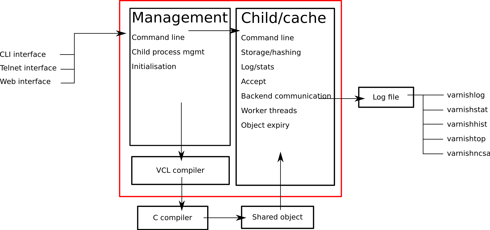
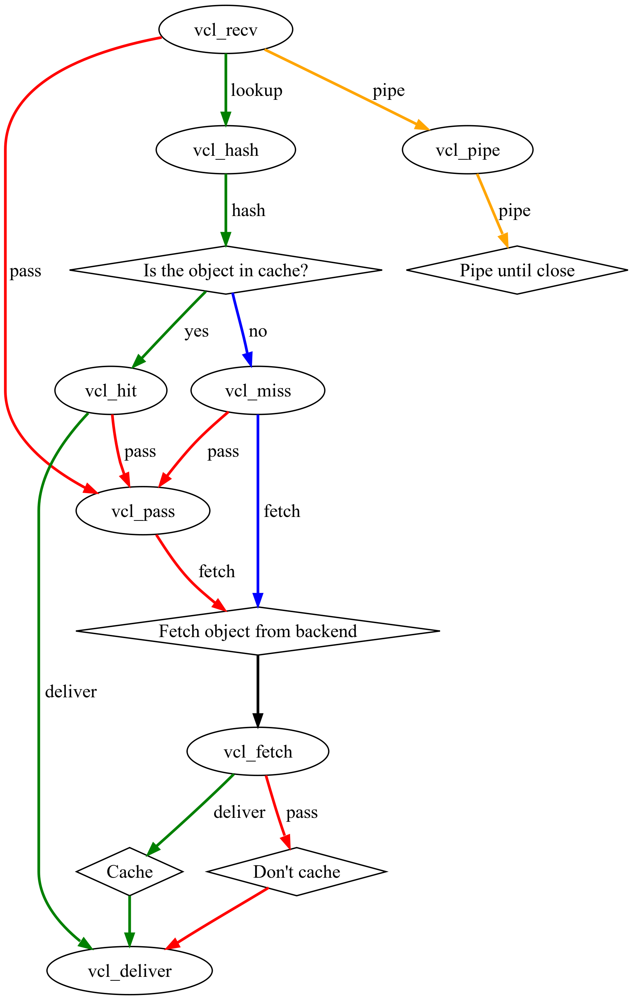

=============================
Varnish System Administration
=============================

.. include:: build/version.rst

..
  .. image:: img/logo.png
   :align: center

.. header::

   .. oddeven::

      .. class:: headertable

      +---+---------------------+----------------+
      |   |.. class:: centered  |.. class:: right|
      |   |                     |                |
      |   |Section ###Section###|Page ###Page### |
      +---+---------------------+----------------+

      .. class:: headertable

      +---------------+---------------------+---+
      |               |.. class:: centered  |   |
      |               |                     |   |
      |Page ###Page###|Section ###Section###|   |
      +---------------+---------------------+---+

.. sectnum::

.. raw:: pdf

    PageBreak

.. contents::
   :class: handout

.. raw:: pdf

   PageBreak oneColumn

Introduction
============

- About the course
- Goals and prerequisites
- Introduction to Varnish
- History
- Varnish 2.0 and Varnish 2.1

About the course
----------------

The course is essentially split in two:

1. Architecture, command line tools, installation, parameters, etc
2. The Varnish Configuration Language

The course has roughly 50% exercises and 50% instruction.

.. container:: handout

   The agenda is adjusted based on the progress made. There is usually
   ample time to investigate specific aspects of Varnish that may be of
   special interest to some of the participants.

   The exercises will occasionally offer multiple means to reach the same
   goals. Specially when you start working on VCL, you will notice that
   there are almost always more than one way to solve a specific problem,
   and it isn't necessarily given that the solution offered by the
   instructor or this course material is better than what you might come up
   with yourself.

   Always feel free to interrupt the instructor if something is unclear.

Goals and Prerequisites
-----------------------

Prerequisites:

- Some GNU/Linux/UNIX skills are expected
- Basic understanding of HTTP and related internet protocols

Goals:

- Thorough understanding of Varnish
- Understanding of how VCL works and how to use it

.. container:: handout

   The course is oriented around a GNU/Linux server-platform, but the
   majority of the tasks only require minimal knowledge of GNU/Linux.

   The course starts out by installing Varnish and navigating some of the
   common configuration files, which is perhaps the most UNIX-centric part
   of the course. Do not hesitate to ask for help.

   The goal of the course is to make you a better system administrator of
   Varnish and let you adjust Varnish to your exact needs. If you have any
   specific area you are particularly interested in, the course is usually
   flexible enough to make room for it.

Introduction to Varnish
-----------------------

- What is Varnish?
- Open Source / Free Software
- History
- Design Principles

.. container:: handout

   Varnish is a reverse proxy, sometimes referred to as a HTTP accelerator
   or a web accelerator.  It is designed for modern hardware, modern
   operating systems and modern work loads. This uncompromising philosophy
   has helped make Varnish a very clean and fast piece of software, able to
   scale and evolve to unexpected heights.

   At the same time, Varnish is flexible. The Varnish Configuration
   Language is a lighting fast mechanism that allows the developers to
   implement mechanisms which you as a user can turn into policy. Varnish
   has shown itself to work well both on large (and expensive) servers and
   tiny appliances.

   Varnish is also an open source project, or free software. The development
   process is public and everyone can submit patches, or just take a peak at
   the code if there is some unclarity as to how Varnish works. There is
   a community of volunteers who help each other and newcomers. The BSD
   license used by Varnish is the most restraint-free license among the
   free licenses, which conceptually makes it possible to use Varnish on
   non-free platforms, for example Solaris.

   Varnish is developed and tested on GNU/Linux and FreeBSD. The code-base
   is kept as self-contained as possible to avoid introducing out-side bugs
   and unneeded complexity.

   Varnish development is governed by the Varnish Governance Board (VGB),
   which thus far has not needed to intervene. The VGB consists of an
   architect, a community representative and a representative from Varnish
   Software. As of August 2010, the positions are filled by Poul-Henning
   Kamp (Architect), Artur Bergman (Community) and Kristian Lyngstøl
   (Varnish Software). On a day-to-day basis, there is little use to
   interfere with the general flow of development.

The history of Varnish
----------------------

- Initiated by VG, one of the largest newspapers in Norway, in 2006.
- Redpill Linpro performed Varnish development.
- Later development has been financed through service subscriptions
- Varnish Software was established in 2010 as an independent company to
  service the increasing commercial interest in Varnish.

.. container:: handout

        VG, a large Norwegian newspaper, initiated the Varnish-project in
        co-operation with Linpro. The lead developer, Poul-Henning Kamp is
        an experienced FreeBSD kernel-hacker and continues to bring his
        wisdom to Varnish in most areas where it counts.

        From 2006 throughout 2008, most of the development was sponsored by
        VG, API, Escenic and Aftenposten, with project-management,
        infrastructure and extra man-power provided by Redpill Linpro.

        Today Varnish Software is able to fund the core development with
        income from service agreements, in addition to offering development
        of specific features on a case-by-case basis.

        The interest in Varnish continue to increase on an almost daily
        basis.  An informal study based on the list of most popular web
        sites in Norway indicates that about 75% or more of the web traffic
        that originates in Norway is served through Varnish.

Varnish 2.0
-----------

- Released in October 2008.
- Edge Side Includes (ESI)
- Load balancing
- Backend health checks
- Grace - Controlled delivery of expired objects until a fresh copy is
  available

.. container:: handout

        Varnish implements a subset of the ESI Language 1.0 defined by W3C.
        This is based on what was deemed to be necessary at the time.

        Backend health checks, load balancing and grace all interact with
        each other in Varnish 2.0.5 allowing you to reduce the number of
        exposed error messages to almost zero even when your web servers
        are struggling heavily.

        The load balancing of Varnish allow you to define a number of web
        servers that Varnish should balance the traffic between, based on
        an algorithm you can specify. When health checks are enabled,
        Varnish will only direct traffic to web servers it knows is working
        correctly, and you can even tell Varnish to use otherwise expired
        content instead of giving an error message when all your web
        servers are marked as unhealthy.

Varnish 2.1
-----------

- Version 2.1 was released early in 2010.

- Persistent storage
- Improved purging mechanisms
- Saint mode

.. container:: handout

        Where Varnish 2.0 brought Varnish out of it's childhood, Varnish
        2.1 will make Varnish truly mature. Persistent storage will allow
        Varnish to keep it's cache - or most of it - when it's restarted.
        This will reduce the warm-up time in case of a system upgrade or
        crash.

        Most of the performance tweaks and the improved purging is already
        included in Varnish 2.0.5. With the new mechanism of purging, it is
        now possible to purge - or invalidate - objects based on any data
        that can be recognized in VCL. The smarter purging allows for more
        dynamic and application-oriented purging, instead of having to
        adapt your web application to Varnish.

        Saint Mode is a way of telling varnish to use an old object instead
        of the new version of the object. This allow you to check in VCL if
        you think what the web server just gave you is correct. For
        instance by checking if it is a "500 Internal Server Error", you
        can tell Varnish to not try to get this object again from this
        backend, then try again. If none of your backends are able to give
        you the desired result, Varnish can then use the old copy instead
        of serving an error message.

        Most of the performance tweaks that have been made are based on
        experiences either from the Varnish community or from customers of
        Varnish Software, and not on guess-work. The close co-operation
        between developers, users and customers ensures that the
        development is driven by the needs of those who use Varnish instead
        of having the developers try to guess what you as a user want.

        During the development cycle of Varnish, Varnish Software performs
        nightly builds and stress tests on the most current development
        version on Varnish to ensure that the performance and stability
        doesn't decline. In addition to this, the open development model
        allows anyone who's interested to grab the latest development
        version and try it out.

Architecture
============

- Design principles
- Process architecture

.. container:: handout

   The internal architecture of Varnish is of some interest, both because
   it is chiefly responsible for the performance you will be able to
   achieve with Varnish, and because it affects how you integrate Varnish
   in your own architecture.

   There are several aspects of the design that was unique to Varnish when
   it was originally implemented. Truly good solutions is the aim of
   Varnish, regardless of whether that means reusing ancient ideas or
   coming up with something radically different.

Design principles
-----------------

- Optimized for 64-bit - supports 32bit
- Optimized for multi-core/CPU
- Work with the kernel, not against it
- Innovate - not copy/paste

  - VCL, shared memory log, bheaps

- Make the fast-path really fast. Delegate.
- Solve real problems.

.. container:: handout

        The focus of Varnish has always been performance and flexibility.
        That has required some sacrifices.

        Varnish is designed for hardware that you buy today, not the hardware
        you bought 15 years ago. Varnish is designed to run on 64-bit
        architectures and will scale almost proportional to the number of CPU cores
        you have available. Though CPU-power is rarely a problem.

        If you choose to run Varnish on a 32-bit system, you are limited to 3GB
        of virtual memory, which puts a limit on the number of threads you can run
        and the size of your cache. This is a trade-off to gain a simpler design
        and reduce the amount of work Varnish needs to do.

        Varnish does not keep track of whether your cache is on disk or in
        memory. Instead, Varnish will request a large chump of memory and
        leave it to the operating system to figure out where that memory
        really is. The operating system can generally do a better job than
        a user-space program.

        Accept filters, epoll and kqueue are advanced features of the
        operating system that are designed for high-performance services
        like Varnish.

        In addition, Varnish uses a configuration language that is translated to
        C-code, compiled with a normal C compiler and then linked directly into
        Varnish at run-time. This has several advantages. The most practical of
        which is the freedom you get as a system administrator. You can use
        VCL to decide how you want to interface with Varnish, instead of
        having a developer try to predict every possible scenario. That it
        boils down to C and a C compiler also gives you very high
        performance, and if you really wanted to, you could by-pass the VCL
        to C translation and write raw C code (this is called in-line C in
        VCL). In short: Varnish provides the features, VCL allow you to
        specify exactly how you use and combine them.

        The shared memory log allows Varnish to log large amounts of
        information at almost no cost by having other applications parse
        the data and extract the useful bits. This reduces the
        lock-contention in the heavily threaded environment of Varnish.
        Lock-contention is one of the reasons why Varnish uses a
        workspace-oriented memory-model instead of only allocating the
        exact amount of space it needs at run-time.

        To summarize: Varnish is designed to run on realistic hardware
        under real work-loads and to solve real problems. Varnish does not
        cater to the "I want to make varnish run on my 486 just
        because"-crowd. If it does work on your 486, then that's fine, but
        that's not where you will see our focus. Nor will you see us
        sacrifice performance or simplicity for the sake of niche use-cases
        that can easily be solved by other means - like using a 64-bit OS.

Process Architecture
--------------------

The multi-process architecture:

.. class:: handout

The management process
......................

Varnish has two main process: the management process and the child process.
The management process apply configuration changes (VCL and parameters),
compile VCL, monitor Varnish, initialize Varnish and provides a command
line interface, accessible either directly on the terminal or through a
telnet interface.

By default, the management process polls the child process every few
seconds to see if it's still there. If it doesn't get a reply within a
reasonable time, the management process will kill the child and start it
back up again. The same happens if the child unexpectedly exits, for
example from a segmentation fault or assert error.

This ensures that even if Varnish does contain a critical bug, it will
start back up again fast. Usually within a few seconds, depending on the
conditions.

All of this is logged to syslog. This makes it crucially important to
monitor the syslog, otherwise you may never even know unless you look for
them, because the perceived downtime is so short.

.. note::

   Varnish Software and the Varnish community at large occasionally get
   requests for assistance in performance tuning Varnish that turn out to
   be crash-issues. Because the Varnish management thread starts the child
   up so fast, the users don't even notice the down time, only the extra
   loading time as Varnish is constantly emptying it's cache.

   This is easily avoidable by paying attention to syslog.

.. raw:: pdf

   PageBreak

.. class:: handout

The child process
.................

The child process is where the real magic goes on. The child process
consist of several different types of threads, including, but not limited
to:

- Acceptor thread to accept new connections and delegate them
- Worker threads - one per session. It's common to use hundreds of worker
  threads.
- Expiry thread, to evict old content from the cache

Varnish uses workspaces to reduce the contention between each thread when
they need to acquire or modify some part of the memory. There are multiple
work spaces, but the most important one is the session workspace, which is
used to manipulate session data. An example is changing "www.example.com"
to "example.com" before it is entered into the cache, to reduce the number
of duplicates.

It is important to remember that even if you have 5MB of session workspace
and are using 1000 threads, the actual memory usage is not 5GB. The virtual
memory usage will indeed be 5GB, but unless you actually use the memory,
this is not a problem. Your memory controller and operating system will
keep track of what you actually use.

To communicate with the rest of the system, the child process uses a shared
memory log accessible from the file system. This means that if a thread
needs to log something, all it has to do is grab a lock, write to a memory
area and then free the lock. In addition to that, each worker thread has a
cache for log data to avoid overly frequent locking.

The log file is usually about 90MB, and split in two. The first part is
counters, the second part is request data. To view the actual data, a
number of tools exist that parses the shared memory log. Because the
log-data is not meant to be written to disk in its raw form, Varnish can
afford to be very verbose. You then use one of the log-parsing tools to
extract the piece of information you want - either to store it permanently
or to monitor Varnish in real-time.

.. class:: handout

VCL compilation
...............

Configuring the caching policies of Varnish is done in the Varnish
Configuration Language (VCL). Your VCL is then interpreted by the
management process into to C and then compiled by a normal C compiler -
typically gcc. Lastly, it is linked into the running Varnish instance.

As a result of this, changing configuration while Varnish is running is
very cheap. Varnish may want to keep the old configuration around for a bit
in case it still has references to it, but the policies of the new VCL
takes effect immediately.

Because the compilation is done outside of the child process, there is
virtually no risk of affecting the running Varnish by accidentally loading
an ill-formated VCL.

Getting started
===============

::

    rpm -i libvarnish*.rpm
    rpm -i varnish*.rpm

::

    dpkg -i libvarnish*.deb
    dpkg -i varnish*.deb

A 64 bit environment is recommended for production.

 - Setting up a backend
 - Downloading the source
 - Compiling and installing

.. container:: handout

        You want to use packages for your operating system whenever possible,
        but today you can choose for yourself.

        If the computer you will be using throughout this course has Varnish
        2.0.3 or more recent available through the package system, you are
        encouraged to use that package if you do not feel you need the exercise
        in installing from source.

        We will be using usemod-wiki and apache2 throughout the course (among
        other things) as a backend. Usemod-wiki is a simple yet dynamic web
        application that is well-suited for testing. While you are welcome to
        choose something else, you should wait until the second day of training to
        set a real web-application as backend, due to the extra complications that
        are usually caused by cookies.

        .. tip::

           If you are missing dependencies on Debian or Ubuntu when using
           ``dpkg -i``, you can fetch them and finish the installation by
           running ``apt-get install -f``

Exercise: Installation
-------------------------

Install a backend:

1. Install "usemod-wiki" and "apache2"
2. Verify they work by going to "http://localhost/" and "http://localhost/cgi-bin/wiki.pl"
3. If it complains about "Bad page version (or corrupt page).", run ``sudo rm -r /var/lib/usemod-wiki/page``

Install Varnish:

- Either use ``apt-get install varnish`` for Ubuntu or Debian systems
- or ``yum install varnish`` for Red Hat-based systems.
- Ensure that you have at least Varnish 2.0.4 installed, if not, the
  instructor can provide binary packages. Or you can do a source install.

.. container:: handout

   For simplicity, we are using usemod-wiki and Apache for these exercises.
   usemod-wiki is a very simple wiki that works with little or no
   configuration on Ubuntu-systems.

   Using the Varnish packages provided by your distribution is often just
   as good as compiling from source. Alternatively, you can add the
   repository provided by Varnish Software, with the base URL of
   http://repo.varnish-software.com/.

   You can also just fetch the packages from the repo above and use the
   commands demonstrated in the previous section to install them.

   To compile from source, you can follow these instructions:

   1. Install "libncurses5-dev"
   2. Download Varnish from http://sourceforge.net/projects/varnish, or
      http://repo.varnish-software.com/ (for Varnish Software customers)
   3. Unpack in your ~
   4. Run ``./configure``
   5. ``make`` and ``sudo make install``

   .. tip::

      If you are on Debian-based system, you will need the
      `build-essential` package and you may want to run ``apt-get build-dep
      varnish``

Configuration
-------------

- Command line configuration
- Tunable parameters
- VCL

.. container:: handout

        Varnish has two conceptually different configuration sets. Tunable
        parameters and command line arguments are used to define how varnish should
        work with operating system and hardware in addition to setting some default
        values, while VCL define how Varnish should interact with web servers and
        clients.

        Almost every aspect of Varnish can be reconfigured without restarting
        Varnish. Notable exceptions are cache size and location, the username and
        group that Varnish runs as and hashing algorithm.

        While you can change the values, some changes might require restarting
        the child to take effect (modifying the listening port, for instance) or
        might not be visible immediately. Changes to how long objects are cached,
        for instance, usually only take effect after the currently cached objects
        expire and are fetched again.

Command line configuration
--------------------------

- "-a hostname:port" - listen address
- "-b hostname:port" - backend address
- "-f filename.vcl" - VCL
- "-p parameter=value" - set tunable parameters
- "-d" - debug
- "-d -d" - debug harder
- "-T hostname:port" - Telnet interface
- "-s storagetype,options" - where and how to store objects

.. container:: handout

        All the options that you can pass to the 'varnishd' binary are
        documented in the varnsihd manual page ("man varnishd"). You may
        want to take a moment to skim over the options mentioned above.

        The only option that is strictly needed to start Varnish is the -b
        option to specify a backend or the mutually exclusive -f to specify a VCL
        file. Note that you can not specify both -b and -f at the same time. Until
        you start working with VCL, use -b to tell Varnish where your web server
        is.

        Though they are not strictly required, you almost always want to specify
        a "-s" to select a storage backend, "-a" to make sure Varnish listens for
        clients on the port you expect and -T to enable a management interface,
        often referred to as a telnet interface.

        Both for -T and -a, you do not need to specify an IP, but can use ":80"
        to tell Varnish to listen to port 80 on all IPs available. Make sure you
        don't forget the colon, as "-a 80" will tell Varnish to listen to the IP
        with the decimal-representation "80", which is almost certainly not what
        you want. This is a result of the underlying function that accept this kind
        of syntax.

        You can specify -p for parameters multiple times. The workflow for
        tuning varnish parameters usually means that you first try the parameter on
        a running varnish through the management interface to find the value you
        want, then store it in a configuration file that will pass it to varnish
        with -p next time you start it up. We will look at these files later
        on.

Storage backends
----------------

- file
- malloc
- persistent (experimental)

.. container:: handout

        Varnish supports different methods of allocating space for the
        cache, and you choose which one you want with the '-s' argument.

        They approach the same basic problem from two different angles. With the
        "malloc"-method, Varnish will request the entire size of the cache with a
        malloc() (memory allocation) system call. The operating system will then
        divide the cache between memory and disk by swapping out what it
        can't fit in memory.

        The alternative is to use the "file" storage backend, which instead
        creates a file on a filesystem to contain the entire cache, then tell the
        operating system through the mmap() (memory map) system call to map the
        entire file into memory if possible.

        *The file storage method does not retain data when you stop or restart
        Varnish!* This is what persistent storage is for. While it might
        seem like that's what it would do, remember that Varnish does not
        know which parts of the cache is actually written to the file and
        which are just kept in memory. In fact, the content written to disk
        is likely going to be the least accessed content you have. Varnish
        will not try to read the content, though.

        While malloc will use swap to store data to disk, file will use
        memory to cache the data instead. Varnish allow you to choose
        between the two because the performance of the two approaches have
        varied historically.

        The persistent storage backend is similar to file, but only
        released in an experimental state. It does not yet gracefully
        handle situations where you run out of space. We only recommend
        using persistent if you have a large amount of data that you must
        cache and are prepared to work with us to track down bugs.

        When choosing storage backend, the rule of thumb is to use malloc if
        your cache will be contained entirely or mostly in memory, while the file
        storage backend performs far better when you need a large cache that
        exceeds the physical memory available. This might vary based on the kernel
        you use, but seems to be the case for 2.6.18 and later Linux kernel, in
        addition to FreeBSD.

Exercise: Start Varnish
-----------------------

1. Start Varnish, in debug mode, with the telnet interface on port 1234,
   HTTP listening on ``:8000``, with ``127.0.0.1:80`` as the backend

Exercise: Start Varnish - solution
----------------------------------

::

        varnishd -b 127.0.0.1:80 -a :8000 -T :1234 -d

.. container:: handout

        Did you remember the colon?

        To see the difference between "-d" and "-d -d", try starting Varnish
        with -d, then hitting "Ctrl-d". This should drop you back to your shell.
        Now run "ps aux | grep varnish" to see if Varnish is running, then try it
        again with "-d -d". Did you see the difference?

Exercise: Controlling Varnish using telnet
------------------------------------------

- Telnet to ``localhost`` port ``1234``
- Type ``help``
- Find out what the parameter ``default_ttl`` is set to.

.. container:: handout

   The telnet interface - or management interface - is a powerful tool for
   administrating Varnish. Through it you can change most aspect of
   Varnish.

   One important concern that regards the telnet interface is security.
   Because the telnet interface is not encrypted, does not have
   authenticate and still allows almost total control over Varnish, it is
   important to protect it. The easiest way of doing that is by having it
   only listen to localhost (127.0.0.1). An other possibility is firewall
   rules to only allow specific (local) users to connect.

   It is also possible to protect the telnet interface through a shared
   secret, but this makes it impossible to use it without also using
   varnishadm. At the time being, it is reserved for certain scripts. It
   may become a default in the future.

Exercise: Fetch data through Varnish
------------------------------------

- Type ``start`` in the telnet or CLI interface
- Install ``libwww-perl``
- Do ``GET -Used http://localhost:8000/`` (on the command
  line)
- Wait about five seconds
- Repeat the ``GET`` above and compare the results

.. container:: handout

        GET and HEAD is actually the same tool; lwp-request. A HTTP HEAD request
        tells the web server - or Varnish in this case - to only reply with the
        HTTP headers, while GET returns everything.

        "GET -Used" tells lwp-request to do a GET-request, print the request
        headers (U), print the response status code (s), which is typically "200
        OK" or "404 File not found", print the response headers "-e" and finally to
        not display the content of the response. Feel free to try remove some of
        the options to see the effect.

        GET is also useful to generate requests with custom headers, as you can
        supply extra headers with -H "Header: value", which can be used multiple
        times.

        You may also be familiar with firebug, an add-on for Firfox used for web
        development and related affairs. This too can show you the response
        headers.

        One thing you will discover soon is that web browsers tend to have their
        own cache which you may not immediately be able to tell if you're using or
        not, so always double-check with GET or HEAD if you are in doubt if what
        you're seeing is coming from Varnish or is part of your browser cache.

Defining a backend in VCL
-------------------------

/etc/varnish/default.vcl

.. code-block:: text
   :include: vcl/backend.vcl

.. container:: handout

   You almost always want to use VCL: we might as well get started!

   The above example defines a backend named `default`. The name "default"
   is not special, and the real default backend that Varnish will use is
   the first backend you specify.

   You can specify many backends at the same time.

Exercise: Define a backend with VCL
-----------------------------------

1. Edit the startup script configuration for varnish:
  
  - On Red Hat or CentOS: /etc/sysconfig/varnish
  - On Debian or Ubuntu: /etc/default/varnish

2. Remove the ``-b localhost:80`` option.
3. Make sure there is a ``-f /etc/varnish/default.vcl`` startup argument.
4. Edit `/etc/varnish/default.vcl` to add your Apache server as the only
   backend.

.. container::

   Most of the time, you use VCL to configure backends for Varnish, and
   in this exercise, we set it up.

   You can chose a different location than `/etc/varnish/default.vcl` if
   you wish to.

   .. warning::

      The script-configuration (located in `/etc/sysconfig` or
      `/etc/default`) is directly sourced as a shell script. Pay special
      attention to any backslashes (\\) and quotation marks that might move
      around as you edit the DAEMON_OPTS environmental variable.

   Example `/etc/default/varnish` snippet, comments removed::

        NFILES=131072
        MEMLOCK=82000
        INSTANCE=$(uname -n)
        DAEMON_OPTS="-a :6081 \
                     -T localhost:6082 \
                     -f /etc/varnish/default.vcl \
                     -s file,/var/lib/varnish/$INSTANCE/varnish_storage.bin,1G"

Tunable parameters
==================

- In the CLI::

        param.show -l

- Don't fall for the copy/paste tips

.. container:: handout

        Varnish has many different parameters which can be adjusted to make
        Varnish act better under specific workloads or with specific software and
        hardware setups. They can all be viewed with "param.show" in the management
        interface and set with the "-p" option passed to varnish - or directly in
        the management interface.

        Remember that changes made in the management interface are not stored
        anywhere, so unless you store your changes in a startup script, they will
        be lost when Varnish restarts.

        The general advice with regards to parameters is to keep it simple. Most
        of the defaults are very good, and even though they might give a small
        boost to performance, it's generally better to use safe defaults if you
        don't have a very specific need.

Threads
-------

- Threads
- Thread pools can safely be ignored
- Maximum: Roughly 5000
- Start them sooner rather than later
- The maximum and minimum number of threads are on different scales!

.. class:: handout

Details of threading parameters
...............................

While most parameters can be left to the defaults, the one big exception
is number of threads.

Since Varnish will use one thread for each session, the number of
threads you let Varnish use is directly proportional to how many
requests Varnish can serve concurrently.

The available parameters directly related to threads are::

        thread_pool_add_delay      20 [milliseconds]
        thread_pool_add_threshold  2 [requests]
        thread_pool_fail_delay     200 [milliseconds]
        thread_pool_max            500 [threads]
        thread_pool_min            5 [threads]
        thread_pool_purge_delay    1000 [milliseconds]
        thread_pool_stack          unlimited [bytes]
        thread_pool_timeout        300 [seconds]
        thread_pools               2 [pools]
        thread_stats_rate          10 [requests]

Out of all of these, the two most important are thread_pool_min and
thread_pool_max. The thread_pools parameter is also of some importance, but
mainly because it is used to calculate the real number of minimum threads.

Varnish splits the threads into multiple pools of threads, the theory being
that if we only had one thread pool, it might become a contention point in
a massively multi-tasked environment. In the past, the rule of thumb was to
have roughly one thread pool for each CPU core. Experience has shown us
that the importance of multiple thread pools was exaggerated, though, and
there is little measurable difference between running with one thread pool
and eight thread pools on a eight-core machine. This holds true even under
heavy load.

So for the sake of keeping things simple, the current best practice is to
leave thread_pools at the default (2).

.. class:: handout

Number of threads
.................

The threading model of Varnish allows it to start and stop threads based on
demand. Time has shown us that this, too, was perhaps a bit unnecessary.
On a normal 64-bit system, there is little practical difference between
having 10 threads available and having 1000 threads available. However,
leaving the minimum amount of threads too low will result in a delay when
Varnish has to start new threads. The actual delay is likely going to be
unnoticeable to the user, but since there is virtually no extra cost of
keeping a few hundred extra threads around, it's generally advisable to
tune Varnish to always have a few spare threads.

The thread_pool_min parameter defines how many threads will be running
for each thread pool even when there is no load. Notice that, unlike
thread_pool_max, the thread_pool_min parameter has to be multiplied by
thread_pools (2, by default) to get the total number of minimum threads
running.

The defaults of a minimum of 5 threads per thread pool, a maximum of 500
threads total and 2 thread pools, will result in:

- At any given time, at least 10 worker threads will be running
- No more than 500 threads will run.

In other words:

- Minimum threads running = thread_pools * thread_pool_min
- Maximum threads running = thread_pool_max

In the past, there was a natural limit to how many threads Varnish could
use, but this has been removed. Still, we rarely recommend running with
more than 5000 threads. If you seem to need more than 5000 threads, it's
very likely that there is something not quite right about your setup, and
you should investigate elsewhere before you increase the maximum value.

For minimum, it's common to operate with 500 to 1000 threads minimum
(total). You can observe if this is enough through varnishstat, by looking
at the 'overflowed work requests' over time. It should be fairly static
after startup.

.. class:: handout

Timing thread growth
....................

When Varnish was initially written, it was revealed that certain operating
system kernels did not take kindly to a process trying to start a thousand
threads instantly. To avoid this, a delay between adding threads was added.
This is tunable through ``thread_pool_add_delay``. If you follow the best
practice of always having enough threads available, this isn't a problem
for normal operation. However, during initial startup, when Varnish may
have to start a thousand threads, waiting 20ms (per pool) between each new
thread is a long time to wait.

Today, there is little risk involved in reducing the thread_pook_add_delay
to 1ms. It will, however, reduce the startup time of 1000 threads over 2
pools from 10 seconds to half a second.

There are a few, less important parameters related to thread timing. The
thread_pool_timeout is how long a thread is kept around when there is no
work for it before it is removed. This only applies if you have more
threads than the minimum, and is rarely changed.

An other is the thread_pool_fail_delay, which defines how long to wait
after the operating system denied us a new thread before we try again.

System
------

- sess_workspace - incoming HTTP header workspace (from client)
- Common values range from 16kB to 10MB
- ESI typically requires exponential growth
- Pre 2.1: obj_workspace.
- Remember: It's all virtual - not physical memory.

.. container:: handout

        Workspaces are some of the things you can change with parameters. The
        session workspace is how much memory is allocated to each HTTP session for
        things like string manipulation of incoming headers. It is also
        used to modify the object returned from a web server before the
        precise size is allocated and the object is stored read-only.

        Some times you may have to increase the session workspace to avoid
        running out of workspace. We will talk more about this when we get
        to troubleshooting.

        As most of the parameters can be left unchanged, we will not go through
        all of them, but take a look at the list "param.show" gives you to get an
        impression of what they can do.

Timers
------

Backend:

- connect_timeout - OS/network latency
- first_byte_timeout - Page generation?
- between_bytes_timeout - Hiccoughs?

Client:

- send_timeout - Client-in-tunnel
- sess_timeout - keep-alive timeout

Mangement:

- cli_timeout - Management thread->child

.. container:: handout

        The timeout-parameters are generally set to pretty good defaults, but
        you might have to adjust them for strange applications. The connection
        timeout is tuned for a geographically close web server, and might have to
        be increased if your Varnish server and web server are not close.

        Keep in mind that the session timeout affects how long sessions are kept
        around, which in turn affects file descriptors left open. It is not wise to
        increase the session timeout without taking this into consideration.

        The "cli_timeout" is how long the management thread waits for the worker
        thread to reply before it assumes it's dead, kills it and starts it back
        up. For real loads, the default is very good, but if you manage to starve
        Varnish on CPU, it might be a bit low. After the default was increased to
        10s in Varnish 2.0.4, there have been no reports that indicates that it's
        insufficient on production servers.

Exercise: Tune first_byte_timeout
---------------------------------
  
1. Create a small CGI script in /usr/lib/cgi-bin/test.cgi containing::

        #! /bin/sh
        sleep 5
        echo "Content-type: text/plain"
        echo "Cache-control: max-age=0"
        echo
        echo "Hello world"

2. Make it executable
3. Test that it works outside of Varnish
4. Start Varnish, test that it works through Varnish
5. Set ``first_byte_timeout`` to 2s
6. Check that it doesn't work.

Programs
========

- varnishlog
- varnishncsa
- varnishstat
- varnishhist
- varnishtop
- varnishsizes
- varnishadm

.. container:: handout

   Varnish provides several tools to help monitor and control Varnish. The
   varnishadm tool is the only one that can affect a running instance of
   Varnish, as it is a convenience program to talk to the telnet interface.

   All the other tools, however, operate exclusively on the shared memory
   log, or shmlog as it's called in the context of Varnish. They all take
   similar (but not necessarily identical) commands, and use the same
   underlying API to parse the log.

   Among the log-parsing tools, varnishstat is so far unique in that it
   only looks at counters. The counters are easily found in the shmlog, and
   are typically polled at  reasonably frequent interval, to give the
   impression of real-time updates.

   The rest of the tools, however, work on the round robin part of the
   shmlog, which deals with specific requests. Since the shmlog provides
   large amounts of information, it is usually necessary to filter it. But
   that does not just mean "show me everything that matches X". The most
   basic log tool, varnishlog, will do precisely that. The rest of the
   tools, however, can process the information further and display running
   statistical information.

varnishlog
----------

::

   97 ReqStart     c 10.1.0.10 50866 117511506
   97 RxRequest    c GET
   97 RxURL        c /style.css
   97 RxProtocol   c HTTP/1.1
   97 RxHeader     c User-Agent: Mozilla/5.0 (Windows; U; Windows NT \
        6.0; nb-NO; rv:1.9.1b1) Gecko/20081007 Firefox/3.1b1
   97 RxHeader     c Accept: text/css,*/*;q=0.1
   97 RxHeader     c Accept-Charset: ISO-8859-1,*,utf-8
   97 RxHeader     c Accept-Encoding: gzip,deflate,bzip2
   97 RxHeader     c Host: www.example.com
   97 RxHeader     c Connection: Keep-Alive
   97 VCL_call     c recv lookup
   97 VCL_call     c hash hash
   97 Hit          c 117505004
   97 VCL_call     c hit deliver
   97 Length       c 3218
   97 VCL_call     c deliver deliver
   97 TxProtocol   c HTTP/1.1
   97 TxStatus     c 200
   97 TxResponse   c OK
   97 TxHeader     c Server: Apache/2.2.8 (Ubuntu)
   97 TxHeader     c Last-Modified: Fri, 21 Nov 2008 13:49:20 GMT
   97 TxHeader     c ETag: "210215-c32-45ca34fd121800"
   97 TxHeader     c Content-Type: text/css
   97 TxHeader     c Content-Length: 3218
   97 TxHeader     c Date: Sat, 22 Aug 2008 01:10:10 GMT
   97 TxHeader     c X-Varnish: 117511501 117505004
   97 TxHeader     c Age: 2
   97 TxHeader     c Via: 1.1 varnish
   97 TxHeader     c Connection: keep-alive
   97 ReqEnd       c 117511501 1227316210.534358978 \
        1227316210.535176039  0.035283089 0.000793934 0.000023127

.. container:: handout

   As you can see, the above input is quite extensive. The above output is
   a single cache hit, as processed by Varnish. If you are dealing with
   several thousand requests per second, it is impossible to review all
   that information.

   The displayed data is categorized as follows:

   1. The number on the left is a semi-unique identifier of the request. It
      is used to distinguish different requests.
   2. Each piece of log information belongs to a tag, as seen on the second
      left-most column. TxHeader, RxHeader, VCL_call etc. You can later use
      those tags for intelligent filtering.
   3. Varnishlog will try to decipher if a request is related to a client
      (c), backend (b) or "misc" (-). This can be used to filter the log.
      The misc-category will contain data related to thread-collection,
      object expiry and similar internal data.

varnishlog options
------------------
-  -b -- only show traffic to backend
-  -c -- only show traffic to client
-  -o -- group by request

.. container:: handout

   Some options of note are:

   ``-n <name>``
        The name of the varnish instance, or path to the shmlog. Useful for
        running multiple instances of Varnish.

   ``-o``
        Group data from the same request together.

   ``-b``
        Only show traffic related to a backend

   ``-c``
        Only show traffic related to a client

   ``-i <tag>``
        Only show one tag.

   ``-I <regex>``
        Filter the tag provided by -i, using the regular expression for -I.

   ``[<tag> <filter>]``
        Show *requests* where the <tag> matches <filter>. Example:
        ``varnishlog -c -o TxStatus 500`` to show requests returned to a
        client with status code 500.

   .. warning::

      varnishlog sometimes accept arguments that are technically
      incorrect, which can have surprising results on filtering. Make sure
      you double-check the filter logic, and always use -o. You most likely
      want to specify -b or -c too.

   .. tip::

      Many of the arguments above are valid for most of the other tools
      too. Try them out!

varnishtop
----------

::

        varnishtop -i TxStatus

          list length 6                                                          hostname

          3864.45 TxStatus       200
          1001.33 TxStatus       304
            33.93 TxStatus       301
             3.99 TxStatus       302
             3.00 TxStatus       404
             1.00 TxStatus       403

- Group tags and tag-content by frequency
- Often underrated

.. container:: handout

        Varnishtop groups tags and the content of the tag together to
        generate a sorted list of the most frequently appearing
        tag/tag-content pair.

        Because the usefulness is only visible once you start filtering, it
        is often overlooked. The above example lists status codes that
        Varnish returns.

        Two of the perhaps most useful variants of varnishtop is:

        - ``varnishtop -i TxUrl`` creates a list of URLs requested from a web
          server. Use this this find out what is causing back-end traffic
          and start hitting items on the top of the list.
        - ``varnishtop -i TxStatus`` lists what status codes Varnish returns
          to clients. (As shown above)

        Some other possibly useful examples are:

        - ``varnishtop -i RxUrl`` displays what URLs are most frequently
          requested from a client.
        - ``varnishtop -i RxHeader -I 'User-Agent:.*Linux.*'`` lists
          User-Agent headers with "Linux" in it (ie: most used Linux web
          browsers, that report them self as Linux).
        - ``varnishtop -i RxStatus`` will list status codes received from a
          web server.
        - ``varnishtop -i VCL_call`` shows what VCL functions are used.

varnishncsa
-----------

10.10.0.1 - - [24/Aug/2008:03:46:48 +0100] "GET \
http://www.example.com/images/foo.png HTTP/1.1" 200 5330 \
"http://www.example.com/" "Mozilla/5.0"

.. container:: handout

   If you already have tools in place to analyze Apache-like logs (NCSA
   logs), varnishncsa can be used to print the shmlog as ncsa-styled log.

   Filtering works similar to varnishlog. Unfortunately, you can not
   customize the output of varnishncsa as of Varnish 2.1.3.

varnishstat
-----------

::

    0+00:44:50                                                   foobar
    Hitrate ratio:       10      100      175
    Hitrate avg:     0.9507   0.9530   0.9532

          574660       241.00       213.63 Client connections accepted
         2525317       937.00       938.78 Client requests received
         2478794       931.00       921.48 Cache hits
            7723         3.00         2.87 Cache hits for pass
          140055        36.00        52.07 Cache misses
           47974        12.00        17.83 Backend conn. success
          109526        31.00        40.72 Backend conn. reuses
           46676         5.00        17.35 Backend conn. was closed
          156211        41.00        58.07 Backend conn. recycles
          110500        34.00        41.08 Fetch with Length
           46519         6.00        17.29 Fetch chunked
             456         0.00         0.17 Fetch wanted close
            5091          .            .   N struct sess_mem
            3473          .            .   N struct sess
           53570          .            .   N struct object
           50070          .            .   N struct objecthead
              20          .            .   N struct vbe_conn
             186          .            .   N struct bereq
            1200          .            .   N worker threads
            1200         0.00         0.45 N worker threads created
            2526         0.00         0.94 N overflowed work requests
               8          .            .   N backends
           84929          .            .   N expired objects
         1002104          .            .   N LRU moved objects

.. container:: handout

   varnishstat gives a good representation of the general health of
   Varnish, including cache hit rate, uptime, number of failed backend
   connections and many other statistics.

   As of Varnish 2.1.3, there are close to a hundred different counters
   available. To increase the usefulness of varnishstat, only counters with
   a value different from 0 is shown by default.

   Varnishstat can be executed either as a one-shot tool which simply
   prints the current values of all the counters, using the '-1' option, or
   interactively. Both methods allow you to specify specific counters using
   '-f field1,field2,...' to limit the list.

   In interactive mode, varnishstat starts out by printing the uptime(45
   minutes, in the example above) and hostname(foobar).

   The "Hitrate ratio" and "Hitrate avg" are related. The Hitrate average
   measures the cache hit rate for a period of time stated by "hitrate
   ratio". In the example above, the hitrate average for the last 10
   seconds is 0.9507 (or 95.07%), 0.9530 for the last 100 seconds and
   0.9532 for the last 1000 seconds. As you start Varnish, all of these
   will start at 1 second, then grow to 10, 100 and 1000. This is because
   varnishstat has to compute the average while it is running; there is no
   historic data of counters available.

   The bulk of varnishstat is the counters. The left column is the raw
   value, the second column is "change per second in real time" and the
   third column is "change per second on average since Varnish started". We
   can see on the above example that it has served 574660 requests and is
   currently serving roughly 241 requests per second.

   Some counters do not have 'per second' data. These are counters which
   both increase and decrease.

   We will look at the specific counters in more detail when we investigate
   monitoring and troubleshooting Varnish. There are, however, far too many
   counters to keep track of for non-developers, and many of the counters
   are only there for debugging purposes. This allows you to provide the
   developers of Varnish with real and detailed data whenever you run into
   a performance issue or bug. It allows us, the developers, to test ideas
   and get feedback on how it works in production environments without
   creating specific "test versions" of Varnish. In short: It allows
   Varnish to be developed according to how it is used.

   .. note::

      If you suddenly see varnishstat counters restarting, this probably
      means that varnish restarted. Check your syslog!

   .. note::

      You may have to specify an ``-n`` option to read the stats for the
      correct Varnish instance if you have multiple instances.

varnishhist
-----------

::

        1:100, n = 2000                                    northpole

                |
                |
                |
                | |               #
               || |               #
               ||||               ##
               ||||    #          ##
               |||||   ##       #####  #     #
        +-----+-----+-----+-----+-----+-----+-----+-----+-----

Exercise: Try the tools
-----------------------

- Send a few requests to Varnish using ``GET -e http://localhost:8000``
- verify you have some cached objects using ``varnishstat``
- look at the communication with the clients, using ``varnishlog``.
  Try sending various headers and see them appear in varnishlog.
- Install ``siege``
- Run siege against localhost while looking at varnishhist

VCL
===

- Syntax borrowed from C and Perl
- Domain-specific
- No loops, no variables
- Add as little or as much as you want

.. container:: handout

   The Varnish Configuration Language (VCL) is used to describe the caching
   policy in use. The VCL file for varnish is also called VCL, so when we
   speak of "the VCL", it is likely the actual configuration used, as
   specified using the Varnish Configuration Language.

   VCL is driven by a state engine, and defines how a single request is
   handled. All requests will go through the VCL state engine.

   Defining VCL is optional, as Varnish comes with a default VCL that is
   always present. Even if you define your own VCL, the default VCL is
   still present. The default is simply added at the bottom of your own.
   That means you can add just a one line of VCL if you like, and let the
   default VCL do the rest. Or you can specify an extensive VCL and
   terminate the relevant VCL function before it reaches the default VCL.
   It's all up to you.

   Technically, VCL is translated to C code, compiled with a normal C
   compiler and linked into Varnish. If there is something that you can not
   do with normal VCL, it is possible to implement it using in-line C
   instead, which is a way of by-passing the VCL to C conversion, and just
   enter the C code directly. That, however, is far beyond the scope of
   this course, and left intentionally undocumented as it is part of
   programming Varnish, not configuring it.

VCL - syntax
------------

- # and /\* foo \*/ for comments
- sub $name functions
- No variables (almost true)
- Terminating statements, no return values

.. container:: handout

   If you have worked with a programing language or two before, the basic
   syntax of Varnish should be reasonably straight forward. It is inspired
   mainly by C and Perl.

   The functions of VCL are not true functions in the sense that they
   accept variables and return values. To send data inside of VCL, you will
   have to hide it inside of HTTP headers.

   The "return" statement of VCL returns control from the VCL state engine
   to Varnish. If you define your own function and call it from one of the
   default functions, typing "return(foo)" will not return execution from
   your custom function to the default function, but return execution from
   VCL to Varnish. That is why we say that VCL has terminating statements,
   not traditional return values.

   For each domain, you can return control to Varnish using one or more
   different return values. These return statements tell Varnish what to do
   next. Examples include "look this up in cache", "do not look this up in
   the cache" and "generate an error message".

VCL - request flow
------------------

- `Simplified request flow `_
- `Complete request flow `_

.. class:: handout

.. raw:: pdf

    PageBreak

.. class:: handout

Detailed request flow
.....................

.. image:: img/request.png
   :align: center
   :height: 2235px

VCL - functions
---------------

- regsub(str, regex, sub)
- regsuball(str, regex, sub)
- purge_hash(regex)
- purge_url(regex)
- purge(expression)
- restart

VCL - vcl_recv
--------------

- Executed right after the initial request is parsed.
- Normalizes client-data
- Decides caching-policy based on client data (ie: request method, URL, etc)

Default::

        sub vcl_recv {
            if (req.request != "GET" &&
              req.request != "HEAD" &&
              req.request != "PUT" &&
              req.request != "POST" &&
              req.request != "TRACE" &&
              req.request != "OPTIONS" &&
              req.request != "DELETE") {
                /* Non-RFC2616 or CONNECT which is weird. */
                return(pipe);
            }
            if (req.request != "GET" && req.request != "HEAD") {
                /* We only deal with GET and HEAD by default */
                return(pass);
            }
            if (req.http.Authorization || req.http.Cookie) {
                /* Not cacheable by default */
                return(pass);
            }
            return(lookup);
        }

VCL - vcl_recv - return codes
-----------------------------

- error $code [reason]
- pass
- pipe
- lookup

VCL - vcl_hash
--------------

- Defines what is unique about a request.
- Executed directly after vcl_recv, assuming "lookup" was requested

::

        sub vcl_hash {
            set req.hash += req.url;
            if (req.http.host) {
                set req.hash += req.http.host;
            } else {
                set req.hash += server.ip;
            }
            return(hash);
        }

VCL - vcl_hit
-------------

- Right after an object has been found (hit) in the cache
- You can change the TTL, but nothing else.
- Often used to throw out an old object

::

        sub vcl_hit {
            if (!obj.cacheable) {
                return(pass);
            }
            return(deliver);
        }

VCL - vcl_miss
--------------

- Right after an object was looked up and not found in cache
- Typically only used to avoid sending "PURGE" requests to a backend

::

        sub vcl_miss {
            return(fetch);
        }

VCL - vcl_fetch
---------------

- Varnish just got the object from the web server
- Decide whether to cache or not and how long based on the data returned

::

    if (!beresp.cacheable) {
        return(pass);
    }
    if (beresp.http.Set-Cookie) {
        return(pass);
    }
    return(deliver);

VCL - vcl_deliver
-----------------

- Common last exit point for all (except vcl_pipe) code paths
- Often used to add and remove debug-headers

::

        sub vcl_deliver {
            return(deliver);
        }

VCL - vcl_error
---------------

- Used to generate content from within Varnish, without talking to a web
  server
- Error messages go here by default
- Other use cases: Redirecting users (301/302 Redirects)

::

        sub vcl_error {
            set obj.http.Content-Type = "text/html; charset=utf-8";
            synthetic {"
        <?xml version="1.0" encoding="utf-8"?>
        <!DOCTYPE html PUBLIC "-//W3C//DTD XHTML 1.0 Strict//EN"
         "http://www.w3.org/TR/xhtml1/DTD/xhtml1-strict.dtd">
        <html>
          <head>
            <title>"} obj.status " " obj.response {"</title>
          </head>
          <body>
            <h1>Error "} obj.status " " obj.response {"</h1>
            
"} obj.response {"

            <h3>Guru Meditation:</h3>
            
XID: "} req.xid {"

            <address>
               <a href="http://www.varnish-cache.org/">Varnish</a>
            </address>
          </body>
        </html>
        "};
            return(deliver);
        }

VCL - variables
---------------

- req.* - request
- req.http.* - request HTTP headers
- req.backend - which backend to use
- obj.* - object
- obj.http.* - object HTTP headers
- obj.ttl - lifetime of the object
- obj.status - HTTP status code
- beresp.* - backend response, before it's made into an object
- resp.* - response
- resp.http.* - response HTTP headers

Exercise: VCL - backend
-----------------------

- Write a VCL containing just a backend.  Test that it works.

Solution: VCL - backend
-----------------------

::

        backend default {
                .host = "localhost";
                .port = "80";
        }

Exercise: VCL - set ttl
-----------------------

- Write a VCL setting the TTL of all objects to 10s.  Check that
  it works.

Solution: VCL - backend
-----------------------

::

        sub vcl_fetch {
            set beresp.ttl = 10s;
        }

.. container::

   There are multiple ways to verify if this works.

   - Using GET, or a similar tool, monitor the Age: header as you reload
     the same URL. It should reset to 0 seconds after it hits 10.
   - Look for the TTL tag in varnishlog. It should read VCL .. 10 .. when
     the object is fetched from the web server, indicating that it is
     cached for 10 second, as per VCL.
   - Monitor backend traffic, either using varnishlog or viewing logs on
     the web server to see when Varnish asks for the same object.
   - Count. Watch the X-Varnish header, and count how it takes between each
     time it only has one number.
   - Use varnishstat to see when the cache_miss counter increases (assuming
     there is no other traffic than your test-traffic.)
   - ?

Exercise: VCL - avoid caching a page
------------------------------------

- Write a VCL which avoids caching wiki.pl at all.

Solution: VCL - avoid caching a page
------------------------------------

::

        sub vcl_fetch {
            if (req.url ~ "wiki\.pl") { return(pass); }
        }

Or::

        sub vcl_recv {
            if (req.url ~ "wiki\.pl") { return(pass); }
        }

.. container:: handout

   The above examples are both valid.

   It is usually most convenient to do as much as possible in `vcl_recv`,
   and this is no exception. Even though using pass in `vcl_fetch` is
   reasonable, it creates a hitpass object, which can create unnecessary
   complexity. Whenever you do use pass in `vcl_fetch`, you should also
   make it a habit to set the ``beresp.ttl`` to a short duration, to avoid
   accidentally adding a hitpass object that prevents caching for a long
   time.

Exercise: VCL - respect no-cache from the client
------------------------------------------------

- Write a VCL which refreshes the page from the backend if the
  request contains ``Cache-control: no-cache``

.. container:: handout

   While solving this task, keep in mind that not all client send
   ``no-cache`` when they do refreshes or forced refreshes. Some will use
   max-age=0 instead for example.

   .. warning::

      This is a feature that often seem like a very good idea, specially if
      it is combined with limiting it to only a specific IP range, for
      example the editorial staff.

      The problem with this feature appears the moment you have more than
      one Varnish server. Most likely, only one of many Varnish servers
      will then be refreshed.

Solution: VCL - respect no-cache from the client
------------------------------------------------

::

        sub vcl_hit {
            if (req.restarts == 0 &&
                req.http.cache-control ~ "no-cache") {
               set obj.ttl = 0s;
               restart;
            }
        }

Or::

        sub vcl_hit {
            if (req.restarts == 0 &&
                req.http.cache-control ~ "no-cache") {
               purge("req.url == " req.url);
               restart;
            }
        }

.. container:: handout

   The purge() command has not yet been introduced, but is included as an
   example that there are more than one way to solve the specific task.

   .. warning::

      Using purge() and restart as demonstrated above is sub-optimal. You
      can safely do it in `vcl_recv` instead.

   .. warning::

      Setting ttl to 0 seconds is an efficient way of removing specific
      objects. This is commonly done as a result of a script, for example a
      script that issues a PURGE method. When that is the case, it is
      important to remember that Varnish might have different variants of
      the same objects stored.

      The typical example is one or more variants that are compressed, and
      one that is uncompressed. Setting the ttl to 0 seconds in vcl_hit
      does not address that: The calling script will have to generate one
      request for each possible variant.

Exercise: VCL - remove all cookies
----------------------------------

- Write a VCL which removes all cookies from the request as well as
  any set-cookie headers from the backend, but this only for jpeg and
  CSS files.

Solution: VCL - remove all cookies
----------------------------------

::

        sub vcl_recv {
            if (req.url ~ "\.(jpg|jpeg|css)$") {
                remove req.http.cookie;
            }
        }

        sub vcl_fetch {
            if (req.url ~ "\.(jpg|jpeg|css)$") {
                remove beresp.http.set-cookie;
            }
        }

.. container:: handout

   When you deal with Cookies, there are two different aspects you have to
   consider.

   First is the Cookie that the client sends to Varnish. This will be
   whatever the browser stored for that site. It can include google
   analytics cookies, old cookies that are no longer needed and just about
   anything else.

   The second set of cookie-headers is those sent by the web server, using
   the "Set-Cookie" header. These are instructions from the web-server to
   the client to store a cookie.

   Both has to be addressed one way or the other, and the above example
   does that.

Exercise: VCL - add header showing hit/miss
-------------------------------------------

- Write a VCL which adds a header telling you if this is a hit or
  a miss, and the number of hits if it's a hit

.. container:: handout

   .. warning::

      Many of the first implementations of a hit/miss header used the
      vcl_hit and vcl_miss functions, as they seemed the obvious choices.
      However, because multiple clients can get the same object at the same
      time, it is not safe to modify the object in vcl_hit, save for
      changing the TTL. It was possible in Varnish 2.0, but would cause
      crashes during heavy load.

      To solve this, the ``obj.hits`` variable is accessible in
      vcl_deliver.

Solution: VCL - add header showing hit/miss
-------------------------------------------

::

        sub vcl_deliver {
                if (obj.hits > 0) {
                        set resp.http.X-Cache = "HIT";
                        set resp.http.X-Cache-Hits = obj.hits;
                } else {
                        set resp.http.X-Cache = "MISS";
                }
        }

.. container:: handout

   vcl_deliver is the primary function to use to add and remove headers
   sent to a client. If you wish to remove the Via or X-Varnish header,
   this is the place to do it.

   The solution above uses the ``obj.hits`` variable, which counts how many
   times an object has been hit in the cache. Note that you should not
   check if it is 0, and you should only add it to a header after checking
   that the value is above 0. This is because an error message, for
   example, will have a non-existent, or empty value. That is not the same
   as 0. In other words, the value of obj.hits can be one of:

   - A positive integer (1, 2, 3, 4...)
   - Zero (0)
   - Empty

   Checking for "larger than 0" implies "non-zero". Checking for 0, does
   not cover the scenario where it is empty.

Purges
======

- Purge on anything
- Does not free up memory
- ``purge req.url ~ "/foo"``
- ``purge req.http.user-agent ~ "Firefox" &&
  obj.http.content-type ~ "text"``
- VCL: ``purge("req.url == " req.url);``

.. container:: handout

   Purging in the context of Varnish refers to adding a ban to the
   ban-list. It can be done both trough the command line interface, and
   through VCL, and the syntax is almost the same.

   The name "purge" is a bit misleading, as the objects that match the
   entered purge are not immediately removed from the cache. As such,
   purges are more and more often referred to as bans, and purging is
   referred to as banning. In this chapter, there might be some overlap
   between the two, but they mean the same.

   Banning is the act of placing a ban on a ban list. A ban is one or more
   statement in VCL-like syntax that will be tested against objects in the
   cache when they are retrieved. A ban statement might be "the url starts
   with /sport" or "the object has a Server-header matching lighttpd".

   Each object in the cache always points to an entry on the ban-list. This
   is the entry that they were last checked against. Whenever Varnish
   retrieves something from the cache, it checks if the objects pointer to
   the ban list is point to the top of the list. If it does not point to
   the top of the list, it will test the object against all new entries on
   the ban list and, if the object did not match any of them, update the
   pointer of the ban list.

   There are pros and cons to this approach. The most obvious con is that
   no memory is freed: Objects are only tested once a client asks for them.
   A second con is that the ban list can get fairly large if there are
   objects in the cache that are rarely, if ever, accessed. To remedy this,
   Varnish tries to remove duplicate purges by marking them as "gone"
   (indicated by a G on the purge list). Gone purges are left on the list
   because an object is pointing to them, but are never again tested
   against, as there is a newer purge that superseeds it.

   The biggest pro of the ban-list approach is that Varnish can add bans to
   the ban-list in constant time. Even if you have three million objects in
   your cache, adding a ban is instantaneous. The load is spread over time
   as the objects are requested, and they will never need to be tested if
   they expire first.

   .. tip::

      To keep the ban-list short, avoid very specific bans, or to periodic
      bans that cover a wider name-space, thus letting Varnish remove the
      specific bans.

      If you need specific bans, the recommended method is to set the ttl
      of the object to 0::

          sub vcl_hit {
              if (req.request == "PURGE") {
                  set obj.ttl = 0s;
                  error 200 "Purged";
              }
          }

          sub vcl_miss {
              if (req.request == "PURGE") {
                  error 404 "Not in cache";
              }
          }

VCL contexts when adding bans
-----------------------------

- The context is that of the client present when testing, not the client
  that initiated the request that resulted in the fetch from the backend.
- In VCL, there is also the context of the client adding the item to the
  purge list. This is the context used when no quotation marks are present.

``purge("req.url == " req.http.x-url);``

- `req.url` from the future client that will trigger the test against the
  object is used.
- `req.http.x-url` is the x-url header of the client that puts the ban on
  the ban list.

.. container:: handout

   One of the typical examples of purging reads ``purge("req.url == "
   req.url)``, which looks fairly strange. The important thing to remember
   is that in VCL, you are essentially just creating one big string.

   .. tip::

      To avoid confusion in VCL, keep as much as possible within quotation
      marks, then verify that it works the way you planned by reviewing the
      purge list through the cli, using ``purge.list``.

   .. tip::

      Varnish now has a ban lurker thread, which will test old objects
      against bans periodically, without a client. For it to work, your
      bans can not refer to anything starting with `req`, as the ban lurker
      doesn't have any request data structure.

      If you wish to purge on url, it can be a good idea to store the URL
      to the object, in vcl_fetch::

         set beresp.http.x-url = req.url;

      Then use that instead of req.url in your purges, in vcl_recv::

         purge("obj.http.x-url == " req.url);

      The ban-lurker is not active by default and is a recent addition to
      Varnish (2.1.0). It is activated with the `ban_lurker_sleep`
      parameter.

Exercise: Purge - remove all CSS files
--------------------------------------

- Write a purge expression removing all CSS files

Solution: Purge - remove all CSS files
--------------------------------------

::

        purge req.url ~ "\.css"

.. container:: handout

   .. note::

      In Varnish 2.1, up to and including 2.1.3, you will have to write
      ``"\\.css"`` instead of ``"\.css"`` due to a bug resulting in
      conflicting escape mechanisms between Varnish internals and the pcre
      library used for regular expressions.

Exercise: Purge - remove based on multiple conditions
-----------------------------------------------------

- Write a purge expression removing all objects with a Cache-Control
  header containing "max-age=3600" and URL starting with /foo

Solution: Purge - remove based on multiple conditions
-----------------------------------------------------

::

        purge req.url ~ "^/foo" && obj.http.cache-control ~ "max-age=3600"

Load balancing
==============

- Direct support for several backends
- Health checking

Directors available:

- round robin
- random
- client
- hash
- DNS (as of 2.1.4/Custom RPMs/DEBs)

.. container:: handout

   With backend directors, Varnish can do load balancing. The two simplest
   methods of letting Varnish load balance multiple web servers is using
   either the random or the round robin director. The round robin director
   simply takes several backends as arguments and will direct traffic to
   them one after the other. The random director will pick one of the
   backends provided at random, but allows weighting of backends. In other
   words: the random director can direct a proportionally larger amount of
   traffic to one backend over the other.

   The client and hash directors are new as of Varnish 2.1. The client
   director will use the client IP to direct traffic, ensuring that the
   same client (assuming it has the same IP) always hits the same backend.
   It is a cheap way of doing sticky clients, without using cookies.

   The hash director directs traffic based on the cache hash. This means
   that the same URL will be requested from the same web server. This is
   handy when you have multiple Varnish servers in a multi-tier setup, as a
   set of second tier caches can contain different data, maximizing their
   cache efficiency.

   The DNS director is to be included in Varnish 2.1.4. It uses the Host
   header sent by a client to find a backend among a list of possibles.
   This allows dynamic scaling and changing of web server pools without
   modifying Varnish' configuration, but instead just waiting for Varnish
   to pick up on the DNS changes.

Example: Load balancing
-----------------------

::

        backend foo {
          .host = "backend1.example.com";
          .probe = {
                        .url = "/";
          }
        }

        backend bar {
          .host = "backend2.example.com";
          .probe = {
                        .url = "/";
          }
        }

        director wwwdirector random {
                {
                        .backend = foo;
                        .weight = 100;
                }
                {
                         .backend = bar;
                         .weight = 200;
                }
        }

.. container:: handout

        Note: The backends foo and bar need to be defined.

.. class:: handout

The DNS director
................

As the DNS director is both the newest addition and perhaps the most
complex, some extra explanation might be useful. Consider the following
example VCL::

        director mydirector dns {
                .list = {
                        .port = "81";
                        "192.168.0.0"/24;
                }
                .ttl = 5m;
                .suffix = "internal.example.net";
        }

It defines 255 backends, all in the 192.168.0.0/24 range. The DNS director
can also use the traditional (non-list) format of defining backends, and
most options are supported in .list, as long as they are specified before
the relevant backends.

The TTL specified is for the DNS cache. In our example, the `mydirector`
director will cache the DNS lookups for 5 minutes. When a client asks for
``www.example.org``, Varnish will look up
``www.example.org.internal.example.net``, and if it resolves to something,
the DNS director will check if on of the backends in the 192.168.0.0./24
range matches, then use that.

Exercise: Load balancing
------------------------

- Install ``lighttpd``
- Make varnish use both ``apache`` and
  ``lighttpd`` as the backends.
- Look at the varnishlog output for backend health checking
- Take down one of the backends
- See that varnish notices it
- Start it back up
- See that varnish notices it

ESI
===

- Edge Side Includes, similar to Apaches Server Side Includes
- What is ESI?
- Why not full ESI support?
- <esi:include>
- <esi:remove>
- <!--esi ... -->

Enabling esi

::

        sub vcl_fetch {
                esi;
        }

.. container:: handout

   With ESI, Varnish can be used not only to deliver objects, but to glue
   them together. The most typical use case for ESI is a news article with
   a "most recent news" box at the side. The article it self is most likely
   written once and possibly never changed, and can be cached for a long
   time. The box at the side with "most recent news", however, will change
   frequently. With ESI, the article can include a "most recent news" box
   with a different TTL.

   Varnish would then first fetch the news article from a web server, then
   parse it for ESI content, see the `<esi:include src="/top.html">` item,
   then fetch `/top.html` as if it was a normal object, either finding it
   already cached or getting it from a web server and inserting it into
   cache. The TTL of `/top.html` can be 5 minutes while the article is
   cached for two days. Varnish will know that it has to glue the page
   together from two different objects when it sends it, and thus it will
   update the parts independently and always use the most updated version.

   .. warning::

      Because Varnish has to understand the reply from the web server,
      the content can not be compressed, as is the default of most web
      servers. This is the biggest drawback of ESI in Varnish, and a
      solution for this is scheduled for Varnish 3.0. 

      To disable compressions with apache, you can typically type
      ``a2dismod deflate``.

Exercise: ESI
-------------

#. Put::

        #!/bin/sh

        echo 'Content-type: text/html'
        echo 'Cache-control: max-age=1'
        echo ''
        date "+%Y-%m-%d %H:%M:%S"

   in ``/usr/lib/cgi-bin/date.cgi`` and ``chmod +x`` it

#. Make /var/www/index.html include /cgi-bin/date.cgi::

        <esi:include src="/cgi-bin/date.cgi"/>

#. Look at the number of objects cached

- You might have to disable deflate.

.. container:: handout

        When using ESI, the `sess_workspace` parameter is very important.
        The `sess_workspace` should be large enough to contain changes made
        to anything else. That includes changes made in vcl_recv and
        vcl_deliver.  ESI also uses session workspace, and there is
        frequently a need to increase this drastically if recursive ESI is
        used.

        With heavy ESI, it might be necessary to set `sess_workspace` in
        the range of megabytes. This means that with, for instance, 10 000
        sessions running, you will use sess_workspace * 10 000 sessions
        virtual memory. It is important to remember that since the actual
        memory usage for each session is not going to be close to the
        maximum, you will - for the most part - just be using virtual
        memory, not physical memory.

Finishing words
===============

Monitoring varnish
------------------

Munin

- Monitoring tool based on rrdtool
- http://munin-monitoring.org/
- Centralised data gathering and graphs
- Distributed sensors and configuration
- Free software - GPLed
- Integrates with Nagios for monitoring
- Not SNMP (but can monitor SNMP items too)

.. container:: handout

   You will want to monitor Varnish, and there are several ways of doing
   it. Munin is perhaps the best established method, but certainly not the
   only.

   Monitoring tools typically read and parse varnishstat-output, and there
   are a few key counters that should be checked once in a while:

   - Hit rate (hit versus miss).
   - Backend failures. You will see a few of these every once in a while,
     depending on how robust your web servers are.
   - Dropped work requests. Ideally, this should be 0 at all times, and a
     positive value indicates that Varnish had to give up serving a request
     due to heavy load. 
   - Overflowed work requests. This constitutes how many requests were put
     on the waiting list, or queue, due to a lack of threads. On a live
     Varnish server, you typically see a few overflowed work requests on
     startup, but after startup it should be fairly static.
   - Number of threads and threads created. If you have more threads
     created than number of threads, that means Varnish has had to use more
     threads than the minimum you specified. If this happens repeatedly,
     you should consider increasing the minimum number of threads.
   - LRU nuked objects. When your cache is full, Varnish will remove - or
     nuke - objects using the "Least Recently Used" method. If LRU nuked
     objects increases rapidly, you would benefit from a larger cache (more
     memory), or perhaps shorter duration on some of the less popular
     content.
   - Number of objects.
   - Uptime. Use the varnishstat uptime, as that will reset if there is an
     assert error.

   Keep in mind that you should also monitor the syslog, as that is where
   Varnish logs the most grave errors it accounts.

A few common problems
---------------------

- Ignoring syslog
- Exaggerated tuning
- Using a 32bit system

.. container:: handout

        Varnish does extensive sanity checks on run-time, and will throw an error
        at the first indication that something isn't as it should be. All these
        errors are logged to syslog, either in /var/log/messages (redhat) or
        /var/log/syslog (debian). After an error has been thrown, the management
        thread will restart the caching threads immediately, which will leave
        uptime almost unaffected.

        There are essentially three types of issues that are very common. Trying to
        tune Varnish too much can often lead to misunderstood tuning options, a
        good example is that many people set lru_interval to 3600, which can be
        harmful. The second issue is running out of session workspace. Lastly, is
        using a non-standard system.

        If you can, you should use the provided startup scripts, run Varnish on
        either Red Hat Enterprise Linux, Debian, Ubuntu or Freebsd, based on a
        64bit architecture. These are well tested setups which are known to be
        stable for Varnish.

        If you do run into an assert error, the best place to look for help is
        the bugtracker at http://www.varnish-cache.org. Most of the assert
        errors that can be resolved with configuration are already explained in a
        ticket, so a quick search for the function-name will often yield the answer
        to your problem.

Resources
---------

- RFC 2616

Community driven:

- http://varnish-cache.org
- http://varnish-cache.org/docs/
- http://varnish-cache.org/wiki/VCLExamples
- Public mailing lists: http://varnish-cache.org/wiki/MailingLists
- Public IRC channel: #varnish at irc.linpro.no

Commercial:

- http://planet.varnish-cache.org/
- http://www.varnish-software.com
- http://repo.varnish-software.com (for service agreement customers)
- support@varnish-software.com (for existing customers, with SLA)
- sales@varnish-software.com
